# 如何建立一个成功的自我托管的电子邮件通讯平台

> 原文：<https://betterprogramming.pub/how-to-build-a-successful-self-hosted-email-newsletter-platform-4e2ec11eeec4>

## 使用 AWS 和熊智娟设置平台的终极指南


Jud Mackrill 在 [Unsplash](https://unsplash.com?utm_source=medium&utm_medium=referral) 拍摄的照片

# 介绍

对于刚开始电子邮件营销的人来说，Mailchimp 是一个不用动脑筋就能想到的东西，它有多达 2K 的免费联系人。但是当你超过这个数字，你就会付出代价。其他流行的平台也是如此。随着用户越来越多，费用以陡峭的曲线增长。

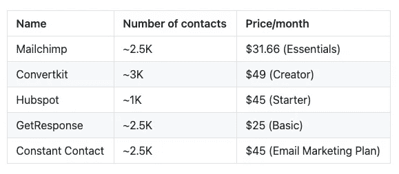

电子邮件营销平台价格比较。图片作者。

幸运的是，有一些声誉好、更划算的选择。熊智娟就是其中之一。熊智娟是一个自托管的电子邮件时事通讯应用程序，售价 69 美元，一次性付款**。它使用亚马逊 ses，所以你需要建立一个亚马逊 SES 账户。**

**让我给你一张成本图。如果你每周发送 25000 封电子邮件，那么每个月大约会有 2000 封 10K 电子邮件。一滴 DigitalOcean 每月花费 5 美元，亚马逊 SES 大约花费 1 美元。**发送 10K 电子邮件每月花费 6 美元**，每月发送 3 万封电子邮件每月花费 8 美元。**

**这篇文章将引导你了解关于建立一个自我托管的电子邮件通讯平台的一切。**

**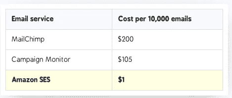**

**来自 Sendy.co 的成本比较。**

**主题包括数字海洋服务器、保护服务器、设置 MySQL 数据库、应用 Amazon SES、安装熊智娟和编写登录页面。**

## **设置熊智娟需要什么技能？**

**你需要一些使用终端的经验。关于服务器的知识会有帮助，但我会尽可能多的解释。如果你是一个热衷于学习的人，那就开始吧。**

****注意事项****

**我将用`**$**`符号表示**本地**终端提示符，用`**#**`符号表示**远程**终端(SSH)提示符，用`**//**`表示终端**注释**。**

```
**Table of Contents**· [Introduction](#c021)
  ∘ [What skills do you need to set up Sendy?](#d7dd)
· [Creating and setting up a DigitalOcean project](#6492)
  ∘ [LAMP on Ubuntu20.04](#1c00)
  ∘ [SSH keys](#5b8e)
· [Connecting through SSH](#f934)
  ∘ [Updating and upgrading the server](#f51a)
  ∘ [How to reboot your system](#c9cc)
· [Installing PHP and modules](#835a)
  ∘ [PHP, curl, php-xml, and simplexml](#7f6d)
  ∘ [Adding your domain name to your DNS server](#88d6)
  ∘ [Using your domain name with SSH](#6918)
  ∘ [Adding a free SSL](#a1b2)
· [Database](#127b)
  ∘ [Creating a new database and user](#0646)
  ∘ [Disabling ONLY_FULL_GROUP_BY](#3cd7)
· [Creating a new user for your server](#766f)
  ∘ [Why?](#5571)
  ∘ [Adding a new user](#93c2)
  ∘ [Adding the user to the sudo group](#1716)
  ∘ [Enabling ssh for a new user](#f0af)
  ∘ [Disabling the root access](#caa9)
  ∘ [Enabling sudo without password](#9a13)
· [Setting Up a Firewall](#94c0)
  ∘ [Service, protocol, and port numbers](#3ea4)
  ∘ [Allowing your IP address](#e6ad)
· [Setting up a cronjob](#9c35)
· [Amazon SES](#10e2)
  ∘ [Request to increase sending limits](#cec7)
  ∘ [Adding a domain to Amazon SES](#56fc)
  ∘ [Adding a verification to your DNS record](#be51)
  ∘ [Adding DKIM](#d287)
  ∘ [Verifying email addresses](#23c5)
  ∘ [Creating a new user from Identity and Access Management (IAM)](#89dd)
· [Installing Sendy](#f6bc)
  ∘ [Uploading Sendy to your server](#e86d)
  ∘ [rsync](#9088)
  ∘ [How to connect to MySQL from a database management tool](#629d)
· [Conclusion](#e596)
· [References](#1098)
  ∘ [DigitalOcean/Server](#c501)
  ∘ [Sendy](#09c2)
```

# **创建和设置数字海洋项目**

## **Ubuntu20.04 上的灯**

**[DigitalOcean](https://www.digitalocean.com/) 提供虚拟专用服务器(称为 droplets ),具有各种开箱即用的选项。基本液滴每月 5 美元。**

**注册数字海洋并登录。找到**新项目**，点击创建新项目。**

**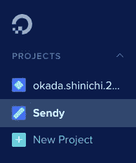**

**新建项目按钮。图片作者。**

**输入您的项目名称、简短描述，并选择目的。**

**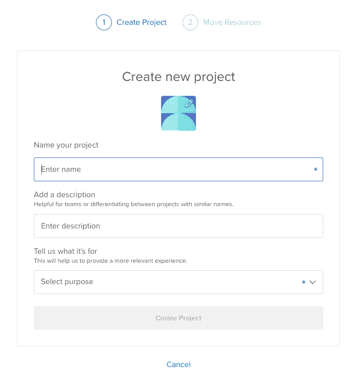**

**在数字海洋中创建新项目。图片作者。**

**您现在可以跳过“将资源移动到项目中”。**

**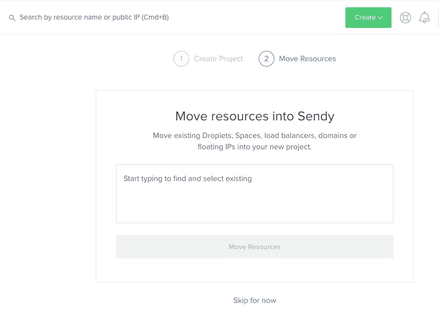**

**您现在可以跳过移动资源。图片作者。**

**点按“开始使用 Droplet”**

**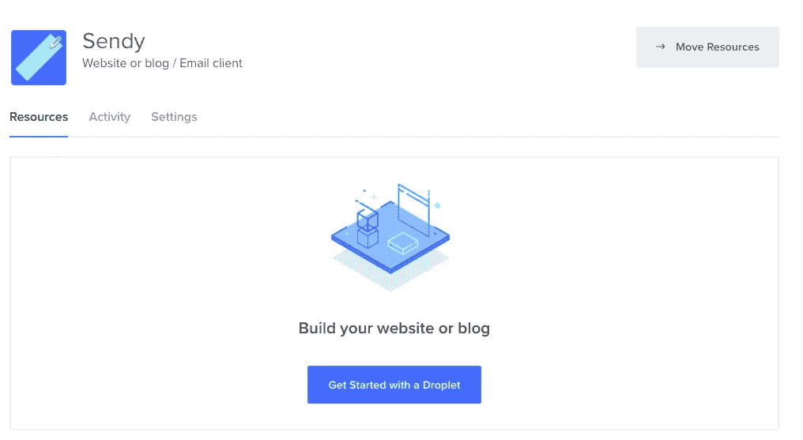**

**点按“使用 Droplet 开始”按钮。图片作者。**

**在市场中选择基本的$5/mo 计划和 Ubuntu20.04 上的**灯(称为 1-Click LAMP Droplet)。LAMP 包括 Linux、Apache、MySQL、PHP，以及一个免费的 SSL 证书。****

**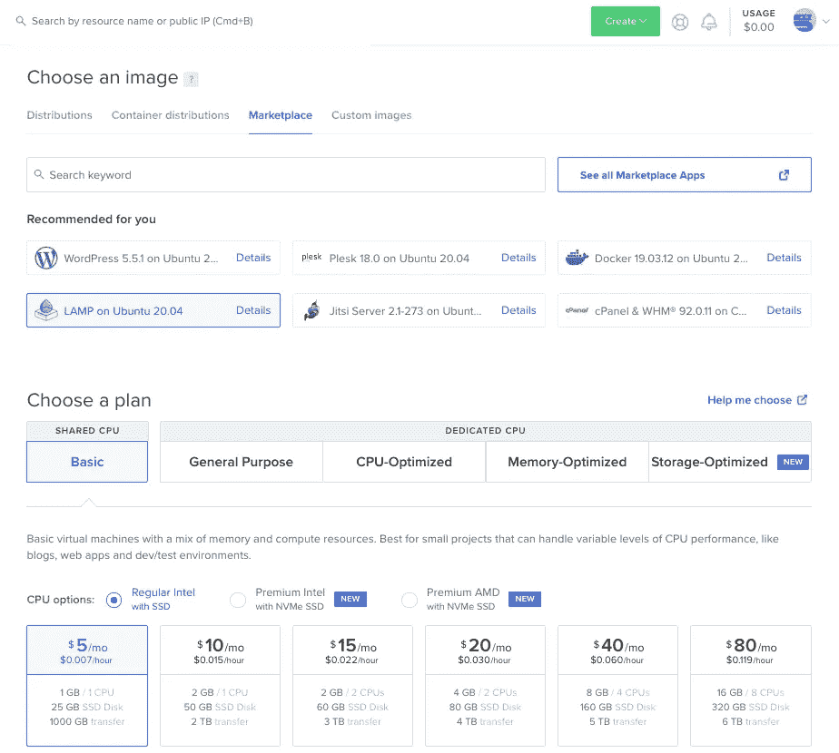**

**选择基本计划和$5 CPU 选项。图片作者。**

**选择一个数据中心区域。
跳过选择附加选项。**

## **SSH 密钥**

**选择 SSH 密钥进行身份验证。**

**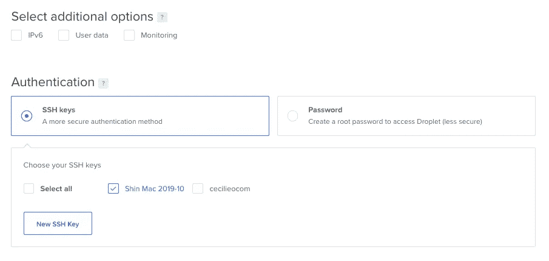**

**选择 SSH 密钥验证。图片作者。**

**将您的 id_rsa.pub 复制到剪贴板。**

```
$ pbcopy < ~/.ssh/id_rsa.pub
```

**如果你没有 SSH 密钥，[这篇文章](https://www.digitalocean.com/community/tutorials/how-to-set-up-ssh-keys-2)将帮助你创建它们。**

**单击新建 SSH 密钥并粘贴您的密钥。**

**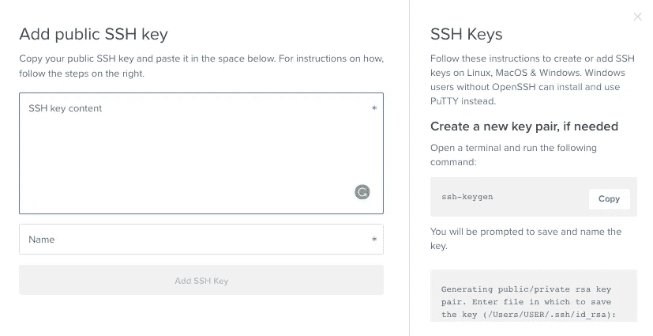**

**添加您的公共 SSH 密钥。图片作者。**

**添加您的 droplet 名称(主机名)以识别它。**

**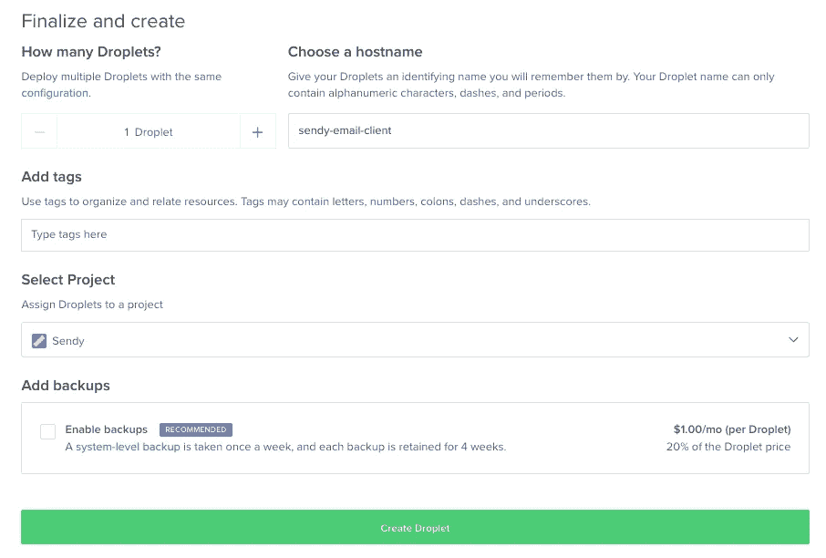**

**添加 droplet 名称(主机名)。图片作者。**

**在新项目中找到您的**服务器 IP 地址**。这有点像 165.227.90.202。**

# **通过 SSH 连接**

**打开一个终端(或 iTerm)。**

**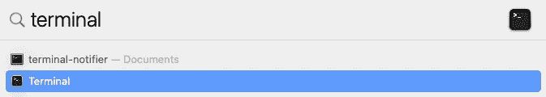**

**寻找你的终端。图片作者。**

**SSH(安全外壳协议)用于在不安全的网络上运行网络服务。使用您的服务器 IP 地址通过 SSH 连接:**

```
$ ssh root@your-ip-address
// for example
$ ssh root@123.456.78.123
```

**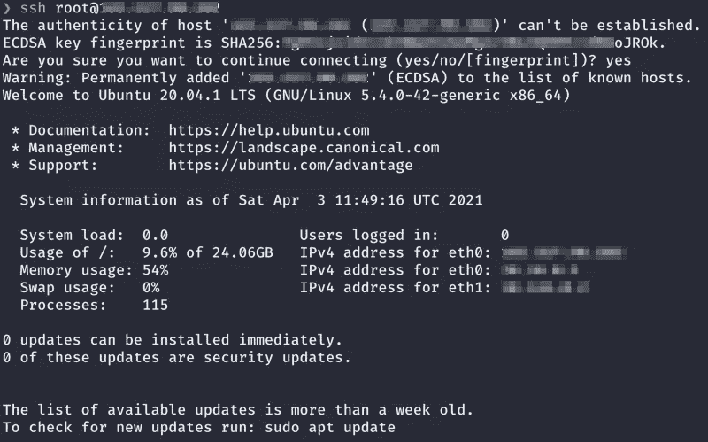**

**使用 SSH 连接到您的服务器。图片作者。**

**现在，您位于自己创建的远程服务器中。**

## **更新和升级服务器**

**高级软件包工具(APT)是一个免费的软件用户界面，用于在 Ubuntu 上安装和删除软件。**

**`sudo apt update`命令更新可用包及其版本的列表:**

```
# sudo apt update
// or
# sudo apt-get update
```

**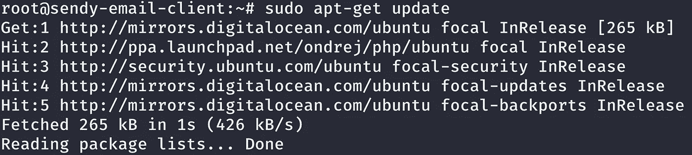**

**正在更新 apt 包列表。图片作者。**

**`sudo apt upgrade`命令安装您拥有的软件包的新版本:**

```
# sudo apt upgrade
// or
# sudo apt-get upgrade
```

**如果它告诉你你的修改版本有一个更新的版本，回答 N 保留你的文件。**

**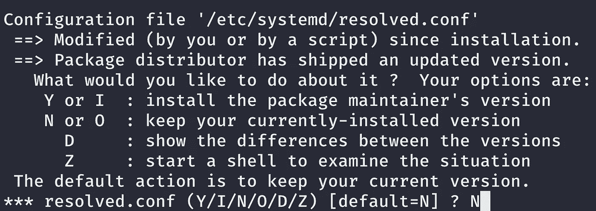**

**回答“否”将在升级过程中保留您的文件。图片作者。**

## **如何重启系统**

**更新和升级后，您将获得以下内容:**

**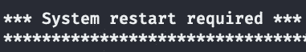**

**需要系统重启警告。图片作者。**

**从终端重新启动 droplet:**

```
# sudo reboot
```

# **安装 PHP 和模块**

## **PHP、curl、php-xml 和 simplexml**

**PHP 是一种通用脚本语言。熊智娟运行在 PHP 上。
通过 SSH 连接到您的服务器，检查 PHP 版本:**

```
# php -v
```

**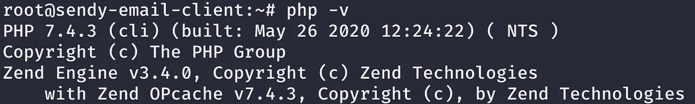**

**作者用 php -v. Image 查找 PHP 版本。**

**PPA(个人软件包档案)是第三方 PHP 软件包的仓库。您可以使用`add-apt-ropsitory`命令添加存储库:**

```
# sudo add-apt-repository ppa:ondrej/php
```

**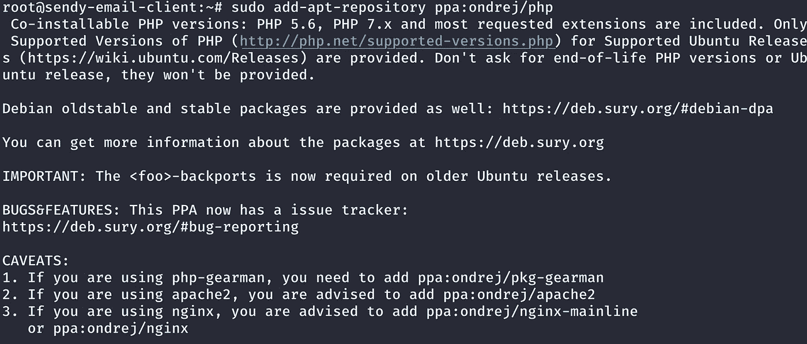**

**添加 PPA，个人包档案库。图片作者。**

**我们需要为熊智娟安装两个软件包。**

****curl** 是一款与服务器来回传输数据的工具。我们需要为 PHP7.4 安装 curl 模块:**

```
# sudo apt install php7.4-curl
// or
# sudo apt-get install php7.4-curl
```

**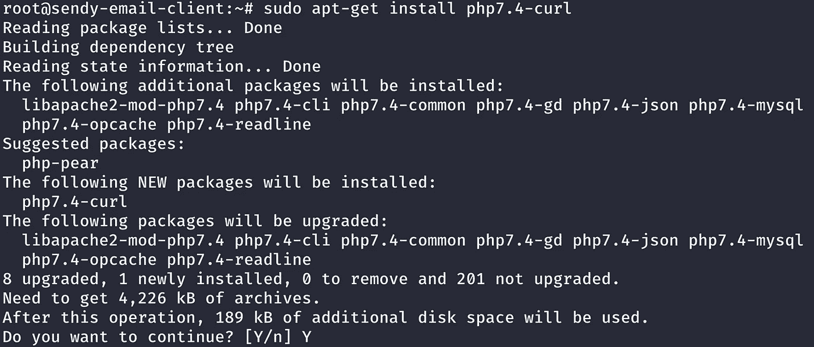**

**安装 php7.4-curl。图片作者。**

**XML 用于构建、存储和从一个系统向另一个系统传输数据。我们需要为 PHP 安装 XML 模块:**

```
# sudo apt install php-xml
// or
# apt-get install php-xml
```

**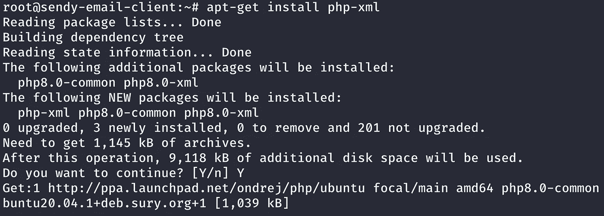**

**安装 php-xml。图片作者。**

**安装`php7.4-simplexml`:**

```
# sudo apt install php7.4-simplexml
```

**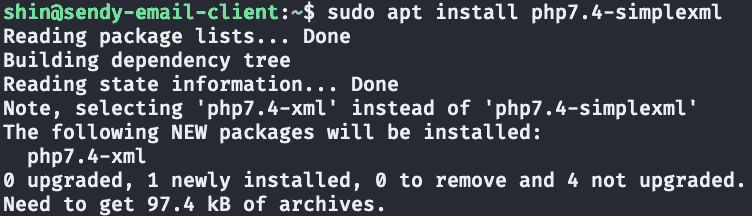**

**安装 php7.4-simplexml。图片作者。**

**重新启动服务器以使更改生效:**

```
# sudo systemctl restart apache2
```

**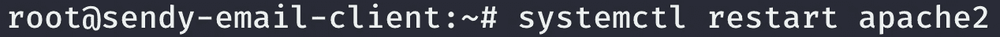**

**重启你的系统。图片作者。**

## **将您的域名添加到您的 DNS 服务器**

**转到您的 DNS 服务。如果您使用的是 Namecheap，从域列表>管理>[高级 DNS](https://www.namecheap.com/support/knowledgebase/article.aspx/319/2237/how-can-i-set-up-an-a-address-record-for-my-domain/) ，点击添加新记录按钮。选择一个记录作为类型，并在值下输入@作为主机和您的 DigitalOcean IP 地址。**

**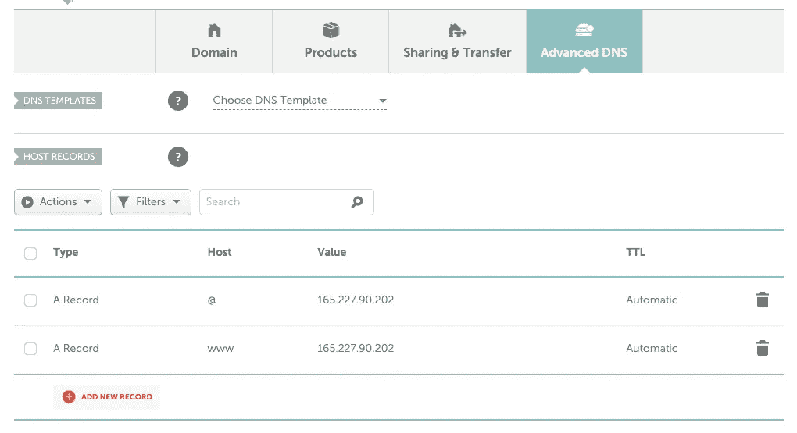**

**添加记录的廉价高级 DNS 页面。图片作者。**

**访问您的网站，您应该会看到下图:**

**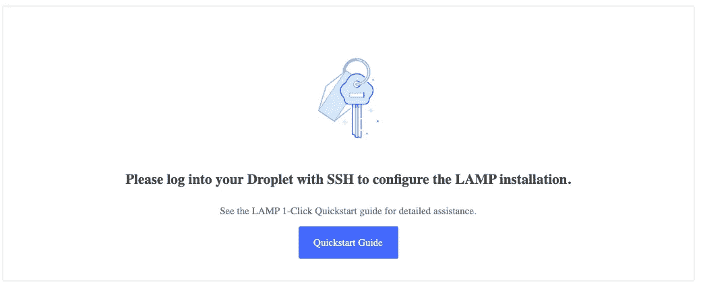**

**默认 Index.php 页面。图片作者。**

## **通过 SSH 使用您的域名**

**您可以使用您的域名访问 SSH:**

```
$ ssh root@your-domain.com
```

## **添加免费 SSL**

**[设置 SSL 证书](https://marketplace.digitalocean.com/apps/lamp#getting-started)在网络服务器上启用 HTTPS。它保护您的服务器和客户端之间的流量。Certbot 是免费的，包含在 Ubuntu20.04 的 LAMP 中。**

**在您的服务器上，键入以下内容:**

```
# certbot --apache -d example.com -d www.example.com
```

**选择 **2:重定向**使所有请求重定向到安全 HTTPS。**

**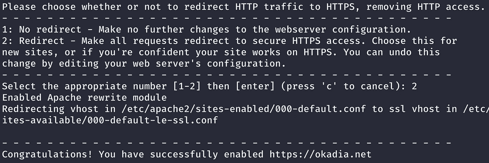**

**设置免费的 SSL 证书。图片作者。**

# **数据库ˌ资料库**

## **创建新的数据库和用户**

**检查 MySQL 数据库版本:**

```
# mysql -V
mysql  Ver 8.0.23-0ubuntu0.20.04.1 for Linux on x86_64 ((Ubuntu))
```

**让我们深入数据库。**

```
# mysql
```

**这将启动一个 MySQL 提示符。**

**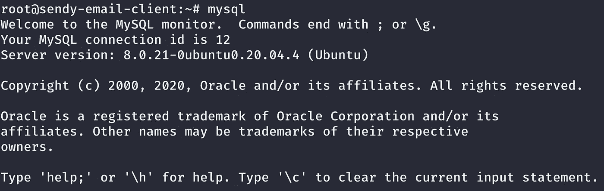**

**运行 mysql 启动 MySQL 提示符。图片作者。**

**创建数据库:**

```
mysql> CREATE DATABASE sendy;
```

**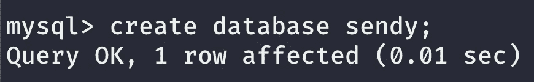**

**创建一个名为 sendy 的数据库。图片作者。**

**创建一个 [MySQL 用户并授予权限](https://www.digitalocean.com/community/tutorials/how-to-create-a-new-user-and-grant-permissions-in-mysql):**

```
mysql> CREATE USER 'sendyadmin'@'localhost' IDENTIFIED WITH mysql_native_password BY 'password';
```

**列出所有 MySQL 用户:**

```
mysql> SELECT USER, HOST FROM mysql.user;
```

**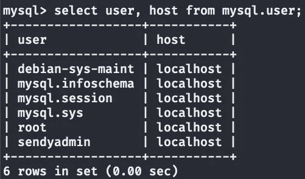**

**所有用户的列表。图片作者。**

**或者**

```
mysql> SELECT user,authentication_string,plugin,host FROM mysql.user;
```

**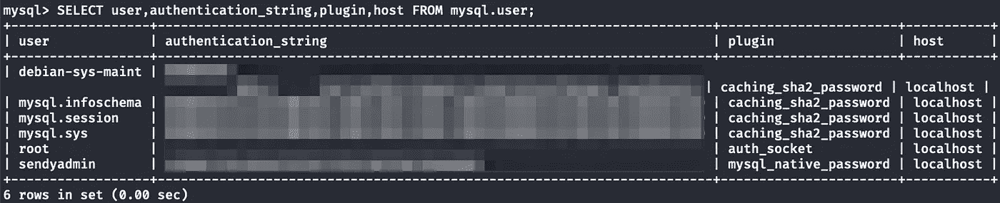**

**MySQL 用户输出。图片作者。**

**你可以在插件栏下看到 sendyadmin 的`mysql_native_password`。**

**如果您犯了一个错误，想要删除一个用户:**

```
mysql> DROP USER 'wrong-name';
```

**我们将所有权限授予新创建的用户:**

```
mysql> GRANT ALL ON *.* TO 'new-user'@'localhost';
```

**重新加载所有权限:**

```
mysql> FLUSH PRIVILEGES;
```

****

**在 MySQL 中授予所有权限和重载权限。图片作者。**

## **禁用 ONLY_FULL_GROUP_BY**

**熊智娟需要没有 ONLY_FULL_GROUP_BY 的 MySQL 模式。**

**让我们检查一下我们的`sql_mode`:**

```
# sudo mysql -sse "SELECT @@GLOBAL.sql_mode;"
[sudo] password for shin:
ONLY_FULL_GROUP_BY,STRICT_TRANS_TABLES,NO_ZERO_IN_DATE,NO_ZERO_DATE,ERROR_FOR_DIVISION_BY_ZERO,NO_ENGINE_SUBSTITUTION
```

**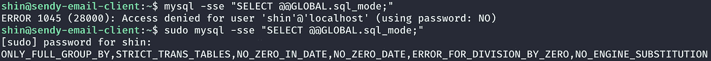**

**正在检查 sql_mode。图片作者。**

**可以看到，sql_mode 有`ONLY_FULL_GROUP_BY`。复制除 ONLY_FULL_GROUP_BY 之外的输出行。**

**打开/etc/MySQL/MySQL . conf . d/mysqld . CNF 文件，添加我们的`sql_mode`:**

```
# sudo vim /etc/mysql/mysql.conf.d/mysqld.cnf
```

**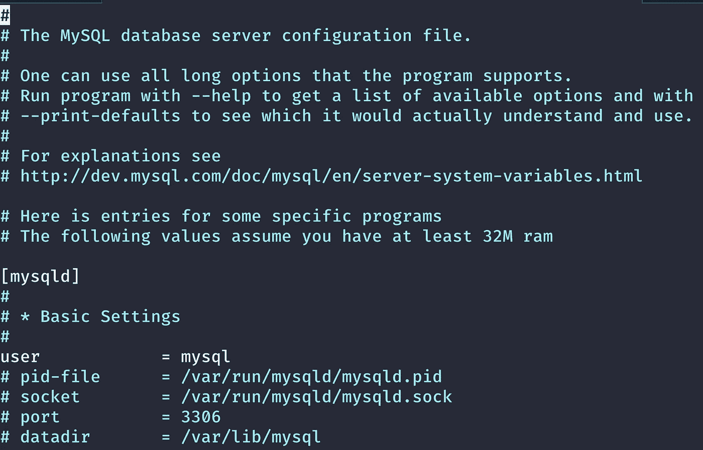**

**/etc/MySQL/MySQL . conf . d/mysqld . cn f 文件。图片作者。**

**按 SHIFT-G 转到最后一行。按下`o`在其下插入新的一行，使用 delete 键删除`#`注释符号，并将复制的内容粘贴在`sql_mode=`之后:**

```
sql_mode=STRICT_TRANS_TABLES,NO_ZERO_IN_DATE,NO_ZERO_DATE,ERROR_FOR_DIVISION_BY_ZERO,NO_ENGINE_SUBSTITUTION
```

**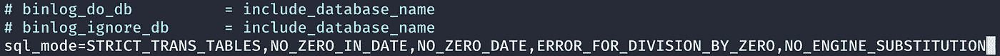**

**要保存并退出，请按 ESC 键并键入`:wq`。**

**重启 MySQL:**

```
# sudo service mysql restart
```

**确认更改:**

```
# sudo mysql -sse "SELECT @@GLOBAL.sql_mode;"
STRICT_TRANS_TABLES,NO_ZERO_IN_DATE,NO_ZERO_DATE,ERROR_FOR_DIVISION_BY_ZERO,NO_ENGINE_SUBSTITUTION
```

**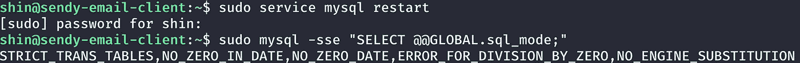**

**重启 MySQL 并确认 sql_mode 输出。图片作者。**

# **为您的服务器创建新用户**

## **为什么？**

**我们要做的是为您的服务器创建一个新用户，并赋予它`sudo`权限。然后，我们将为新用户启用 SSH 访问，并禁用对服务器的 root 访问。**

**出于安全原因，我们禁用了 root 访问。任何人都可以使用 SSH 和 root 到您的 IP 地址，并试图通过猜测您的密码进入。但是如果你禁用了根访问，那么他们也需要猜测你的用户名。**

**我们还设置了防火墙来增加服务器的安全性。**

## **添加新用户**

**让我们创建一个新用户。我将创建一个名为`shin`的用户(您知道您需要使用您的用户名)。**

**确保更改以下命令的粗体部分，以匹配您的用户名:**

```
# adduser **shin**
```

**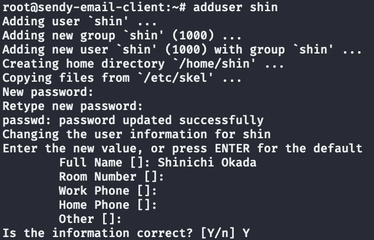**

**我正在添加一个新用户。图片作者。**

**当您创建一个新用户时，系统会创建一个新目录`/home/shin`。**

**通过查找所有用户来检查您是否添加了新用户:**

```
# less /etc/passwd
```

**您可以在最后一行找到一个新用户。**

****

**输出的最后一行。图片作者。**

## **将用户添加到 sudo 组**

**`sudo`命令赋予某些用户以 root 用户身份运行命令的能力。我们将把它授予我们的新用户。**

```
# usermod -aG sudo **shin**
```

**接下来，我们允许这个新用户进行 SSH 访问。**

## **为新用户启用 ssh**

**让我们允许新用户使用 SSH。root 用户在`~/.ssh/authorized_keys`文件中有本地公钥。您需要将它复制到新创建的目录中，`/home/**shin**`。(不要忘记替换所有粗体字。)**

```
# rsync --archive --chown=**shin**:**shin** ~/.ssh /home/**shin**
```

**打开一个新的终端选项卡(您的本地终端)并使用 ssh:(使用您的 IP 地址和新用户名。)**

```
$ ssh **shin**@**123.456.78.123**
```

**测试新用户是否可以使用`sudo`命令:**

```
# sudo ls -la /root
```

**您可以使用`exit`命令退出 SSH 会话。**

```
# exit
```

## **禁用 root 访问权限**

**如果您退出了服务器，请使用 SSH 以新用户的身份登录到服务器。**

**将目录更改为`/etc/ssh`，并将`sshd_config`复制到`sshd_config.old`。做一份拷贝是个好主意，以防出错。**

**Vim 是一个文本编辑器。使用 Vim 打开文件:**

```
# cd /etc/ssh
# sudo cp sshd_config sshd_config.old
# sudo vim /etc/ssh/sshd_config
```

**使用向下箭头找到`PermitRootLogin yes`，并将其更改为:**

```
PermitRootLogin no
```

**你需要按 SHIFT+A 移动到行尾，删除`yes`，键入`no`。按 escape 键并键入`:wq`，然后按 enter 键写入并退出 Vim 编辑器。**

**重启`sshd`服务:**

```
# systemctl restart sshd.service
```

**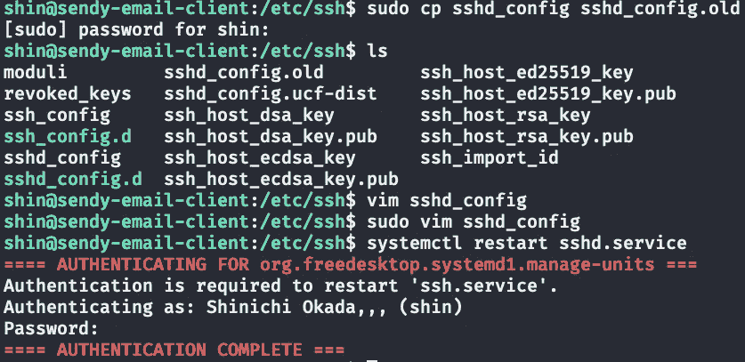**

**禁用根访问。图片作者。**

**现在，您可以尝试使用 root 通过 SSH 连接到您的服务器。您的服务器应该拒绝您的访问。**

**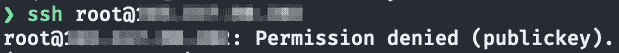**

**根用户访问权限被拒绝。图片作者。**

## **无密码使能`sudo`**

**稍后，我们将使用 git 通过 Github 钩子将本地文件推送到我们的服务器。我们需要让我们的用户名不需要密码。**

```
# sudo visudo
```

**这将打开配置`sudo`命令的`/etc/sudoers`文件。默认编辑器是`nano`文本编辑器。就在最后一行`#includerir /etc/sudoers.d`之前，添加以下内容(不要忘记替换所有粗体字。):**

```
**shin** ALL=(ALL) NOPASSWD:ALL
```

**您可以通过以下方式限制没有密码的命令:**

```
**shin** ALL=(ALL) NOPASSWD: /usr/bin/git,/usr/bin/chown, /usr/bin/mv
```

**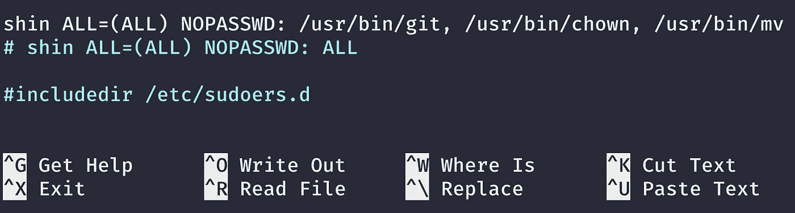**

**将用户权限规范添加到/etc/sudoers。图片作者。**

**按`Ctrl+o`返回保存，然后按`Ctrl+x`退出编辑器。**

# **设置防火墙**

## **服务、协议和端口号**

**在本节中，我们将限制对服务器端口的访问，以获得额外的安全性。**

**1-Click LAMP Droplet 附带 UFW(简单防火墙)来在您的服务器上设置防火墙。**

**不同的服务有不同的端口号:**

**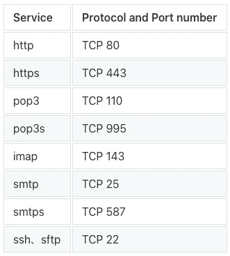**

**服务、协议和端口号图表。图片作者。**

**当您通过 SSH 连接到服务器时，您会看到与下面类似的欢迎说明:“除了 22 (SSH)、80 (HTTP)和 443 (HTTPS)之外，所有端口都被阻止。”**

**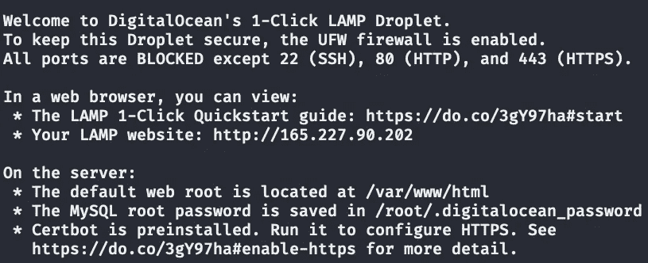**

**SSH 到服务器时的欢迎说明。图片作者。**

**让我们启用 [UFW](https://www.digitalocean.com/community/questions/cannot-connect-to-mysql-via-sequel-pro) :**

```
# sudo ufw enable
```

**它会问你“命令可能会中断现有的 ssh 连接。是否继续操作(y|n)？。键入 y 继续:**

**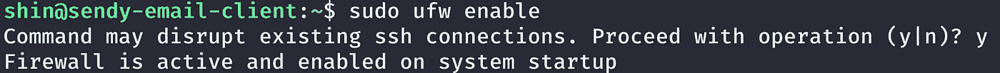**

**sudo ufw 使能输出。图片作者。**

**检查防火墙状态:**

```
# sudo ufw status verbose
```

**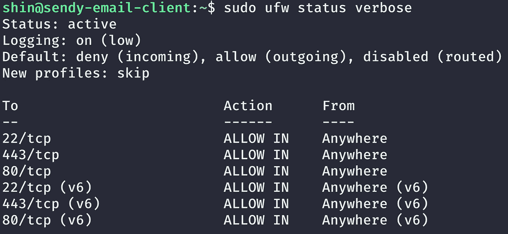**

**sudo ufw 状态详细的输出。图片作者。**

**这里您可以看到 22(SSH)、443(HTTPS)和 80(HTTP)端口是打开的。**

**如果您没有看到如上图所示的任何线条，您可以添加它们:**

```
# sudo ufw allow ssh
// or
# sudo ufw allow 22/tcp# sudo ufw allow http
// or
# sudo ufw allow 80/tcp# sudo ufw allow https
// or
# sudo ufw allow 443/tcp
```

## **允许您的 IP 地址**

**让我们允许来自特定 IP 地址的传入 SSH:**

```
# sudo ufw allow from **123.456.78.901** to any port 22 proto tcp
```

**将 123.456.78.901 更改为[您的 IP 地址](https://whatismyipaddress.com/)。**

****

**sudo ufw 前后的输出允许从 **123.456.78.901** 到任何端口 22 proto tcp。图片作者。**

**现在您需要从其他地方删除 SSH (22)访问:**

```
# sudo ufw delete allow to any port 22 proto tcp
```

**让我们检查一下状态:**

```
# sudo ufw status
```

**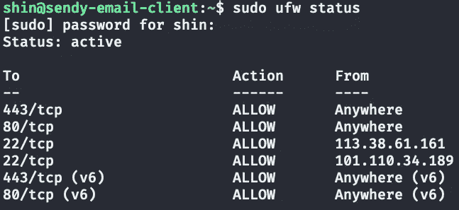**

**在这里，您可以看到我可以从两个 IP 地址使用 SSH。图片作者。**

**熊智娟使用忘记密码功能。SMTP 协议允许应用程序通过 internet 传输电子邮件，POP3 协议处理从邮件服务器接收电子邮件。让我们允许 POP3 和 SMTP 端口:**

```
# sudo ufw allow 110/tcp
# sudo ufw allow 25/tcp
# sudo ufw status
```

**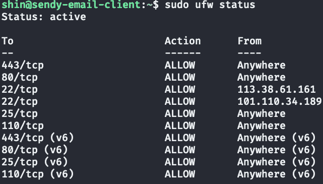**

**添加端口后的 ufw 状态输出。图片作者。**

**退出 SSH，并测试它是否适用于您的 IP 地址。**

**如果您希望从上述 IP 地址删除访问权限:**

```
# sudo ufw delete allow from 123.456.789.01 to any port 22 proto tcp
```

**现在没有人可以使用 root 访问，也不能从其他 IP 地址访问你的服务器(包括你)。如果您使用不同的 IP 地址，请不要忘记提前运行以下命令:**

```
# sudo ufw allow ssh
```

# **设置 cron 作业**

**要激活熊智娟的自动回复器，我们需要添加一个 [cron 作业](http://en.wikipedia.org/wiki/Cron)。Cron 是一个基于时间的作业调度守护程序(软件)。**

**你的 Ubuntu 服务器应该已经有 cron 了:**

```
# which cron
/usr/sbin/cron
```

**如果没有，请安装它:**

```
# sudo apt install cron
```

**启用 cron:**

```
# sudo systemctl enable cron
```

**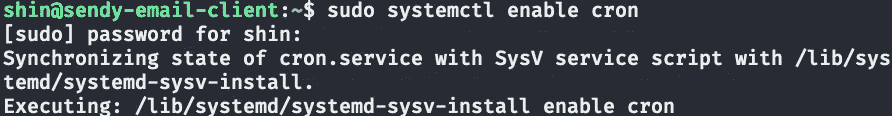**

**要检查并编辑您的 cronjob:**

```
# crontab -l
# crontab -e
```

**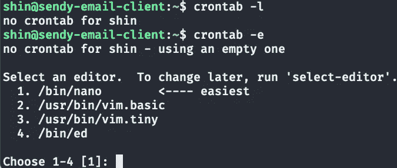**

**选择你的编辑。对于本教程，我们使用纳米编辑器。**

**在文件末尾添加以下内容:**

```
*/1 * * * * php /var/www/html/sendy/autoresponders.php > /dev/null 2>&1
```

**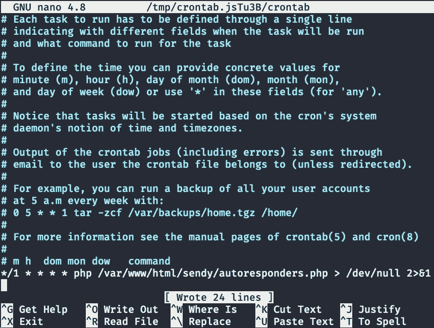**

**按`Ctrl+o`和回车键写入文件，按`Ctrl+x`退出。**

****干得好！**这就是设置您的服务器所需的全部内容。恭喜你自己。**

**接下来，我们将关注亚马逊 SES。**

# **亚马逊 SES**

## **请求增加发送限额**

**你需要在 [AWS 亚马逊网络服务](https://aws.amazon.com/)创建一个账户。**

**您需要从控制台请求增加发送限制。提交后，您将收到 AWS 的回复:**

**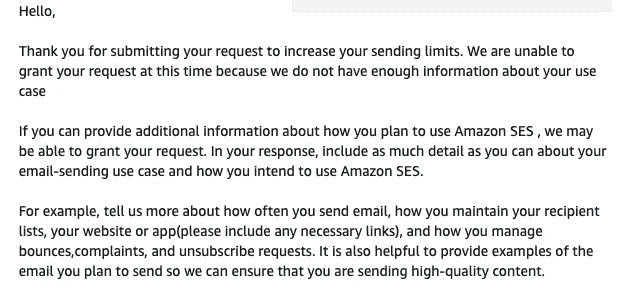**

**AWS 关于发送限制的回复。图片作者。**

**回复他们的请求，包括你的目的、当前的订户数量(如果有的话)、一份简讯样本，以及尽可能多的信息。**

**这是一封信的样本:**

```
Hello, Thank you for your message. My website is [https://mywebsite.com/](https://cecilieo.com/). Currently, I am using (Email Service Name) to send out a weekly newsletter. At the time of writing, the list has 2,500 subscribers. The list increases by 5-10 subscribers daily. My landing page has a 20% conversion rate. I check the subscriber list daily and archive unsubscribes daily. The average unsubscribes with each newsletter is 0.5%. So far, I have not received a single complaint. I leave soft bounces (0-4) in the list and delete hard bounces (hardly ever). 50% of newsletter recipients are highly engaged, 10% are moderately engaged, and 20% rarely. The content of each newsletter is a new blog post with ... tutorial and sometimes related or additional news about ... . 
After subscribing, people are invited to an engaged, closed Facebook Group that I started on Oct. 1, 2020\.  As of today, it has 300 members. My website has an average of 10K visitors per month. Recently, the number of visitors rose sharply. The social traffic comes from ... . I am a professional ..., and I have ...ed. I intend to ... . Please let me know if you require any further information.  
Thank you. Best regards, 
John Doe
```

**然后你会得到回复。**

****

**AWS 的回复。图片作者。**

## **向 Amazon SES 添加域**

**登录[亚马逊 AWS 控制台](https://console.aws.amazon.com/)进入 SES 主页(只需使用顶部的搜索)。然后转到“域”页面，单击“验证新域”。**

**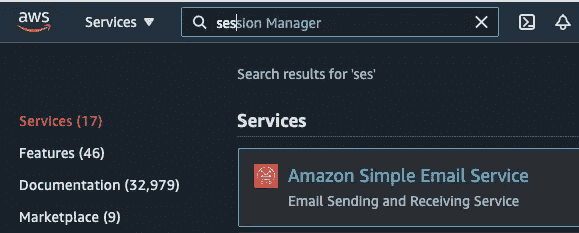**

**使用“搜索查找 SES”页面。图片作者。**

**从左侧菜单中，转到域。**

**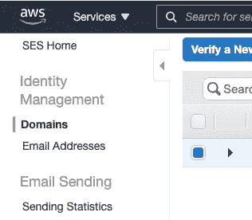**

**亚马逊 SES 域名页面。图片作者。**

**类似的页面如下所示，将显示:**

**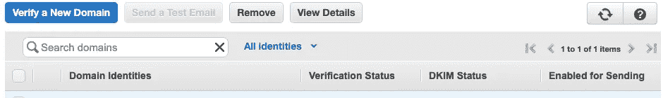**

**验证左上角的“新域”按钮。图片作者。**

**单击验证新域。**

**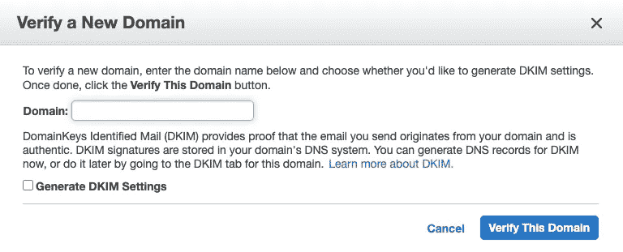**

**验证亚马逊上的新域名表单。图片作者。**

**添加您的域名，如 mydomain.com。**

## **向您的 DNS 记录添加验证**

**找到亚马逊 SES 域验证 TXT 记录。如果找不到，请转到 SES 主页>域>您的域。**

**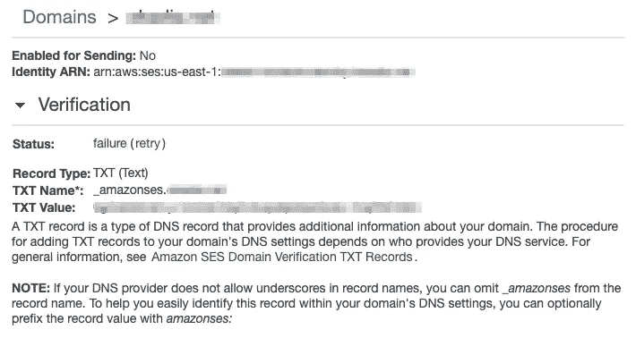**

**我们将使用 **_amazonses** 作为主机的结尾，不带您的域名。**

**转到您的 DNS 服务。如果您使用的是 Namecheap，请转到域列表，然后单击您的域的管理按钮。然后单击高级 DNS。**

**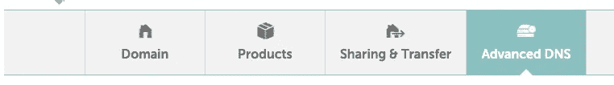**

**高级 DNS 菜单。图片作者。**

**在主机记录下，单击添加新记录。从 AWS 验证值复制并粘贴。主机字段应该是 _amazonses，末尾没有您的域名。**

**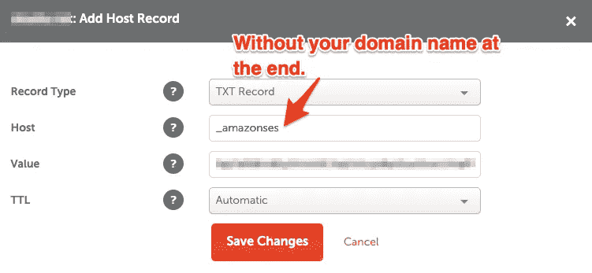**

**添加亚马逊 SES 域验证 TXT 记录。图片作者。**

## **添加 DKIM**

> **DKIM(域密钥识别邮件)是一种电子邮件认证技术，允许收件人检查电子邮件确实是由该域的所有者发送和授权的。—来自 dmarcanalyzer.com**

**从 SES 主页>域>您的域，您可以找到 DKIM(域密钥识别邮件)设置。请注意，有三行**需要添加到您的 DNS 设置中。****

****

**亚马逊 DKIM 有三排。图片作者。**

**像以前一样，通过单击“添加新记录”来添加三个 CNAME 记录。当你粘贴到一个主机字段时，请再次注意在末尾粘贴没有你的域名的**。****

****

**将 DKIM 添加到我的 DNS 服务。图片作者。**

## **验证电子邮件地址**

**您需要向 AWS 验证您的电子邮件地址才能发送电子邮件。**

**转到 SES 主页>电子邮件地址，然后单击验证新的电子邮件地址。**

**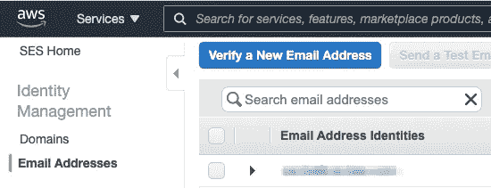**

**AWS SES 主页电子邮件地址页面。图片作者。**

**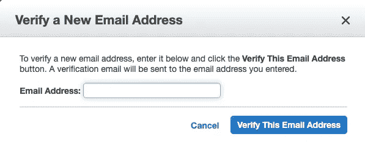**

**验证新的电子邮件地址模式。图片作者。**

**输入您的电子邮件后，您需要检查并确认您的电子邮件。您将收到来自 AWS 的确认电子邮件。**

**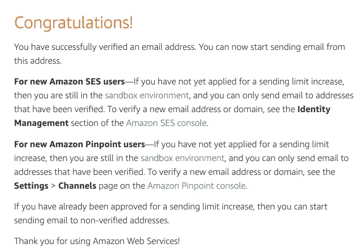**

**验证电子邮件地址后，会收到一封亚马逊确认电子邮件。图片作者。**

## **从身份和访问管理(IAM)创建新用户**

**我们需要创建一个新的 IAM 用户，用于熊智娟的 Amazon Web Services 凭证。**

**从搜索中找到我。**

**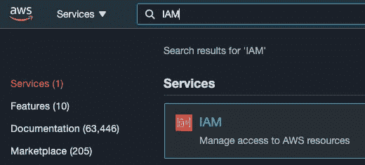**

**使用搜索来查找 IAM。图片作者。**

**创建新用户:**

**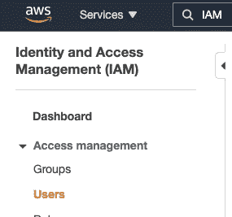**

**单击用户菜单创建新用户。图片作者。**

**保留访问密钥 ID 和秘密访问密钥。我们以后在熊智娟需要它们。**

**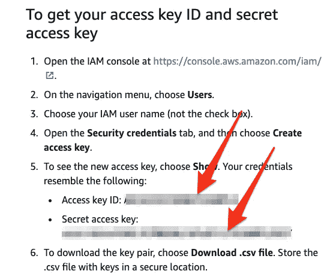**

**从 IAM，Amazon SES 复制访问密钥 ID 和秘密访问密钥。图片作者。**

**安装后，我们将在熊智娟添加上述键。**

**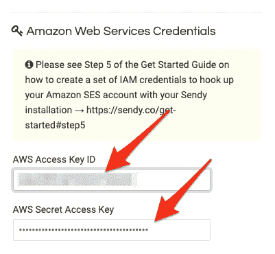**

**稍后，我们将向熊智娟添加 AWS 访问密钥 ID 和 AWS 秘密访问密钥。图片作者。**

**再次恭喜你。你做到了。设置亚马逊 SES 就这么多了。干得好！**

**接下来，我们将安装和设置熊智娟。**

# **安装熊智娟**

**购买熊智娟后，您将收到下载链接、许可密钥和许可域。**

**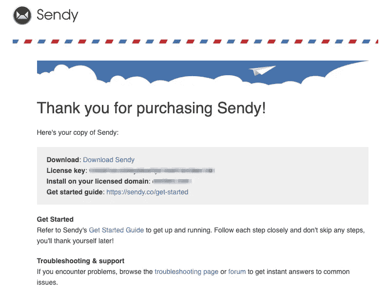**

**带有您的许可密钥和许可域的页面。图片作者。**

**购买后，如果你需要，你可以从 https://sendy.co/#forms[更改授权域名。](https://sendy.co/#forms)**

**([入门](https://sendy.co/get-started)页面告诉你如何在你的服务器上安装熊智娟。)**

**解压缩下载的文件，并在文本编辑器(如 VS Code)中打开它们。找到`/include/config.php`文件，修改内容。使用我们在上一节中使用的 MySQL 用户名和密码。**

```
//------------------------------------------//
// COMPULSORY SETTINGS
//--------------------------------------//
/*  Set the URL to your Sendy installation (without the trailing slash) */define('APP_PATH', 'https://yourweb.com/sendy');/*  MySQL database connection credentials (please place values between the apostrophes) */$dbHost = 'localhost'; // MySQL Hostname
$dbUser = 'sendyadmin'; // Your MySQL Username
$dbPass = 'password'; // Your MySQL Password
$dbName = 'sendy'; // Your MySQL Database Name
```

## **将熊智娟上传到您的服务器**

**我们没有为熊智娟使用版本控制(尽管我们将为我们的登陆页面使用 Git)。我们使用 rsync 将所有熊智娟文件传输到服务器。**

## **rsync**

**检查您的**本地**和远程系统上是否有 rsync:**

```
$ rsync --version
rsync  version 3.2.3  protocol version 31
Copyright (C) 1996-2020 by Andrew Tridgell, Wayne Davison, and others.
Web site: [https://rsync.samba.org/](https://rsync.samba.org/)
```

**如果没有，可以安装 rsync:**

```
// Ubuntu
$ apt install rsync
// macOS
$ brew install rsync
// Fedra, CentOS
$ yum install rsync
```

**不要忘记重启你的终端。**

**您可以使用 rsync:**

```
$ rsync [options] [source] [destination]
```

**由于新用户没有权限，您不能直接将文件传输到`/var/www/html/sendy`。但是您可以将文件传输到您有权限的远程主目录。**

**让我们在**远程**服务器上创建一个`sendy`目录:**

```
# mkdir /home/**shin**/sendy
```

**然后从您的**本地**终端:**

```
$ cd /path/to/sendy
$ rsync -av ./sendy/ **shin**@**123.456.78.901**:/home/**shin**/sendy/
```

**同样，您需要更改 IP 地址和用户名。**

**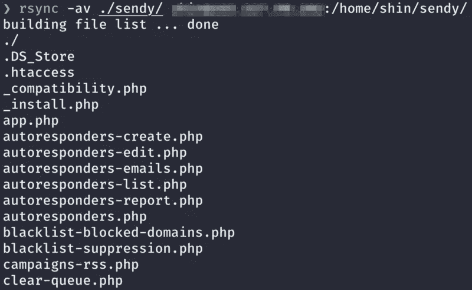**

**使用 rsync 将熊智娟文件传输到我们的服务器。图片作者。**

**我们需要将刚刚转移到`/var/www/html`目录的`/home/sendy`目录移动到这里。在**远程**服务器中:**

```
# cd ~
# sudo mv sendy /var/www/html
```

**您可以确认所有文件都在`/var/www/html`目录中:**

```
# ls /var/www/html/sendy
```

**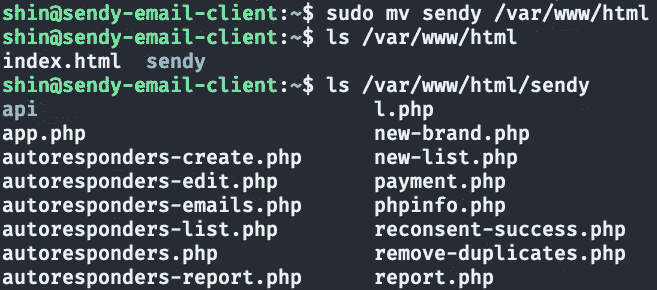**

**正在将 sendy 目录移动到/var/www/html 目录。图片作者。**

**目前，`/var/www/html/sendy`中的所有文件和目录都有一个所有者和组`shin`(您的用户名)。**

**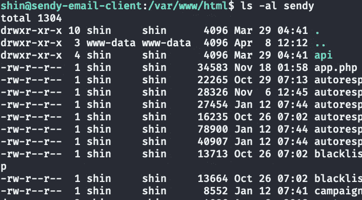**

**所有文件和目录都有 shin 作为所有者和组。图片作者。**

**我们需要递归地将所有文件和目录的所有者和组更改为`www-data`。**

```
# cd /var/www/html
# sudo chown -R www-data:www-data sendy
```

**检查`sendy`目录是否显示`www-data` `www-data`，`sendy`目录下的所有文件是否也有`www-data` `www-data`。**

```
# ls -al
# ls -al sendy
```

**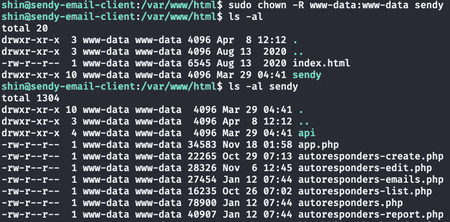**

**所有文件和目录都显示 www-data www-data。图片作者。**

**设置上传目录的文件权限:**

```
# sudo chmod 777 /var/www/html/sendy/uploads/
```

**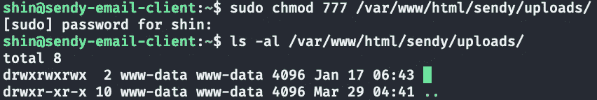**

**运行 sudo chmod 777/var/www/html/sendy/uploads/。图片作者。**

**参观 https://yourdomain.com/sendy.**

**在“许可证密钥”字段中使用熊智娟许可证密钥。在电子邮件字段中使用您的 AWS 登录电子邮件。使用前面 AWS 部分中的 AWS 访问密钥 ID 和秘密访问密钥。**

**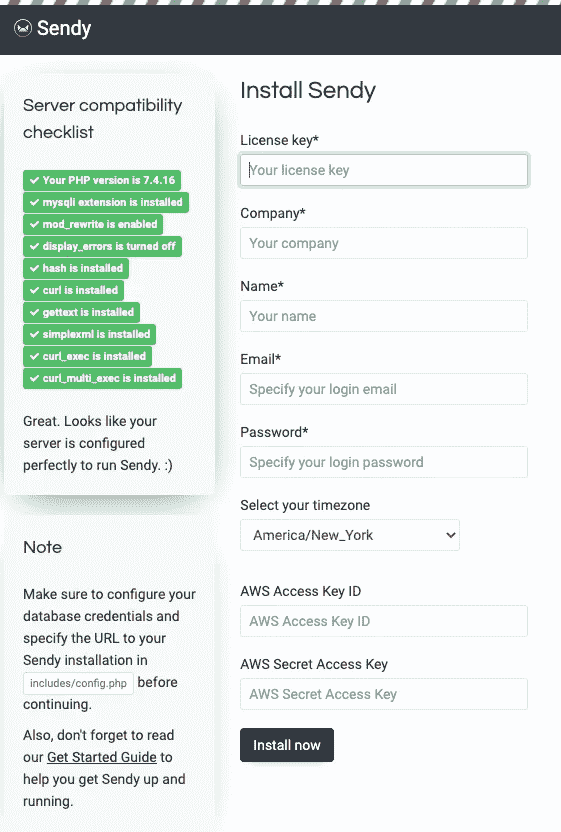**

**熊智娟安装页面。图片作者。**

**请注意，您的服务器兼容性清单是绿色的。**

**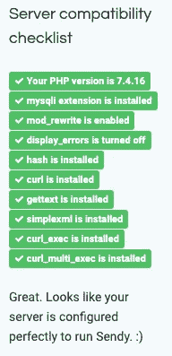**

**一切准备就绪。图片作者。**

## **如何从数据库管理工具连接到 MySQL**

**您可能需要使用数据库管理工具(如 Sequel Pro)连接到数据库。下图显示了您需要在每个字段中输入的内容。我们使用的是 SSH 协议。**

**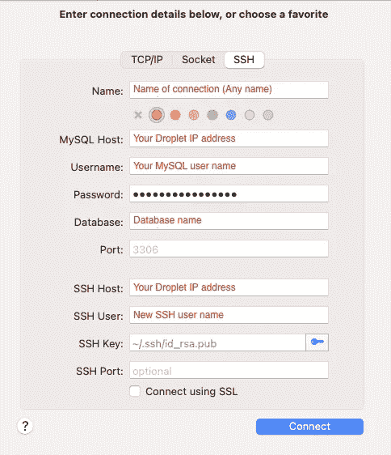**

**我们数据库的连接细节。图片作者。**

**安装完成后，登录并检查设置页面。**

****

**熊智娟设置页面。图片作者。**

**安装到此为止。**

# **结论**

**恭喜你，感谢你阅读这篇文章。我希望你能利用这篇文章创建自己的电子邮件营销平台。熊智娟[不允许](https://sendy.co/forum/discussion/1257/multiple-administrators/p1)你创建一个以上的管理员，但你可以创建许多品牌和登录用户。**

**一旦你设置了熊智娟，就很容易发送你的电子邮件通讯。由于它使用亚马逊，你的电子邮件进入垃圾邮件箱的机会非常小。**

**你需要知道熊智娟是由[本](https://sendy.co/forum/profile/8/Ben)开发和维护的，所以在熊智娟论坛和电子邮件通信上的支持是有限的。**

**在下一篇文章中，我们将介绍如何创建熊智娟登陆页面。让我知道你的安装进展如何，如果你有任何问题。**

****通过** [**成为**](https://blog.codewithshin.com/membership) **会员，获得媒体上所有故事的访问权限。****

****

**[https://blog.codewithshin.com/subscribe](https://blog.codewithshin.com/subscribe)**

# **参考**

## **数字海洋/服务器**

*   **[如何在 Ubuntu 20.04 上用 UFW 设置防火墙](https://www.digitalocean.com/community/tutorials/how-to-set-up-a-firewall-with-ufw-on-ubuntu-20-04)**
*   **[如何编辑 Sudoers 文件](https://www.digitalocean.com/community/tutorials/how-to-edit-the-sudoers-file)**
*   **[在 DigitalOcean Droplet 上部署带有 Git 挂钩的代码](https://macarthur.me/posts/deploying-code-with-a-git-hook)**
*   **PHP——创建自己的 dotenv 来加载环境变量。env 文件**
*   **[在数字海洋上举办熊智娟](https://daily-dev-tips.com/posts/hosting-sendy-on-digital-ocean/)**

## **熊智娟**

*   **[熊智娟 API](https://sendy.co/api)**
*   **[熊智娟故障排除&支持](https://sendy.co/troubleshooting)**
*   **[熊智娟论坛](https://sendy.co/forum/)(别指望你能得到快速回复。这不是一个社区论坛。)**