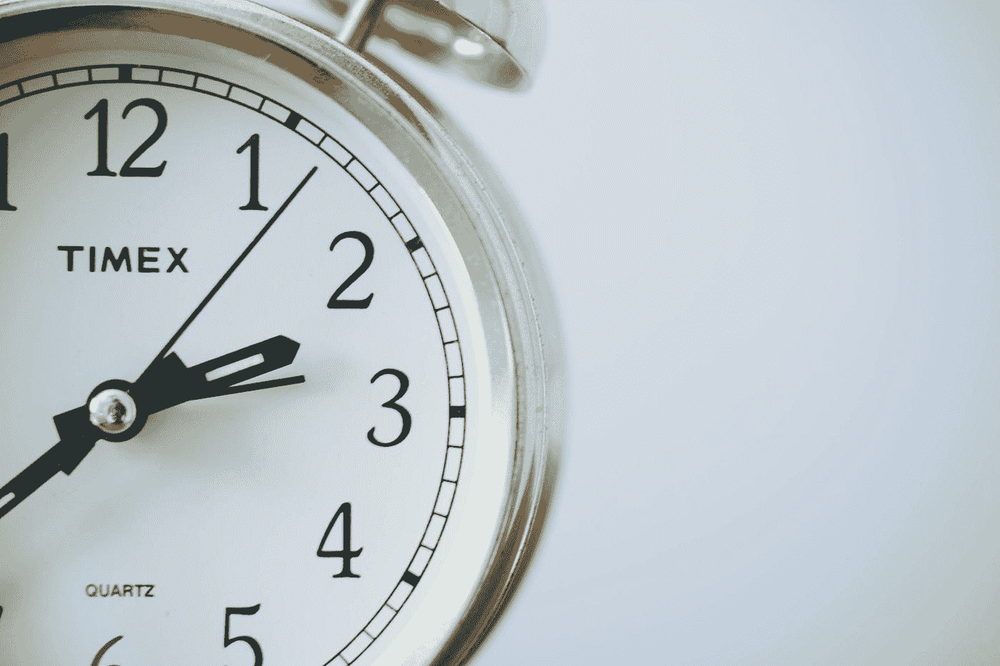
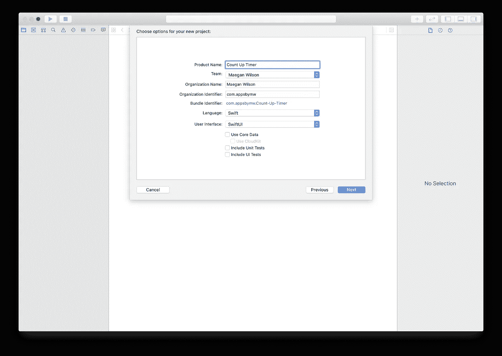
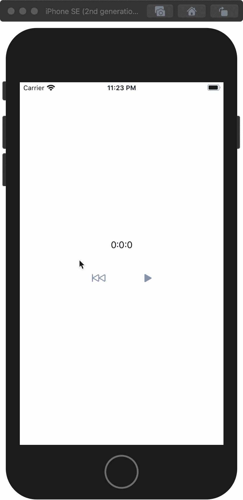

# 如何使用 Swift 和 SwiftUI 构建计时器

> 原文：<https://betterprogramming.pub/how-to-build-a-timer-using-swift-and-swiftui-e72cd8eb3d3a>

## 开始使用 SwiftUI 构建的好地方

照片由 [Sonja Langford](https://unsplash.com/@sonjalangford?utm_source=medium&utm_medium=referral) 在 [Unsplash](https://unsplash.com?utm_source=medium&utm_medium=referral) 上拍摄。

在本文中，我们将使用 Swift 和 SwiftUI 制作一个计时器。这将带你一步一步地完成这个过程，从制作一个新的应用程序到运行完成的计时器。

完成的项目可以从 GitLab 中克隆[。](https://gitlab.com/appsbymw/count-up-timer)

# 第一步:启动一个新项目

在 Xcode 中启动一个新项目。该模板需要是一个单视图应用程序。语言需要设置为 Swift，用户界面需要设置为 SwiftUI。您可以将`Product Name`设置为您喜欢的任何值。我在叫我的倒计时器。

# 第 2 步:添加变量

让我们添加变量来保存需要在屏幕上显示的小时、分钟和秒。

在`ContentView.swift`中，在以下要点中添加第 6 行到第 8 行:

这三个变量(`hours`、`minutes`和`seconds`)是用`@State`属性包装器声明的，这样当值更新时文本也会更新。你可以在[苹果网站](https://developer.apple.com/documentation/swiftui/state)上阅读更多关于`@State`属性包装器的信息。

# 步骤 3:设计用户界面

现在，让我们实际设计 UI。中间是计时器，然后是启动/暂停计时器和将计时器重置为零的按钮。

我们需要做的第一件事是在`body`中添加一个 VStack。为此，您可以右键单击`Text("Hello, World!")`并选择嵌入 VStack。您的代码现在应该看起来像下面的要点:

## 显示计时器值

然后，我们需要输入变量。我们要把`Hello, World!`改成`\(hours):\(minutes):\(seconds)`。如果你打开画布并恢复它，那么你应该在设备中看到 *0:0:0* 。

你可能想知道为什么我在变量名周围使用了`\()`。斜杠和圆括号是用来告诉编译器圆括号里有代码。因此，程序将显示变量的内容，而不是变量的名称。

## 添加按钮

现在，让我们添加按钮，让他们做一些事情！

首先，我们将添加一个新的状态变量，它表示计时器是已经启动还是已经暂停。在声明`seconds`之后，添加`@State var timerIsPaused: Bool = true`。

然后，在`Text()`之后，我们需要添加一个 if 语句，该语句将显示计时器暂停和开始时的视图。下面的要点显示了带有 if 语句的视图应该是什么样子:

现在，我们将把`Text`改为`Buttons`，并使用`SF Symbol`进行启动、暂停和复位。

如果`timerIsPaused`是`true`，那么我们要显示一个开始的播放图标和一个复位的后退图标。为此，我们需要使用`Image(systemName: String)`作为按钮标签。这两个按钮也需要在一个堆栈中，彼此相邻。现在，如果`timerIsPaused`是`false`，我们需要显示一个暂停图标来停止计时器。以下要点显示了 if 语句中的按钮:

# 第四步:启动计时器

是时候让计时器真正开始计时了。我们将使用 Swift 内置的`[Timer](https://developer.apple.com/documentation/foundation/timer)`。我们需要制作一个每秒增加一秒的重复计时器。

让我们先为状态添加一个变量。所以在`timerIsPaused`之后，加上`@State var timer: Timer? = nil`。这声明了一个变量来存储计时器，但实际上并没有将计时器存储到变量中，因为当计时器启动时，我们将调用一个新的计时器。

接下来，我们需要编写一个启动计时器并将`timerIsPaused`更改为`false`的函数。该函数将被称为`startTimer()`。在函数中，添加行`timerIsPaused = false`。之后，需要添加一个计时器。以下要点表明:

现在，我将解释第 3 行到第 5 行发生了什么。

## 制作一个新计时器

这是一个新的计时器实际制作的地方。我用了一个定时计时器，这样每一秒都有东西被触发。

*   `withTimeInterval`用于指定闭包内每个动作执行的频率，以秒为单位。我将它设置为 1，这样`seconds`每秒递增一次。
*   `repeats`需要设置为`true`,这样闭包中的代码每秒运行一次。如果设置为`false`，那么闭包中的操作只运行一次。

## 检查添加时间

这是检查何时增加秒、分和小时的所有代码。

我选择使用启动新计时器的闭包方法，这样就不必将函数包装在 Objective-C 调用者中。

一旦编写了函数，确保在按钮中调用它。下面是开始按钮代码现在应该看起来的样子:

# 第五步:停止计时

是时候用另一个函数来停止计时器了。该函数将被称为`stopTimer()`。在这个定时器中，我们需要将`timerIsPaused`设置为`false`，并杀死当前正在运行的定时器。为了杀死计时器，我们调用计时器上的`invalidate()`函数，这将不允许计时器再次启动。该函数如下所示:

现在，确保在按下停止按钮时调用该函数。

这里是`ContentView.swift`此时应该的样子:

# 第六步:重置时钟

这是最简单的功能。它将把`hours`、`minutes`和`seconds`设置回零。

现在，当使用`self.restartTimer()`按下复位按钮时调用它。

计时器结束了！

完成的项目可以从 [GitLab](https://gitlab.com/appsbymw/count-up-timer) 中克隆。

感谢阅读！