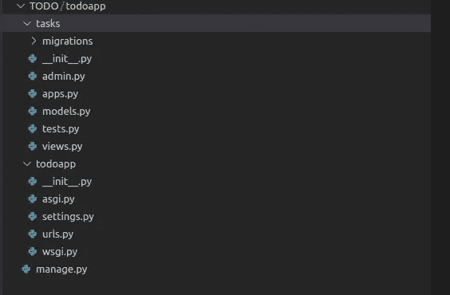
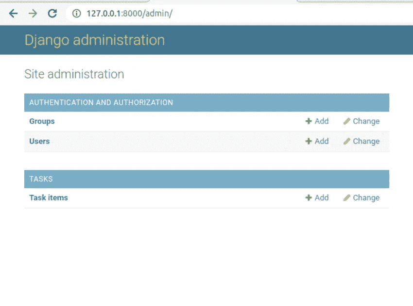
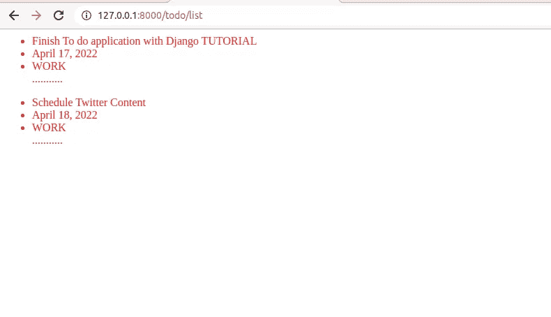
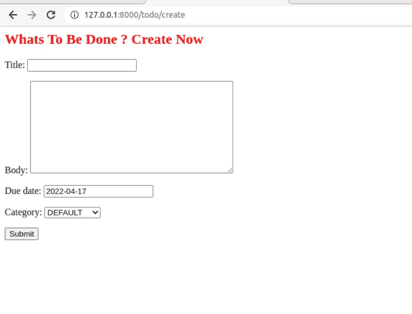
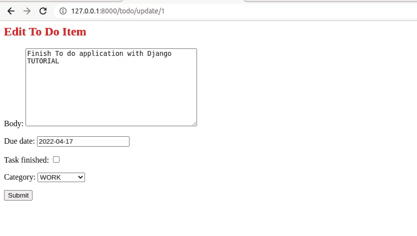
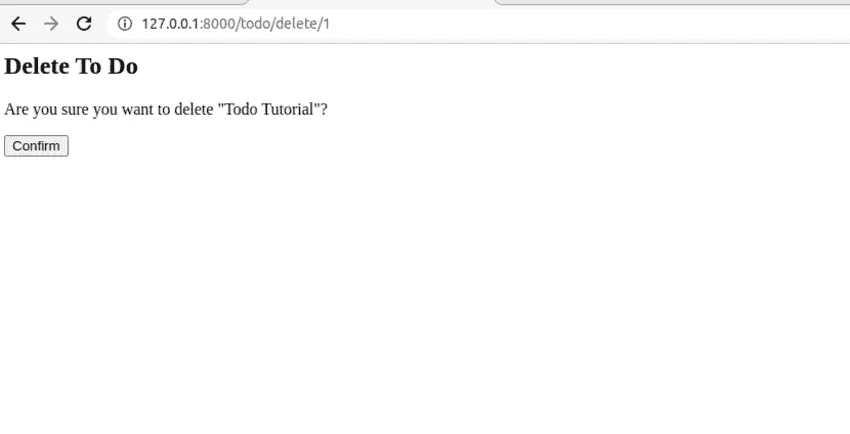

# 如何用 Django 构建 Todo 应用程序

> 原文：<https://betterprogramming.pub/how-to-build-a-todo-application-with-django-ac675811d77b>

## 了解如何构建 CRUD web 应用程序


安内特·lūsiņa 在 [Unsplash](https://unsplash.com/s/photos/todo-application?utm_source=unsplash&utm_medium=referral&utm_content=creditCopyText) 上拍摄的照片

todo 应用程序是每个开发人员都应该尝试构建的应用程序之一，因为它涵盖了开发中所有常用的模式，例如:

*   数据库
*   视图
*   模板

在本教程中，您将使用 Django 构建一个全功能的 todo 应用程序。您将能够执行以下操作:

*   查看所有待办事项
*   添加新的待办事项
*   更新待办事项
*   删除待办事项

本教程结束时，您将了解这些技能:

*   在编写任何一行代码之前，都要设计好项目。
*   如何创建虚拟环境？
*   如何建立自己的 Django 项目？
*   建模数据库关系。
*   对数据库执行操作，如创建、更新、读取和删除。
*   将从数据库接收的数据呈现到网页。

# 为什么是姜戈？

Django 是一个高级 Python 框架，非常适合构建复杂的数据库驱动的应用程序。你知道 Django 为 Instagram 等一些最著名的网站提供支持吗？


照片由[托马斯·帕克](https://unsplash.com/@thomascpark?utm_source=unsplash&utm_medium=referral&utm_content=creditCopyText)在 [Unsplash](https://unsplash.com/s/photos/surprised-face?utm_source=unsplash&utm_medium=referral&utm_content=creditCopyText) 拍摄

## 先决条件

你应该已经有了

*   Python3 已安装
*   Python 和 Django 的基础知识

# 项目设计

在编写任何代码之前有一个构建内容的思考过程将会为你将来省去很多麻烦。例如，首先要考虑您的数据库，并提出以下问题:

*   我的数据库会是什么样子？
*   我需要捕捉哪些细节？
*   待办事项有哪些属性？
*   界面会是什么样子？

一旦你有了一个合适的设计，你就可以开始建造了。

## 入门指南

与往常一样，建议在使用 Python 项目时创建一个虚拟环境，以将项目依赖关系与系统的其余部分隔离开来。因此，使用以下代码创建一个目录并放入 cd:

```
mkdir TODO
cd TODO
```

用 [venv](https://www.google.com/url?sa=t&rct=j&q=&esrc=s&source=web&cd=&cad=rja&uact=8&ved=2ahUKEwj6noyF2Zr3AhXJzaQKHQGFBecQFnoECBEQAQ&url=https%3A%2F%2Fdocs.python.org%2F3%2Flibrary%2Fvenv.html&usg=AOvVaw1SQ6VGTcJCX7W6wOs1SpnV) 模块创建一个虚拟环境并激活它。

```
python3 -m venv env
source env/bin/activate
```

用 pip 安装 Django。

```
pip install Django
```

创建一个名为`todoapp`的新 Django 项目。

```
django-admin startproject todoapp
```

在新的`todoapp`目录中，创建一个名为 tasks 的 app，如下图所示:

```
cd todoapp
django-admin startapp tasks
```

Django 将为项目创建以下文件，您的目录应该如下所示:



将任务 app 添加到`settings.py`中的`installed_apps`列表中，如下图所示。

```
INSTALLED_APPS = [.....'tasks' #add this]
```

## 数据库

Django 附带 SQLite，这是一个轻量级数据库应用程序。如果您希望使用任何其他数据库，您可以选择如下选项:

*   一种数据库系统
*   Mongo 数据库
*   Mysql，等等

## 模型

您希望存储在应用程序中的东西(待办事项)由模型表示。反过来，模型也有属性。例如，模型用户可以具有诸如用户名、电子邮件等属性。

在本教程中，您的数据库将有一个模型，即:

*   任务项

打开任务/模型并添加以下代码:

那么，上面的代码中发生了什么呢？我们来分解一下。

*   首先，您定义了`TaskItem`模型，它将有`title`、`body`、`due_data`和一个布尔字段，用于检查任务是否已经完成。
*   接下来，定义一个字段类别，该类别包含一系列选项:默认、个人、购物、愿望列表和工作。
*   然后是`__str__()`方法，它给出了模型实例对象的“类似英语”版本

## 迁移

运行迁移会影响您对模型所做的所有更改。因此，运行`migrations`命令。

```
python manage.py makemigrations
Migrations for 'tasks':
  tasks/migrations/0001_initial.py
    - Create model TaskItem
```

接下来是`migrate`命令，它将创建数据库表。

```
python manage.py migrate
Operations to perform:
  Apply all migrations: admin, auth, contenttypes, sessions, tasks
Running migrations:
  Applying tasks.0001_initial... OK
```

## Django 管理站点

Django 管理站点是一个功能强大的界面，可以很容易地添加和管理数据。首先要做的是创建一个超级用户，他将能够在管理界面中添加和删除数据。

```
python manage.py createsuperuser
Username (leave blank to use 'earth'): admin
Email address: 
Password: 
Password (again): 
Superuser created successfully
```

接下来，在管理应用程序中注册模型。打开`admin.py`文件，添加以下代码:

```
from django.contrib import adminfrom .models import TaskItem# Register your models here.admin.site.register(TaskItem)
```

现在运行开发服务器，导航到`[http://127.0.0.1:8000/](http://127.0.0.1:8000/)admin`并使用超级用户凭证登录。您应该会看到类似这样的内容:



现在，您可以添加一些数据来使用。

# 视图和模板

Django 中的视图向模板发送数据，而模板显示数据。使用 Django 的最大优势是它提供了内置的视图，这些视图抽象了 CRUD 操作的大部分底层功能。这就是你要利用的。

## 基于类的通用视图

第一个视图是从数据库中获取所有`Task`项的视图。打开`views.py`并添加以下代码:

`ListView`是一种通用视图，可以检索列表中的条目。该类需要两个属性:`model`和`template_name`，它将执行从数据库中检索所有`TaskItem`对象所需的所有功能。你现在需要创建`todoitem_list.html`模板。Django 将默认在 templates 目录中查找模板，因此文件目录应该遵循以下约定:

```
tasks/ 
    templates/
           tasks/
            -task-list.html
```

## Django 中的模板

该视图将提供一个与模板通信的上下文(`object_list`)。模板将使用花括号作为 Django 传递的数据的占位符。打开`task-list.html`并添加以下代码:

## 资源定位符

当一个客户端请求一个特定的 URL 时，Django 将获取该地址，将其传递给 URL 解析器，然后将其与一个模式列表进行匹配。如果找到匹配，它将被传递给正确的视图函数。打开`urls.py`并添加一个对应于我们上面定义的`TodoItemListView`的 URL 模式，如下所示:

查看所有待办事项的路径可以在`[http://127.0.0.1:8000/tasks](http://127.0.0.1:8000/todo/list)`找到。



## 形式

到目前为止，您一直在使用管理界面添加待办事项。但这不是理想的方式。您需要在 web 应用程序中添加表单来使其变得更好。Django 带有内置的`ModelForm`类，使得从模型类创建表单变得容易。在 tasks 应用程序中创建一个文件`forms.py`，并添加以下代码:

`TaskItemCreate`表单将自动为上面定义的字段生成表单字段

## 创建待办事项

您仍将使用 Django 的内置泛型类来实现这一点。打开`views.py`并创建一个用于创建新待办事项的视图。

第一个视图和`CreateTodoItemView`之间的唯一区别是现在您添加了两个额外的属性，即一个`form_class`和一个`success_url`。一个`success_url`定义了成功创建一个新的待办事项后用户将被重定向到的路径。

创建`todoitemcreate_form.html`模板并添加以下代码:

如下所示更新 URL:

导航至`[http://127.0.0.1:8000/todo/create](http://127.0.0.1:8000/todo/create)`并添加新的待办事项。



## 更新和删除待办事项

从上面的端点可以看出，泛型类提供了大多数底层功能。在本节中，您将添加更新和删除待办事项的功能。您将使用学到的概念，包括以下内容:

*   从模型创建表单
*   创建视图
*   将上下文数据呈现到 HTML 页面

打开`forms.py`，添加一个更新待办事项的表单。

您只需要更新那些在`Meta`类中指定的字段。
接下来，创建用于更新和删除待办事项的视图。代码如下:

创建相应的模板

`todoitem_update_form.html`

`todoitem_delete_form.html`

## 资源定位符

按如下方式更新`url.py`:

`todo/update/<pk>`和`todo/delete.<pk>`路径将根据其主键检索待办事项。例如，如果您想用`id ==1`更新一个实例，那么路径将是`[http://127.0.0.1:8000/todo/update/1](http://127.0.0.1:8000/todo/delete/1)`。



要删除待办事项，导航至`[http://127.0.0.1:8000/todo/delete/1](http://127.0.0.1:8000/todo/delete/1)`。



# 结论

您的应用程序现在执行它的预期功能，也就是说，您可以查看、创建、更新和删除待办事项。

如果你喜欢读这篇文章，你可能会喜欢这些文章:

[](/everything-you-need-to-know-about-django-models-in-python-2a44ed4293dd) [## 关于 Python 中的 Django 模型，您需要知道的一切

### Django 模型综合指南

better 编程. pub](/everything-you-need-to-know-about-django-models-in-python-2a44ed4293dd) [](/a-detailed-guide-to-user-registration-login-and-logout-in-flask-e86535665c07) [## Flask 中用户注册、登录和注销的详细指南

### 如何在 Flask 中设置用户帐户

better 编程. pub](/a-detailed-guide-to-user-registration-login-and-logout-in-flask-e86535665c07) 

我每周都会发布新的 Python 教程。关注并订阅更多。