# 如何用 React 建立待办事项列表

> 原文：<https://betterprogramming.pub/how-to-build-a-todo-list-with-react-d2d5dd9f6630>

## 反应 101

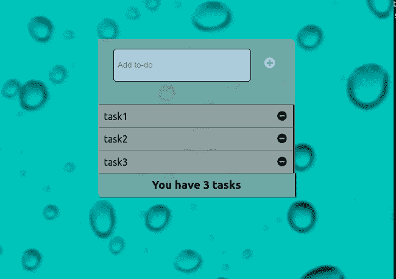

图片来源:作者

发表在我的[博客](https://blog.uchechukwunwafor.codes/)上的原创文章

# 更新

> 本文最初是使用 React 的基于类的组件发布的。但是考虑到基于功能的组件现在是标准，我将提供功能等同于带有`useState` [React 钩子](https://reactjs.org/docs/hooks-intro.html)的`App`组件。尽情享受吧！😊

# 介绍

在掌握 React Js 的基础知识之后，构建一个待办事项列表应用程序是挑战自己的一个好方法。这是一个入门项目，有助于巩固基本概念，如状态、组件、虚拟 DOM 等等。

我将指导你创建一个简单的待办事项应用程序，并鼓励你在它的基础上添加任何你喜欢的功能。在我们开始之前，有几件事你必须知道:

*   除了那些由`create-react-app`提供的，所有的功能组件或函数都将被写成箭头函数。
*   要理解这篇文章，您需要了解 React 的基础知识。(你可以查看 React 文档。)
*   本文不涉及部署待办事项应用程序。

对于那些想看看真实代码的人来说，[这里有链接](https://github.com/caspero-62/to-do-list-demo-for-article)到那里。

您也可以点击访问 [live 应用程序。](https://caspero-62.github.io/to-do-list/)

## 更新

> 此应用的功能组件版本的[回购](https://github.com/caspero-62/ToDoListFunctional)已添加到本文中。

由于这只是一个 React 教程，我将删除每个组件的 CSS 文件的链接:

1.  [Index.css](https://github.com/caspero-62/to-do-list-demo-for-article/blob/master/src/index.css)
2.  [App.css](https://github.com/caspero-62/to-do-list-demo-for-article/blob/master/src/App.css)
3.  [ToDoList.style.css](https://github.com/caspero-62/to-do-list-demo-for-article/blob/master/src/components/ToDoList/ToDoList.style.css)
4.  [ToDo.style.css](https://github.com/caspero-62/to-do-list-demo-for-article/blob/master/src/components/ToDo/ToDo.style.css)
5.  [TaskIndicator.style.css](https://github.com/caspero-62/to-do-list-demo-for-article/blob/master/src/components/TaskIndicator/TaskIndicator.style.css)
6.  [InputForm.style.css](https://github.com/caspero-62/to-do-list-demo-for-article/blob/master/src/components/InputForm/InputForm.style.css)

# 设置 React 应用程序

为了这个例子，我们将使用`create-react-app`方法来设置我们的应用程序。这是为了让我们一切都变得容易。

如果您的计算机上没有设置`create-react-app`，您可以通过查看 [Create React App 文档](https://facebook.github.io/create-react-app/docs/getting-started)开始。

以下步骤将帮助您开始设置应用程序:

1.  转到您的终端(如果您是 MAC OS/LINUX 用户)或命令提示符(如果您是 Windows 用户)。

注意:在本文中，我将只使用术语*终端*。

2.使用`cd`命令，将路径更改为您想要创建应用的目录:

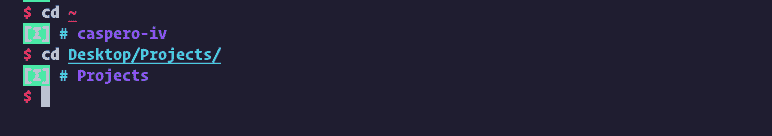

3.在你的终端中输入`create-react-app <name of the app>`并按回车键。这安装和应用程序，瞧:我们可以开始编码我们的应用程序。

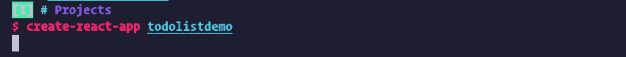

注意:如果您在下面的消息中看到这种错误，请尝试使用 sudo 命令切换到 root。

4.进入 app 文件夹，在 VS 代码或任何其他你使用的 IDE 中打开:

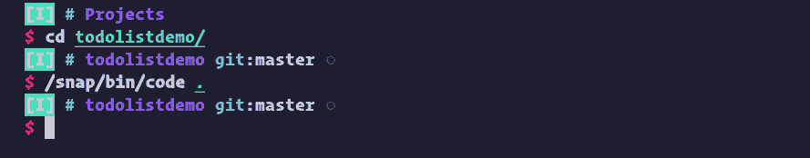

# 草图和结构

在我们开始编写应用程序之前，我们需要对我们想要实现的目标有一个可视化的表示或结构。我有一个我们希望应用程序看起来像什么的快速草图:

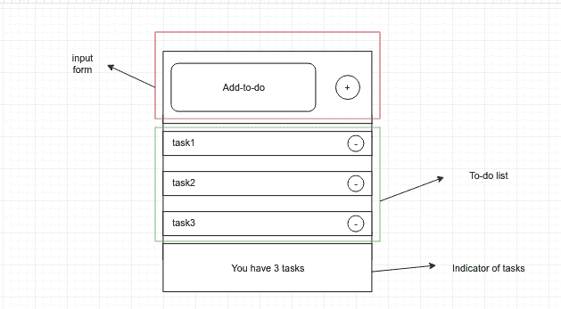

尤其是在 React 中，我们希望了解以下内容:

*   我们的组件会是什么样子
*   组件的哪一部分应该改变或更新
*   他们什么时候会改变

请看这张图片，我们需要三个基本组件:

1.  **输入表单:**该部分负责接收用户输入(任务)，最终将呈现给待办事项列表组件。
2.  **待办事项列表:**该组件作为每个待办事项(任务)组件的容器，容纳任何接受的新任务。
3.  **任务指示器:**这个组件会显示你当时的任务数。

正如这些组件已经列出，这是它们在我们的应用程序中的样子。我们必须为每个任务包含一个待办组件，最后，我们的`App.js`文件将包含所有这些组件(这已经由`create-react-app`提供给我们)。)

完成整个设置后，我们的应用程序的`src`结构如下所示:

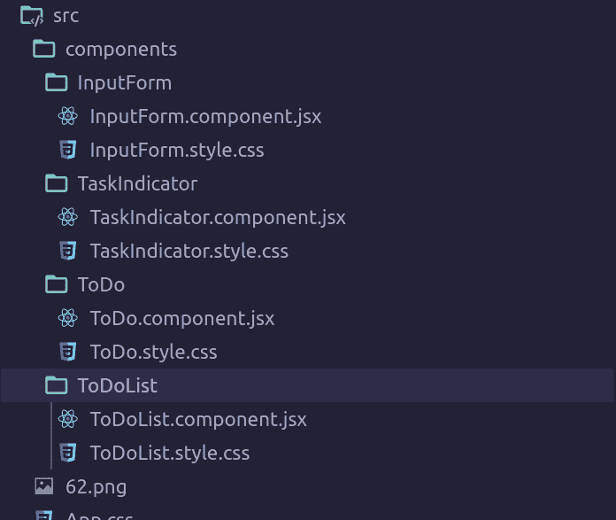

正如您在这里看到的，我们在`src`文件夹下创建了一个`component`文件夹来存放所有单独的和可重用的组件。这是 React 的主要优势之一；它有助于将我们的整个应用程序分解成块(可重用的组件)。在构建更大的应用程序时，我们更容易看到这种优势。

# 编写应用程序

最后，是时候编写我们的应用程序了。我们所有的文件都准备好了，让我们从`App`组件开始，因为它将包含我们所有剩余的组件。

这个特殊的`App`组件将是一个类组件，这样我们就可以访问 React 的状态。

我建议我们清除`App.js`文件中的所有内容，并从头开始编码。但是，您可以将其修改为下面的代码:

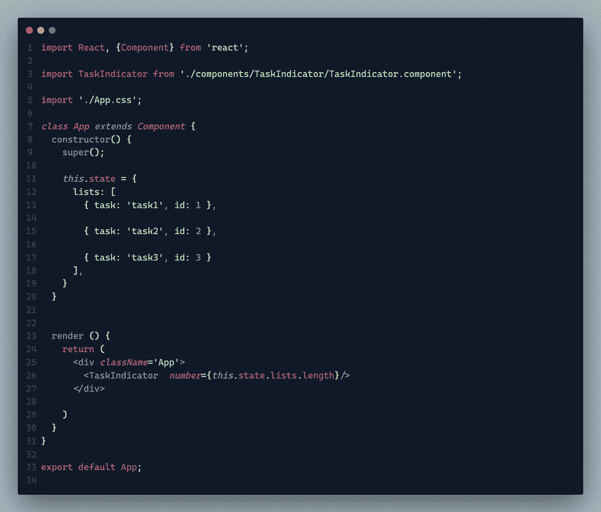

好的，让我们解释一下目前为止我们做了什么。第一张图片只是描述了我们需要导入的内容。如你所知，在 React 中编写任何函数或类组件之前，我们必须导入 React。由于这是一个类组件，我们还必须导入 React 的组件类。

然后我们从各自的文件中导入`TaskIndicator`函数，并为`App`组件导入 CSS 文件。

在这之后，我们开始编写我们的`App`类组件，它将扩展 React 的组件类，并可以访问它的方法(通过调用`super()`)。这使我们能够访问一个状态属性，在这里我们可以声明我们想要更改的内容。

在我们的应用程序中，我们想要改变的是我们的 tasks ( `lists`)属性，对象值包含每个任务及其各自的`id`。

然后调用`render`方法，它将以类似 HTML 的格式(JSX)返回我们想要的组件。我们现在渲染的第一件事是`TaskIndicator`组件，我们将`number`道具传递给它，指示我们的待办事项列表中剩余的任务数量。

让我们看看我们的`TaskIndicator`组件会是什么样子:

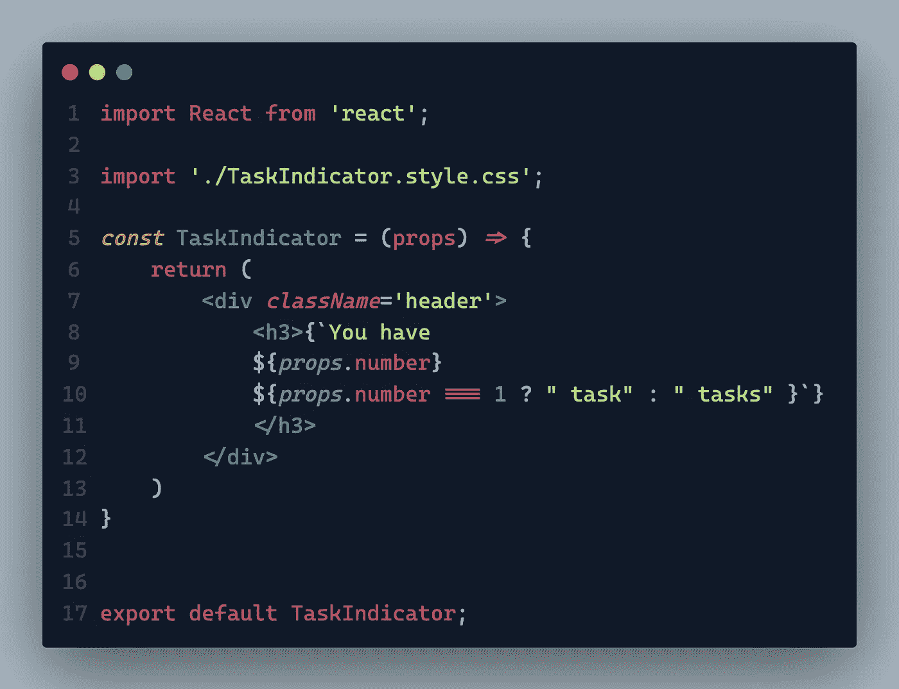

TaskIndicator 组件

我们让它成为一个功能组件(因为它不包含任何状态),只返回我们拥有的任务数量的文本(使用我们传递给它的`number`属性)。

应用组件的 CSS 文件后，我们应该在浏览器中看到:

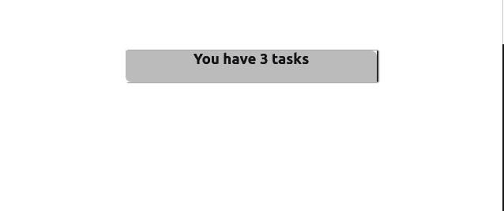

如您所见，这表明我们有三个任务，这是我们的`lists`数组中存在的对象数量。

那很容易，不是吗？现在让我们继续添加我们的`ToDoList`组件。它将使用`lists`数组作为它的道具，并且有一个`handleDelete`方法来帮助删除我们完成的任何任务。`handleDelete`方法如下:

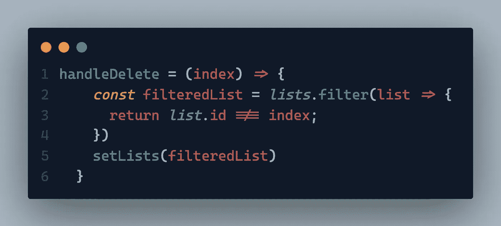

handleDelete 函数

这个方法接受一个`index`参数，这个参数有助于从列表中过滤出一个`id`不等于`index`的任务。然后，它使用`this.setState()`方法将列表的状态修改为过滤后的形式。

然后我们将`ToDoList`组件添加到`App.js`文件的`render`方法中:

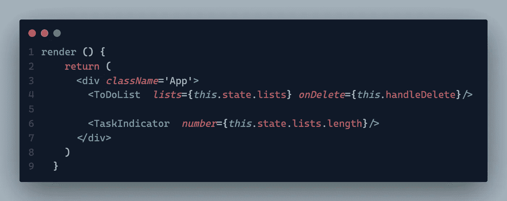

不要忘记从文件中导入`ToDoList`函数，然后继续编写`ToDoList` 函数:

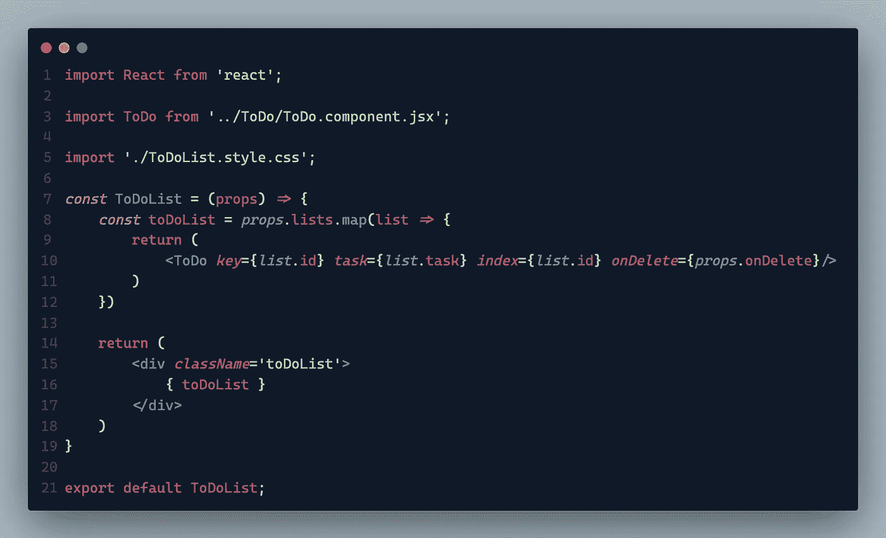

ToDoList 组件

这个函数组件遍历作为 props 给出的`lists`数组，并为每个列表返回一个`ToDo`组件。然后我们给每个`ToDo`组件以下道具:

*   `key` —相当于列表对象中的`id`值
*   `index` —与`key`相同，但被传递到`handleDelete`方法中，用于移除每个任务
*   `task` —代表`lists`数组的每个任务
*   `onDelete` —在我们的 App 组件中编写的`handleDelete`方法

当然，我们导入我们的`ToDo`组件并在我们的`ToDo.component.jsx`文件中编写函数。

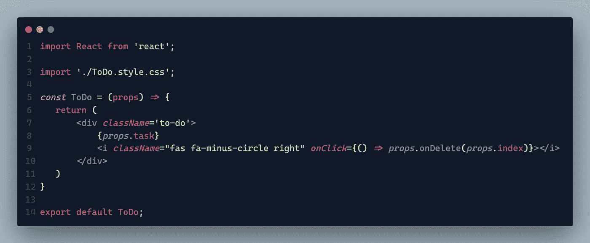

待办事项组件

我们应用程序的这一部分最终返回一个 div，其中包含每个任务和一个字体很棒的减号(-)图标，该图标传递了`onDelete`道具。单击此图标时，会移除相应的任务。然后，该组件被导出。

为了访问字体 Awesome 图标，我们将下面的脚本标签添加到我们的`index.html`文件中的 body 标签的末尾，该文件位于我们应用程序的 public 文件夹中。

```
<script *src*=”https://kit.fontawesome.com/8ca81c817e.js" *crossorigin*=”anonymous”></script>
```

做完这些后，我们的应用程序看起来是这样的:


现在是我们应用程序的最后一个阶段，创建输入表单，接受新任务并将它们添加到列表中。根据我们的草图，这个表单将包含一个输入元素(type=text)和另一个带有加号(+)的字体很棒的图标。

为了帮助我们实现这一目标，我们需要以下方法:

*   一个`handleChange`方法，处理作为输入传递的任何值
*   一个`handleSubmit`方法，将输入(任务)添加到列表中，只要它不为空

首先，我们在我们的`App`组件中添加一个输入状态:

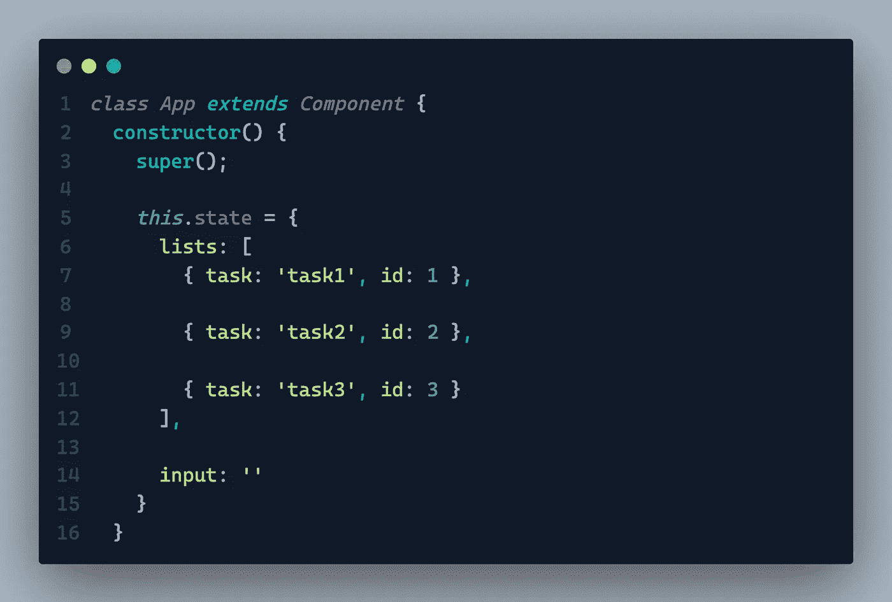

之后，我们继续在构造函数后面编写我们的`handleChange`和`handleSubmit`方法。

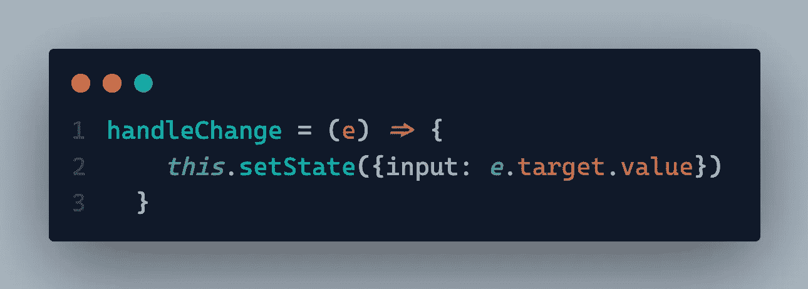

handleChange 函数

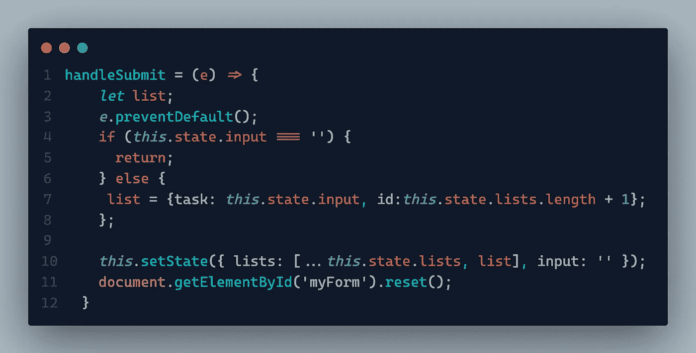

handleSubmit 函数

如前所述，`handleChange`方法只是记录用户类型并将我们的输入设置为该值。

另一方面，如果用户的输入为空，我们的`handleSubmit`方法什么也不做。如果用户最终写了东西，它会用`task`和`id`属性创建一个对象，并将这个对象添加到我们的待办事项列表中。添加任务时，表单将被清除或重置。

正如我们对前面的组件所做的那样，我们从文件中导入`InputForm`组件，并在我们的`App`组件中呈现它:

```
**import** InputForm **from** ‘./components/InputForm/InputForm.component.jsx’;
```

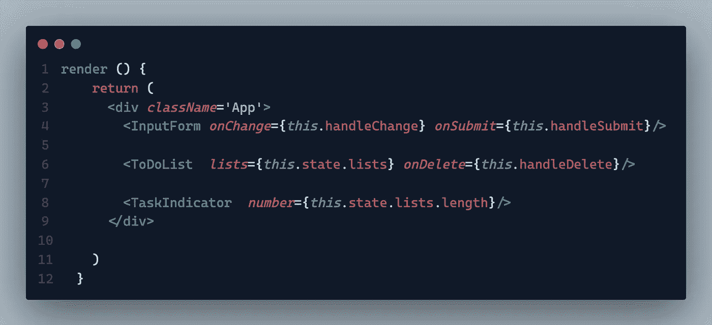

记住，我们必须传入我们刚刚编写的两个方法，作为进入`InputForm`组件的道具。

下面是`InputForm`功能:

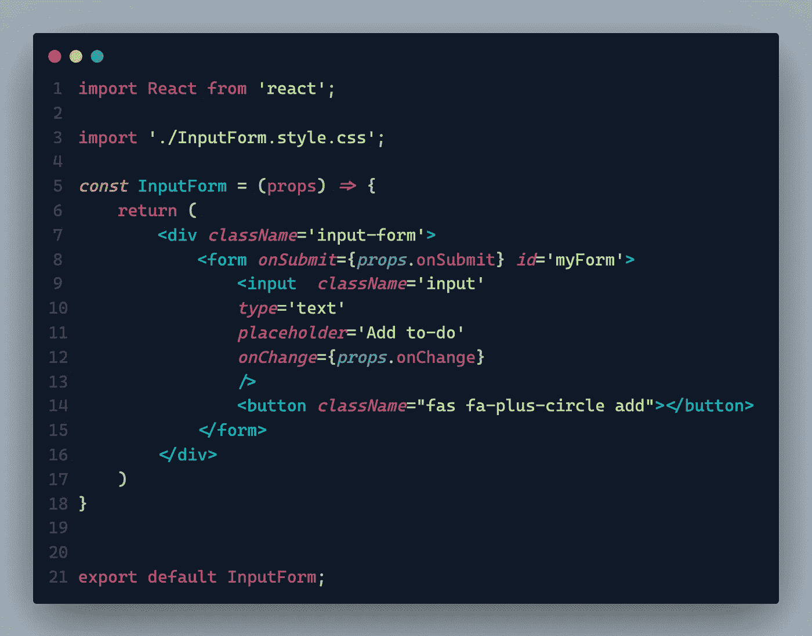

输入表单组件

我们利用所有必要的道具和出口我们的组件。

# 更新——用于`App`的功能组件

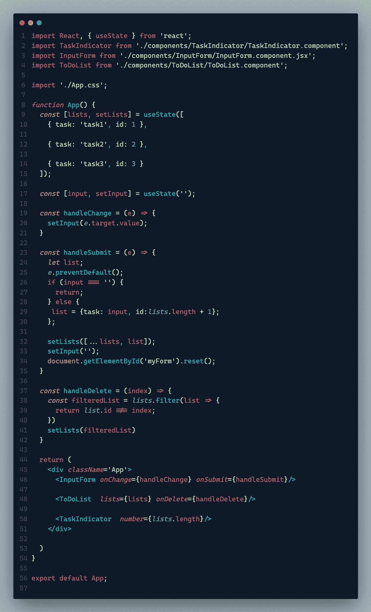

App.js 代码重组

正如您所注意到的，将我们的`App`组件从基于类切换到基于函数需要一些修改。

我们做的第一件显而易见的事情是从`Class`改为`function`。
这样做，我们失去了`this`上下文；因此，我们使用`const`初始化所有的句柄函数。我们也不再需要`constructor`，并且可以继续移除它。

最后，我们使用`useState`钩子代替构造函数中的`this.state`对象来初始化我们的状态。`useState`允许你初始化一个状态，也可以传入一个函数在以后改变状态——就像`this.state`和`this.setState`一样。不同之处在于，它与功能组件结合使用，并且可以尽可能多次地用于指定单个状态，就像我们对**列表**和**输入**所做的那样。

从这里开始，其他事情都非常简单。

# **结论**

仅此而已。我们已经准备好了待办事项应用程序。只需添加必要的样式，我们的应用程序就像开始时的成品一样。

理解这样一个小项目可以帮助您掌握 React 中的一些基本概念，并为您继续学习更具挑战性的概念做好准备。