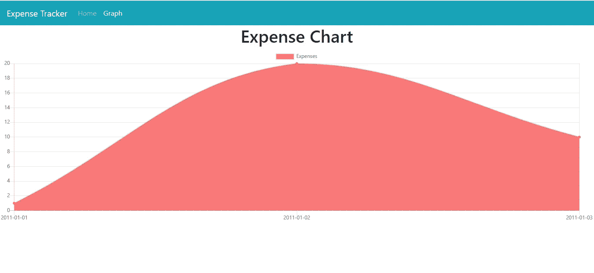
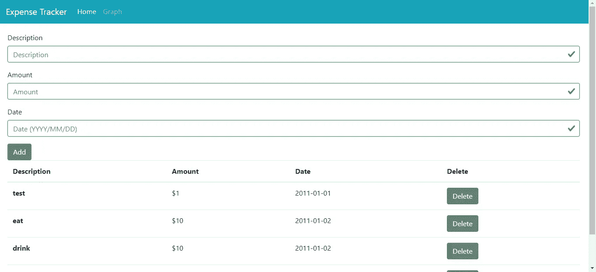
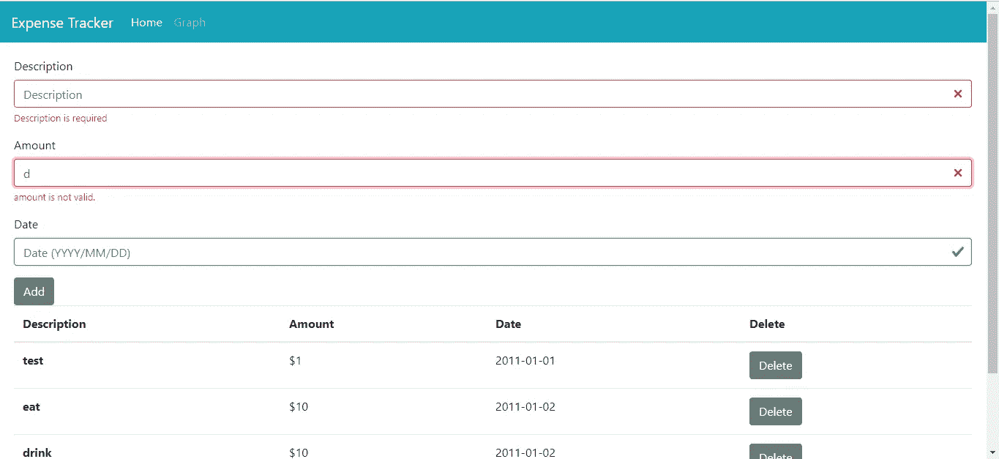

# 如何用 BootstrapVue 2 构建 UI

> 原文：<https://betterprogramming.pub/how-to-build-a-ui-with-bootstrapvue-2-982511386107>

## 用 BootstrapVue 2 构建一个简单的费用跟踪器


Arif Riyanto 在 [Unsplash](https://unsplash.com/) 上拍摄的照片

现在发布了 BootstrapVue 2，它与 Vue.js 2.6 或更高版本兼容。在这个版本中有很多幕后的改进和突破性的变化。此版本还引入了性能改进。

在很大程度上，使用 BootstrapVue 2 构建应用程序与使用以前版本的 BootstrapVue 非常相似。您可以在 [Bootstrap 的 Changelog](https://bootstrap-vue.js.org/docs/misc/changelog) 上查看变更的完整列表。

在本文中，我们将构建一个简单的费用追踪器，用一个表单添加费用的描述、金额和日期。我们还将构建一个表来显示数据，我们还将添加按钮让用户删除费用。此外，将有一个页面显示按日期排序的费用折线图。

后端将使用 Koa 构建，以保持简单。我们将使用最新版本的 Vue.js 和最新版本的 BootstrapVue 来构建 UI。Vee-Validate 将用于表单验证，Vue-Chartjs 将用于折线图。

# 后端

首先，我们构建一个简单的后端来存储费用。创建一个项目文件夹，然后创建一个`backend`文件夹来存储后端代码。现在我们可以构建后端，为此我们运行`npm init`并通过输入默认值来回答问题。然后我们安装自己的软件包。Koa 什么都没有，所以我们需要安装一个请求体解析器，一个路由器，CORS 插件来支持前端的跨域请求，并为数据库添加库。

要安装所有这些包，运行`npm i @babel/cli @babel/core @babel/node @babel/preset-env @koa/cors koa-bodyparser koa-router sequelize sqlite3`。我们需要 Babel 包来运行最新的 JavaScript 特性。Sequelize 和 SQLite 分别是我们将要使用的 ORM 和数据库。Koa 包分别用于启用 CORS、解析 JSON 请求体和启用路由。

下次运行:

```
npx sequelize-cli init
```

这将创建数据库样板代码。

然后我们运行:

```
npx sequelize-cli --name Expense --attributes description:string,amount:float,date:date
```

这将创建一个`Expense`表，其字段和数据类型列在`attributes`选项中。

完成后，运行`npx sequelize-cli db:migrate`创建数据库。

接下来，在`backend`文件夹的根目录下创建`app.js`,并添加:

```
const Koa = require("koa");
const cors = require("[@koa/cors](http://twitter.com/koa/cors)");
const Router = require("koa-router");
const models = require("./models");
const bodyParser = require("koa-bodyparser");const app = new Koa();
app.use(bodyParser());
app.use(cors());
const router = new Router();router.get("/expenses", async (ctx, next) => {
  const Expenses = await models.Expense.findAll();
  ctx.body = Expenses;
});router.post("/expenses", async (ctx, next) => {
  const Expense = await models.Expense.create(ctx.request.body);
  ctx.body = Expense;
});router.delete("/expenses/:id", async (ctx, next) => {
  const id = ctx.params.id;
  await models.Expense.destroy({ where: { id } });
  ctx.body = {};
});app.use(router.routes()).use(router.allowedMethods());app.listen(3000);
```

这是包含我们应用程序所有逻辑的文件。我们使用通过导入运行`sequelize-cli init`创建的`models`模块而创建的 Sequelize 模型。

然后我们通过添加`app.use(cors());`来启用 CORS。通过添加`app.use(bodyParser());`来启用 JSON 请求体解析。我们通过添加`const router = new Router();`来添加路由器。

在 GET `expense`路线中，我们得到所有的费用。这个帖子是用来添加联系人的。PUT 路线用于通过按 ID 查找来更新现有费用。而删除路径用于按 ID 删除费用。

现在后端完成了。就这么简单。

# 前端

为了开始构建前端，我们在项目的根文件夹中添加一个`frontend`文件夹，然后我们进入`frontend`文件夹并运行:

```
npx @vue/cli create .
```

当我们运行向导时，我们将手动选择选项，并选择包括 Vuex 和 Vue 路由器和 SCSS。我们还将使用 NPM 进行包管理。

接下来，我们安装一些包。我们将使用 Axios 进行请求，使用 Moment 操作日期，使用 BootstrapVue 进行样式设置，使用 Vee-Validate 进行表单验证，使用 Vue-Chartjs 显示图表。

为了安装所有东西，我们运行:

```
npm i axios bootstrap-vue chartjs vue-chartjs vee-validate moment
```

安装好所有的包后，我们就可以开始写代码了。

在`src`文件夹中，创建一个`charts`文件夹，并在其中创建一个名为`ExpenseChart.vue`的文件。在文件中，添加:

```
<script>
import { Line } from "vue-chartjs";export default {
  extends: Line,
  props: ["chartdata", "options"],
  mounted() {
    this.renderChart(this.chartdata, this.options);
  },
  watch: {
    chartdata() {
      this.renderChart(this.chartdata, this.options);
    },
    options() {
      this.renderChart(this.chartdata, this.options);
    }
  }
};
</script><style>
</style>
```

我们指定这个组件接受`chartdata`和`options`道具。我们在`mounted`和`watch`两个块中都调用了`this.renderChart`,这样无论何时道具改变或者该组件第一次加载时，图表都会更新。

接下来，我们创建一个过滤器来格式化日期。在`src` 文件夹中创建一个`filters`文件夹，并在其中创建`date.js`。在文件中，我们添加了:

```
import * as moment from "moment";export const dateFilter = value => {
  return moment(value).format("YYYY-MM-DD");
};
```

这将接收一个日期，然后以 YYYY-MM-DD 格式返回。

然后我们为 HTTP 请求代码创建一个 mixin。在`src`文件夹中创建一个`mixins`文件夹，在其中创建一个`requestsMixin.js`并添加:

```
const APIURL = "[http://localhost:3000](http://localhost:3000)";
const axios = require("axios");export const requestsMixin = {
  methods: {
    getExpenses() {
      return axios.get(`${APIURL}/expenses`);
    }, addExpense(data) {
      return axios.post(`${APIURL}/expenses`, data);
    }, deleteExpense(id) {
      return axios.delete(`${APIURL}/expenses/${id}`);
    }
  }
};
```

当 mixin 包含在组件中时，这允许我们在任何组件中调用这些函数。

接下来，在`views`文件夹中，我们创建我们的组件。在`views`文件夹中创建一个`Graph.vue`文件，并添加:

```
<template>
  <div class="about">
    <h1 class="text-center">Expense Chart</h1>
    <expense-chart :chartdata="chartData" :options="options"></expense-chart>
  </div>
</template><script>
import { requestsMixin } from "../mixins/requestsMixin";
import * as moment from "moment";export default {
  name: "home",
  mixins: [requestsMixin],
  data() {
    return {
      chartData: {},
      options: { responsive: true, maintainAspectRatio: false }
    };
  },
  beforeMount() {
    this.getAllExpenses();
  }, methods: {
    async getAllExpenses() {
      const response = await this.getExpenses();
      const sortedData = response.data.sort(
        (a, b) => +moment(a.date).toDate() - +moment(b.date).toDate()
      );
      const dates = Array.from(
        new Set(sortedData.map(d => moment(d.date).format("YYYY-MM-DD")))
      );
      const expensesByDate = {};
      dates.forEach(d => {
        expensesByDate[d] = 0;
      }); dates.forEach(d => {
        const data = sortedData.filter(
          sd => moment(sd.date).format("YYYY-MM-DD") == d
        );
        expensesByDate[d] += +data
          .map(a => +a.amount)
          .reduce((a, b) => {
            return a + b;
          });
      }); this.chartData = {
        labels: dates,
        datasets: [
          {
            label: "Expenses",
            backgroundColor: "#f87979",
            data: Object.keys(expensesByDate).map(d => expensesByDate[d])
          }
        ]
      };
    }
  }
};
</script>
```

我们在这里显示我们之前创建的`ExpenseChart`。通过从后端获取数据来填充数据。`this.getExpenses`函数来自我们包含在这个文件中的`requestMixin`。为了生成`chartData`，我们按照日期对数据进行排序，然后将日期设置为`labels`。然后，在`datasets`中，我们有该行的数据，即费用金额。我们将每天的所有费用相加，并将其转换为一个数组，其中包含:

```
const dates = Array.from(
        new Set(sortedData.map(d => moment(d.date).format("YYYY-MM-DD")))
      );
const expensesByDate = {};
dates.forEach(d => {
  expensesByDate[d] = 0;
});dates.forEach(d => {
  const data = sortedData.filter(
    sd => moment(sd.date).format("YYYY-MM-DD") == d
  );
  expensesByDate[d] += +data
    .map(a => +a.amount)
    .reduce((a, b) => {
      return a + b;
    });
});
```

在上面的代码中，我们将费用转换成一个字典，以日期作为键，以总费用作为值。

我们通过将`{ responsive: true, maintainAspectRatio: false }`传递给`options`属性来使图表具有响应性。

接下来，我们用以下代码替换`HomePage.vue`中的现有代码:

```
<template>
  <div class="page">
    <ValidationObserver ref="observer" v-slot="{ invalid }">
      <b-form [@submit](http://twitter.com/submit).prevent="onSubmit" novalidate>
        <b-form-group label="Description">
          <ValidationProvider name="description" rules="required" v-slot="{ errors }">
            <b-form-input
              :state="errors.length == 0"
              v-model="form.description"
              type="text"
              required
              placeholder="Description"
              name="description"
            ></b-form-input>
            <b-form-invalid-feedback :state="errors.length == 0">Description is required</b-form-invalid-feedback>
          </ValidationProvider>
        </b-form-group>
        <b-form-group label="Amount">
          <ValidationProvider name="amount" rules="required|min_value:0" v-slot="{ errors }">
            <b-form-input
              :state="errors.length == 0"
              v-model="form.amount"
              type="text"
              required
              placeholder="Amount"
            ></b-form-input>
            <b-form-invalid-feedback :state="errors.length == 0">{{errors.join('. ')}}</b-form-invalid-feedback>
          </ValidationProvider>
        </b-form-group>
        <b-form-group label="Date">
          <ValidationProvider name="amount" rules="date" v-slot="{ errors }">
            <b-form-input
              :state="errors.length == 0"
              v-model="form.date"
              type="text"
              required
              placeholder="Date (YYYY/MM/DD)"
              name="date"
            ></b-form-input>
            <b-form-invalid-feedback :state="errors.length == 0">{{errors[0]}}</b-form-invalid-feedback>
          </ValidationProvider>
        </b-form-group>
        <b-button type="submit">Add</b-button>
      </b-form>
    </ValidationObserver> <b-table-simple responsive>
      <b-thead>
        <b-tr>
          <b-th sticky-column>Description</b-th>
          <b-th>Amount</b-th>
          <b-th>Date</b-th>
          <b-th>Delete</b-th>
        </b-tr>
      </b-thead>
      <b-tbody>
        <b-tr v-for="e in expenses" :key="e.id">
          <b-th sticky-column>{{e.description}}</b-th>
          <b-td>${{e.amount}}</b-td>
          <b-td>{{e.date | formatDate}}</b-td>
          <b-td>
            <b-button [@click](http://twitter.com/click)="deleteSingleExpense(e.id)">Delete</b-button>
          </b-td>
        </b-tr>
      </b-tbody>
    </b-table-simple>
  </div>
</template><script>
import "bootstrap/dist/css/bootstrap.css";
import "bootstrap-vue/dist/bootstrap-vue.css";
import { requestsMixin } from "../mixins/requestsMixin";export default {
  name: "home",
  mixins: [requestsMixin],
  data() {
    return {
      form: {}
    };
  },
  beforeMount() {
    this.getAllExpenses();
  },
  computed: {
    expenses() {
      return this.$store.state.expenses;
    }
  },
  methods: {
    async onSubmit() {
      const isValid = await this.$refs.observer.validate();
      if (!isValid) {
        return;
      }
      await this.addExpense(this.form);
      await this.getAllExpenses();
    }, async getAllExpenses() {
      const response = await this.getExpenses();
      this.$store.commit("setExpenses", response.data);
    }, async deleteSingleExpense(id) {
      const response = await this.deleteExpense(id);
      await this.getAllExpenses();
    }
  }
};
</script>
```

我们使用 BootstrapVue 中的表单和表格来构建表单和表格。对于表单验证，我们用每个`b-form-input`包装`ValidationProvider`来获得表单验证。表单验证的规则注册在`main.js`中，所以我们可以在这里使用它们。

我们在每个`b-form-input`中添加了`:state=”errors.length == 0"`,这样我们就可以为每个输入显示正确的验证消息，并对其进行适当的样式设置。`errors`对象有每个输入的表单验证错误消息。我们还需要在`ValidationProvider`和`b-form-input`中指定`name`属性，以便将表单验证规则应用于`ValidationProvider`中的输入。我们将表单放在`ValidationObserver`组件中，让我们验证整个表单。使用 Vee-Validate，当我们像在上面的代码中那样使用`ValidationObserver`时，我们得到了`this.$refs.observer.validate()`函数。如果表单有效，它返回一个解析为 true 的承诺，否则解析为 false。因此，如果它解析为 false，我们不会运行函数的其余代码。

`this.$store`由 Vuex 提供。我们在它上面调用`commit`将值存储到 Vuex 存储中。我们从`computed`街区的商店获得最新的价值。

接下来在`App.vue`中，用以下代码替换现有代码:

```
<template>
  <div id="app">
    <b-navbar toggleable="lg" type="dark" variant="info">
      <b-navbar-brand href="#">Expense Tracker</b-navbar-brand> <b-navbar-toggle target="nav-collapse"></b-navbar-toggle> <b-collapse id="nav-collapse" is-nav>
        <b-navbar-nav>
          <b-nav-item to="/" :active="path  == '/'">Home</b-nav-item>
          <b-nav-item to="/graph" :active="path  == '/graph'">Graph</b-nav-item>
        </b-navbar-nav>
      </b-collapse>
    </b-navbar>
    <router-view />
  </div>
</template><script>
export default {
  beforeMount() {
    window.Chart.defaults.global.defaultFontFamily = `
  -apple-system, BlinkMacSystemFont, "Segoe UI", "Roboto", "Oxygen",
  "Ubuntu", "Cantarell", "Fira Sans", "Droid Sans", "Helvetica Neue",
  sans-serif`;
  },
  data() {
    return {
      path: this.$route && this.$route.path
    };
  },
  watch: {
    $route(route) {
      this.path = route.path;
    }
  }
};
</script><style lang="scss">
.page {
  padding: 20px;
}
</style>
```

在这个文件中，我们添加了 BootstrapVue `b-navbar`来显示一个顶栏。我们观察 URL 的变化，以便我们可以将正确的链接设置为活动的。在`data`块中，我们设置初始路线，以便在应用首次加载时高亮显示正确的链接。

接下来在`main.js`中，我们将现有代码替换为:

```
import Vue from "vue";
import App from "./App.vue";
import router from "./router";
import store from "./store";
import BootstrapVue from "bootstrap-vue";
import { ValidationProvider, extend, ValidationObserver } from "vee-validate";
import { required, min_value } from "vee-validate/dist/rules";
import { dateFilter } from "./filters/date";
import ExpenseChart from "./charts/ExpenseChart";extend("required", required);
extend("min_value", min_value);
extend("date", {
  validate: value =>
    /^(19|20)\d\d[/]([1-9]|0[1-9]|1[012])[/]([1-9]|0[1-9]|[12][0-9]|3[01])$/.test(
      value
    ),
  message: "Date must be in YYYY/MM/DD format"
});Vue.component("expense-chart", ExpenseChart);
Vue.filter("formatDate", dateFilter);
Vue.use(BootstrapVue);
Vue.component("ValidationProvider", ValidationProvider);
Vue.component("ValidationObserver", ValidationObserver);
Vue.config.productionTip = false;new Vue({
  router,
  store,
  render: h => h(App)
}).$mount("#app");
```

这里添加了我们在`Home.vue`中使用的验证规则。注意，我们可以有定制的验证规则，比如`date`规则。使用 VeeValidate 3 很容易定义自定义规则。我们还注册了`ValidationProvider`和`ExpenseChart`组件，以便在我们的应用程序中使用它们。

我们在这里注册了`ValidationObserver`组件，让我们在`HomePage.vue`中验证整个表单。

在`router.js`中，我们将现有代码替换为:

```
import Vue from 'vue'
import Router from 'vue-router'
import Home from './views/Home.vue'
import Graph from './views/Graph.vue'Vue.use(Router)export default new Router({
  mode: 'history',
  base: process.env.BASE_URL,
  routes: [
    {
      path: '/',
      name: 'home',
      component: Home
    },
    {
      path: '/graph',
      name: 'graph',
      component: Graph
    }
  ]
})
```

这将包括我们创建的`Graph`页面。

在`store.js`中，我们将代码替换为:

```
import Vue from "vue";
import Vuex from "vuex";Vue.use(Vuex);export default new Vuex.Store({
  state: {
    expenses: []
  },
  mutations: {
    setExpenses(state, payload) {
      state.expenses = payload;
    }
  },
  actions: {}
});
```

现在，无论何时获得费用数据，我们都可以将其保存在商店中。

最后在`index.html`中，我们将现有代码改为:

```
<!DOCTYPE html>
<html lang="en">
  <head>
    <meta charset="utf-8" />
    <meta http-equiv="X-UA-Compatible" content="IE=edge" />
    <meta name="viewport" content="width=device-width,initial-scale=1.0" />
    <link rel="icon" href="<%= BASE_URL %>favicon.ico" />
    <title>Expense Tracker</title>
  </head>
  <body>
    <noscript>
      <strong
        >We're sorry but frontend doesn't work properly without JavaScript
        enabled. Please enable it to continue.</strong
      >
    </noscript>
    <div id="app"></div>
    <!-- built files will be auto injected -->
  </body>
</html>
```

这样就改标题了。我们已经在`App.vue`中导入了引导样式，所以我们不必在这里包含它。

写完所有代码后，我们就可以运行我们的应用程序了。在运行任何东西之前，通过运行`npm i -g nodemon`来安装`nodemon`,这样我们就不必在文件改变时自己重启后端。

然后，通过运行`backend`文件夹中的`npm start`和`frontend`文件夹中的`npm run serve`运行后端。

最终，我们得到了以下结果:

