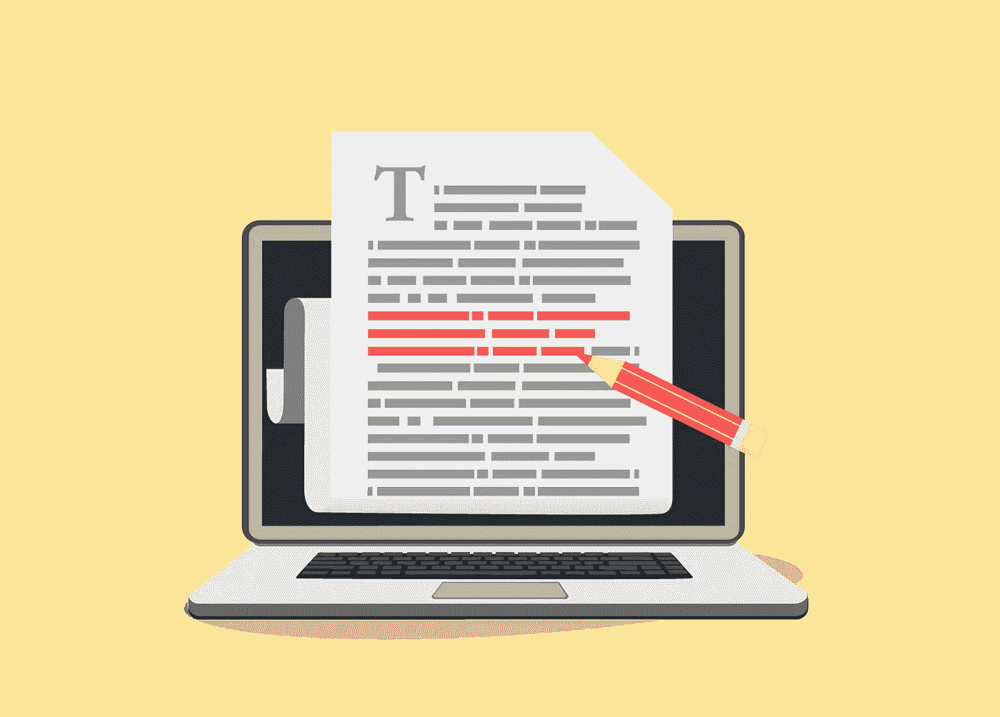

# 如何构建一个文本摘要器(TL；博士)用简单的自然语言处理

> 原文：<https://betterprogramming.pub/how-to-build-a-url-text-summarizer-with-simple-natural-language-processing-ac1a9cb742de>

## 了解如何使用 Python、NLP 和基本的 web 爬行来总结任何在线文章



如果你能自动获得任何在线文章的摘要，那不是很好吗？无论你是太忙还是阅读清单上有太多的文章，有时你真正想要的只是一篇简短的文章摘要。

这就是为什么 TL；DR 如今被广泛使用。虽然这个互联网缩写词可以批评一篇文章过长，但它通常用于对一个更长的故事或复杂的现象进行有益的总结。今天，我们将构建一个 TL；任何给定文章的 DR。

# 入门指南

对于本教程，我们将使用两个 Python 库:

1.  [美汤](https://www.crummy.com/software/BeautifulSoup/bs4/doc/)进行网页抓取。

> “Beautiful Soup 是一个 Python 库，用于从 HTML 和 XML 文件中提取数据。它与您喜欢的解析器一起工作，提供导航、搜索和修改解析树的惯用方式。它通常能为程序员节省数小时或数天的工作。”——[美汤的文档](https://www.crummy.com/software/BeautifulSoup/bs4/doc/)

1.  用于文本摘要的 NLTK(自然语言工具包)。

> “NLTK 是构建 Python 程序来处理人类语言数据的领先平台。它为超过 50 个语料库和词汇资源(如 WordNet)提供了易于使用的接口，以及一套用于分类、标记化、词干化、标记、解析和语义推理的文本处理库，以及工业级 NLP 库的包装器。— [NLTK 的文件](https://www.nltk.org/)

在继续之前，先熟悉一下这些库。此外，确保将它们安装在本地。或者，在[项目回购目录](https://github.com/assafelovic/nlp_url_summarizer)中运行该命令:

```
pip install -r requirements.txt
```

接下来，我们将从 NLTK 库中单独下载`stopwords`语料库。打开 Python 的命令行，输入:

```
import nltk
nltk.download("stopwords")
```

# 使用自然语言处理的文本摘要

让我们来描述一下算法:

1.  从用户输入中获取 URL。
2.  Web-crawl 从 HTML 页面中提取页面文本(通过`<p>`)。
3.  对提取的文本句子执行[总结频率算法](https://github.com/assafelovic/nlp_url_summarizer/blob/master/text_summarizer.py)(使用 NLTK 实现)。该算法根据句子包含的单词的频率对句子进行排序，并选择顶部的句子进行最终总结。
4.  返回排名最高的句子(我更喜欢五个)作为最终总结。

对于第 2 部分(第 1 部分不言自明)，我们将开发一个名为`getTextFromURL`的方法:

```
def getTextFromURL(url):
    r = requests.get(url)
    soup = BeautifulSoup(r.text, "html.parser")
    text = ' '.join(map(lambda p: p.text, soup.find_all('p')))
    return text
```

该方法向给定的 URL 发起 GET 请求，并从 HTML 页面返回文本。

# 从文本到目标语；速度三角形定位法(dead reckoning)

对于第 3 和第 4 部分，我们将开发一个叫做`summarizeURL`的方法:

```
def summarizeURL(url, total_pars):
    url_text = getTextFromURL(url).replace(u"Â", u"").replace(u"â", u"")
    fs = FrequencySummarizer()
    final_summary = fs.summarize(url_text.replace("\n"," "),       total_pars)
    return " ".join(final_summary)
```

该方法调用上面的`getTextFromURL`来检索文本，并清除 HTML 字符和尾随的新行(`\n`)。

接下来，我们对给定的文本执行 [FrequencySummarizer](https://github.com/assafelovic/nlp_url_summarizer/blob/master/text_summarizer.py) 算法。该算法将输入标记为句子，然后计算单词的词频图。然后，对频率图进行过滤，以便忽略非常低频和高频的单词。这样，它能够丢弃有噪声的单词(例如非常常见但不包含太多信息的限定词)或只出现几次的单词。要查看源代码，请将[转至 GitHub](https://github.com/assafelovic/nlp_url_summarizer/blob/master/text_summarizer.py) 。

最后，我们返回一个排名最高的句子列表，这是我们的最终总结。

GitHub 上的[提供了完整的源代码。](https://github.com/assafelovic/nlp_url_summarizer)

# 摘要

就是这样！用任何 URL 尝试一下，你会得到一个相当不错的摘要。最近几年提出了很多总结算法(比如 [TF-IDF](https://towardsdatascience.com/text-summarization-using-tf-idf-e64a0644ace3) )，这个算法还有很多事情要做。例如，继续改进文本过滤。

如果你有任何建议或推荐，我很乐意阅读！