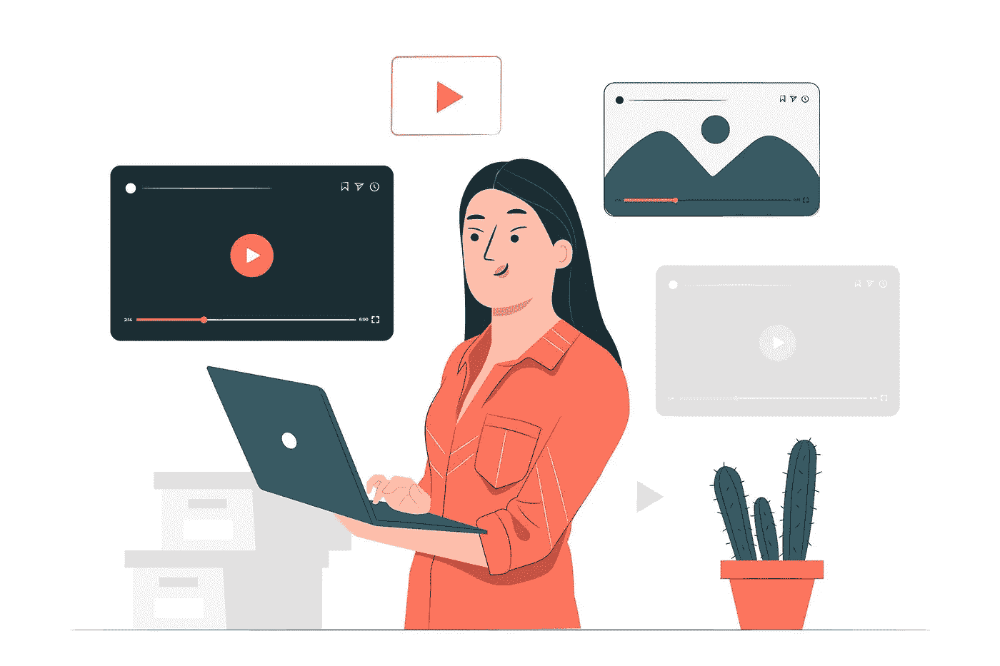
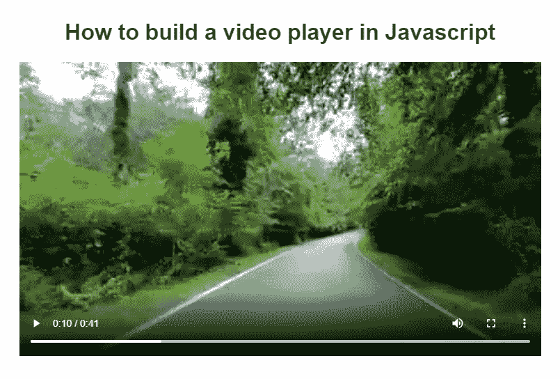
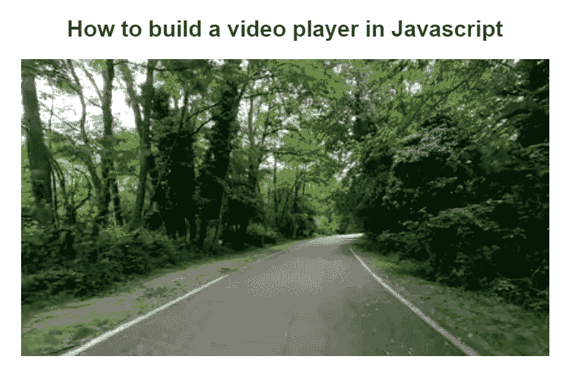
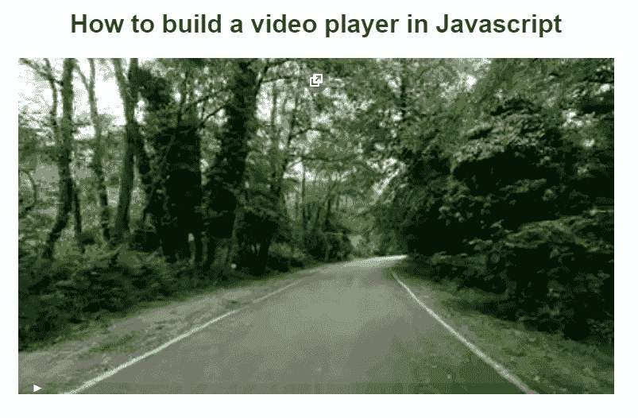

# 如何用普通的 JavaScript 和 HTML5 构建视频播放器

> 原文：<https://betterprogramming.pub/how-to-build-a-video-player-in-vanilla-javascript-and-html5-61ecc1552b8e>

## 一个深入的使用简单方法的 JavaScript 视频播放器教程



[图片由 Freepik 上的故事集](https://www.freepik.com/free-vector/media-player-concept-illustration_9936448.htm#query=video%20player&position=6&from_view=search)提供

十年前，如果没有 Flash 或 Silverlight 等第三方服务，在浏览器中播放视频或音频几乎是不可能的。你必须安装一个插件，并且只在使用它的时候播放你的媒体。它非常不舒服，速度慢，延误时间长。

现在，我们有了 HTML5 的 JavaScript，有了这些新技术和工具，我们可以更快、更容易、没有任何延迟地传输视频。要做到这一点，你只需要在 HTML5 中添加一个简单的`<video>`标签，并提供一个链接到你电脑上存储的视频。然后，通过使用一个名为`controls`的简单属性，您将拥有一个内置在浏览器中的默认视频播放器。

它很基础，没有太多功能，所以如果你想用你的个人视频播放器在你的网站上更专业地播放视频，你需要使用 JavaScript。我们将在这篇文章中教你如何去做！

在本指南结束时，您将拥有类似的东西。所以，如果你感到兴奋，继续阅读，并按照这个教程一步一步来！

# 设置项目

假设您正在使用 UNIX 系统(或者在 Windows 上使用 Git BASH ),您可以使用以下命令创建用 JavaScript 构建视频播放器所需的所有三个文件:

要在我们的应用程序中添加一个简单的视频播放器，我们必须在我们的`index.html`中添加以下代码:

在上面的代码中，`<video>`元素使用了来自我的 FTP 的远程视频。你可以使用我的默认视频，也可以通过调整`src`属性从你的本地计算机添加任何视频。HTML5 规范支持三种不同的视频格式，片段使用了多个`<source>`标签来使视频在 MP4 和 WebM 中可用。此外，`<p>`标签向不支持`video`元素的用户代理显示预定义的内容。

HTML5 `<video>`标签接受几个本地属性。例如，`controls`属性在添加或设置为 true 时显示标准播放器控件。你可以在这里找到更多关于[所有视频属性](https://developer.mozilla.org/en-US/docs/Web/HTML/Element/video#attr-controls)。

在继续之前，您应该应用本教程中需要的所有样式，方法是用此代码笔中的所有样式[填充您的`style.css`。保存并打开您的`index.html`,将其加载到浏览器中，查看嵌入式视频播放器，如下所示:](https://codepen.io/paulknulst/pen/qBYNxxa)



HTML 5 视频播放器用户界面的屏幕截图

# 用 JavaScript 定制视频播放器

要定制视频播放器，首先必须删除显示`Play`、`Pause`、`Volume`等的`controls`属性。，因为您将在本教程中实现自己的自定义控件。现在，检查你的浏览器。您将意识到控件已不存在，并且无法再播放视频。



不带控件属性的 HTML5 视频播放器用户界面的屏幕截图

# 添加播放和暂停

要启用播放和暂停视频的功能，您必须向`index.html`添加一个新按钮。看起来是这样的:

之后，打开您的`script.js`，通过添加以下代码来启用功能:

在这段 JavaScript 代码中，首先选择`video-container`元素和`playPauseBtn`(第 1 行和第 2 行)。之后，将定义两个函数:`togglePlay()`和`updatePlayBtn()`。`togglePlay()`用于根据实际状态停止和启动视频。`updatePlayBtn`用于在视频播放器内显示的图标之间切换。

在代码片段的最后一部分，click 事件监听器被添加到`playPauseBtn`中，它执行`togglePlay()`函数。接下来，三个点击事件监听器被添加到`videoContainer`。它们在鼠标点击时执行`togglePlay()`,根据视频的状态执行`updatePlayBtn`。

现在您可以重新加载您的`index.html`，并且应该能够通过点击视频或按钮来播放和暂停视频:



HTML5 视频播放器播放和暂停的动画演示

# 添加进度条

接下来，将实现一个进度条来显示视频播放时的当前时间戳。首先，给`index.html`添加一个`<div>`标签，作为进度条:

然后打开`script.js`并添加以下代码片段:

在这个代码片段中，将选择`progress`容器和`progress__filled`元素，并添加两个函数:`handleProgress()`和`jump(e)`。`handleProgress()`将负责更新进度条。`jump(e)`功能可以点击进度条跳转到视频中的位置。

最后一部分包含进度条所需的所有事件侦听器。每个`timeupdate`事件都会调用`handleProgress()`。还有，点击进度条上的任意位置都会调用`jump(e)`方法，视频会跳转到该位置。此外，`mousedown`、`mousemove`和`mouseup`将用于在进度条上按住鼠标按钮的同时在视频中滑动。

# 结束语

恭喜你！如果您遵循了教程，您就学会了如何使用 JavaScript 实现自己的视频播放器和添加自定义控件。现在，您可以使用 [my CodePen](https://codepen.io/paulknulst/pen/qBYNxxa) 并开始实现更多控件，如音量控件、键盘快捷键或跳过控件，以构建您自己的定制视频播放器。

目前，我正在编写后续教程，在该教程中，我将扩展这段代码以添加键盘控件和附加功能。它将在媒体上和我的博客上发表。

有什么问题吗？没问题，在评论区问就行了。我会回答一切。

```
**Want to Connect?**Feel free to connect with me on [my blog](https://www.paulsblog.dev), [LinkedIn](https://www.linkedin.com/in/paulknulst/), and [Twitter](https://twitter.com/paulknulst).
```

*这篇文章也在这两个地方发表:*

*   *在我的博客上:*[*https://www . paulsblog . dev/how-to-build-a-video-player-in-vanilla-JavaScript-and-html 5/*](https://www.paulsblog.dev/how-to-build-a-video-player-in-vanilla-javascript-and-html5/)
*   *在我的 Img.ly 博客上:*[*https://img . ly/blog/how-to-build-video-player-in-JavaScript/*](https://img.ly/blog/how-to-build-video-player-in-javascript/)