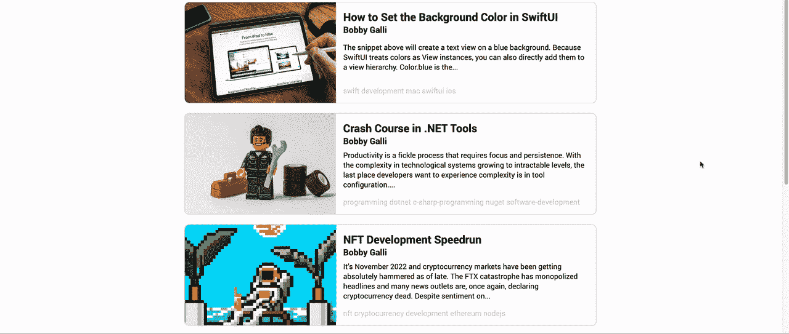
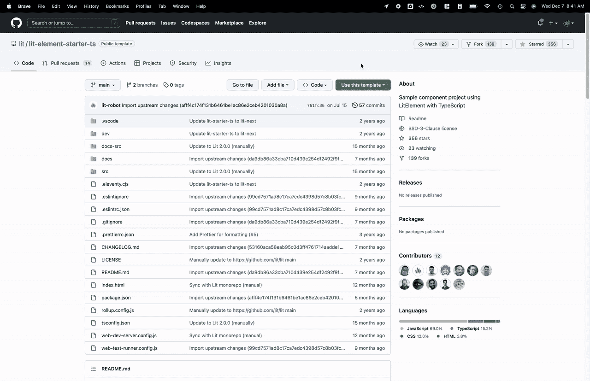
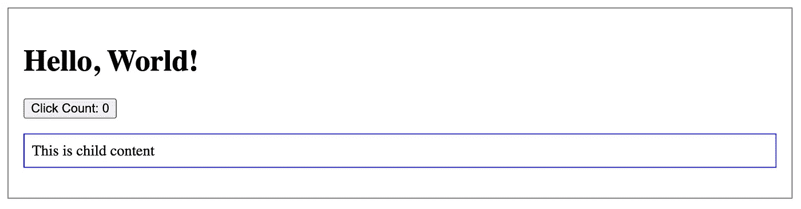
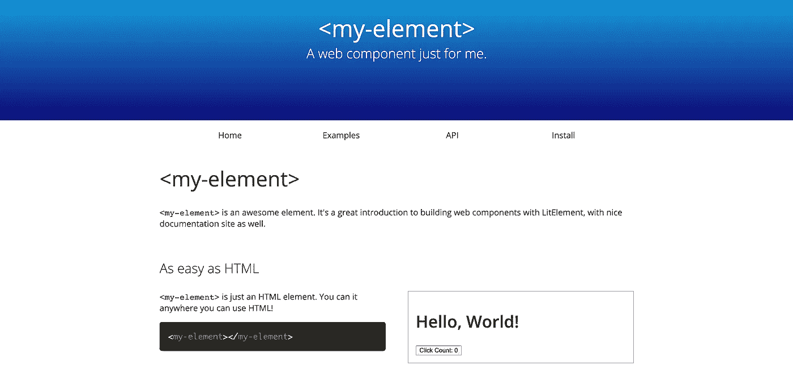
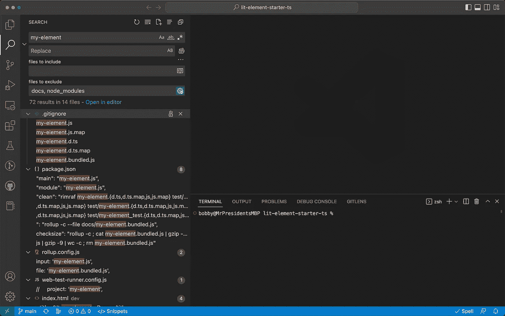
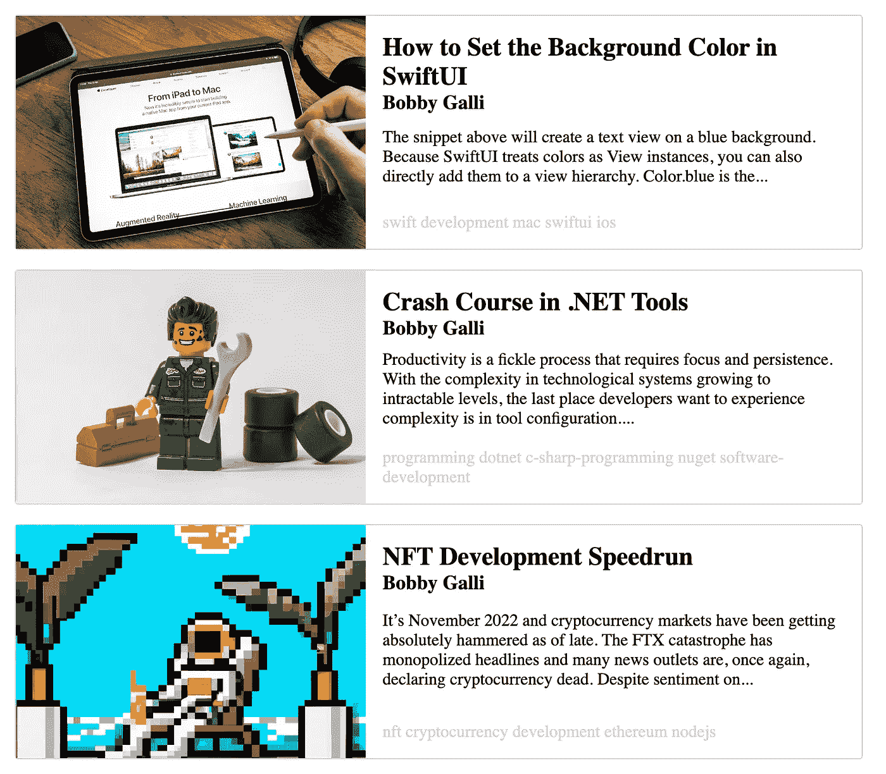
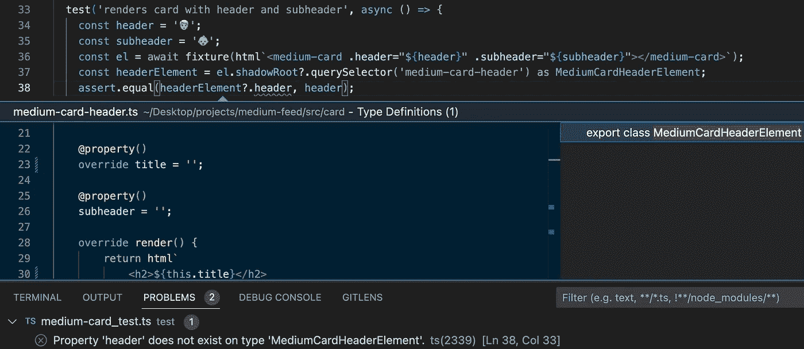

# 如何用 Lit 元素构建 Web 组件

> 原文：<https://betterprogramming.pub/how-to-build-a-web-component-with-lit-elements-d88684a46e56>

## 将媒体的 RSS 提要转换为预览卡列表


使用轻元素将自己从沉重框架的重力中解放出来(📷miszaszym

# 定义

*“web 组件是一组 Web 平台 API，允许你创建新的定制的、可重用的、封装的 HTML 标签，用于网页和 Web 应用。”——*【webcomponents.org】T4

# 目标

在本系列中，我们将构建一个 [web 组件](https://developer.mozilla.org/en-US/docs/Web/Web_Components)，它将一个[中型 RSS](https://help.medium.com/hc/en-us/articles/214874118-Using-RSS-feeds-of-profiles-publications-and-topics) 提要转换成一个可以添加到您的博客或 web 应用程序中的[预览卡列表。](https://developer.mozilla.org/en-US/docs/Web/CSS/Layout_cookbook/Card)



媒体馈送教程 web 组件

本文提供了各种技术的演练，这些技术可用于使用 [Lit](https://lit.dev/) 和 [@open-wc](https://open-wc.org/) 构建灵活、可扩展且经过良好测试的 web 组件。此外，我们将讨论测试策略并为您的 web 组件自动生成文档。

本文的配套报告可通过以下链接找到:

[](https://github.com/bobbyg603/medium-feed) [## GitHub — bobbyg603/medium-feed:演示如何从一个…

### 这个 Web 组件演示了如何从一个 RSS 提要中预览媒体报道—GitHub—bobbyg 603/Medium-feed:Web…

github.com](https://github.com/bobbyg603/medium-feed) 

# Web 组件

使用 web 组件，您可以像创建任何其他 HTML 元素一样创建应用程序中使用的自定义元素，但包括它们自己的自定义行为和样式。

利用 web 组件可以使您的应用程序更加高效和可维护，因为您可以根据需要轻松地重用和修改您的组件。此外，web 组件被设计成与框架无关，因此您可以将它们用于任何前端 JavaScript 库或框架。

总的来说，使用 web 组件可以帮助您构建一个更具伸缩性和灵活性的 web 应用程序。

# 准备发射

首先，我们将创建一个基于[LitElement TypeScript starter repo](https://github.com/lit/lit-element-starter-ts)的项目。这个[模板](https://docs.github.com/en/repositories/creating-and-managing-repositories/creating-a-repository-from-a-template)自带了许多有用的工具来加速我们的开发。

让我们从将模板复制到我们的 GitHub 帐户开始。



将模板 repo 复制到您的 GitHub 帐户

如果您对最小设置感兴趣，您也可以使用 [npm init @open-wc](https://open-wc.org/guides/developing-components/getting-started/) 来启动您的项目。

接下来，克隆您创建的 repo 并安装项目的依赖项。下面是如何做到这一点:

```
git clone https://github.com/your-github-username/your-github-repo
cd your-github-repo
npm i
```

在开发我们的 web 组件时，我们希望在不同的终端中运行两个命令。第一个命令将监视我们的源文件，并在发生任何变化时重新构建我们的组件。第二个命令将启动我们的开发预览服务器。

在第一个终端窗口中运行`build:watch`命令:

```
npm run build:watch
```

在第二个终端窗口中运行`serve`命令:

```
npm run serve
```

第二个命令应该显示一个可以在 web 浏览器中打开的 URL。导航到指定的 URL，单击组件演示链接，并确保您看到类似如下的内容。



点燃元件启动器组件

不错！您已经成功构建了您的第一个 web 组件。

在我们继续之前，让我们看看模板生成的文档。首先，使用以下命令构建文档:

```
npm run docs
```

接下来，在单独的终端中运行以下命令。第一个命令将监视 docs 文件夹的更改，并在文件更改时进行重建。第二个命令将为本地主机上的文档启动一个 web 服务器。

运行`docs:gen:watch`命令:

```
npm run docs:gen:watch
```

运行`docs:serve`命令:

```
npm run docs:serve
```

导航到终端窗口中列出的 URL。您应该会看到类似如下的内容:



为 Lit 元素生成的文档

太棒了。我们已经获得了构建新 web 组件所需的所有工具。在下一节中，我们将深入了解 LitElement TypeScript starter repo 的内部工作方式。

# 倒数计秒

让我们快速浏览一下代码，以理解让它工作的每一部分。打开 [src/my-element.ts](https://github.com/lit/lit-element-starter-ts/blob/main/src/my-element.ts) 并查看以下内容:

```
/**
 * An example element.
 *
 * @fires count-changed - Indicates when the count changes
 * @slot - This element has a slot
 * @csspart button - The button
 */
```

前面的代码片段是一个注释，由 [custom-elements-manifest](https://github.com/webcomponents/custom-elements-manifest) 读取，生成一个描述我们的 web 组件及其 API 的`custom-elements.json`文件。 `custom-elements.json`文件由[eleven](https://www.11ty.dev/)读取，用于为我们的组件文档生成一个[静态站点](https://www.sanity.io/static-websites#d8a2954dc26c)。

```
@customElement('my-element')
export class MyElement extends LitElement {
  // Implementation
}
```

上面的代码为我们的 web 组件定义了一个扩展了 [LitElement](https://lit.dev/docs/api/LitElement/) 的`MyElement`类。我们使用`@customElement` [装饰器](https://www.typescriptlang.org/docs/handbook/decorators.html)，它[指示 Lit 定义](https://lit.dev/docs/components/defining/)一个叫做`my-element`的定制元素[。](https://softwareengineering.stackexchange.com/questions/289038/what-is-the-difference-between-web-components-and-custom-elements)

```
static override styles = css`
  :host {
    display: block;
    border: solid 1px gray;
    padding: 16px;
    max-width: 800px;
  }
`;
```

静态`styles`属性是[用 Lit 定义样式](https://lit.dev/docs/components/styles/)的推荐方法。其他选项包括[从共享导出导入样式](https://lit.dev/docs/components/styles/#sharing-styles)，[使用继承和 CSS 属性进行主题化](https://lit.dev/docs/components/styles/#theming)，以及[可构造样式表](https://lit.dev/docs/components/styles/#theming)。

```
/**
 * The name to say "Hello" to.
 */
@property()
name = 'World';
```

在上面的例子中，我们用 [@property](https://lit.dev/docs/api/decorators/#property) decorator 定义了一个[反应性属性](https://lit.dev/docs/components/properties/)，它可以在发生变化时触发反应性更新周期，重新呈现组件，并可选地读取或写入[属性](https://lit.dev/docs/components/properties/#attributes)。

```
override render() {
  return html`
    <h1>${this.sayHello(this.name)}!</h1>
    <button @click=${this._onClick} part="button">
      Click Count: ${this.count}
    </button>
    <slot></slot>
  `;
}
```

[渲染](https://lit.dev/docs/components/lifecycle/#render)函数是一个[生命周期](https://lit.dev/docs/components/lifecycle)函数，每当检测到[更新](https://lit.dev/docs/components/lifecycle/#reactive-update-cycle-triggering)时，就会调用该函数来重新渲染 [DOM](https://developer.mozilla.org/en-US/docs/Web/API/Document_Object_Model/Introduction) 。`render`函数返回一个[模板结果](https://lit.dev/docs/api/templates/#TemplateResult)，在本例中，通过 [HTML 标签](https://lit.dev/docs/templates/overview/)模板文字。

```
private _onClick() {
  this.count++;
  this.dispatchEvent(new CustomEvent('count-changed'));
}
```

对`@click` [事件](https://lit.dev/docs/components/events/)的处理由`_onClick`函数完成。在这里，我们更新了`count`属性，在元素更新之后[调度了一个事件，以根据更改了属性的用户交互来重新呈现页面。](https://lit.dev/docs/components/events/#dispatching-events-after-an-element-updates)

```
declare global {
  interface HTMLElementTagNameMap {
    'my-element': MyElement;
  }
}
```

文件的最后一部分声明了一个`HTMLElementTagNameMap`，它允许[类型脚本](https://www.typescriptlang.org/)到[为我们的自定义元素`my-element`提供良好的类型](https://lit.dev/docs/components/defining/#typescript-typings)。

打开 [dev/index.html](https://github.com/lit/lit-element-starter-ts/blob/main/dev/index.html) ，看看`my-element`的实例是如何在 html 中创建的。

```
<my-element>
  <p>This is child content</p>
</my-element>
```

如果我们想为`name`传递一个值，我们应该将我们的 HTML 更新如下。

```
<my-element name="bobby">
  <p>This is child content</p>
</my-element>
```

最后但同样重要的是，`<my-element>`标签内的内容将在[槽](https://lit.dev/docs/components/shadow-dom/#slots)中呈现。`<p>`标签的内容将被插入到`<my-element>`模板中`<slot>`标签的位置。

```
<h1>${this.sayHello(this.name)}!</h1>
<button @click=${this._onClick} part="button">
  Click Count: ${this.count}
</button>
<p>This is child content</p>
```

厉害！既然我们了解了所有部件的工作原理，我们就可以组装更复杂的东西了。在下一节中，我们将完成 web 组件的构建。

# t 减 0

构建 Lit 元素是一种很棒的体验，感觉类似于 React 开发。在上一节中，我们深入探讨了由[LitElement TypeScript starter](https://github.com/lit/lit-element-starter-ts)repo 提供的工具。现在我们已经了解了我们的工具，是时候开始构建我们的组件了。

首先，我们将对起始模板进行一些调整，以改善开发人员的体验。接下来，我们将构建一个巨大的 web 组件，它获取一个[媒体 RSS 提要](https://help.medium.com/hc/en-us/articles/214874118-Using-RSS-feeds-of-profiles-publications-and-topics)并显示几个[预览卡](https://codepen.io/search/pens?q=image+card)。最后，我们将把我们的项目重新组织成小的、封装良好的、易于测试的组件。

完成下一部分后，您将构建类似如下的东西。


中馈纸幅组件

# 发射

默认模板配置将所有构建工件输出到与源代码相同的文件夹中，这非常烦人。我们可以通过更新`.eleventy.cjs,``.gitignore``dev/index.html``rollup.config.js``tsconfig.json``web-test-runner.config.js`和`package.json`来改变这种行为。如果您希望帮助更新您的配置以构建到`dist`文件夹，请查看此[差异](https://github.com/bobbyg603/lit-element-starter-ts/commit/5cd4995a9133887a84d571161cf884974a85e9b2)。

如果你的工作区域没有被这些文件困扰，请继续阅读！

让我们重命名`my-element`组件。您可以利用 IDE 的搜索来确保更新从`MyElement`到`MediumFeed`的所有代码引用，以及从`my-element`到`medium-feed`的模板引用，并将文件`my-element.ts`和`my-element_test.ts`分别重命名为`medium-card.ts`和`medium-feed_test.ts`。

您可以查看它并将您的更改与此 [diff](https://github.com/bobbyg603/lit-element-starter-ts/commit/f53a59e59bec32675e68d958d5ec98caac5d7b76) 进行比较，以检查您的工作。



VS 代码中的查找和替换查询示例

现在我们已经有了一个好的工作区，最简单的开始方式是将所有的组件功能转储到`medium-feed`中。首先，我们将允许用户为一个中等 RSS 提要指定一个`url`属性。我们将使用 RSS 提要 URL 来获取文章的 [XML](https://en.wikipedia.org/wiki/XML) 集合，并将其转换为 [JSON](https://www.json.org/json-en.html) 。最后，我们将[将](https://developer.mozilla.org/en-US/docs/Web/JavaScript/Reference/Global_Objects/Array/map)每篇文章映射到一个包含`thumbnail`、`header`、`body`和`footer`的 HTML 卡片。

中馈纸幅组件

在上面的代码中，我们添加了一个描述组件的[注释，并且](https://gist.github.com/bobbyg603/1b7b7212e1ff2a01b9578531ad027777#file-medium-feed-ts-L4-L9)[使用`@customElement`装饰器定义了我们的定制元素](https://gist.github.com/bobbyg603/1b7b7212e1ff2a01b9578531ad027777#file-medium-feed-ts-L10)。我们添加了几个默认的样式和更多的样式，这些样式可以通过 CSS 变量进行主题化。我们声明了 [URL](https://gist.github.com/bobbyg603/1b7b7212e1ff2a01b9578531ad027777#file-medium-feed-ts-L71-L72) 和[计数](https://gist.github.com/bobbyg603/1b7b7212e1ff2a01b9578531ad027777#file-medium-feed-ts-L74-L75)输入[属性](https://lit.dev/docs/components/properties/)，并使用它们通过`[connectedCallback](https://gist.github.com/bobbyg603/1b7b7212e1ff2a01b9578531ad027777#file-medium-feed-ts-L80-L83)`生命周期挂钩[获取数据](https://gist.github.com/bobbyg603/1b7b7212e1ff2a01b9578531ad027777#file-medium-feed-ts-L125-L132)。RSS 提要数据通过一个[端点获取，该端点将其转换为 JSON](https://gist.github.com/bobbyg603/1b7b7212e1ff2a01b9578531ad027777#file-medium-feed-ts-L126) ，保存到[组件的状态](https://gist.github.com/bobbyg603/1b7b7212e1ff2a01b9578531ad027777#file-medium-feed-ts-L77-L78)，我们[将](https://gist.github.com/bobbyg603/1b7b7212e1ff2a01b9578531ad027777#file-medium-feed-ts-L88-L117)每个结果映射到一个[卡片数组](https://gist.github.com/bobbyg603/1b7b7212e1ff2a01b9578531ad027777#file-medium-feed-ts-L95-L116)。

在一个终端运行`npm run build:watch`，在另一个终端运行`npm run serve`。构建完成后，导航到终端中显示的 URL，通常是`[https://localhost:8000](https://localhost:8000).)`。

上面代码片段中的代码应该产生以下内容。



中等饲料成分

这是一个非常好看的 web 组件，但是代码很难处理，并且很难测试。让我们从这个 web 组件中提取一些片段，并解释它们是如何工作的。我们将提取`thumbnail`、`header`、`body`、`footer`片段来构建一个可以在`medium-feed`组件中使用的通用`card`。

首先，我们将在`src`目录中创建一个`card`文件夹。在`card`文件夹中，创建`medium-card-thumbnail.ts`并粘贴以下内容:

中型卡片缩略图组件

`medium-card-thumbnail`元素允许消费者为模板用来呈现图像的`src`属性指定值。我们使用`:host`选择器对包含元素的组件进行[样式化，并赋予它们属性`display: flex`。`img`样式还包含一组](https://lit.dev/docs/components/styles/#host) [CSS 属性](https://developer.mozilla.org/en-US/docs/Web/CSS/Using_CSS_custom_properties)，我们稍后将使用它们来允许用户覆盖我们的默认样式，以控制图像的圆角和更改缩略图大小。

让我们也在`card`文件夹中创建一个`medium-card-header.ts`文件。

介质卡标题组件

用户可以通过`--medium-header-color`变量设置`medium-card-header`元素的颜色。`header`和`subheader`属性的值分别呈现在`h2`和`h3`标签中。

我们可以创建一个`medium-card-body`元素来显示`card`中的一段文本。

介质卡体组件

`body`属性允许用户设置组件的主体内容。目前,`overflow: hidden`和`text-overflow: ellipsis`有点令人向往。这些样式的工作方式不太好，它们会截断 body 元素底部的文本。我们将把这作为一个练习留给读者——如果你找到了用 CSS 规则控制溢出的解决方案，请在评论中告诉我们！

将我们的`card`的最后一个子组件添加到新的`medium-card-footer.ts`文件中。

中型卡片页脚组件

通过`footer`属性设置`medium-card-footer`内容。与其他子组件类似，页脚接受一个`--medium-footer-color`变量，允许消费者对其进行主题化。组件的其余部分是我们以前见过的死记硬背的东西。

我们可以在一个新的`medium-card`组件中组织所有这些部分。

上面的片段是事情开始变得有趣的地方。

我们为组件定义了几种样式和属性。该组件还接受传递给子组件的几个 CSS 变量值。如果消费者想要设计`medium-card`的实例，他们可以通过设置`--medium-card-header-color`、`--medium-card-body-color`、`--medium-card-footer-color`等的值来实现。CSS 变量值被传递给子组件，允许消费者将`card`作为一个内聚单元进行主题化。我们的设计还允许消费者使用主题化的子组件作为构建模块来构建他们自己版本的卡片。

下面是一个消费者如何创建自己的`card`的示例，即创建一个省略缩略图的新卡:

合成不带缩略图的中型卡片

最后，我们可以重构我们的`medium-feed`组件来利用我们的新`medium-card`。

重构的介质馈送

我们现在有了一个更干净的实现，很容易被 [grok](https://www.merriam-webster.com/dictionary/grok) 。同样，我们将几个 CSS 变量传递给子组件，以便于组件主题化。`connectedCallback` [生命周期钩子](https://lit.dev/docs/components/lifecycle/#connectedcallback)用于获取媒体 RSS 提要 XML 并将其转换为 JSON。

将内部的`_state.posts`属性映射到一个`MediumPosts`数组，并将每个帖子映射到一个`medium-card`。我们使用`trimContent`删除文章正文中的所有 HTML 标签，并将内容截短为 32 个单词。我们的卡体的开头是从文章的第三段生成的，因为这看起来在测试中效果最好。

上面的`trimContent`片段中潜伏着一个 bug，因为并不是所有的文章都保证有三段。如果你发现了漏洞，干得好！我们将把这个问题留给用户来解决。

您已经成功地构建了一个定制的、可重用的 web 组件，该组件可以获取一组中型文章，并将它们显示为预览卡——干得漂亮！在下一节中，我们将开发一个测试 web 组件的策略，并学习帮助我们与其他开发人员一起构建更复杂的 web 组件的技术。

# 测试

测试 web 组件可能很棘手，编写有效的测试需要良好的设计和聪明的思维。编写测试是记录特性如何工作的好方法，这样将来的开发人员可以快速有效地迭代。编写良好的测试可以防止回归，而不会重复其他测试中的工作。在 Lit Elements 教程的最后一节中，我们将讨论测试策略，回顾我们的中馈示例中的测试，并深入细节。

# 测试基础

在上一篇文章中，我们从一个巨大的 web 组件开始，并将其分解成更小的子组件。将整体组件分解成小块有助于我们组织项目。此外，封装良好的小型组件更容易测试，因此[与](https://stackoverflow.com/questions/18666821/what-does-the-term-reason-about-mean-in-computer-science)有关。根据经验，如果某个东西很难测试，它可能需要被分成更小的部分和/或简化。

让我们从子组件的一些测试开始。最简单的测试组件是`medium-card-body`。

中等卡体测试

第一个测试创建了一个`medium-card-body`，并断言它是我们的`MediumCardBodyElement`的一个实例。接下来，我们设置`body`属性的值，并针对影子 DOM 断言以确保`body`属性被正确呈现。最后，我们添加了一个测试来确保如果我们设置了`--medium-body-color` CSS 变量会改变主体的`color`。

我们使用`medium-card-body`元素的`style`属性注入我们的 [CSS 变量](https://developer.mozilla.org/en-US/docs/Web/CSS/Using_CSS_custom_properties)的值。为了检查 CSS 变量是否正确连接，我们使用 [getComputedStyle](https://developer.mozilla.org/en-US/docs/Web/API/Window/getComputedStyle) 函数来获取`color`属性，并断言它等于我们通过`styles`属性注入的值。

用于测试`medium-card-body`的策略的一个稍微复杂的例子可以在`medium-card-header`的测试中看到。

中型卡接头测试

在`medium-card-header`测试中，我们断言组件正确地分别呈现了`h2`和`h3`标签中`header`和`subheader`的值。 [querySelector](https://developer.mozilla.org/en-US/docs/Web/API/Document/querySelector) 函数用于获取感兴趣的[元素](https://developer.mozilla.org/en-US/docs/Web/API/Element)，以便我们针对其属性运行断言。我们使用[可选链接](https://developer.mozilla.org/en-US/docs/Web/JavaScript/Reference/Operators/Optional_chaining) `?`操作符和[非空断言操作符](https://www.typescriptlang.org/docs/handbook/release-notes/typescript-2-0.html#non-null-assertion-operator) `!`来告诉 TypeScript 编译器，我们接受对象可能是[未定义的](https://developer.mozilla.org/en-US/docs/Glossary/undefined)的可能性。一旦我们有了对`h2`和`h3`元素的引用，我们就可以断言它们的`color`等于我们用`--medium-header-color`指定的值。

# 高级测试策略

到目前为止，我们已经测试了子组件的属性值是否正确呈现，CSS 变量是否可以覆盖组件样式。因为我们的子组件用于实现`medium-card`组件，这对测试这些组件的集成并确保值正确地从父组件传递到子组件是很重要的。

起初，测试完全呈现的组件树并验证传递给子组件的值是否被正确呈现似乎是个好主意。不幸的是，测试呈现的子组件会变得复杂，并且我们的许多测试逻辑会在父组件和我们为子组件编写的测试之间重复。

多亏了 TypeScript，我们可以避免重复代码，并安全地测试父组件和子组件的边界。

介质卡标题测试

在上面的片段中，我们将一个大的测试分成了两个更小的、更有针对性的测试。我们可以测试到一个`medium-card`和任何子元素的边界，而不是测试整个呈现的`medium-card`组件。这是可行的，因为我们已经有了子组件实现的测试覆盖，并且避免了测试之间的逻辑重复。

将一个整体集成测试分解成更小的单元测试实现了我们的目标，即编写测试来防止未来的开发人员重命名子组件中的属性并忘记更新父组件中的引用。

测试到`medium-card`组件边界的具体例子可以在`medium-card-header`测试中看到。我们测试了`medium-card-header`上的`header`属性设置是否正确，并且可以保证它们能够正确渲染，因为我们已经在单独的测试中测试了`medium-card-header`的渲染。

重要的是要注意，只有当你能够利用编译器来确保[类型安全](https://en.wikipedia.org//wiki/Type_safety)时，边界测试才有效。当您更改子组件中的属性名时，您需要一些警告或错误来提示您更新父组件中的任何引用。为了确保测试中的类型安全，我们可以使用`as`关键字向`querySelector`的结果添加一个[类型断言](https://www.typescriptlang.org/docs/handbook/2/everyday-types.html#type-assertions)。



中型标题类型安全示例

由于`querySelector`结果类型正确，将`medium-card-header`中的属性`header`更改为`title`会产生编译错误。此外，在 VS 代码中，您使用[重命名符号](https://code.visualstudio.com/docs/editor/refactoring#_rename-symbol)特性来安全地更新`header`到`title`的所有引用，并完全避免这个问题！

既然我们已经彻底测试了`medium-card`组件，让我们来看看我们的`medium-feed`组件。

# 间谍

我们的`medium-feed`组件发出一个网络调用，从一个中等的 RSS 提要中获取数据并填充组件。网络调用是用 [fetch](https://developer.mozilla.org/en-US/docs/Web/API/Fetch_API) 完成的，这是一个[异步](https://developer.mozilla.org/en-US/docs/Glossary/Asynchronous)操作。我们不想在测试中执行任何“真正的”网络调用，因为它们运行缓慢，并且发送端的数据会发生变化。

我们可以使用一个[Sinon](https://sinonjs.org/)spy(又名 [stub](https://sinonjs.org/releases/latest/stubs/) )来[模拟](https://sinonjs.org/releases/latest/mocks/)网络调用并返回[假数据](https://github.com/bobbyg603/medium-feed/blob/main/test/article.ts)，而不是进行真正的网络调用。

```
import { MediumFeedElement } from '../src/feed/medium-feed.js';
import { assert, fixture, html, waitUntil } from '@open-wc/testing';
import { article } from './article';
import sinon from 'sinon';

suite('medium-feed', () => {
  const url = '🔗';
  const cards = 3;
  let stubbedFetch: sinon.SinonStub;

  setup(() => {
    const response = createFakeResponse(cards);
    stubbedFetch = sinon.stub(globalThis, 'fetch');
    stubbedFetch.returns(Promise.resolve(response));
  });

  teardown(() => {
    stubbedFetch.restore();
  });

  test('gets articles from rss feed', async () => {
    const el = await fixture(html`<medium-feed .url="${url}"></medium-feed>`) as MediumFeedElement;
    await el.updateComplete;
    assert.isTrue(stubbedFetch.calledWith(`https://api.rss2json.com/v1/api.json?rss_url=${url}`));
  });

  function createFakeResponse(cards: number) {
    const items = Array.from(Array(cards)).map(() => article);
    return new Response(
      JSON.stringify({
        items
      })
    );
  }
});
```

我们通过从`article.ts`导入`article`来创建一个假的`response`。fetch 实现被存根化，`returns`函数指示我们的存根返回一个假响应。存根允许针对用于通过用调用的[调用 fetch 的参数执行断言。测试](https://sinonjs.org/releases/latest/spies/#spy-api)[生命周期挂钩](https://mochajs.org/#hooks) `setup`和`teardown`用于在每次测试后创建和销毁存根，以防止在一个测试中修改存根的操作影响其他测试。请注意，根据您使用的测试框架，`setup`和`teardown`可能分别被命名为`beforeEach`和`afterEach`。

# 等待

我们的`medium-feed`异步网络请求填充组件的内容，我们必须等待它完成，然后才能执行断言。

在执行断言之前，确保组件有效的最简单方法是使用`[waitUntil](https://open-wc.org/docs/testing/helpers/#waituntil)`。

`waitUntil`函数接受一个函数参数，该参数一直运行到内部条件返回 true(也称为[谓词](https://dcl-prog.stanford.edu/function-predicate.html))。此外，传递给`waitUntil`的第二个参数是一条消息，如果等待超时而谓词没有返回 true，将显示这条消息。在这个例子中，我们使用了一个谓词，当呈现的`medium-cards`的数量等于预期的卡片数量时，该谓词返回 true。一旦测试等待卡片被呈现，就可以安全地在夹具上执行断言了。

# 任务完成

本系列涵盖了 Lit Element Starter 模板的来龙去脉，并演示了如何制作一个经过良好测试的可重用 web 组件。如果你想让你的 web 组件更上一层楼，考虑一下[将你的 web 组件](https://lit.dev/docs/tools/publishing/)发布到 [npm](https://www.npmjs.com/) 或者[在你的博客上部署你的 web 组件](https://lit.dev/docs/tools/production/)。如果你觉得这个教程有用，请留下评论。

感谢阅读！