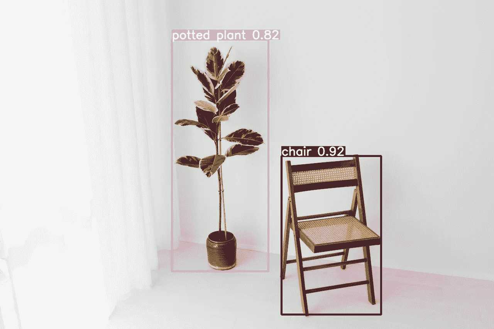
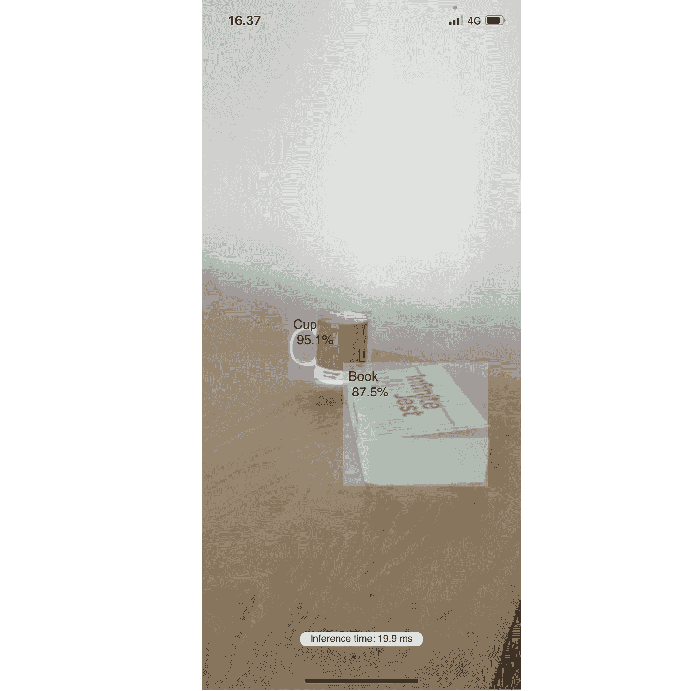
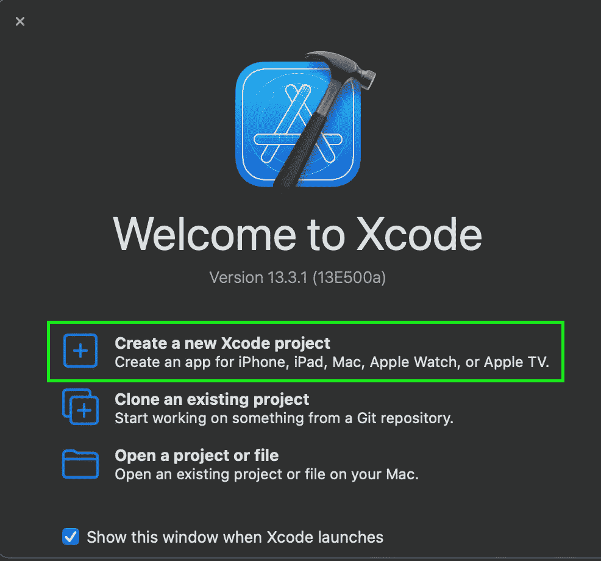
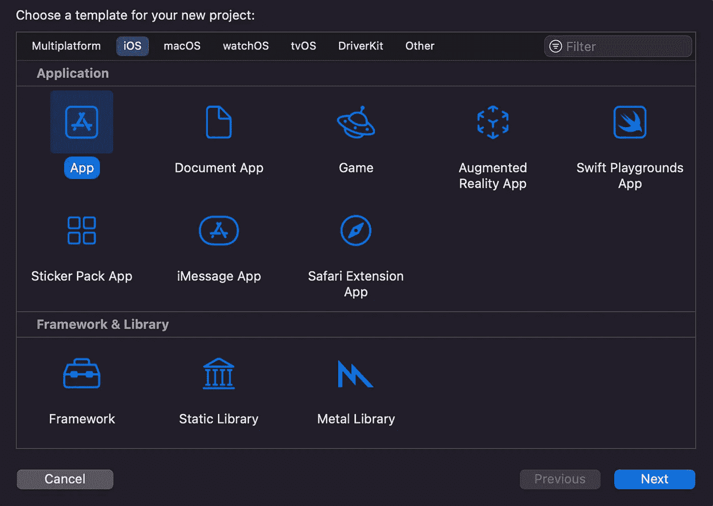
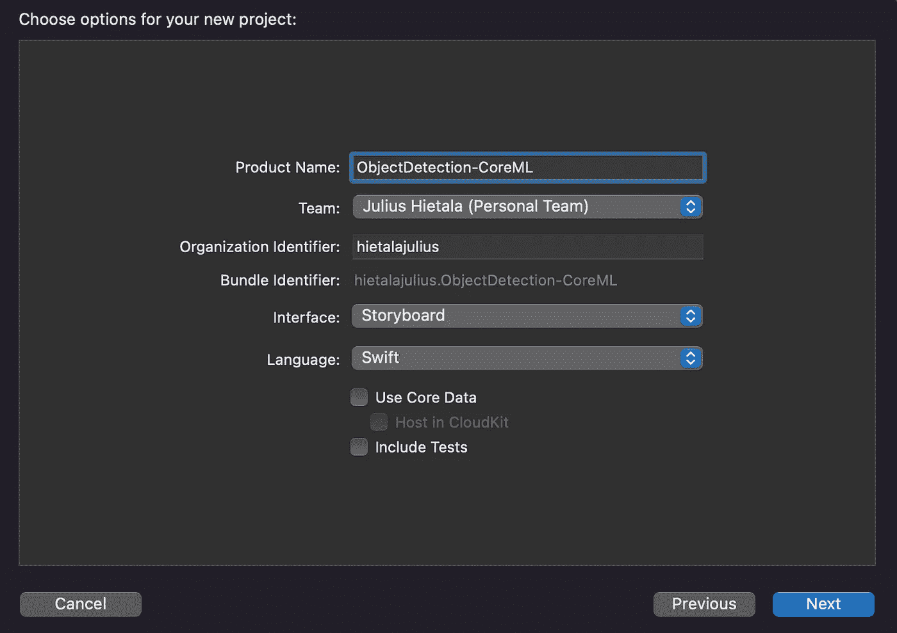
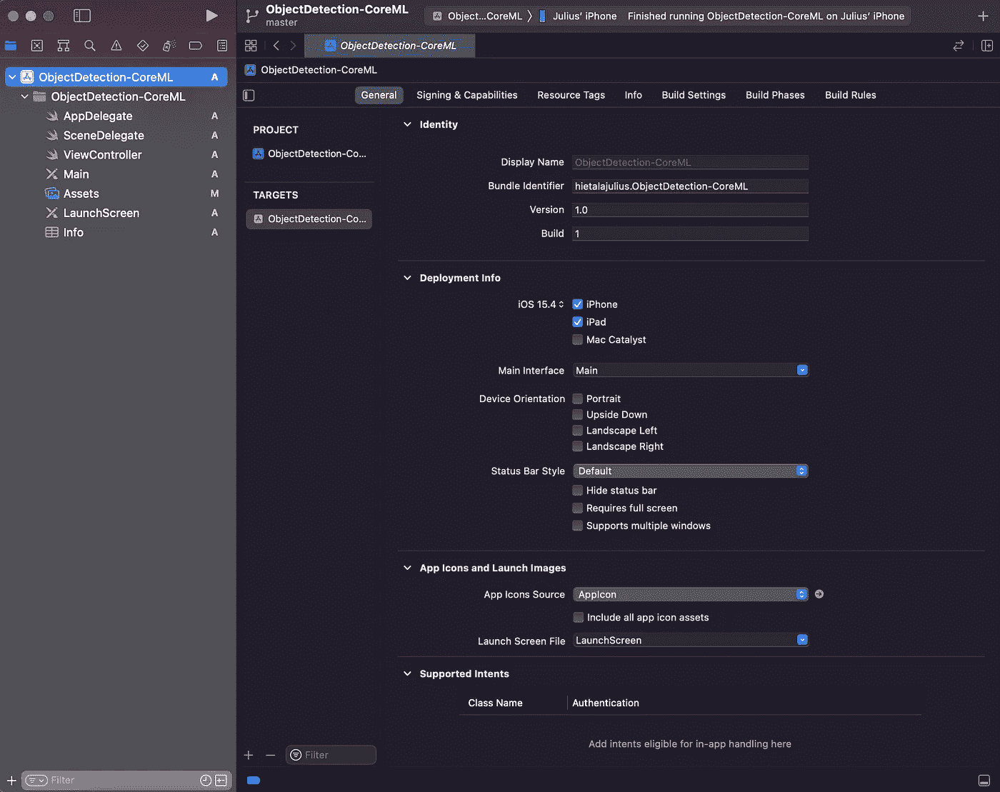
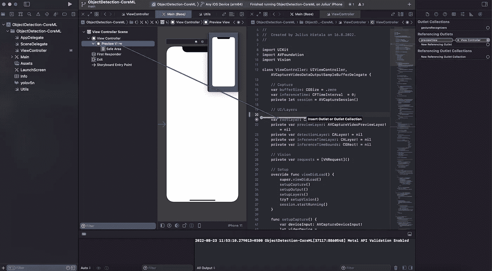
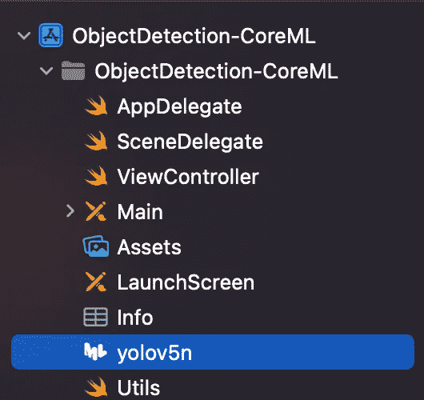
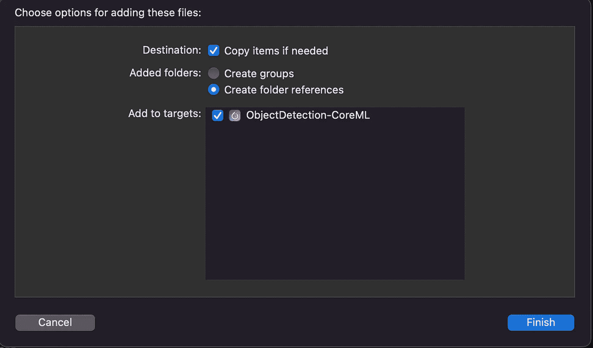

# 如何在 iOS 上搭建 YOLOv5 物体检测 App

> 原文：<https://betterprogramming.pub/how-to-build-a-yolov5-object-detection-app-on-ios-39c8c77dfe58>

## 我用 YOLOv5 和 Core ML 搭建了一个 iOS 物体检测 app。以下是你也可以建立一个的方法！



卡罗琳娜·格拉博斯卡在[的照片](https://www.pexels.com/photo/folding-chair-and-a-potted-plant-in-a-white-interior-7193647/)

本教程将教你如何使用 [YOLOv5 型号](https://github.com/ultralytics/yolov5)构建一个实时视频对象检测 iOS 应用程序！

该教程基于苹果公司提供的[这个](https://developer.apple.com/documentation/vision/recognizing_objects_in_live_capture)物体检测示例，但该教程将特别展示如何在 iOS 上使用自定义模型。

为了增加刺激，下面是最终版本的样子:



在 iOS 上运行 YOLOv5 模型的最终应用

# YOLOv5、CoreML 和 Vision

下面你可以找到我们构建示例应用程序所需的关键构件的摘要。

## YOLOv5

[YOLOv5](https://github.com/ultralytics/yolov5) 是使用 [PyTorch](https://pytorch.org/) 构建的一系列对象检测模型。这些模型能够从单个图像中检测对象，其中模型输出包括边界框的预测、边界框分类和预测的置信度。

预训练的 YOLOv5 模型已经使用 [COCO 数据集](https://cocodataset.org/#home)进行了训练，该数据集包括 80 种不同的日常对象类别，但使用自定义对象类别训练模型非常简单。可以参考[官方指南](https://github.com/ultralytics/yolov5/wiki/Train-Custom-Data)获取说明。

YOLOv5 GitHub 库提供了各种实用工具，比如将预训练的 PyTorch 模型导出为各种其他格式。此类格式包括 [ONNX](https://onnx.ai/) 、 [TensorFlow Lite](https://www.tensorflow.org/lite) 、 [Core ML](https://developer.apple.com/documentation/coreml) 。使用核心 ML 是本教程的重点。

## 核心 ML

苹果的核心 ML 支持在 iOS 设备上使用机器学习(ML)模型。Core ML 提供了各种现成的 API 和模型，但它也支持构建完全自定义的模型。

## 视力

苹果的 Vision 框架旨在支持 iOS 上的各种标准计算机视觉任务。我还允许使用自定义的核心 ML 模型。

# 让我们开始—设置一个 Xcode 项目

首先打开 Xcode 并选择“创建新的 Xcode 项目”



对于模板类型，选择“App”



请确保将“组织标识符”编辑为例如您的 Github 用户名，并为项目选择一个名称(产品名称)。对于界面，选择“故事板”，对于语言，选择“Swift”。



完成上述步骤后，项目结构将如下所示:



# 守则

完整的示例源代码可以在[这里](https://github.com/hietalajulius/ios-demo-app/tree/main/ObjectDetection-CoreML)找到，但我们将在以下部分中浏览重要部分。

## ViewController

应用程序的主要逻辑将在`**ViewController**`类中创建。下面的代码显示了类的成员。

所创建的主要项目是视频捕获会话和用于显示输出视频流、检测和推断时间的可视层。此外，这里对`**Vision**`预测请求数组进行初始化。

最重要的是`previewView`需要连接到`Main.storyboard`文件中的主`View`，以便在屏幕上显示不同的可视层。这可以通过选择视图，按下控制，并将其拖到`ViewController`的一行中来完成:



## viewDidLoad

初始化类成员后，您应该设置`viewDidLoad`方法，该方法在视图控制器将其视图层次加载到内存后调用。方法分为初始化

*   视频捕获
*   视频预览输出
*   可视层
*   视觉预测。

它在代码中的布局如下:

## 设置视频输入和输出

让我们从设置视频捕获和输出开始，逐步介绍不同的元素。以下是实现:

该逻辑的要点(并非双关语)是找到一个设备(背面摄像头)并将其添加到`AvCaptureSession`中。`setupOutput`方法还将输出添加到进程中。总而言之，`AvCaptureSession`负责将输入(相机)连接到输出(屏幕)。

## 设置用户界面层

视频可视屏幕层设置如下:

显示预览视频(`previewLayer`，以`AvCaptureSession`为自变量)、检测(`detectionLayer`)和显示当前推断时间(`inferenceTimeLayer`)有不同的层次。

## 建立愿景

最后，视觉设置通过以下方式实现:

我们将在下一节中重新讨论在项目中包含实际的检测模型(上述要点中的第 2 行和第 7 行)，但是这里要注意的最重要的部分是任务定义，即`Vision`应该在第 8 行执行的请求，并为结果定义回调(`drawResults`)。

为了将所有内容联系在一起，我们还定义了一个方法(`captureOutput`)，每当一个新的帧从摄像机到达时都会调用该方法，该方法的任务是使用新图像向 Vision 发送一个新的对象识别请求:

# 导出检测模型

如前所述，在运行应用程序之前，我们需要创建 YOLOv5 Core ML 模型。为此，您应该用以下代码克隆这个存储库:

```
git clone [https://github.com/hietalajulius/yolov5](https://github.com/hietalajulius/yolov5)
```

要创建导出的模型，您需要 python 3.7 或更高版本，并从存储库的根目录安装依赖项，包括:

```
pip install -r requirements.txt -r requirements-export.txt
```

成功安装依赖项后，可以使用以下命令运行实际导出:

```
python export-nms.py --include coreml --weights yolov5n.pt
```

该脚本是原始 YOLOv5 `export.py`脚本的修改版本，在模型末尾包含[非最大抑制](https://learnopencv.com/non-maximum-suppression-theory-and-implementation-in-pytorch/#:~:text=Non%20Maximum%20Suppression%20(NMS)%20is,arrive%20at%20the%20desired%20results.) (NMS)以支持使用视觉。本例中使用的砝码来自 YOLOv5 模型的 nano 变体。这个脚本负责下载训练好的模型，所以不需要手动下载。

该脚本输出一个名为`yolov5n.mlmodel`的核心 ML 文件，需要拖放到 Xcode 项目中:



您将会看到下面的屏幕提示，在这里记住将模型文件包含在构建的目标中是很重要的(“Add to targets”)。



# 运行应用程序

要运行完成的应用程序，请在 Xcode 上选择一个 iOS 模拟器或设备来运行该应用程序。应用程序将开始输出预测和当前推断时间:


感谢您的阅读！欢迎反馈和改进意见！

```
**Want to Connect?**You can find me on [LinkedIn](https://www.linkedin.com/in/julius-hietala-8967b8a2/), [Twitter](https://twitter.com/hietalajulius?lang=en), and [Github](https://github.com/hietalajulius). Also check my personal [website/blog](https://www.hietalajulius.com/) for topics covering ML and web/mobile apps!
```