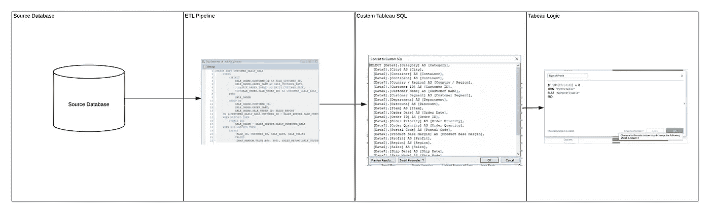

# 如何构建高级 SQL

> 原文：<https://betterprogramming.pub/how-to-build-advanced-sql-798d615ba323>

## 构建更易维护、可读性更强和优化的数据工作流

图片由 [Unsplash](https://unsplash.com?utm_source=medium&utm_medium=referral) 上的 [Alexandru Acea](https://unsplash.com/@alexacea?utm_source=medium&utm_medium=referral) 拍摄

SQL 仍然是数据语言。早在 20 世纪 70 年代开发，它是为数不多的保持不变的技术之一。不管出现什么样的拖放工具，也不管有什么样的新查询范式试图超越它。

SQL 仍然是使用最广泛的数据交互技术。随着利用 [NOSQL](https://www.mongodb.com/nosql-explained) or(不仅仅是 SQL)的数据库的出现，像 Presto 和 Hive 这样的层已经被开发出来，以提供友好的 SQL 交互。

不仅如此，SQL 的使用范围已经远远超出了数据工程师和分析师。大型科技公司的产品经理、分析合作伙伴和软件工程师都使用 SQL 快速访问数据和回答问题。

重点是，SQL 值得了解。但是一旦你知道了基础，你怎么进步呢？是什么让一个 SQL 用户从新手到高级？

在过去的几年里，我们花了很多时间为数据管道、仪表板、数据产品和其他零碎的东西编写 SQL。

我们不认为高级 SQL 是关于语法的。学习了分析从句之后就没有太多花哨的从句了。当然，您可以在 SQL 中循环，甚至编辑文件。然而，它们都是可以在代码中发生的动作。

那么是什么将初级 SQL 用户[和高级 SQL 用户](https://www.eventbrite.com/e/advanced-sql-for-data-analysts-scientists-and-engineers-tickets-109520821726)区分开来呢？我们认为这更多的是考虑全局。高级 SQL 开发人员考虑的是长期还是短期。他们开发的 SQL 易于维护，易于阅读，但需要更多的时间和考虑。

在本文中，我们将重点关注许多设计决策，我们认为这些决策将 SQL 开发新手与高级 SQL 开发人员区分开来。您会注意到这超越了 SQL。很多将进入更多的概念性问题，那里没有最佳解决方案的明确答案。

提示的格式将是问题或行为，然后是解决方案或改进的方法。事实上，一些解决方案可以被认为是设计偏好。你们中的一些人甚至可能不同意我们在这里给出的建议。如果是这样，请留下评论，我们很乐意进一步讨论它们。

说完，我们开始学习吧！

# 将逻辑放入 SQL vs 表中

[Case 从句](https://www.w3schools.com/sql/sql_case.asp)非常有用。然而，有些人使用它们的两种特定方式可能会反过来咬你。

第一，重复逻辑。

我们所说的复制逻辑是什么意思？我们的意思是在多个查询、视图和管道中使用相同的 case 语句。

比如下面，我们多处逻辑相同。在这种情况下，在数据分析中使用的特别查询中，他们每月重复一次，并在 BI developers [Tableau](https://www.youtube.com/watch?v=c_x7bUFso_o&t=4s) 仪表板中重复一次。

现在，让我们想象由于某种原因需要更新类别的逻辑。您甚至可能不知道需要进行更新的所有位置。如果不同的团队管理所有这些不同的查询会怎么样？谁来告诉他们更新它，你将如何通知他们的变化？并不是每个公司都有很好的工具来帮助找到这样的重复逻辑。

另一个类似的问题是，当工程师决定使用 case 语句作为枚举而不是使用表时。例如，让我们看看下面的查询:

您会注意到，它们实际上是在检查一个 id，并为该 ID 提供一个值。但是如果要添加新的 ID 呢？然后你需要编辑代码。

# 解决办法

在这种情况下，您应该考虑使用表格。这允许您在不更改代码的情况下向表中添加更多的 id。这更干净，更容易测试，不会出错

这适用于两个问题——无论您是像第一个查询那样使用重复的逻辑，还是使用 SQL 作为表。在这两种情况下，都要考虑创建表的利弊。

需要注意的是，这种解决方案有其利弊。添加新表意味着要维护新代码。成为更高级的 SQL 的一部分是进入权衡的思维模式。那么我们来谈谈另一个设计权衡。

# 多少个 cte 才算太多 cte？

SQL 提供的一个很好的工具是通用表表达式，也称为 [CTEs](https://www.essentialsql.com/introduction-common-table-expressions-ctes/) 。cte 与子查询有一些相似之处，尽管如何处理 cte 取决于您使用的 SQL 引擎(一些 SQL 引擎预先运行并存储 cte，另一些将它们视为子查询)。但是从设计的角度来看，cte 可以让代码更容易阅读。然而，与此同时，cte 也会使 SQL 更难阅读。我们来解释一下。

cte 可用于分离出一个查询或减少冗余的 select 语句。问题是一些 SQL 开发人员、分析师和工程师在一条 SQL 语句中放了太多的 cte。这可能变得非常难以维护，主要有两个原因:

*   很难跟踪每个专栏和 CTE 的所有逻辑
*   很难调试数据问题，因为你不知道哪个 CTE 导致了这个问题。

当您有大量的 cte 堆叠在一起时，很难判断问题发生在哪里。也很难测试和查看结果，因为这些子查询中的每一个都可能导致问题-特别是如果您有一个基于 CTE 和 CTE 的 CTE，并且每一步都有列被更改！您可以查看数据的最终结果，但不清楚问题发生在哪里。

让我们看一个例子。

假设您构建了下面的查询，并且在某处有一个错误。它可能在数据中，可能在加载某个表的代码中，也可能在 SQL 中。

但是，只有在运行了所有不同的逻辑并选择了输出之后，它才会显示出来。

那么，如何找到错误呢？*注意:与我们看到的 1500 行 SQL 语句相比，这个查询相当简单！*:

您可能需要一次移除一点点查询片段，并查看各种 cte 的每个结果。

由于每个 CTE 都基于前一个，因此每次都需要查询所有的。这也可能很耗时，这取决于您的数据仓库的开发程度。

作为一名软件工程师，你经常会学到可维护性和可读性。换句话说，编写其他人可以轻松阅读、改进和修复的代码。

如果你的代码过于微妙和聪明，未来的工程师(甚至你自己)可能很难在未来修复它们。这就是为什么有时候最优雅的解决方案并不总是最好的解决方案。它可能看起来很漂亮，可能更抽象，更聪明——但是如果另一个开发人员努力理解它，它最终会被取代。SQL 也是一样。

我们从未想过有一天会看到 1500 行 select 语句——但是我们看到了很多。大部分都吓到我们了！您怎么可能写了这么多 SQL，而不在某个时候认为它在将来很难跟踪呢？抱怨够多了，让我们来谈谈解决办法。

# 解决办法

我们可以想到几个解决方案。

首先，你可以从评估你的 cte 开始，弄清楚你是否经常重复同样的加入。你会发现重复 cte 的一个明显的地方是事实表。事实表是通常位于数据仓库中心的表，因此已经连接到许多表，如下图所示。

通常，当您有一个事实表时，您会发现自己一遍又一遍地连接所有维度表。

您应该创建一个预先连接的表，或者用所有的维度查看这个事实表，而不是使用 cte 来做这件事。这大概解决了这个问题的 70%。还有另外 30%的更具体的查询，其中构建单独的表可能是无益的。

另一个解决方案是创建临时表。并非所有的 SQL 引擎都允许这样做，但就我个人而言，我喜欢创建本地临时表的能力。创建临时表可以很容易地找出查询出错的地方。

我们稍后会再多谈一点 QA，但本质上，如果你看下面的例子，你会发现创建单元测试是很容易的。

与 cte 不同，在 cte 中，所有的逻辑都是分散的，数据转换的每个阶段都很难到达，而临时表使分析每个阶段的数据变得很容易。

因此，当您遇到问题时，很容易找到问题所在。

# 思考大局

高级 SQL 开发人员的一个重要标志是他们能看到全局。这可以从很多方面体现。我们可以在 SQL 开发人员如何创建数据工作流中看到这一点。这不仅仅是关于数据工程——它在开发指标、仪表板和算法时发挥作用。

你如何看待你的数据集，以及你如何创建它，是非常重要的。

让我们来看一个例子:

[资料来源:tableau](https://www.tableau.com/)

假设您正在构建一个 Tableau 仪表板，或者任何类似的仪表板(微软 BI、Quilk、Looker 等)。

您经常在数据仓库中放置几层逻辑，在定制 SQL 中再放置几层，在 Tableau 仪表板中再放置几层逻辑，然后添加过滤器吗？你真的能确定每种过滤器组合都不会导致坏数据吗？当出现数据问题时，您如何知道问题在哪里——数据源、您的数据仓库逻辑、您的定制 SQL 逻辑或 Tableau 仪表板计算？您有太多的失败点，很难找出问题出在哪里。

这又回到了可维护性的概念。许多人将 Tableau 仪表板视为一个简单的拖放工具。但是，正如我们常说的，这太容易了，也可能很危险。

你可以很快地创建一个依赖于一个公式的公式，然后又依赖于另一个公式，直到调试变成一场噩梦。这类似于 Excel，人们用复杂的公式和依赖关系创建庞大的工作簿，这太容易出错了。

这并不是说你不应该这样做。只是说，一个成熟的开发者，是尝试着把这些东西想透，而不是只在后期构建和处理。这句话出自一个人之口，当他们开始构建 tableau 仪表板时，他们只是构建了它们，而没有考虑全局！

# 解决办法

这里的解决方案是花时间实际规划您的最终仪表板(如果您只是在做探索性的工作，那很好)。

然而，当你设计最终的仪表板时，一定要考虑周全。考虑您的度量标准可能容易被破坏的各个地方，在每一步创建单元测试，并考虑创建集成测试。

拖放仪表板工具不仅仅是仪表板。在某种意义上，它们更类似于软件，你应该小心地管理版本，并确保考虑测试你的仪表板上的坏数据。

# 您将如何让您的 SQL 更上一层楼？

SQL 看起来已经存在了。事实上，如果有什么不同的话，那就是它在加速。挑战在于如何让您的 SQL 更上一层楼。

不仅仅是学习新的语法。

这是关于[学习如何让你的 SQL 更易维护、更可读、更可信](https://www.youtube.com/watch?v=ztvxmGtrNA0&t=4s)。这样做，您将在更高的层次上创建 SQL。您将创建公司中每个人可以依赖几个月以上的数据集、仪表板和指标。

从产品经理到数据分析师，公司中越来越多的角色需要至少能流利地使用 SQL。从数据中提取见解的能力在任何职位上都是有价值的。