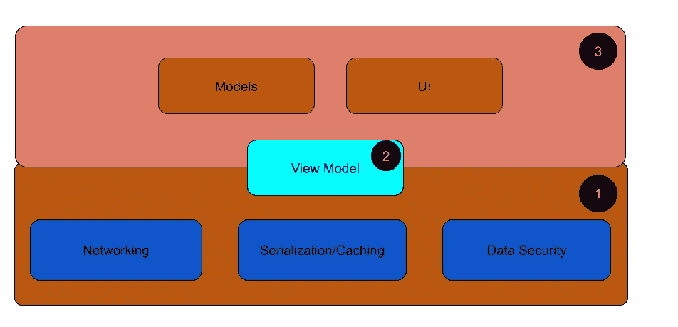

# 如何独自从零开始构建一个大型软件项目

> 原文：<https://betterprogramming.pub/how-to-build-alone-a-large-software-project-from-scratch-13c860f4fee8>

## 因为你需要开始的只是，嗯，你…

克林特·帕特森在 [Unsplash](https://unsplash.com?utm_source=medium&utm_medium=referral) 上拍摄的照片

一次又一次，我们听到聪明的程序员脑中冒出伟大的独角兽的故事。

Instagram 创始人凯文·斯特罗姆当时正和女友在墨西哥度假，突然想到了 Instagram 著名的 X-Pro II 滤镜。他全职受雇于 Nextstop 时编写了这个程序。

扎克伯格在他的哈佛宿舍推出了脸书。我还没听说哈佛的作业要求有多低。

他们是通过纯粹的激情和勇气实现的吗？

绝对的。

然后，有一种方式是如何做到的。

# **第一步。想象一下你最笨的客户正在使用它**

> **“以目的为出发点……”—斯蒂芬·柯维，高效人士的 7 个习惯**

你必须从想象结束开始，然后逆向工程你的方式。你的头号错误是开始编写最内部的核心来验证它是否可以完成。那应该是你的第二步。

你的同事没有告诉你真相，但如果你想在职业生涯中经常得到这种认可，也许你还是个新手。一个经验丰富的开发人员不会屈服于他们遇到的每一个挑战。

他们明智地选择了它们。因为他们知道在给定的时间内他们能做什么，不能做什么。

第一步，想象你最笨的客户正在使用它。可能是消费者，也可能是公司。即使是 B2B，你的产品仍然有一个最终客户。

想象一下用户在你的产品屏幕之间跳来跳去。作为这一步的延伸，创建一个实体、交互、相关和独立工作流的心智模型。

但是不要急于决定你的范围。下一步将决定你能走多远。

# **第二步。验证核心理念/解决方案**

只有当您对核心问题的解决方案有技术上的疑问时，这一步才是必要的。

如果你正在制作一个贺卡制作网站，制作一个用户可以输入问候信息和电子邮件的前端。添加 10 个基本的，但诱人的动画。包括收件人电子邮件文本框。

你不必购买云主机或电子邮件网关来验证整个事情。您甚至不必编写文本框验证。谷歌你的方式来创建上面的屏幕。这很简单，一旦你做到了，你会很高兴完成了某件事。

你所需要确保的是你已经确定了正确的问题，并且你打算提供一个最小可行的产品来解决这个问题。在这个阶段不要担心定价。不过，你可以梦想一下你的收入数字。它会给你带来一夜好眠！

# **第三步。拥抱野兽**

在这个阶段，你的飞机已经滑行够了。现在是起飞的时候了。

如果你浪费更多的时间来制作图表或与朋友和家人讨论你的想法以留下印象，你正在走向你的项目的过早死亡。

想象一下，他们都在取笑你从未真正成功的伟大创业。

不管感觉有多诱人，都要避免文档。当然，如果你在一个大团队中工作，这是必要的。如果没有它就不能进步也是可以接受的。

无论如何，不要认为这是你真正的进步。我见过许多自由职业者在周末堆积 READMEs 和谷歌图纸。

六个月后，他们的*提交*按钮带来 *501* 。

# **你会如何开始？**

如果你是敏捷团队的开发人员，你唯一的目标就是达到 sprint 目标。如果是这样，在 80%的情况下，你开始开发 UI 会做得很好。因为这给了整个团队一些认可和进步感。

然而，你的个人副业并不一定要依赖敏捷。除了你自己，你不能回答任何人。你应该试着先做最难的部分。我说的是真正拥抱野兽。

为了制造一个超棒的产品，除了解决核心问题，你总是需要 1024 样东西。您需要非常了解依赖管理。

软件依赖管理

您必须进行用户管理，因为这是数据的入口。用户数据现在和将来都是你最有价值的商品，直到你决定将自己的企业出售给脸书或谷歌的那一天。

随之而来的是网络。还记得处理有效载荷吗？你必须存储离线数据，并通过移动应用程序/Dropbox 集成提供这些数据，以防你最有价值的消费者转移到格陵兰或刚果。

有了这些，你怎么能忘记数据传输带来的成本呢？您必须定义一个协议，在各方之间经济高效地承载您的负载:HTTP、Websockets、TCP (Protobuffers)或其他什么？

一旦定义了所有其他依赖项，数据安全性就是这个链中的最终依赖项(除非您的核心产品是为了解决安全问题)。

您如何端到端地加密您的数据？沙？MD5？你将如何实现公钥-私钥握手？

如果你知道这些相关术语，很容易在 GitHub 上搜索或者在论坛上征求意见。一个很好的起点是在维基百科上搜索这些术语，然后从那里开始。

了解它们，了解它们的替代品，很快你就会成为你为项目选择的每项技术的专家。

下一步:全部实现。也就是说，没有编写一行业务逻辑。

确保你没看错。

一言以蔽之:尽可能保持它与你的业务逻辑解耦。用接口写，用抽象类/结构写。制作混凝土测试桩来测试它们。

是的，要用 primate UI 测试这一切，您必须编写一些测试用例。软件界流行的建议是在编写一行代码之前，先从测试用例开始。

TDD 给你的代码库提供了专家评审者所不能提供的洞察力。一旦你实施下一步，你就会意识到它的巨大价值。

永远记住:你可能会以一千种方式出错。但是这一步不仅仅是一堂课。

在这里完成的工作是*从未丢失的*。它是可重用的，因为它与业务逻辑无关。当你丢弃这个项目时，记住你可以重用它来加速你未来的项目。你的开发时间将会成倍减少。

# **第四步。调用您的构建模块**

开发了核心模块或微服务之后，现在应该开始实现核心业务特性了。仍然有很多工作要做，但是在这里，您用更少的实现做出了更多的选择。

您会在第一次使用时要求登录，还是允许五次免费匿名使用？在没有网络/超时的情况下，你会选择一个错误弹出或振动文本字段吗？

您希望允许多少个可配置的设置？你会为你的整个应用程序或网站选择哪种 UI 主题？

这是一个可扩展的步骤。你可以考虑将这部分外包给你的同事、朋友或联合创始人。上述问题可以通过一个屏幕或 100 个屏幕来回答。

您的模型将遵循您公开的数据项。这将是你整个工作流程的一种复制粘贴工作。

你可以从大学里雇佣聪明的人才，让他们做你的实习生。这是一个建立联系和向前支付的好方法。在他们的余生中，他们将永远感激你和你的项目。

不用说，如果您正确地完成了前一步，包括测试用例部分，这一步将会轻而易举。如果你没有，那将是你最可怕的噩梦。而且，你会永远弃船而去。

# **第五步。展开**

早期的软件项目总是需要开发运维。如今，云让可扩展性变得轻而易举。根据您选择的功能集(存储、运行时、数据库等)，您需要了解云提供商的术语。).

主要参与者是 AWS、Azure 和 Google Cloud。他们的定价对于决定你的项目从长远来看是否经济可行非常重要。

对于较小的项目，当你使用这些解决方案时，成本可能在每月 100 美元到 500 美元左右——我引用的这个数字来自讨论独立开发者的数千个附带项目的论坛。

如果你觉得学习云是一种负担，那么这是一种值得承担的负担。学习一次不仅能为你未来的项目提供便利。这也让你成为就业市场上的抢手货。

记住这些话:作为一名独立软件开发者，你不能也不应该在没有外部资金的情况下雇佣云开发者。

没有云解决方案，没有人能在软件行业生存，如果你很好地掌握了云解决方案，至少在未来 10 年内你不会破产。

# **结论**

这是关于作为独立开发者建立一个大型软件项目。然而，即使你为雇主工作，步骤也不会不同。

你的热情和激情在某种程度上会是缺失的因素。挑战和你迎接挑战的方法将保持不变。

即使你失败了，做过一次也值得把你的故事讲给一群渴望学习并热衷于实施的人听。

就像我刚刚做的那样。