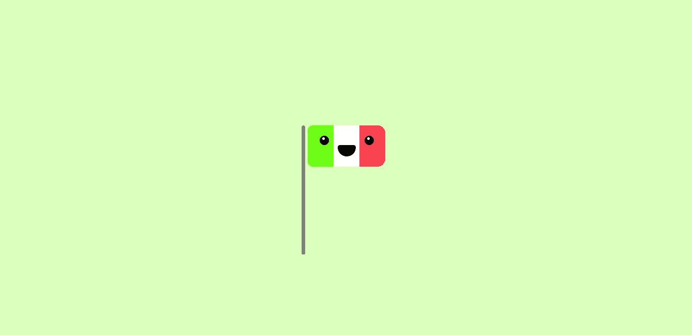
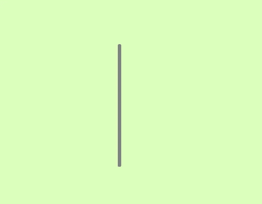
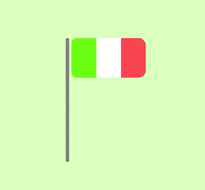
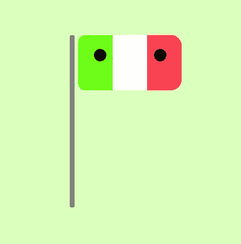
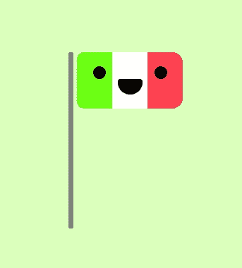
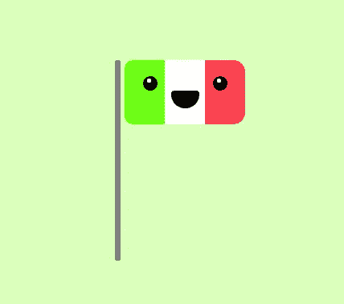

# 作为初学者，如何构建令人惊叹的 CSS 艺术

> 原文：<https://betterprogramming.pub/how-to-build-amazing-css-art-as-a-beginner-53454a50b0eb>

## 级联样式表是强大的——让我们开始使用这种力量吧



作者图片

无论你是一个试图掌握 CSS 的初级前端开发人员，还是一个想知道人们如何用它创造奇特形状的后端开发人员，或者只是一个好奇的人，你肯定都见过有人谈论所谓的“CSS 艺术”

在我的例子中，我就是我之前提到的三个人。在 Twitter 上看到一个 CSS 的家伙说他们的头只用 CSS 做的，我开始尝试创建花哨的形状和动画。

在这篇文章中，我将指导你完成 CSS 艺术的基础，同时画一个简单的草图。

## 理解 CSS 艺术的关键(如果你以前从未做过)

我假设你在这里是因为你从来没有接触过 CSS 艺术，我要告诉你一件事，这将有助于你开始消化整个事情:

`**Divs**` **将是你的一切。**

如果你曾经使用过三个 j 来创建形状或几何图形，在 CSS 中`div`元素将会是那个几何图形。我们使用它们是因为它们可以是任何东西。你可以给它们任何你想要的大小、颜色、形状、阴影和位置。

如果你曾经看过一个复杂的 CSS 艺术的源代码，很可能你已经看到了很多`div`元素。

# 让我们建造一些东西

如果您还不明白，我们将创建您在点击本文时看到的笑脸意大利国旗。

这是一种非常简单的艺术，但足以让你进入这个世界，尤其是如果你只知道 CSS 是给 HTML“上色”的东西。(我打算多写几篇关于 CSS 艺术的文章。)

在开始使用 CSS 之前，我们需要一个结构，HTML 为我们做到了这一点:

在告诉浏览器我们的 CSS 文件是`main.css`(我们马上就要创建它)之后，我们已经定义了页面的结构。草图包括旗杆和旗帜，旗帜上有一张像孩子一样有眼睛和嘴巴的脸。

现在，让我们创建我刚才提到的`main.css`文件，并添加一些东西:

这将设置一个温暖的绿色背景，并在更中心的位置显示我们的草图(并相对于最近的祖先:`absolute`)。现在我们要用*画出*灰色的杆子:

```
.pole {
    width: 7px;
    height: 250px;
    background: gray;
    margin-right: 5px;
    border-radius: 7px 7px 5px 5px;
}
```

我们通过简单地为旗杆设置一个合理的宽度、长度和颜色，将它与我们未来的旗帜(`margin right`)分开一点，并设置圆角(为了外观，顶部的角会稍微圆一些)。现在，您的页面应该如下所示:



接下来我们要添加的是旗帜:

```
.flag {
    width: 150px;
    height: 80px;
    border-radius: 10px 15px 15px 10px;
    background: linear-gradient(to right, #6cff12 33.33%, white 33.33%, white 66.66%, #FF4152FF 66.66%);
}
```

我们设置旗帜的宽度和高度，然后使右角比左角略圆，最后使用线性渐变(向右)用多种颜色填充旗帜(注意`#6cff12`是绿色，`#FF4152FF`是红色)。

这是结果(就目前而言):



## 脸

这有点复杂，因为我们也将为眼睛使用`::before`伪元素(在眼睛的右上角创建小白点)。首先，我们要定义旗帜上的部分，我们将把我们的脸放在那里，并告诉浏览器我们希望它里面的项目如何显示(`flex`和`flex-column`):

```
.face {
    position: absolute;
    display: flex;
    flex-direction: column;
    align-items: center; /* for the mouth */
    height: 40px;
    top: 20px;
    left: 35px;
}
```

然后我们对眼睛做同样的处理(我们需要在`eyes` div 中分隔元素):

```
.eyes {
    display: flex;
    justify-content: space-between;
    width: 105px;
}
```

你不会看到更多的东西，因为我们没有添加任何带有背景颜色的东西。但是我们要通过添加眼睛来解决这个问题:

```
.eye {
    position: relative;
    width: 18px;
    height: 18px;
    background: #000000;
    border-radius: 100%;
}
```

用背景色和*最大圆角* ( `border-radius`)设置宽度和高度将显示两个间隔的黑点:



光有眼睛没有嘴巴感觉怪怪的；让我们来解决这个问题:

```
.mouth {
    width: 35px;
    height: 25px;
    background: #020202;
    border-radius: 10px 10px 40px 40px;
}
```

我们让它足够大和圆，并给它一个黑色的颜色。记住，由于我们之前在`.face`选择器中设置的`align-items: center`，它将自动居中。



它看起来很酷，但缺少瞳孔使它有点扁平。

这就是我们将要使用`::before`伪元素的地方。它允许我们在不添加 HTML 的情况下将内容插入页面。对于我们在这个 CSS 艺术中的使用，我们可能会认为它是眼睛里面的另一个`div`。

我们想把这个`**div**`做得又小又白:

```
.eye::before {
    content: '';
    position: absolute;
    top: 3px;
    left: 5px;
    width: 5px;
    height: 5px;
    background: #ffffff;
    border-radius: 100%;
}
```

此外，我们将它从顶部和左侧移开一点，使它们更居中。

*看哪*，你已经创建了你的第一张 CSS 图片:



将这个简单的笑脸旗称为艺术类似于将四年前的图画称为艺术，但是它给出了简单 CSS 艺术的主要概念:

*   打个`div`
*   塑造它
*   给它上色
*   将其相应地插入到草图中。

感谢您的阅读，请继续关注关于这个主题的更多中间片段。