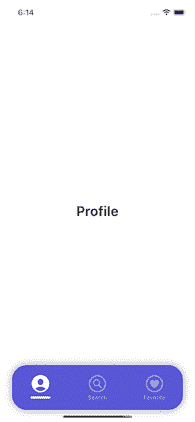

# 在您的 iOS 应用程序中构建动画自定义标签栏

> 原文：<https://betterprogramming.pub/how-to-build-an-animated-custom-tab-bar-for-ios-application-5eb3a72e07a8>

## 创造漂亮的 iOS 设计


每个用户界面设计师都喜欢漂亮的动画标签栏。另一方面，对于必须实现该设计的开发人员来说，这是一场噩梦。当然，使用苹果的原生标签栏组件会更容易，而且可以专注于更有趣的事情，比如业务逻辑实现。但是如果我们必须创建一个自定义标签栏呢？从哪里开始？

我将在本文中尝试回答这些问题。我们将讨论创建自定义选项卡栏的最重要的方面。最终的效果将是一个动画的、易于扩展的、完全定制的标签栏，我希望它能在未来节省您的时间，并使实现设计者梦想的标签栏更快、更舒适。你准备好了吗？我们走吧！

首先，给出的例子使用了一些依赖关系。多亏了他们，实现本文中描述的解决方案更快了。请随意用您的本机代码或其他库来替换它们。这些依赖关系是:

*   [SnapKit](https://snapkit.io) 用于布局目的
*   [RxGesture](https://github.com/RxSwiftCommunity/RxGesture) 用于处理选项卡栏项目上的点击
*   [RxSwift](https://github.com/ReactiveX/RxSwift) 用于通知 TabBarController 项目已被点击

现在我们可以进入实现部分了！

# 标签栏项目

item 组件由两个耦合在一起的不同部分组成:视图层和处理所有已定义项目类型的 enum。为什么枚举类型而不是简单的结构？

这很简单，枚举在编程中是强大的类型，尤其是在 Swift 语言中。它们将熟悉的案例收集在一起，是案例可迭代的，可以扩展以扩展关于特定案例的信息，或者可以在其中使用计算属性。

此外，枚举是与结构相同的值类型。很酷吧。

如您所见，`CustomTabItem`具有图标、选定图标、名称和相关联的`viewController`的属性。这就是全部，每个值都是使用 switch 语句定义的，为每个枚举情况返回一个特定的值。

第二部分是选项卡栏项目的视图层。它与`CustomTabItem`直接耦合，因为一个条目是初始化期间传递给视图的两个参数之一。第二个是索引，对于每个视图都是唯一的，它将在以后用于改变标签栏的`selectedIndex`。

而且，每个视图都有一个简单的过渡动画。项目的设计很简单，顶部有一个图标，下面有一个标题。根据项目是否被选中，标题可以变成图标下面的圆形线。

自动布局和配置视图属性并不复杂，所以我有意省略了这一部分。如果你想知道我是如何实现这一部分的，可以查看文章末尾提到的 GitHub 库。

由于我们的项目已经完成，我们可以移动到主视图—选项卡栏。

# 标签栏实现

让我们讨论一下负责收集所有标签栏条目并处理它们的选择的主要组件。自动布局很容易，因为它是作为`UIStackView`组件的子类创建的。唯一要做的就是使用`addArrangedSubview(_ view: UIView)`添加我们的项目。那是在`setupHierarchy()`方法内部处理的。

在 GitHub 资源库的`**Extensions.swift**`文件中，您可以找到一些有用的扩展，比如在一行代码中向`UIStackView`添加许多子视图的扩展。

此外，对于我们想要添加到标签栏的每个项目，我们必须设置`translatesAutoresizingMaskIntoConstraints`到`false`来防止为它们自动创建自动布局，并设置`clipsToBounds`到`true`来将我们的项目裁剪到标签栏的边界。我们将在其他属性配置中，在`setupProperties()`方法中实现该部分。

除了选项卡栏项目声明，我们还必须添加负责发出所选项目索引的可观察序列属性。

从上面可以看出，subject 本身被声明为私有常量，在 subject 的值上有一个暴露的可观察值。

因此，我们确保没有人能够从`CustomTabBar`类之外搞乱这个主题发出的值。

最后但同样重要的是，我们必须在我们的`CustomTabBar`实现中添加两个方法。第一个是`selectItem(index: Int)`，这里我们将处理负责更新当前所选项的整个逻辑。

首先，我们更新每个项目中的`isSelected`属性，以反映最新的选择。

其次，我们使用上面描述的主题发出所选项的索引。这样，我们更新了— `TabBarController`和选项卡栏项目中的选择。

我们必须实现的第二个方法是一个`bind()`，负责处理每个项目的用户触摸。

实现使用的是`RxGesture`，但是如果你愿意，你可以用你的反应式扩展来代替它。

`RxGesture`提供了识别用户交互的方法`.tapGesture()`,但是在绑定到那个动作之前，我们必须过滤用户手势，只过滤那些有`recognized`状态的手势。

如您所见，`selectItem(index: Int)`方法是在`animateClick(completion: @escaping () -> Void)`的闭包内调用的。这是一个`UIView`的扩展，负责我们项目的缩放动画。

上面的代码示例展示了如何处理`profileItem`的用户交互。但是，不要忘记以同样的方式处理其余的项目！

# 将所有这些放在标签栏控制器中

几乎所有的事情都做好了，现在我们要把所有的零件组装起来！`CustomTabBarController`是一个完美的地方，但首先，我们需要一个简单的视图控制器来处理与标签栏项目相关的不同屏幕。

上面的例子故意省略了自动布局和属性配置，因为这是一个很容易添加的东西。如果你想用我的，可以查看文章末尾的 GitHub 库。每个视图控制器都用`CustomTabItem`初始化，这样我们就可以在屏幕上显示项目的名称。

回到标签栏控制器，除了设置层次和布局，我们必须配置一些属性。

首先，隐藏名为— `tabBar`的类属性下的本地选项卡栏。

其次，我们将设置`translatesAutoresizingMaskIntoConstraints`为`false`，并为我们的`customTabBar`组件添加一些阴影。

最后，我们必须将选项卡栏控制器的`selectedIndex`属性设置为初始值(最常见的情况是将该值设置为 0 ),并设置将由选项卡栏控制器处理的视图控制器。由于我们的选项卡栏项目的实现有一个关联视图控制器的属性，它是`CaseIterable`,我们可以很容易地将枚举的所有情况映射到分配给每个情况的视图控制器值。映射后，使用以下方式设置它们:

```
setViewControllers(_ controllers: [UIViewController], animated: true)
```

现在只剩下一步了，我们必须处理当前`selectedIndex`的变更。

如果你以前关注过，你会立即知道我们将如何实现这一点。当然，通过从`CustomTabBar`类订阅先前创建的可观察序列。

因为我们不希望在这里出现任何错误，所以我们可以使用 bind 方法来代替订阅。对于每个发出的索引值，我们使用`selectTabWith(index: Int)`方法选择一个特定的选项卡，该方法将作为参数传递的索引分配给选项卡栏控制器的`selectedIndex`属性。



自定义选项卡栏实现的最终结果

我们到了。欣赏我们新的美丽的自定义标签栏！

如果你还在阅读，这意味着现在你知道如何创建你的自定义标签栏！恭喜你。非常感谢你的时间，希望你喜欢。

欢迎在评论区提问。此外，如果你想检查整个实现，你可以在我的 GitHub 页面找到库[这里【T3:)](https://github.com/jcholuj/CustomTabBarExample)