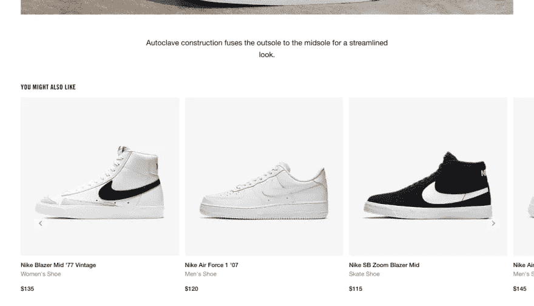
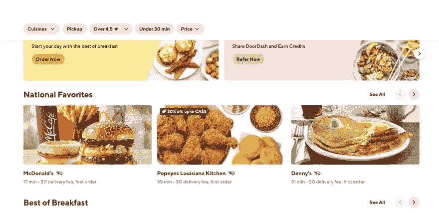

# 如何用嵌入式 hub 构建动漫推荐系统

> 原文：<https://betterprogramming.pub/how-to-build-an-anime-recommender-system-with-embeddinghub-c9df13197578>

## 使用 KNN 算法向用户推荐动漫


照片由[蒂姆·莫斯霍尔德](https://unsplash.com/@timmossholder?utm_source=unsplash&utm_medium=referral&utm_content=creditCopyText)在 [Unsplash](https://unsplash.com/s/photos/anime?utm_source=unsplash&utm_medium=referral&utm_content=creditCopyText) 上拍摄

应用机器学习中的一个常见问题是如何根据用户过去的行为向用户推荐数据库中的项目。像文本或类别这样的特征需要转换成数字特征，然后嵌入，以便模型可以使用它们。

通常，嵌入——现实世界对象和关系的密集数字表示，表示为向量——存储在数据库服务器中，如 PostgreSQLEmbedding。然而，`[embeddinghub](https://github.com/featureform/embeddinghub)`使得存储和加载你的嵌入变得更加容易。您可以从最少的设置开始，与使用`scikit-learn`构建 KNN 模型相比，这也使您的代码不那么冗长。

本文将带您了解如何使用`embeddinghub`来构建一个基于内容的推荐模型，向观众推荐动漫。

# 推荐系统的常用方法

在我们开始设置之前，让我们探索一下我们的选择。在构建推荐模型时，有几种常用的范例:

*   基于流行度的过滤。这是最直接的推荐模型。它根据大众的喜好推荐热门商品。网飞的*加拿大前 10 强*是基于人气的推荐模式的一个很好的例子。一个显而易见的警告是，不是每个人都会喜欢网飞在加拿大的十大举动。
*   基于内容的过滤。这是基于这样的假设:如果用户喜欢项目 X，他们也会喜欢与 X 相似的其他项目。像这样的模型试图找到项目之间的相似之处，并将它们分组在一起。给出的推荐是基于用户的好恶。这是您将在本文中构建的模型。
*   基于协作的过滤。该模型根据与您相似的其他用户的操作来推荐项目。假设如果用户 A 和用户 B 相似，那么他们两个都有相似的兴趣。如果用户 B 突然转向一部新类型的电影，该模型假设用户 A 也会这样做，因此会向用户 A 推荐该新类型的电影。
*   混合过滤。该模型结合了基于内容的过滤和基于协作的过滤。

这些不同推荐系统的常见用例包括:

*   产品推荐。大多数电子商务商店都有一个专门向访问者推荐产品的板块。这些要么是基于访问者之前购买的东西，他们当前正在查看的项目，或者他们过去的浏览历史。



https://www.nike.com/ca/

*   餐厅推荐。根据之前的餐厅，一名游客尝试了 DoorDash 和 UberEats 等应用。他们会收到新餐馆的推荐。他们还推荐最受欢迎的餐馆或全国最爱。



【https://www.doordash.com/ 

*   媒体推荐。Spotify、网飞和 YouTube 等应用会根据你的浏览历史向你推荐媒体。事实上，由于推荐引擎，网飞驱动了大约 75%的观众。

# 如何构建嵌入式网络推荐系统

出于本教程的目的，您将使用 Kaggle 上提供的[动画推荐数据集](https://www.kaggle.com/CooperUnion/anime-recommendations-database/version/1?select=anime.csv)。您将使用提供的数据来构建基于内容的推荐模型。它将能够根据用户观看的节目推荐动漫。例如，如果一个观众喜欢口袋妖怪，他们可能喜欢龙珠 Z，数码宝贝等。

您将使用`[embeddinghub](https://github.com/featureform/embeddinghub)` [的](https://github.com/featureform/embeddinghub) Python 模块创建一个矢量空间(一个表示您的特征嵌入的空间。如果你的嵌入是二维的，你将需要一个 2D 向量空间来表示它们)并存储你的嵌入。您还将使用最近邻算法使用`embeddinghub`来推荐动画。

> *你可以在这里* *找到本教程的* [*源代码。*](https://github.com/rahulbanerjee26/Embeddinghub-Anime-Recommender)

# 下载数据和设置环境

在这里下载[数据集，并为项目创建一个新文件夹。](https://www.kaggle.com/CooperUnion/anime-recommendations-database/version/1?select=anime.csv)

```
mkdir anime-recommendation
```

创建新的虚拟环境。

```
python3 -m venv venv
```

并激活它。

```
source venv/bin/activate
```

接下来，安装依赖项。

```
pip3 install pandas embeddinghub protobuf
```

> *在* `*embeddinghub*` *中有一个* [*已知问题*](https://github.com/featureform/embeddinghub/issues/69) *关于 protobuf 是一个缺失的依赖项。如果你得到一个* `*module 'google' not found*` *错误，你将需要安装 protobuf。*

# 加载数据

你可以从[这里](https://github.com/rahulbanerjee26/Embeddinghub-Anime-Recommender/blob/main/anime.csv)下载动漫资料。

使用 Pandas 的`read_csv`功能加载 CSV 文件作为数据帧。将数据帧打印到控制台，然后使用以下代码浏览各列:

要在本教程中构建推荐模型，您只需要知道动画的类型。你可以使用一键编码来嵌入类型，以保持简单。

# 数据处理

您可能已经注意到，流派列中的值基本上是一个流派列表。您可以使用下面的代码片段将流派嵌入到代码中:

你嵌入的维度就是栏目或者流派的总数。当你创建向量空间时，这将是必需的。你也可以把`anime_id`和动漫的名字加到`genre_df`里。

> *有一个* [*已知问题*](https://github.com/featureform/embeddinghub/issues/89) *与一个* `*embeddinghub*` *向量空间中的最大元素个数有关。正因如此，我只考虑了前 2000 部动漫。*

# 创建嵌入式 hub 向量空间

您需要创建一个向量空间来表示您的特征嵌入。在上一节中，您存储了流派的数量。当您使用以下代码创建向量空间时，将会用到它:

在第 2 行，我用了`LocalConfig`。但是，如果您愿意，您可以将`embeddinghub`作为 Docker 容器运行。

```
docker run featureformcom/embeddinghub -p 7462:7462
```

代替`LocalConfig`，您可以使用以下内容:

```
hub = eh.connect(eh.Config())
```

它基本上定义了在哪里存储和索引嵌入。如果你使用`LocalConfig`，它会在本地这样做。

在第 3 行，创建了一个向量空间，其维数等于流派的数量。这是用来表示嵌入，也就是说，你的不同动画的一个热编码。

# 向向量空间添加嵌入

正如本文开头提到的，嵌入有助于表示真实世界的对象。在我们的例子中，`anime`是一个带有数值的向量。这些嵌入可以帮助确定这两个节目有多相似。

`Embeddinghub`要求嵌入采用字典的形式。

```
{key : value}
```

在这种情况下，`value`是嵌入，`key`是用来唯一标识嵌入的东西。关键可能是动画的名字，而价值可能是嵌入。

让我们使用以下代码创建一个包含动画及其各自嵌入内容的字典:

嵌入的值不需要`anime_id`或名称。因此，嵌入将从第三列开始。

`Embeddinghub`让你一次写一个或者批量写嵌入。为了方便，我们可以批量写。

# 使用最近邻获得动漫推荐

由于你有一个嵌入了动漫的向量空间，你可以通过测量两个动漫之间的距离来衡量两个动漫的相似度。它们之间的距离越小，就越相似。

让我们试着为一个最近看了*Kizumonogatari II:Nekketsu-hen*的用户获得推荐。您可以使用下面的代码片段找到它的流派:

基于类型，你会希望用户被推荐一部同样风格的动画。要获得推荐，你可以使用嵌入的键(动画的名字)或向量(它的嵌入)。

`num`参数是您想要的推荐数量或最近邻的数量。如果您想获得基于嵌入而不是键的推荐，只需通过嵌入而不是键传递一个参数`vector`。

# 有待改进的领域

好的推荐模型总是可以做得更好的。以下是您可以改进系统的几个关键地方:

*   减少向量空间的维数。现在的维度是`82`，因为有 83 种类型。这可能导致最近邻算法遭受维数灾难。换句话说，不相似的项目不会彼此离得更远。
*   在神经网络的帮助下使用更复杂的嵌入算法，而不是一次性编码。
*   让你的嵌入更能代表特性。目前的嵌入忽略了收视率和`anime_type`(电影或电视节目)。包含这些内容可以改进建议。

# 结论

如果您遵循了本教程，您就构建了一个基于内容的推荐模型来推荐动漫。本文的[源代码就在这里](https://github.com/rahulbanerjee26/Embeddinghub-Anime-Recommender)。

```
**Want to connect with the Author?**LinkedIn: [https://www.linkedin.com/in/rahulbanerjee2699/](https://www.linkedin.com/in/rahulbanerjee2699/)The article was originally posted on [realpythonproject.com](https://www.realpythonproject.com/how-to-build-an-anime-recommender-system-with-embeddinghub/)
```