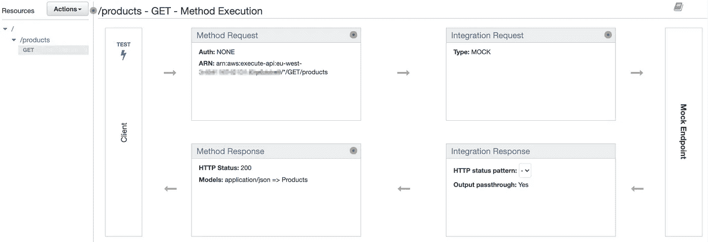

# 如何在 10 分钟内搭建一个 API？

> 原文：<https://betterprogramming.pub/how-to-build-an-api-in-10-minutes-e4cb0401c465>

## 提高工程效率的有前途的服务


照片由[在](https://unsplash.com/@thisisengineering?utm_source=unsplash&utm_medium=referral&utm_content=creditCopyText) [Unsplash](https://unsplash.com/s/photos/software-engineer?utm_source=unsplash&utm_medium=referral&utm_content=creditCopyText) 上拍摄

作为一名热衷于移动平台的程序员，我不断努力构建我的解决方案的后端部分。即使是简单的，也需要安装框架，了解基本原理。我知道 Flask 和 Ruby on Rails 很简单。他们使用流行的编程语言 Python 和 Ruby。它们旨在快速开发和快速交付解决方案。

然而，作为一名工程师，你必须花时间去熟悉它。模型-视图-控制器架构在 web 应用程序中是如何工作的？如何将响应发送回客户端？如何添加授权以及如何使用会话？我们会找到所有的答案，但这需要一些时间。在 10 分钟内剥离一个新的端点不是很好吗？

# 如何

多个云提供商有专门的服务来以无服务器的方式构建端点。您需要定义它返回的响应格式，这就是它。基本功能变成活动的。让我们来探索一下使用 AWS 的服务 [API Gateway](https://aws.amazon.com/api-gateway/) 可以实现什么。

> Amazon API Gateway 是一个完全托管的服务，使开发人员可以轻松地创建、发布、维护、监控和保护任何规模的 API。

当我们创建新的 API 端点时，我们可以选择我们想要的 API 类型:HTTP、REST 或 WebSocket。因为 REST API 要求最高，并且满足大多数 web 应用程序，所以我们出于学习目的选择了它。

接下来，我们需要为它们创建资源和必要的方法。这些是 REST API 的主要支柱。我们创建一个资源`/products`并添加一个方法`GET`。因此，有了这个端点，我们就能够检索产品列表。



API 网关资源仪表板

在为一个资源创建了一个方法之后，我们得到了一个完整的流程概览，就像上面的例子一样。它由四个部分组成:

1.  **方法要求。**在该块中，将执行与请求相关的所有步骤。授权、请求头、API 键、查询参数、请求体和其他部分都是可用。我们可以在这里设置必要的验证，并确保只处理满足要求的请求。这部分看起来像入口。
2.  **整合请求。**这一步定义了端点的业务逻辑。我们在这里定义需要做什么。可以将请求转发到另一个 HTTP 端点，调用 Lambda 函数，或者调用内部 AWS 服务。这是我们 API 的引擎部分。我们还可以选择模拟类型。这意味着我们什么也不做，直接进入响应部分。
3.  **整合响应。**在这里我们必须定义映射到响应格式的数据。在与 Lambda 函数或外部 HTTP 端点集成的情况下，我们需要转换接收到的数据。在模拟响应的情况下，我们以 JSON 格式硬编码响应。
4.  **方法响应。**在这里，我们将来自集成响应的数据与响应状态和标题放在一起。这是流动的出口。客户端从该端点接收的信息在这一步定义。

现在，如果我们单击按钮 TEST，我们将检查端点是如何工作的，并将获得以下日志。

```
Nov 14, 2021 11:59:03 : HTTP Method: GET, Resource Path: /products
Nov 14, 2021 11:59:03 : Method request headers: {}
Nov 14, 2021 11:59:03 : Method response body after transformations: {
  "products" : [
  {
    "id" : 1,
    "name" : "White Shirt"
  }
]
}
Nov 14, 2021 11:59:03 : Method response headers: {Content-Type=application/json}
Nov 14, 2021 11:59:03 : Successfully completed execution
Nov 14, 2021 11:59:03 : Method completed with status: 200
```

我们可以看到端点`GET /products`工作并返回一个伪 JSON 响应。我们几乎准备好了。我们需要做的最后一步是让我们的 API 活起来。

# 让它活起来

API Gateway 有一个*阶段*的概念。我们可以定义多个阶段:开发、筹备、生产，应有尽有。这些是 API 所在的独立环境。为了将 API 部署到 stage，我们导航到资源，并从 Actions 按钮选择项目 deploy API。很快，您的 API 将会投入使用。因此，我们当前对端点所做的所有更改，在我们进行部署之前都是不可见的。

每一级可以具有不同且独立的配置。我们可以设置节流、防火墙、高级日志记录等等。例如，我们的测试环境将使用简化的设置，而生产阶段必须具有增强的安全性。

# 结论

事实上，AWS 的 API Gateway 是一个强大的服务。仅用了 10 分钟，我们就能制作一个实时端点。由于这项服务是无服务器的，我们只为我们使用的东西付费。如果没有流量，我们不需要像永久运行的服务器那样支付任何费用。

API Gateway 具有丰富的特性。我们没有在这里一一介绍。有很好的官方文档和教程可用。但是值得强调其中的几个。可以建立自定义授权流、定义响应模型模式、启用 CORS 和防火墙、创建和导出 API 文档。此外，通过使用 AWS SDK，我们可以将 API 网关端点集成到现有的应用程序中。

现在，您知道如何快速启动并构建您的 API。不要犹豫去尝试它。编码快乐！