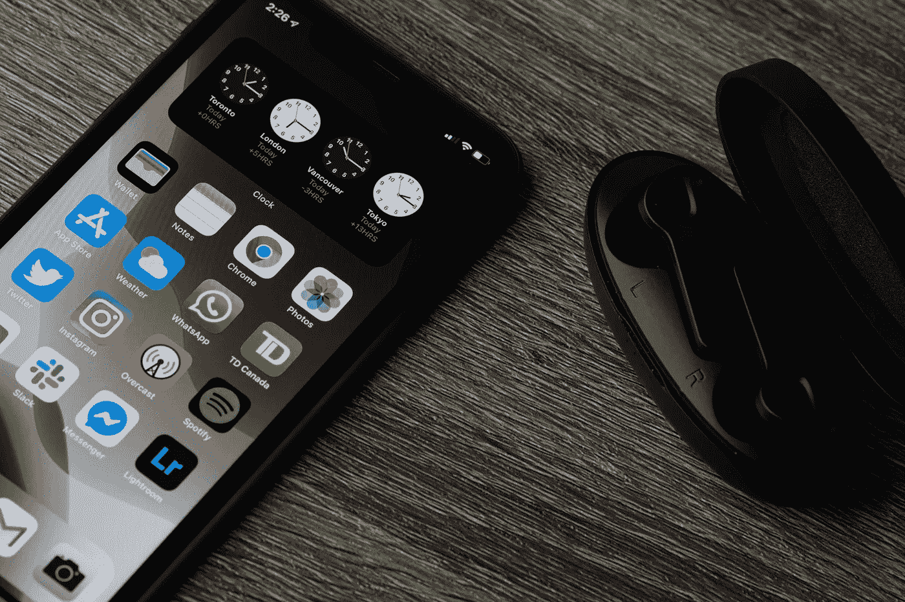
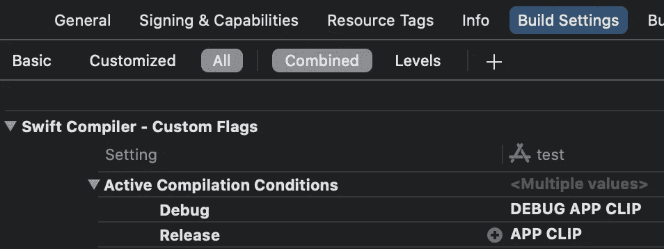
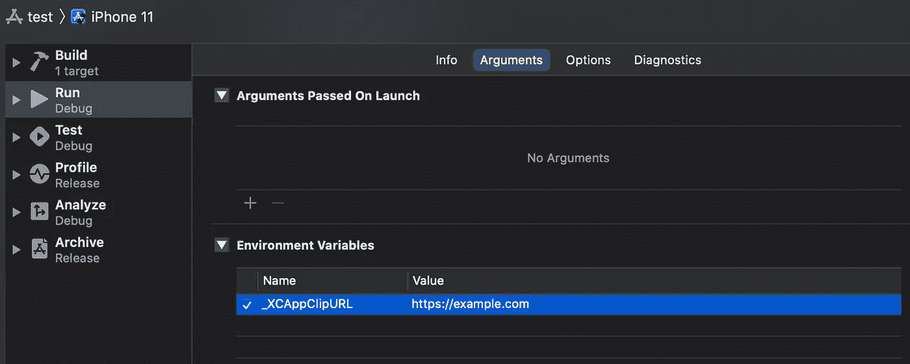
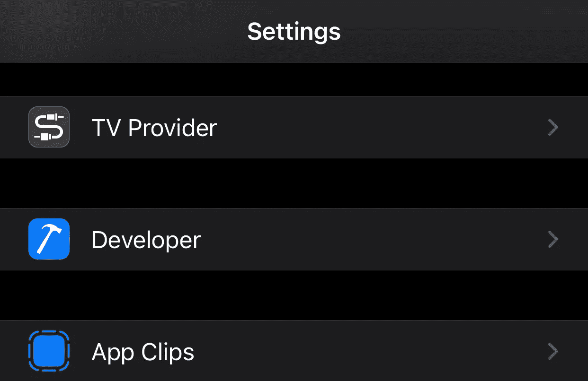
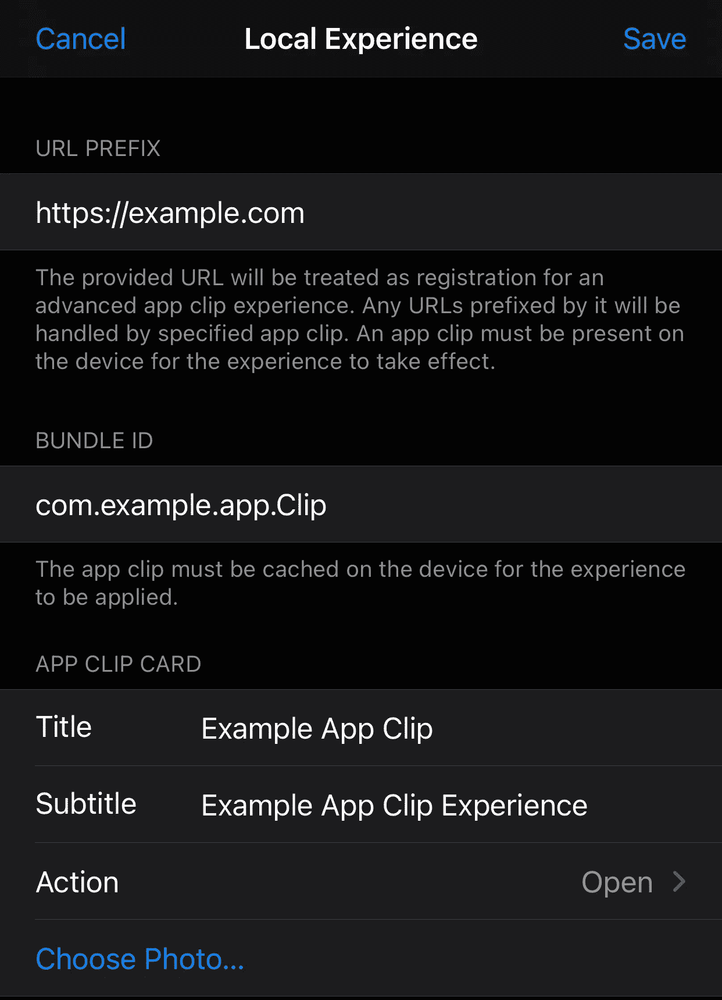
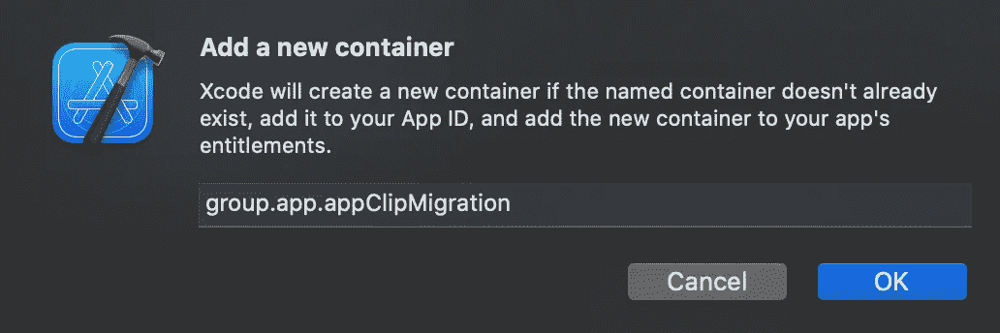
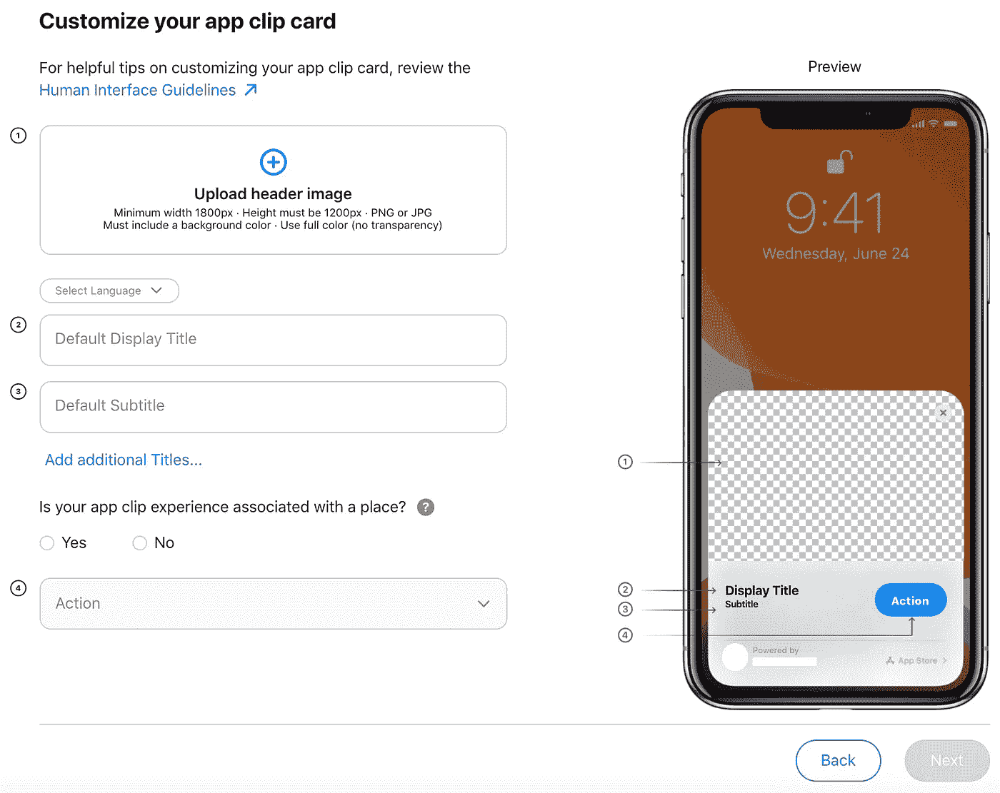
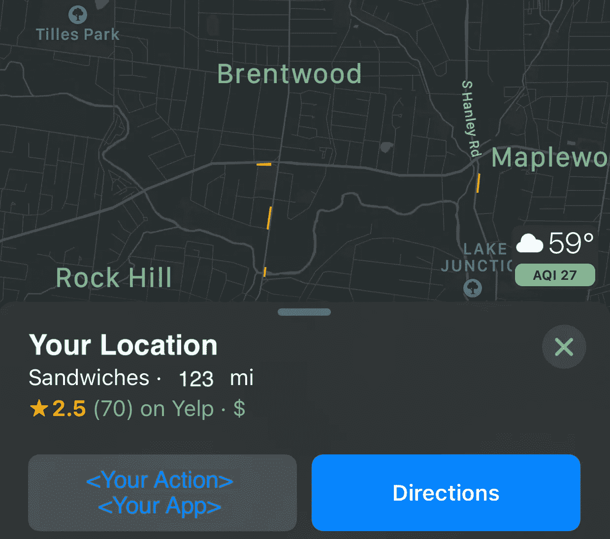

# 如何在 iOS 14 上建立应用程序剪辑

> 原文：<https://betterprogramming.pub/how-to-build-an-app-clip-on-ios-14-a5045fd68eb4>

## 实现应用程序剪辑所需的一切



照片由[托姆·布拉德利](https://unsplash.com/@thombradley?utm_source=unsplash&utm_medium=referral&utm_content=creditCopyText)在 [Unsplash](https://unsplash.com/s/photos/ios-14?utm_source=unsplash&utm_medium=referral&utm_content=creditCopyText) 拍摄

在 2020 年 WWDC 大会上，苹果推出了 App Clips——这是 iOS 开发者向新用户介绍其应用的一种轻量级方式。列出的是我需要的一切，让我的应用程序剪辑离开地面，我希望它也能帮助你。

# 开始前你应该知道的事情

*   仅在 iOS 14 及更新版本上可用
*   需要使用 [Xcode 12](https://developer.apple.com/xcode/) 或更新版本
*   需要搭配完整的应用程序
*   只有当用户没有安装完整的应用程序时才会执行
*   在应用精简后，一个大小限制为 10MB 的独立二进制文件的一部分
    (只能包括小型 SDK)
*   不会出现在主屏幕上，但可能会根据用户活动在“最近添加的”文件夹中保留一小段时间
*   一些框架在应用程序剪辑中不起作用。它们可能不会导致编译时错误，但可能在运行时提供有限的功能或不提供功能
*   由于资源和隐私问题，应用程序剪辑无法使用`URLSession`执行后台联网等后台活动
*   用户可以通过六种方式调用应用程序剪辑:NFC 标签、应用程序剪辑代码或二维码、Safari 应用程序横幅、信息中的链接、地图中的位置卡以及应用程序库中最近添加的文件夹

# 创建应用程序剪辑目标

选择要嵌入应用程序剪辑的目标，并打开一个新的应用程序剪辑目标(“文件”>“新建”>“目标”>“应用程序剪辑”)。您可以选择将 [SwiftUI](https://developer.apple.com/xcode/swiftui/) 或故事板用于界面，并将 SwiftUI 或 [UIKit](https://getuikit.com/) 的应用代理用于应用剪辑的生命周期。确保选择了正确的项目和应用程序，然后单击 create。

**提示**:如果你有一个大型复杂的主应用程序，现在是开始将 SwiftUI 引入你的代码库的好时机。由于应用程序剪辑将存在于一个单独的二进制文件中，并且需要一个简化的流程，因此这是一个探索 SwiftUI 所提供的功能的绝佳机会。

# 添加关联的域

当调用一个应用程序片段时，操作系统需要知道将调用 URL 传递给哪个应用程序。为使该流程正常工作，主应用程序和应用程序剪辑目标都需要包含与*相关联的域权限。*这样，操作系统会将调用 URL 传递给主应用程序(如果有),或者传递给应用程序剪辑(如果用户没有安装完整的应用程序)。


项目设置中的关联域功能

每个启动应用程序剪辑的 URL 都应该以前缀`appclips`(即`appclips:example.com`)列在关联的域功能中。这些也应该列在主应用程序的关联域功能中。

# 配置苹果应用程序站点关联文件

您需要创建或修改相关的域文件。如果你没有，创建一个名为`apple-app-site-association`(没有扩展名)的文件。
使用 JSON 语法，创建一个带有`appclips`键的对象，该对象包含另一个带有`apps`键的对象。`apps`的值应该是应用程序剪辑的应用程序标识符`["<Application Identifier Prefix>.<Bundle ID>"]`。

如果您创建了一个关联文件，您将需要使用“https”(即`https://<domain>/.well-known/apple-app-site-association`)将其托管在`.well-known`目录中。

# 关于实现功能的说明

如果您要将应用程序剪辑添加到现有应用程序中，您将受益于模块化代码库。如果你现在花时间重构，当你实现下一个目标时，你将会节省时间。

需要时使用主动编译条件(相当于 Objc 预处理器标志)。您可能需要引入包含您不能或不想在应用程序剪辑中使用的代码的文件。针对应用程序剪辑目标进行编译时，可以跳过标记的代码部分。活动编译条件位于“生成设置”下。



生成设置中的活动编译条件

# 处理应用程序剪辑中的调用

基于场景的应用剪辑调用处理

基于 SwiftUI 的应用程序剪辑调用处理

根据您使用的是 UIKit 还是 SwiftUI 应用生命周期，在`scene(_:continue:)`或`.onContinueUserActivity(_:perform`中实现应用剪辑调用处理。无论哪种情况，您都需要提取`webpageURL`并使用查询项来配置应用程序剪辑。

# 测试

您可以在模拟器或物理设备上运行 App Clip 目标，但是您需要提供一个调用 URL 作为环境变量。

要访问环境变量，请从方案下拉列表中选择应用程序剪辑目标，然后单击编辑方案。选择“运行操作和参数”选项卡。在名为环境变量的标题下，编辑`_XCAppClipURL`的值。如果不存在，将其作为一个键添加，并将其值作为调用 URL(即`https://example.com`)。确保复选框处于选中状态。用 Xcode 运行 App Clip 时，不会看到 App Clip 卡片。



在方案设置中调用 URL 环境变量

**提示**:您可以给这个调用 URL(即`https://example.com/order?q0=123`)添加查询参数。如果你打算使用 App Clip 代码，请记住它们最多只能编码 128 位数据。保持 URL 简短的一些技巧:使用一个或两个字符的查询字符串参数名称(即`q0=`与`location=`)，使用整数值而不是字符串值(即`q0=123`与`location=Boston`)，如果适用，使用短子域(即`https://appclip.example.com`与`https://alongersubdomain.example.com`)。

## TestFlight 软件

如果你想让非开发者测试应用程序剪辑，你可以通过使用 [TestFlight](https://developer.apple.com/testflight/) 来实现。您需要做的第一件事是上传构建(归档主应用程序，验证并分发到 App Store Connect)。构建完成后，访问 App Store Connect 中的应用程序，并选择 TestFlight 选项卡。如果您单击 build，您将被带到一个新的页面，在这里您可以配置测试细节。在这个页面上，你可以描述测试人员应该测试什么，App Clip 调用 URL，以及测试人员应该是谁。对于内部测试人员来说，这个版本应该可以在他们设备上的 TestFlight 应用程序中立即获得。对于外部测试人员来说，您需要在构建对他们可用之前提交构建供审查。

## 删除应用程序剪辑

如果您需要从设备中删除应用程序剪辑，您可以导航至“设置”>“应用程序剪辑”(它应该列在“开发者设置”下)。在应用程序剪辑中，您可以从设备中移除所有或单个应用程序剪辑。



设置中的应用程序剪辑

## 应用程序剪辑卡

要测试 App Clip 卡，您需要在物理设备上创建本地体验。这在测试 QR 码或 NFC 标签调用时尤其有用。在物理设备上安装应用程序剪辑后，导航到本地体验(设置>开发者>本地体验)。您需要提供 URL 和捆绑包 ID，并为应用程序剪辑卡配置标题、副标题、动作和照片。创建或扫描 NFC 标签或 QR 码，它将调用您指定的应用程序剪辑的本地体验(该应用程序剪辑需要是临时的、开发或试飞版本)。



iPhone 设置中本地应用程序剪辑体验的配置

# 链接到主应用程序

为了链接到主应用程序，苹果建议使用带有应用程序剪辑配置的 SKOverlay(`SKOverlay.AppClipConfiguration(position:)`)。

# 指向主应用程序的调用

如果用户安装了主应用程序，当他们尝试调用应用程序剪辑时，会被定向到主应用程序。您将希望确保用户获得他们期望的体验。在生命周期方法中，为了继续用户活动，您将希望像在应用程序剪辑中一样提取`webpageURL`。然后使用查询参数中的信息来设置主应用程序，以处理用户的预期操作。

# 与主应用程序共享数据

当用户从应用程序剪辑移动到主应用程序时，您可能想要存储他们已经输入或下载的信息，以创建无缝体验。

首先，您需要向应用程序剪辑和主应用程序目标添加应用程序组功能。在该功能中，将同一个组添加到两个目标，并确保选中该复选框。



添加新的共享容器以将数据从应用程序剪辑传递到主应用程序

要在应用程序剪辑目标中保存数据，首先需要获取共享容器(应用程序和应用程序剪辑之间的共享文件夹)的路径，如果适用，添加新路径，并将数据存储在该路径中。

然后在主应用程序中，您将读取容器的内容，并使用该信息来配置主应用程序。

# 检查二进制文件的大小

一个 App Clip 二进制文件细化后大小只能是 10MB。

要检查二进制文件的大小:

1.  档案馆
2.  导出应用程序剪辑(除 App Store Connect 之外的任何内容)
3.  开发分发选项-->“所有兼容设备变体”
4.  签名并导出
5.  打开“App Thinning Size Report.txt ”,查找类似以下内容的行

```
App size: <size> compressed, <size> uncompressed
```

# 设置应用商店

你已经完成了你的 App Clip 实现，并准备提交给 Apple 与全世界分享——恭喜你！

在 App Store Connect 中，有一个应用程序剪辑部分，您需要在其中提供标题图像、副标题和动作。当从 Safari 或“信息”中调用体验时，此元数据会出现在应用程序剪辑卡上。您只能在上传带有应用程序片段的构件后编辑此部分。

如果您进一步向下滚动页面，您将需要添加应用程序剪辑 URL，以便应用程序审核者可以测试应用程序剪辑。如果您使用查询参数，请确保至少包含两个用于测试的 URL。

## 高级体验

在应用程序剪辑部分下面是一个编辑高级体验的按钮。如果您计划支持除 Safari 或 Messages 之外的调用，您将需要配置高级体验。

如果你点击“编辑高级体验”,它会根据你提供的调用 URL，带你回答一些关于你希望应用程序剪辑的外观的问题。根据您是否将体验与地点相关联，您将在下面的下拉列表中看到不同的操作。对于与地点相关的应用程序剪辑，您需要为您想要支持的每个物理位置提供独特的体验。



配置高级体验

要在“地图”中查看您的集成，您需要等待应用程序获得批准并发布。您应该会在“方向”左侧的按钮中看到您的操作和应用程序名称。如果用户的设备上没有应用程序剪辑，他们将看到应用程序剪辑卡；否则，该操作会将他们直接带到应用程序剪辑。



如果您推出分阶段版本，那么在您开始推出时，所有用户都可以使用该应用程序剪辑。

感谢您的阅读，并祝您在实施过程中好运！