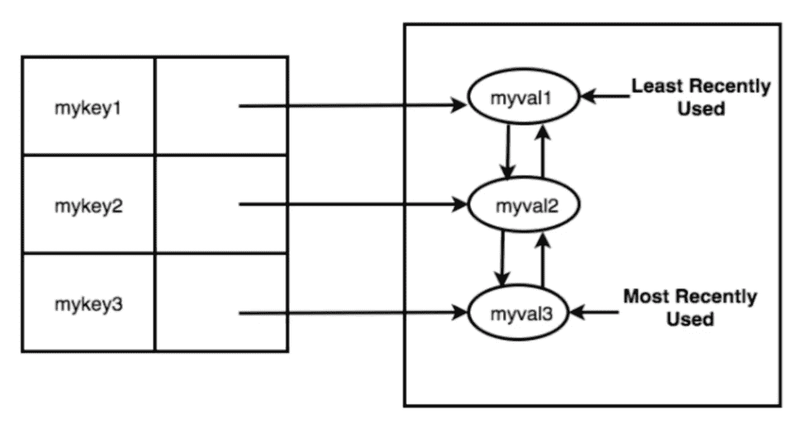
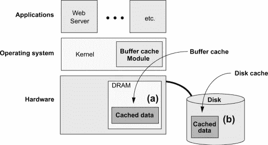
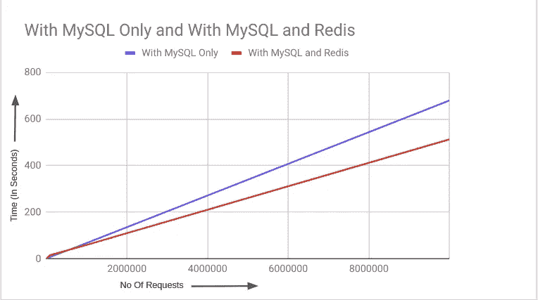
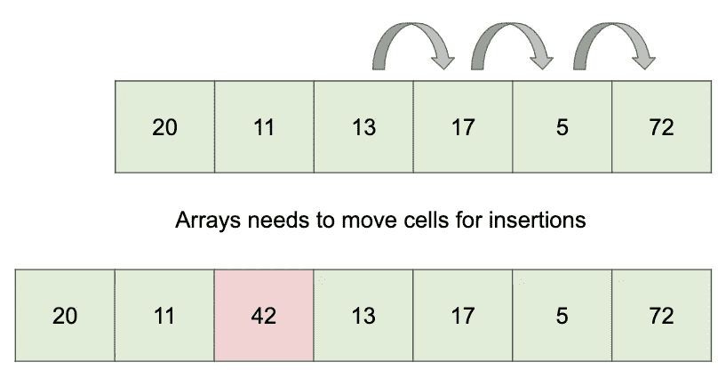
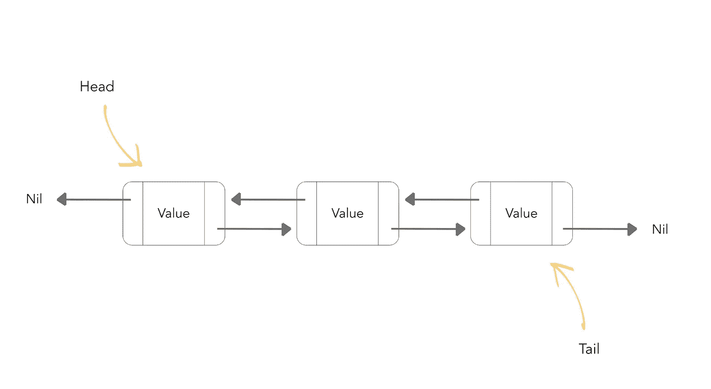
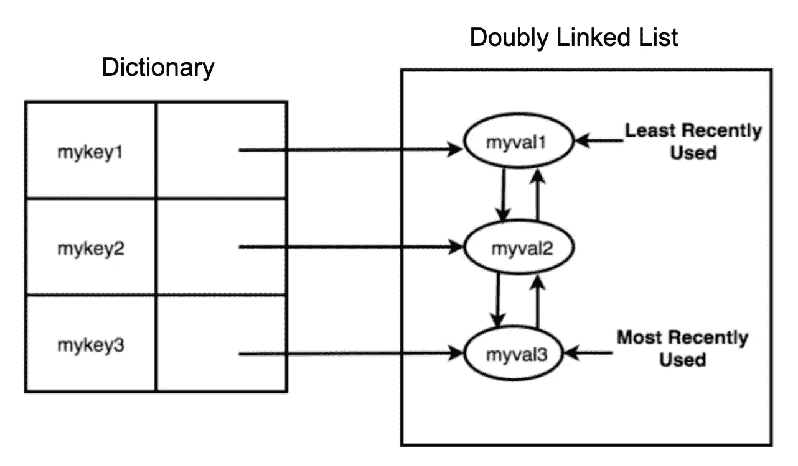
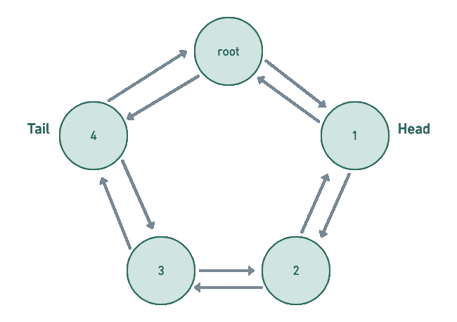
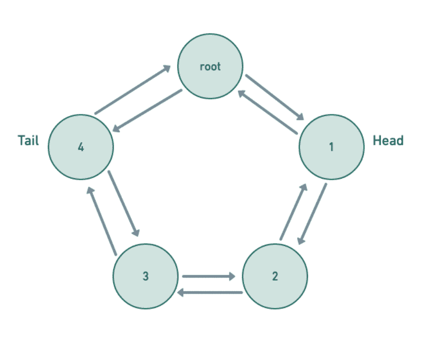
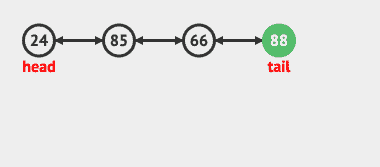
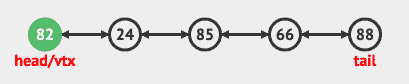

# 如何在不到 10 分钟和 100 行代码内构建 LRU 缓存

> 原文：<https://betterprogramming.pub/how-to-build-an-lru-cache-in-less-than-10-minutes-and-100-lines-of-code-fddad56d7af5>

## 掌握这个常见的面试话题

https://corvostore.github.io/#LRU LRU 高速缓存(图片来源:)

*注:本文所有代码均可在* [*GitHub*](https://github.com/sunny-b/lrucache_examples) *上找到。*

当我面试我的第一份软件工程工作时，我被多次问到最近最少使用(LRU)缓存。我被要求对它们进行编码，并描述它们如何在更大的系统中使用。如果你已经完成了你的编码面试，很可能你也已经完成了。

从采访者的角度来看，缓存是一个通用的话题。它可以用来衡量一个人对数据结构和算法的底层理解。也可以反过来挑战自己对分布式系统的高层次理解。

然而，对于求职者来说，这可能是一种不和谐的体验——尤其是如果你从未在专业场合使用过它们。对我来说就是这样。第一次被问及 LRU·卡奇斯时，我的大脑一片空白。我当然听说过他们。但是在我对二叉树和堆的所有研究中，我并没有费心去了解它们包含了什么。生活在面试官面前并不是解决这个问题的理想环境。

虽然我在那次面试中表现不太好，但这不一定是你的命运。在这篇文章中，我将教你什么和如何 LRU 缓存。最终，您将知道如何在不到 100 行的代码中实现自己的缓存，而无需任何第三方库——所有这一切都在 10 分钟之内完成。

所以让我们开始吧——时间在流逝。

# 什么是最近最少使用的(LRU)缓存？

高速缓存是一种数据存储设备，通常将数据存储在内存中以便快速检索。它们通常被实现为键值存储，这意味着您通过某种标识键来存储和访问数据。

计算机上的 RAM 就是缓存的一个例子。操作系统将数据存储在 RAM 中，以获得比硬盘更快的访问速度，它使用内存单元的地址作为密钥。

操作系统缓存(图像来源:[https://www.sciencedirect.com](https://www.sciencedirect.com/topics/computer-science/disks-and-data))

LRU 缓存是一种特殊类型的缓存，具有独特的功能。当 LRU 缓存空间不足，需要删除数据时，它会逐出最近最少从缓存中取出的键-值对。

LRU 缓存的流行开源例子有 [Redis](https://en.wikipedia.org/wiki/Redis) 和 [Memcached](https://en.wikipedia.org/wiki/Memcached) 。

# 为什么 LRU 缓存有用？

对于提供 API 或用户界面的科技企业来说，性能和可用性至关重要。想想你最近一次访问速度慢的网站。你是留下来等待它加载，还是离开并访问另一个网站？很可能是后者。速度慢或表现不佳的网站会导致数百万美元的收入损失。

不幸的是，许多依赖于高正常运行时间的系统也不得不存储大量数据。社交媒体和电子商务网站通常都是如此。这些网站将其数据存储在某种数据库中，无论是 SQL 还是 NoSQL。虽然这是标准做法，但当您需要获取数据时，问题就来了。查询数据库，尤其是当数据库包含大量数据时，可能会非常慢。

进入缓存。

因为高速缓存将数据保存在内存中，所以它们比传统数据库的性能高得多。对于社交媒体网站，20%最受欢迎的内容驱动着 80%的流量，缓存可以显著降低数据库的负载。

SQL 与缓存速度对比(图片来源:【https://dzone.com/articles/redis-vs-mysql-benchmarks】T4)

下次面试官问你如何优化一个 API 端点或需要反复获取相同数据的工作流时，缓存是一个很好的开始。

然而，了解缓存如何工作以及如何使用它们是很容易的。知道如何自己建造一个是困难的部分。这正是我们要关注的。

# 如何构建 LRU 缓存

出于本文的目的，我将使用 Python 来实现 LRU 缓存。它简洁易读，很多人都知道。然而，如果你不喜欢 Python 或者你对如何用其他语言实现它很好奇，你可以看看我的[范例库](https://github.com/sunny-b/lrucache_examples)。

## 要求

在我们开始构建缓存之前，我们必须了解需求是什么。首先是 API。我们需要实现哪些方法？

虽然生产质量的缓存功能丰富，但我们会保持简单。您只需要创建两个方法:

*   `get(key)`
*   `set(key, value)`

但这还不是全部。LRU 缓存本身有许多要求:

1.  当达到高速缓存的最大值时，删除最近最少使用的键。
2.  每当获取或更新一个键时，它就会成为最近使用的键。
3.  `get`和`set`操作都必须在 [O(1)时间复杂度](https://stackoverflow.com/questions/697918/what-does-o1-access-time-mean)内完成(意思是不管缓存有多大，完成它需要的时间是一样的)。
4.  当获取一个不存在的键时，返回一个`null`值。

记住这些要求，我们就可以开始工作了。

在 [Unsplash](https://unsplash.com?utm_source=medium&utm_medium=referral) 上 [ConvertKit](https://unsplash.com/@convertkit?utm_source=medium&utm_medium=referral) 拍照

## 数据结构

我们需要回答的第一个问题是，哪种数据结构应该支持我们的 LRU 缓存？毕竟，缓存本身不是数据结构。

由于缓存使用了`get`和`set`，并且需要在 O(1)时间内运行，所以您可能会想到哈希表或字典。这确实满足了一些要求。但是拿掉 LRU 钥匙呢？字典不允许我们知道哪个是最古老的钥匙。

我们可以使用时间戳作为字典值的一部分，并在获取键时更新它。这将告诉我们哪个键值对是最老的。问题是，我们需要遍历所有的字典条目来检查哪一个是最老的——这违反了我们的 O(1)要求。

那么答案是什么呢？

这是我应该告诉你一个秘密的地方。我们实际上需要**两个**数据结构:一个用于获取值(字典/哈希映射),另一个用于保存按最近使用排序的条目。

## 第二数据结构

那么第二种数据结构应该是什么呢？如果你想到了一个数组，你就快成功了。

我们可以使用一个数组来保持项目排序。字典中的每个键都可以引用数组中某个值的索引。每当获取一个键时，我们可以将该值移动到数组的前面，将其余的项推回，并更新字典中的索引。

然而，还有一个小问题。在幕后，数组是一行连续的数据单元。如果我们需要将值移动到数组的前面，并将其余的值下推，那么随着数组大小的增加，操作会变得更慢。换句话说，在数组的开头插入元素需要 O(N)时间。

图片来源:作者

但是我们很亲密。我们只需要一个数据结构，它具有与数组相同的排序优势，还可以在 O(1)时间内获取、设置和删除数据。满足所有这些需求的数据结构是一个[双向链表(DLL)](https://en.wikipedia.org/wiki/Doubly_linked_list) 。

双向链表与[链表](https://www.geeksforgeeks.org/data-structures/linked-list/)相同，除了链表中的每个节点都有一个对前一个节点和下一个节点的额外引用。

图片鸣谢:[https://medium . com/flashly-app-stories/double-linked-lists-swift-4-AE 3c F8 a5b 975](https://medium.com/flawless-app-stories/doubly-linked-lists-swift-4-ae3cf8a5b975)

字典中的每个键都将引用链表中的一个节点。这样，我们将能够轻松地获取数据，以及更新和删除它。

图片来源:[https://corvostore.github.io/#LRU](https://corvostore.github.io/#LRU)

# 建设 LRU 高速缓存

现在我们知道了 LRU 缓存的数据结构，我们可以开始构建它了！

看着这段代码，您可能会认为我们已经完成了。但是有一个问题。你注意到第六行的`DoublyLinkedList`了吗？Python 在标准库中没有提供`DoublyLinkedList`。

事实上，大多数编程语言都没有配备 DLL。由于实时编码挑战很少让你使用第三方库，我们将不得不自己实现它。

# 构建双向链表

说到制作 DLL，最重要的方面是设计。有许多不同类型的链表具有不同的权衡，但是对于我们的用例，我们将创建一个循环 DLL。这将使我们快速访问头部和尾部，这对 LRU 缓存很重要。

具有根节点的循环双向链表(图片来源:作者)

虽然链表通常有许多方便的方法，但我们只需要实现其中的一小部分:

1.  `move_front(node)`
2.  `unshift(value)`
3.  `remove_tail`

## 移动前沿

每当从我们的缓存中获取一个键时，我们都需要使那个键成为最近使用的。这涉及到将该键移到 DLL 的前面。

实现`move_front`可能会有点混乱，因为它既涉及到从列表中删除一个节点，又涉及到将它插入到不同的位置。我们通过改变和交换一些周围节点上的`next`和`prev`来做到这一点。

前移动画(图片来源:作者)

## 松开打字机或键盘的字型变换键

DLL 的`unshift`方法非常类似于数组，我们在列表的前面或头部插入一个值。每当调用`set(key, value)`时，我们的 LRU 缓存将使用这个方法。

幸运的是，`unshift`和`move_front`有很多相同的逻辑。如果我们稍微更新一下`move_front`，就可以用它来实现`unshift`。

未移动画(图片鸣谢:[https://visualgo.net](https://visualgo.net/en/list))

## 移除尾巴

如果我们的缓存达到最大值，我们将需要删除最近最少使用的键。这包括移除我们的 DLL 的尾部。与`unshift`相似，`remove_tail`与`move_front`有一些共同的逻辑。虽然我们不能为`remove_tail`重用`move_front`，但是我们可以抽象出一些共同的逻辑。

去掉尾巴动画(图片来源:[https://visualgo.net](https://visualgo.net/en/list))

# 把所有的放在一起

当我们结合我们的 LRU 缓存和 DLL 时，我们得到的是:

就这样，10 分钟后，我们用不到 100 行代码创建了一个基本的 LRU 缓存。对于额外的练习，您可以尝试添加删除键的功能，创建简单的单元测试来证明它的工作，或者用不同的语言创建它。

正如我之前提到的，如果 Python 不是你的菜，不要担心。[我有更多 JavaScript、Ruby 和 Go 的例子](https://github.com/sunny-b/lrucache_examples)。我也开放拉其他语言的请求。

我希望你发现这个深入探究 LRU 的宝藏是有用的和有信息的。这可能是一个令人困惑的话题，但是通过一些练习，你可以在睡梦中建立一个。所以下一次面试官试图挑战你的秘密时，让他们看看你学到了什么。

[*订阅我的个人资料*](https://medium.com/subscribe/@SunnyB) *如果您想在我上传新故事时收到通知。*