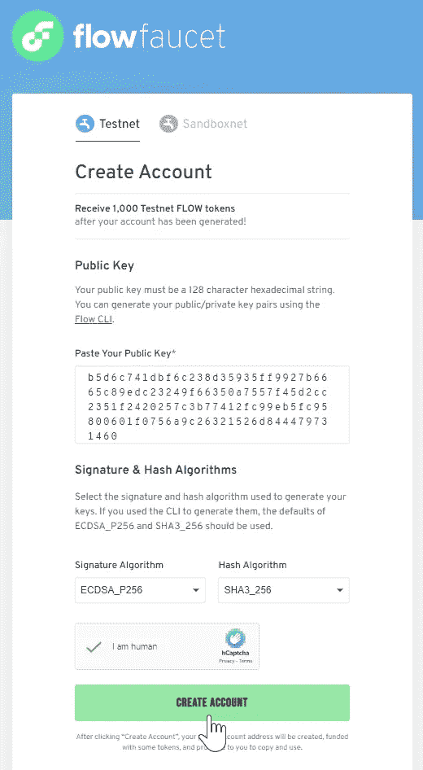
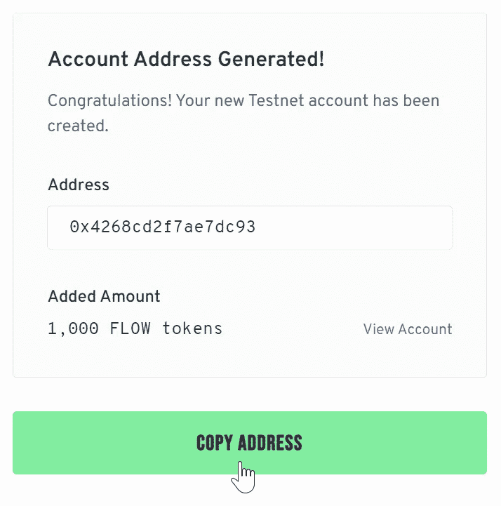
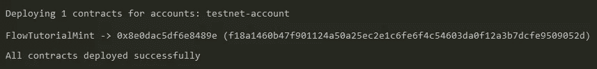
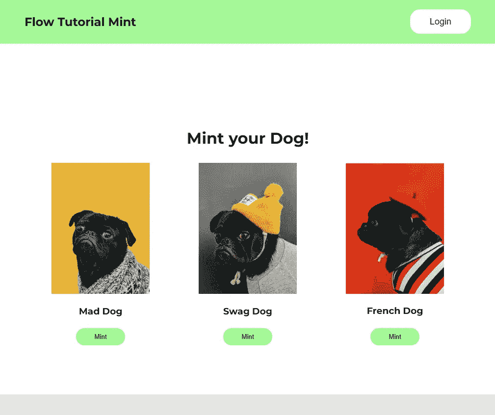
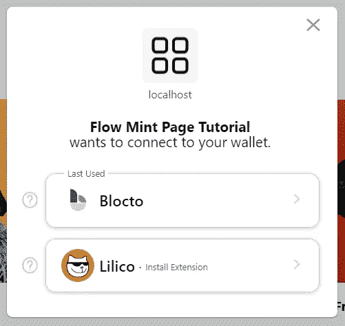
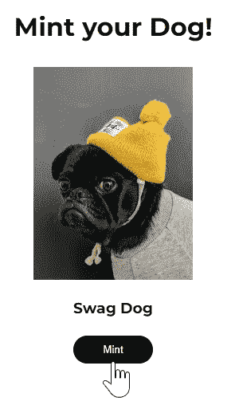
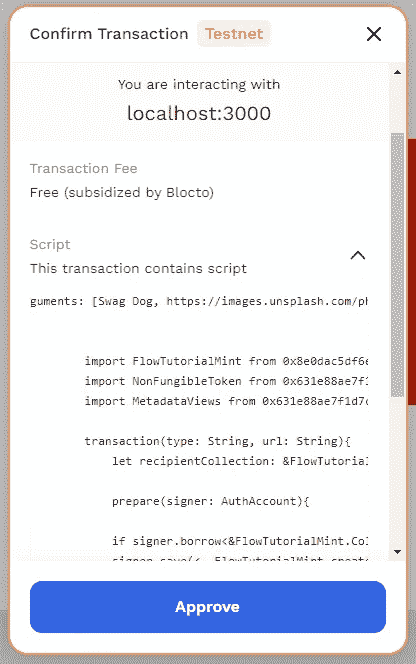

# 如何在流量区块链上搭建一个 NFT 明廷 Dapp

> 原文：<https://betterprogramming.pub/how-to-build-an-nft-minting-dapp-on-the-flow-blockchain-d331a2404cae>

## 让我们通过编写和部署一个智能契约、构建一个前端和创建一些 NFT，将我以前文章中的所有知识付诸实践


在 [Unsplash](https://unsplash.com?utm_source=medium&utm_medium=referral) 上由 [Killian Cartignies](https://unsplash.com/@kikisad?utm_source=medium&utm_medium=referral) 拍摄的照片

如果你一直关注 Flow 系列，那么你已经知道 [Flow 区块链在处理数字资产](https://medium.com/better-programming/an-introduction-to-the-flow-blockchain-60ccc7a35598)方面表现出色，比如 NFTs。它是作为以太坊的网络拥塞和高费用问题的一个更好的替代方案而从头开始构建的。

此外，Cadence 智能合同语言是一种[首创的面向资源的编程语言](https://medium.com/better-programming/smart-contracts-which-is-better-ethereum-or-flow-39f766c72e5d)，使创建和管理数字资产变得简单高效。虽然 Solidity 在通过智能合约促进 Web3 方面表现出色，但它也有缺点。Cadence 改进了 Solidity 的缺陷，提供了升级智能合同的能力和减少人为错误风险的功能，以及其他改进。

最后，可供希望开始使用的开发人员使用的工具和库的列表非常广泛。所以，让我们把它们放在一起，在心流上建立一些东西。

这篇文章是关于为 Flow 区块链创建一个成熟的 NFT 制造 dapp 的教程。

# 让我们开始吧

在本文的其余部分，我们将介绍在区块链流上创建 NFT 铸币 dapp 的过程。

我们将从设置和部署 Cadence 智能合同开始。然后，我们将构建一个前端来连接到我们的智能合同，并在用户的帐户中创建一个 NFT。

我们建立的功能将允许用户连接他们的流量帐户，如果他们还没有一个帐户，创建一个帐户，然后从三个图像中选择一个来创建一个 NFT。然后，dapp 将显示用户帐户中我们的收藏中的 NFTs。这将是一个非常好的项目，突出了在 Flow 上创建 NFTs 是多么容易和高效，以及 Flow 客户端库(FCL)在与区块链交互方面是多么有效。

要跟随本教程，您需要以下东西:

*   [节点](https://nodejs.org/en/download/)和 [NPM](https://docs.npmjs.com/downloading-and-installing-node-js-and-npm)
*   [流程命令行界面](https://developers.flow.com/tools/flow-cli/install)(流程 CLI)
*   [你最喜欢的 IDE](https://code.visualstudio.com/)

安装好所有这些之后，让我们开始吧！

# 1.设置流程帐户

在开始构建之前，我们需要在流区块链上设置一个帐户，以便部署我们的智能合约。运行以下命令生成新的公钥和私钥对:

```
flow keys generate
```

请务必记下您的控制台输出的值，因为我们将在下面的步骤中用到它们。

接下来，我们将前往[流量龙头](https://testnet-faucet.onflow.org/)根据我们的密钥创建一个新地址，并向我们的帐户注入一些测试令牌。完成以下步骤来创建您的帐户:

1.  将您的公钥粘贴到指定的输入字段中
2.  将签名和哈希算法设置为默认值
3.  完成验证码
4.  点击创建账户



成功生成帐户后，我们将与包含 1，000 个流令牌的新流地址进行对话。



复制地址供下一步使用。

# 2.设置智能合同

在我们构建项目前端之前，让我们创建稍后将与之交互的智能契约。

在命令终端中，导航到要使用的文件夹，然后键入以下命令来启动项目:

```
flow init
```

该命令在文件夹中创建一个`flow.json`文件，我们将在其中放置部署智能合同所需的所有信息。

在您的代码编辑器中打开`flow.json`文件，我们将设置一个 testnet 帐户。在`accounts`部分，我们将添加一个名为`testnet-account`的新条目，它包含我们的新地址和之前在`flow keys generate`命令中生成的私钥。

```
{
 "emulators": {
  "default": {
   "port": 3569,
   "serviceAccount": "emulator-account"
  }
 },
 "contracts": {},
 "networks": {
  "emulator": "127.0.0.1:3569",
  "mainnet": "access.mainnet.nodes.onflow.org:9000",
  "testnet": "access.devnet.nodes.onflow.org:9000"
 },
 "accounts": {
  "emulator-account": {
   "address": "f8d6e0586b0a20c7",
   "key": "2becfbede2fb89796ab68df3ec2a23c3627235ec250a3e5da41df850a8dd4349"
  },
  "testnet-account": {
   "address": "0x8e0dac5df6e8489e",
   "key": "c91f4716a51a66683ccb090ca3eb3e213b90e9f9ae2b1edd12defffe06c57edc"
  }
 },
 "deployments": {}
}
```

接下来，我们将创建一个新文件来编写我们的智能合约。

编写代码时，您可能会注意到 Cadence 处理 NFT 创建的方式与 Solidity 有所不同。例如，Cadence 中的 NFT 是作为一种资源创建的，并直接注入用户的帐户中。相比之下，Solidity NFTs 本质上只是一个 ID 号，在映射到数字账本上的特定地址时引用。

记住这一点，在与`flow.json`文件相同的文件夹中，创建一个名为`FlowTutorialMint.cdc`的新文件，并键入以下代码:

在上面的智能合同中需要注意的重要事项:

*   我们正在导入`NonFungibleToken`和`MetadataViews`合同，以使用流标准创建我们的 NFT
*   我们在`pub resource NFT`函数中定义我们的 NFT 资源
*   `mintNFT`函数在调用该函数的账户中铸造一个 NFT

现在我们需要回到我们的`flow.json`文件中添加一些东西:

*   在`contracts`部分，添加契约及其路径。
*   在`deployments`部分添加网络(`testnet`)、我们将用来执行部署的帐户(`testnet-account`)和合同名称(`FlowTutorialMint`)。

```
{
 "emulators": {
  "default": {
   "port": 3569,
   "serviceAccount": "emulator-account"
  }
 },
 "contracts": {
  "FlowTutorialMint": "./FlowTutorialMint.cdc"
 },
 "networks": {
  "emulator": "127.0.0.1:3569",
  "mainnet": "access.mainnet.nodes.onflow.org:9000",
  "testnet": "access.devnet.nodes.onflow.org:9000"
 },
 "accounts": {
  "emulator-account": {
   "address": "f8d6e0586b0a20c7",
   "key": "2becfbede2fb89796ab68df3ec2a23c3627235ec250a3e5da41df850a8dd4349"
  },
  "testnet-account": {
   "address": "0x8e0dac5df6e8489e",
   "key": "c91f4716a51a66683ccb090ca3eb3e213b90e9f9ae2b1edd12defffe06c57edc"
  }
 },
 "deployments": {
  "testnet": {
   "testnet-account": [
    "FlowTutorialMint"
   ]
  }
 }
}
```

设置智能合约的最后一步是将其部署到 testnet。为此，请在终端的项目文件夹中键入以下命令:

```
flow project deploy -n=testnet
```

我们应该会收到一个输出，声明合同已成功部署:



这里需要注意的是，Cadence 智能合约存在于部署它们的账户的存储中，而 Solidity 智能合约存在于区块链上自己的地址中。

虽然帐户的存储容量有限制，但这些限制是相对于帐户中保留的流令牌数而言的。您可以在 [Flow Developer Portal](https://developers.flow.com/learn/concepts/storage) 中了解更多关于账户存储的信息。

厉害！现在让我们构建一个简单的前端来与我们的契约交互。

# 3.创建前端

对于这个项目的前端，我们将使用 React。首先，导航到一个新文件夹并运行以下命令来创建一个 React 项目:

```
npx create-react-app flow-tutorial
```

接下来，导航到 flow-tutorial 文件夹并安装[流客户端库](https://developers.flow.com/tools/fcl-js) (FCL):

```
npm i -S @onflow/fcl
```

FCL 将允许我们与区块链流通信，调用交易，并集成所有其他 FCL 兼容的钱包，而无需添加自定义集成。完成后，我们将安装一些额外的依赖项:

```
npm i elliptic sha3 styled-components
```

安装完所有的依赖项后，我们就可以开始 dapp 前端的工作了。

## **3.a .配置 FCL**

在我们开始结构化和样式化之前，让我们创建一个 FCL 配置文件，我们将在其中定义重要的设置，比如我们是否将与 testnet 或 mainnet 交互。

在`src`目录中，创建一个名为`flow`的新文件夹。在这个新文件夹中，创建一个名为`config.js`的文件。

在这个`config.js`文件中，我们将导入 FCL，调用`fcl.config`函数并为我们的 dapp 创建一些设置，例如:

*   `app.detail.title`
*   `accessNode.api`
*   `discovery.wallet`

打开`config.js`文件，用下面的代码填充它:

```
const fcl = require("@onflow/fcl");

fcl.config({
  "app.detail.title": "Flow Mint Page Tutorial", // this adds a custom name to our wallet
  "accessNode.api": "https://rest-testnet.onflow.org", // this is for the local emulator
  "discovery.wallet": "https://fcl-discovery.onflow.org/testnet/authn", // this is for the local dev wallet
})
```

我们可以为我们的 dapp 配置附加设置，但是现在，这是我们所需要的。

配置完成后，让我们继续构建！

## **3.b .初始结构**

首先，导航到`src`文件夹中的`App.js`文件，将代码替换为:

```
import './App.css';

function App() {

  return (
    <div className="App">
        <h1>Mint Your Dog!</h1>
    </div>
  );
}

export default App;
```

这将为我们提供 dapp 的初始结构，我们将在此基础上进行扩展。

接下来，我们将设计这个结构的样式。打开`index.css`文件，将代码替换为以下内容:

```
@import url('https://fonts.googleapis.com/css2?family=Michroma&family=Montserrat:wght@200;300;600;700&display=swap');

body {
  margin: 0;
  font-family: 'Montserrat', -apple-system, BlinkMacSystemFont, 'Segoe UI', 'Roboto', 'Oxygen',
    'Ubuntu', 'Cantarell', 'Fira Sans', 'Droid Sans', 'Helvetica Neue',
    sans-serif;
  -webkit-font-smoothing: antialiased;
  -moz-osx-font-smoothing: grayscale;
}

code {
  font-family: source-code-pro, Menlo, Monaco, Consolas, 'Courier New',
    monospace;
}
```

如果你运行 npm start，你会看到一个空白页，标题是 Mint Your Dog！

接下来，让我们创建一些组件！

## **3.c .导航组件**

在`src`目录中，创建一个名为`components`的新文件夹，在这里我们将构建所有的自定义 React 组件。

我们将创建的第一个组件是 Navbar，如果用户没有连接，它将显示登录按钮，或者如果用户连接，则显示用户地址旁边的注销按钮和帐户拥有的流令牌数。

创建一个名为`Navbar.jsx`的文件，并用以下代码填充它:

让我们浏览一下代码，看看这里发生了什么。

*   首先，我们正在导入流客户端库，它将为我们提供`authenticate`、`unauthenticate`和确定`currentUser`的函数。
*   接下来，我们导入我们需要的其他依赖项，然后使用`styled-components`在`Wrapper`变量中创建 Navbar 的基本样式。
*   然后，我们定义一些反应状态变量(`user`和`flow`)。
*   接下来是 dapp 的功能，比如`logOut`、`logIn`、`getFlow`(获取关联账户的流量余额)。
*   在那之后，我们返回`html`用于我们样式中包装的导航条。

有了一个完整的`Navbar`组件，我们现在可以将它导入到`App.js`文件中:

```
import './App.css';
import Navbar from './components/Navbar.jsx';

function App() {

  return (
    <div className="App">
        <Navbar />
        <h1>Mint your Dog!</h1>
    </div>
  );
}

export default App;
```

现在，如果我们用`npm start`运行项目，我们会看到`Navbar`提供了我们在代码中定义的功能。厉害！

接下来，让我们建立我们的 NFT 铸造组件！

## **3 . d . NFT 造币部件**

在`components`文件夹中，创建一个名为`MintComponent.jsx`的新文件，然后复制以下代码:

同样，让我们遍历代码，以确保我们理解发生了什么。

*   我们需要在这个组件中导入 FCL，以访问让我们铸造我们的 NFT 的函数。
*   同样，我们使用`styled-components`来添加一些样式。

`mintNFT`函数使用`fcl.mutate`函数通过以下方式执行实际的 mint:

*   验证用户的帐户中是否有流量教程薄荷 NFT 集合，如果没有，则创建一个。
*   在 FlowTutorialMint 协定内调用现有的 mint 函数并传递参数。
*   该函数返回资源(NFT)，我们将它存入用户的帐户。
*   在`fcl.mutate`函数中，我们正在导入使用行`import FlowTutorialMint from 0x8e0dac5df6e8489e`部署的智能契约
*   我们还引进了`NonFngibleToken`和`MetadataViews`标准。
*   在事务中，我们指定图像的 NFT `type`和`url`。

Cadence 交易有两个阶段:`prepare`和`execute`

*   `prepare`–我们要求用户签名以访问他们的帐户并执行私人功能。在这种情况下，创建一个新的`FlowTutorial`薄荷系列，如果他们还没有一个。我们还初始化了一个只限于`NonFungibleToken.CollectionPublic`的公共`Capability`。有关功能的更多信息，请点击链接。
*   `execute`–在 testnet 上调用我们合同内部的`mintNFT`函数。
*   在代码的`html`部分，我们显示了三张图片，用户可以从中铸造一个 NFT。

完成`MintComponent`后，我们可以将其导入到`App.js`文件中:

```
import './App.css';
import Navbar from './components/Navbar.jsx';
import MintComponent from './components/MintComponent.jsx';

function App() {

  return (
    <div className="App">
        <Navbar />
        <h1>Mint your Dog!</h1>
        <MintComponent />
    </div>
  );
}

export default App;
```

现在，用户可以登录到 dapp 和薄荷 NFT 到他们的帐户！

难题的最后一部分是创建一个组件来获取用户的 NFT 并显示它们。

## **3.e .显示用户的 NFTs**

在`components`文件夹中，创建一个名为`ShowNfts.jsx`的新文件，我们将使用以下代码:

本质上，我们在这段代码中所做的是使用 FCL 查询流区块链，并从我们的`FlowTutorialMint`集合中收集连接帐户中的 NFT。

我们只需要将这个组件添加到我们的`App.js`中，就万事俱备了！

```
import './App.css';
import Navbar from './components/Navbar.jsx';
import MintComponent from './components/MintComponent.jsx';
import ShowNfts from './components/ShowNfts';

function App() {

  return (
    <div className="App">
      <Navbar />
      <h1>Mint your Dog!</h1>
      <MintComponent />
      <ShowNfts />
    </div>
  );
}

export default App;
```

就这些了！现在，让我们测试我们的 dapp，确保我们可以创建一些 NFT。

## 4.让我们铸造一些 NFT！

所以首先，让我们用`npm start`启动应用程序，然后打开浏览器到`[http://localhost:3000/](http://localhost:3000/)`。

如果一切顺利，您的屏幕应该是这样的:



在我们的登录序列中使用 FCL 的美妙之处在于，它让我们的用户只需使用一个电子邮件地址就可以轻松地当场创建一个帐户。让我们走一遍这个过程，以确保它正常工作。点击登录按钮，会弹出一个对话框，给我们两个登录选项。我们会选择 Blocto。



Blocto 将提示我们输入一个电子邮件地址，这样做后，我们就可以注册一个新的帐户。然后，一旦我们输入通过电子邮件发送到我们地址的代码，Blocto 就会为我们提供一个闪亮的新地址！


从这里，我们可以选择哪个狗的形象，我们想薄荷作为一个 NFT。我选择了流浪狗，因为它让我想起了自己！



按下 Mint 按钮将弹出另一个对话框，告诉我们将要执行的交易。我们可以看到 Blocto 慷慨地支付了铸造费用，如果我们想看看我们调用的脚本，我们可以这样做。



点击 Approve 几秒钟后，我们应该会收到一条消息，表明我们的 mint 成功了，我们新铸造的 Swag Dog 将显示在 dapp 的 My NFTs 部分下。

以下是我们的 dapp 行动链接:

[https://s1.gifyu.com/images/flow_tutorial-min.gif](https://s1.gifyu.com/images/flow_tutorial-min.gif)

这个项目的完整源代码可以在这个库中找到。

# 结论

正如你所看到的，一旦你理解了它是如何一起工作的，在 Flow Blockchain 上构建一个 NFT minting dapp 就很简单了。此外，流客户端库是我们可以使用的强大工具，它让我们可以访问大量内置功能，并帮助我们的 dapp 获得更好的用户体验。

与以太坊相比，Flow 处理 NFT 的创建和管理更加高效和安全。这是通过部署智能合同并将 NFT 直接注入用户账户来实现的，而不是创建对存储在数字账本上的地址或映射的引用。

要了解更多关于构建流程的信息，请查看[流程开发者门户](https://developers.flow.com/)。

祝你今天过得愉快！