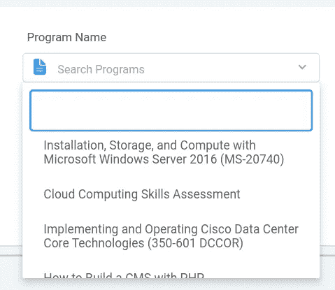
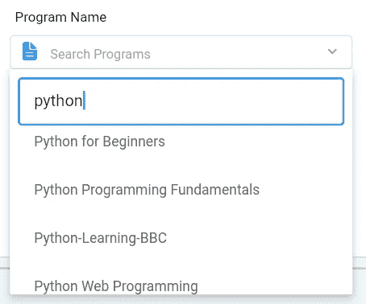
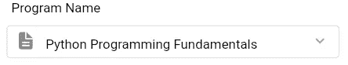

# 如何建立一个在线可搜索的下拉式窗口小部件

> 原文：<https://betterprogramming.pub/how-to-build-an-online-searchable-dropdown-flutter-widget-3ede426f4d17>

## 用 Flutter 中的在线-离线数据实现可定制的下拉菜单


由 [Szabo Viktor](https://unsplash.com/@vmxhu?utm_source=medium&utm_medium=referral) 在 [Unsplash](https://unsplash.com?utm_source=medium&utm_medium=referral) 上拍摄

Flutter 中有几个小部件提供下拉搜索功能，但我发现真正令人惊叹的是:

```
DropdownSearch<>
```

此小部件允许您执行以下操作:

1.  创建项目的下拉列表。
2.  搜索提供的数据(完整和不完整的搜索功能)。
3.  设置数据，使其成为您构建的离线列表，或者可以是可以通过 API 请求获取的在线数据。
4.  可定制的弹出窗口构建器。弹出数据列表的文本、样式和装饰。
5.  可定制的下拉项目生成器。弹出式下拉列表的文本、样式和装饰。

作为第一步，在 Flutter 项目的`pubspec.yml`文件的依赖列表中包含 widget 类。

```
pubspec.yamldependencies:
   dropdown_search:
```

# **用例**

这个小部件就像一个工具，像一个锤子，所以你需要知道在什么情况下应该使用这个工具:

## **案例 1**

1.  您希望实现一个可搜索的下拉列表，并且正在离线创建数据。
2.  离线意味着数据是在代码内部创建的，不需要调用任何 API。

## **案例二**

1.  您希望实现一个可搜索的下拉菜单，并且正在在线获取数据。
2.  在线意味着通过 HTTP 请求从 API 获取数据。
3.  你不想在线过滤。
4.  您正在使用一个`FutureBuilder` 并希望将未来变量传递给下拉搜索小部件。

## **案例三**

1.  您希望实现一个可搜索的下拉菜单，并且正在在线获取数据。
2.  你需要支持关键词搜索的在线过滤。
3.  现在，随着在线过滤的启用，您有了一个希望与这个小部件连接的 API 请求。

在本教程中，我将解释案例 3。这是最复杂的情况。在我接下来的教程中，我还将解释案例 1 和案例 2。

# 在案例 3 中实现下拉搜索后，用户界面将会是什么样子



将创建的用户界面

这张快照来自我的个人项目。您可以看到搜索栏如何出现在列表上，以及如何设计整个小部件的样式。这是我们使用这个小部件的动机。

# Widget 类中每个参数的含义。

小部件代码——允许您使用过滤器创建在线搜索——如下所示:

1.  `DropdownSearch<Class>`:`Class` 是您希望在下拉列表中包含的列表项的`Class`类型。您可以在您的代码中创建一个自定义的`Class`，或者如果列表中有一个已经在 Dart 中可用的类类型，例如 String、int 或 bool，您可以编写它们来代替`Class`。这是非常重要的，因为你必须事先决定哪种类型的项目，你想包括在内。在`onFind`参数中的`getData()`方法将返回相同类型的项目。同一个类的对象会用`onChanged()`的方法给出。
2.  `mode` :指的是您想要在按下小工具时创建的弹出窗口的类型。您可以从`MENU`、`DIALOG` 或`BOTTOMSHEET`三个选项中进行选择。
3.  `showSearchBox` :如果需要搜索功能，应该为真。
4.  `isFilteredOnline`:如果要对在线数据应用过滤器，则应为 true。这意味着无论你在搜索框中写什么，都会被发送到一个 API 在线获取相应的数据。该字段链接到`onFind` ，这将在本教程稍后讨论。
5.  `dropDownButton`:如果你看到 UI 快照，你会看到一个小箭头在右边朝下。这表明您可以扩展列表。该字段提供了图标小部件。您可以在此放置任何图标，但它必须是一个图标。
6.  `dropdownSearchDecoration`:该字段用于下拉小工具的样式。水平矩形框，其中有一个建筑图标和搜索/大学商店写，由于这个领域。该字段接受一个`InputDecoration` 类。什么是输入装饰类，它的属性是什么，可以在 Flutter 关于[输入装饰](https://api.flutter.dev/flutter/material/InputDecoration-class.html)的文档中研究。
7.  `dropdownBuilder`:控制从下拉列表中选择的项目显示后下拉列表的外观。我使用了`ListTile` 来显示文本。`_customDropDownPrograms` 的实现如下:

这里，`item` 是从列表中选择的对象，该字段知道您选择了哪个对象，因此它采用一个返回`ListTile`的方法。如果`item` 不为空(对象被选中)，它使用被选中的`item` ，并从中获取`title` 属性。这里的`item` 是类`BootCampDetails`的自定义实现类对象。您可以创建您的类和属性放在这里。如果`item` 为空(无选择)，则显示“搜索程序”。

8.`popupItemBuilder`:该字段控制弹出下拉菜单中显示的项目的样式。您可以更改文本、颜色长度和大小，甚至添加前导图标。所有这些属性都由`ListTile` 小部件提供。你也可以在每一个项目标题上添加说明性的小标题等等。在关于 [ListTitle](https://api.flutter.dev/flutter/material/ListTile-class.html) 的 Flutter 文档中了解更多关于这个小部件的信息。`_customPopupItemBuilder`的实现如下:

`isSelected` 在这里是没用的。它是用来预选的，大多数情况下不用，但是你得把它放在函数参数里。

9.这是最重要的方法，因为数据在这里给出。`onFindg`给了我们一个可以使用的字符串类型过滤器。Filter 会存储我们在搜索框中输入的任何内容，即使只输入了一个字母并触发了`onFind`。然后，过滤器变得可用。我已经将 filter 作为参数传递给了`getData()`,它使用过滤器字符串向 API 发出在线请求。您需要实现一个类似的方法，返回一个`Future List` **。这非常重要，因为`onFind` 只需要一个未来列表类型的对象。`getData()`实现如下:**

第 10 行是我们将过滤器设置为键`searchText`的值的地方。这是在请求正文中发送的。这取决于我用来获取数据的特定 API。之后，`detailList` 转换为`List`并返回。每当您在搜索框中输入内容时，此方法都会获取数据；因此，它提供实时数据提取。

10 **。** `onChanged`:第二重要的参数就是这个。在您从下拉列表中选择一些内容之后，用这个参数编写的代码将被执行。`onChanged` 字段为我们提供了选中的`Object`。你可以对这个物体做任何你想做的事情。也许把它储存起来，用在别的地方。`setState()`可以从代码内部的任何地方调用。我在这里调用它是为了满足我的特定需求。此外，调用`setState` 是一种常见的做法，因为你可以保存选中的对象，并可能在用户界面的某个地方显示它。

`showClearButton` :如果为真，在所选对象的右边会显示一个小的清除按钮。它用于清除小部件并重新选择某些东西。

用户界面快照:



使用动态数据提取进行搜索



customdropdownbuilder 设置选定数据对象的样式

我将会写另一个关于 Flutter 中使用的小部件的详细教程。

```
**Want to Connect?**Hit me up on [LinkedIn](https://www.linkedin.com/in/hatim-zahid/). 
```

# 参考

[](https://api.flutter.dev/flutter/material/InputDecoration-class.html) [## 输入说明类-素材库- Dart API

### 此示例显示如何使用 InputDecorator 设置 TextField 的样式。文本字段显示一个“发送消息”图标到…

api.flutter.dev](https://api.flutter.dev/flutter/material/InputDecoration-class.html) [](https://api.flutter.dev/flutter/material/ListTile-class.html) [## ListTile 类-素材库- Dart API

### 单个固定高度的行，通常包含一些文本以及前导或尾随图标。列表框包含…

api.flutter.dev](https://api.flutter.dev/flutter/material/ListTile-class.html)