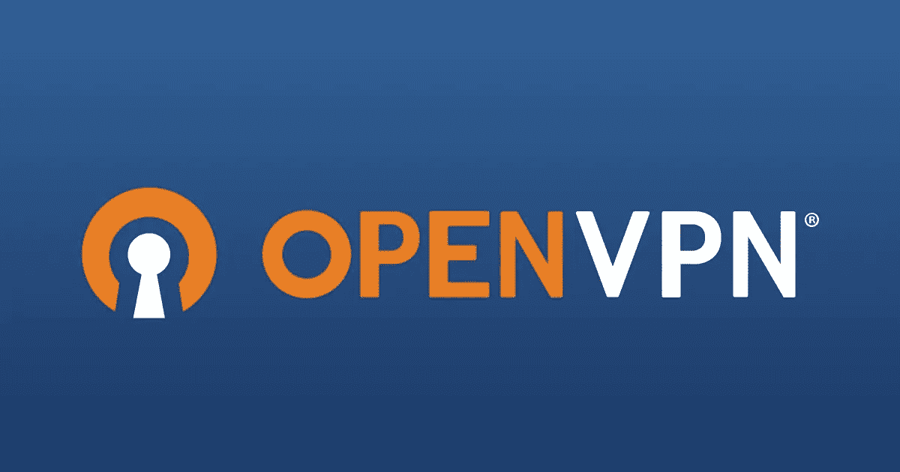
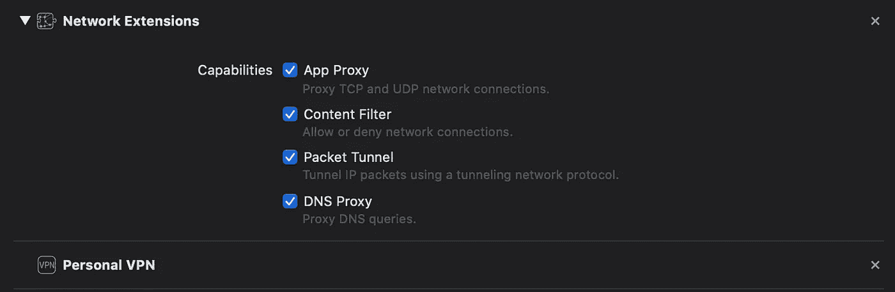
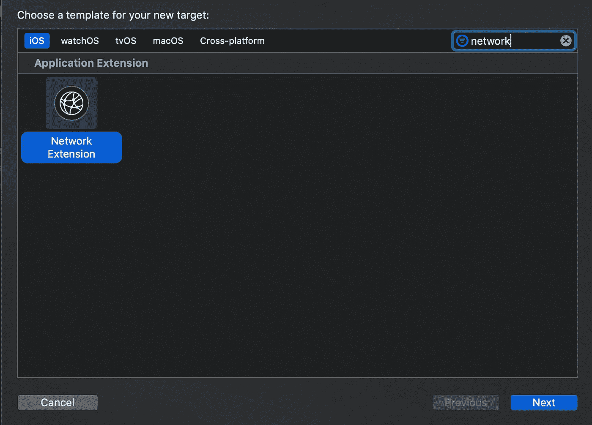

# 如何在 iOS 上构建 OpenVPN 客户端

> 原文：<https://betterprogramming.pub/how-to-build-an-openvpn-client-on-ios-c8f927c11e80>

## 搭建 VPN app？从这里开始。



[VPN 软件解决方案&商业服务| OpenVPN](https://www.google.com/url?sa=i&rct=j&q=&esrc=s&source=images&cd=&cad=rja&uact=8&ved=2ahUKEwiVpLiIvvTlAhUGsp4KHf6qANEQjhx6BAgBEAI&url=https%3A%2F%2Fopenvpn.net%2F&psig=AOvVaw0wUIoY4LnZo4qqCZea5_sG&ust=1574191386775516)

现在大部分 VPN apps 都支持 OpenVPN 协议。然而，当涉及到 iOS 时，并没有太多的东西可以帮助 iOS 开发者轻松进入其中。

苹果意识到移动端对 VPN 的需求越来越大；它们为开发者提供了内置于 iOS 中的强大支持。

苹果创建了[网络扩展](https://developer.apple.com/documentation/networkextension)框架，让开发者可以轻松创建 VPN 应用。在本文中，我将只向您展示如何使用 OpenVPN 协议建立 VPN 连接。IKEv2 将在另一篇文章中介绍。

让我们开始…

# 1.导入 OpenVPNAdapter—OpenVPN 库的 Objective-C 包装器

我们将使用 [OpenVPNAdapter](https://github.com/ss-abramchuk/OpenVPNAdapter) ，它是 OpenVPN 库的包装器。

使用 CocoaPods 安装它:

```
pod 'OpenVPNAdapter', :git => 'https://github.com/ss-abramchuk/OpenVPNAdapter.git', :tag => '0.4.0'
```

特别感谢 [Sergey Abramchuk](https://github.com/ss-abramchuk/OpenVPNAdapter/commits?author=ss-abramchuk) 他是 [OpenVPNAdapter](https://github.com/ss-abramchuk/OpenVPNAdapter) 的创造者。

# **2。添加所需功能**

如果应用程序提供 VPN 服务，苹果要求它们添加个人 VPN 和网络扩展功能。



单击“签名和功能”上的“+功能”按钮添加新功能

如果 Xcode 上没有显示这些功能，请访问[developer.apple.com](https://developer.apple.com)并为您的捆绑包 ID 启用它们。

# 3.添加网络扩展目标

您将需要添加一个网络扩展，您可以将它视为一个独立的应用程序，它将在后台处理 VPN 操作。

苹果是这样定义扩展的:“应用程序扩展让你可以扩展应用程序之外的自定义功能和内容，让用户在与其他应用程序或系统交互时可以使用。”



文件>新建>目标

这将自动创建一个新文件夹，其中包含您的目标名称和一系列文件。我们将在步骤 5 中使用这些。

# 4.配置 VPN 配置文件

首先导入`NetworkExtension`并开始使用`NETunnelProviderManager`配置您的 VPN 配置文件

我在这里提供了一个非常简单的配置`[NETunnelProviderProtocol](https://developer.apple.com/documentation/networkextension/netunnelproviderprotocol)`(VPN 隧道的配置参数)的方法。 *)*

这些参数可能会根据服务器的要求而变化。

您需要将`.ovpn`文件导入到项目中。这个文件应该包含 OpenVPN 指令、证书和密钥。基本上，这个文件包含了建立 VPN 连接所需的所有信息。

# 5.建立联系

创建网络扩展目标后，Xcode 会自动生成一个`PacketTunnelProvider`类，它是`NEPacketTunnelProvider`(数据包隧道提供商应用扩展的主要类)的子类。)

在这里，您可以使用 [OpenVPNAdapter](https://github.com/ss-abramchuk/OpenVPNAdapter) 配置和建立 VPN 连接。

仅此而已！现在运行你的应用程序，它应该建立一个 VPN 连接。

如果你打算在你的应用程序上显示 Wi-Fi SSID，你可以阅读我的文章[如何在 iOS 13 上访问 Wi-Fi SSID](https://medium.com/better-programming/how-to-access-wifi-ssid-on-ios-13-using-swift-40c4bba3c81d)。