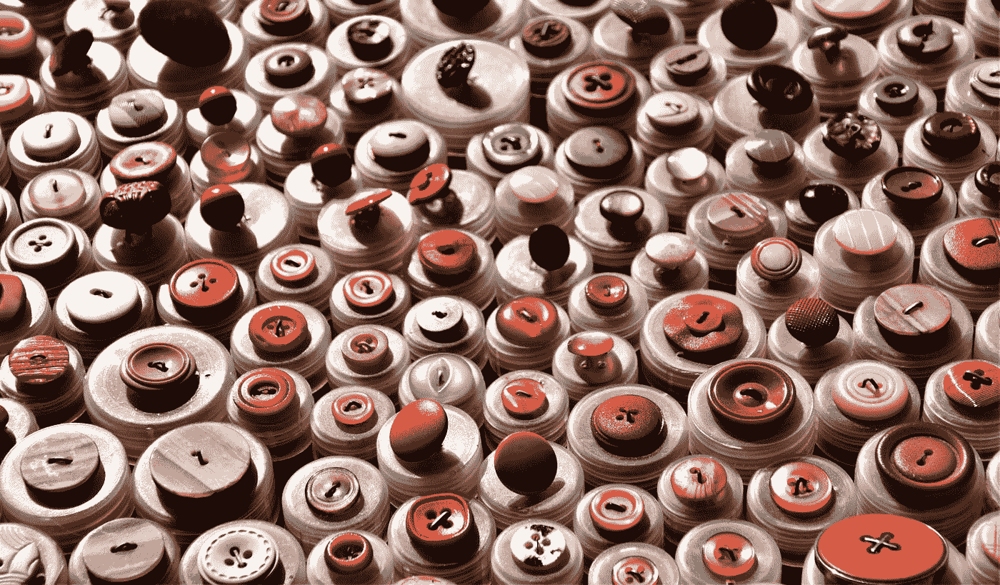
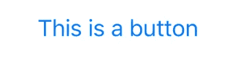
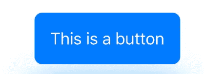
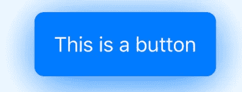
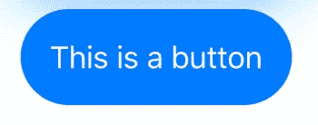
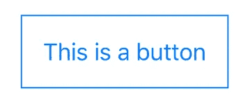
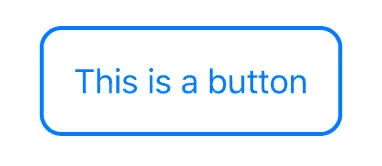
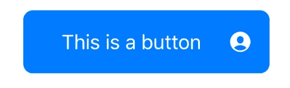
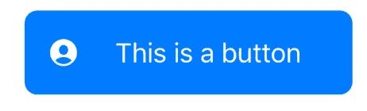

# 如何在 SwiftUI 中构建和定制按钮

> 原文：<https://betterprogramming.pub/how-to-build-and-customize-buttons-in-swiftui-448f5994022d>

## 带有阴影、边框、图像等的按钮



由 [Waldemar Brandt](https://unsplash.com/@waldemarbrandt67w?utm_source=medium&utm_medium=referral) 在 [Unsplash](https://unsplash.com?utm_source=medium&utm_medium=referral) 上拍摄的照片。

要学习本教程，您需要对 Swift 和 Xcode 11 有一些基本的了解，至少要有 iOS 9.1 版本。

# 正常按钮

`Text`是您设置自己的文本的地方。这是构建按钮的基本方法。

```
Button(action: { }, label: {
  Text("This is a button")
})
```



# 按钮定制

以下按钮使用:

*   `Padding`，创建按钮的矩形。
*   `ForegroundColor`，设置文本的颜色。
*   `background`，设置背景颜色。
*   `cornerRadius`，在每个角上设置圆角曲线。



# 阴影

```
Button(action: { }, label: {
...
})
  .shadow(color: Color.blue, radius: 20, y: 5)
```

*   `shadow`添加阴影的颜色、半径以及 x 和 y 的位置



# 无穷角半径

`infinity`永远给你最完美的角落。

```
.cornerRadius(.infinity)
```



# 边境

`.border`允许你在按钮周围创建一条线。你仍然需要`padding`有一个好看的矩形形状。

```
.padding()
.border(Color.blue)
```



获得圆角边框的另一种方法如下:

```
.padding()
.background(RoundedRectangle(cornerRadius: 10).stroke(Color.blue, lineWidth: 2))
```

*   `RoundedRectangle`创建一个矩形的圆角半径。
*   `stroke`允许您调整边框的宽度和颜色。



# 带图像的按钮

只显示文本可能有点枯燥。为什么不加个图呢？

*   `padding(.horizontal)`加宽按钮的宽度。如果不需要，您可以禁用它。
*   `Image(systemName)`允许您使用 Apple 提供的内置图像。你可以下载 SF 符号来更好地利用这个工具。



如果你想把这个图像放在左边，把图像代码上移一行就可以很容易做到。

```
Image(systemName: "person.crop.circle.fill")
Text("This is a button")
```



只是一个图像呢？

*   `renderingMode`允许显示图像。如果你把这条线去掉，你就看不到图像了。
*   `resizeable`允许您调整按钮的大小。
*   `aspectRatio`允许你控制图像的内容。
*   `frame`允许您设置宽度和高度。


感谢阅读！