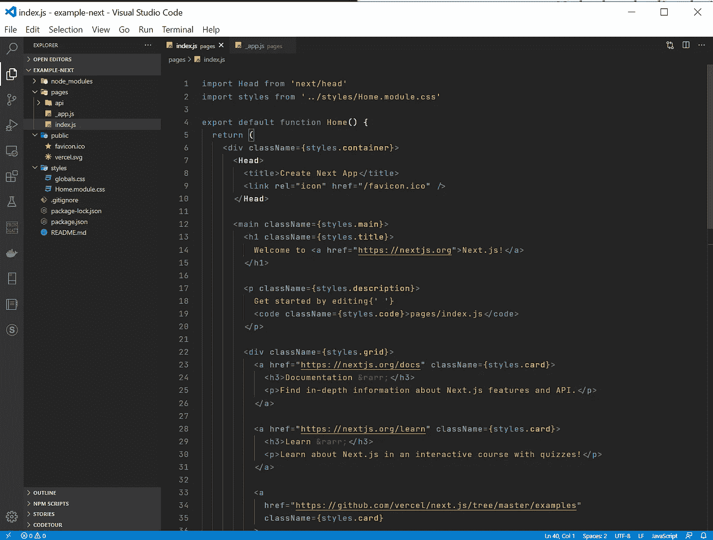

# 如何使用 Next.js 快速构建和部署 Jamstack 网站

> 原文：<https://betterprogramming.pub/how-to-build-and-deploy-a-jamstack-website-fast-with-next-js-a61df3c822f>

## 为什么 Next.js 是明智的选择


克里斯多夫·高尔在 [Unsplash](https://unsplash.com?utm_source=medium&utm_medium=referral) 上拍摄的照片。

# 2010 年网站建设

我刚开始做前端开发的时候，只用 HTML，CSS，JavaScript。因为当时我团队中的后端开发人员需要将它连接到 CMS，所以我将它构建到 PHP 文件中。

我没有使用任何类似 Angular 或 React 的框架。它只是 HTML、CSS 和一点 jQuery。此外，没有 CSS 预处理器可以帮助我。他们是存在的，但我不知道。

> 这个故事最初发表在 [ByRayRay.dev](https://byrayray.dev/posts/2020-12-21-nextjs-jamstack-getting-started) 上

# 2020 年建设网站

如今，我们有很多工具可以使用。像 React 和 Vue.js 这样的框架给了我们一个神奇的工具箱来更快地构建网站。

目前，我不再使用 PHP，因为它让我用 Apache 和 MySQL(或任何其他数据库)配置我的计算机。

在我看来，我们现在在网站建设方面做得更好。我们可以从各种 API 中提取数据，并在我们的网站上出色地展示出来。

# 为什么 Next.js 是明智的选择

我知道，现在有很多选择要做。你打算用什么作为平台来建立你的网站？您打算使用哪个框架或静态站点生成器？

有这么多可用的工具！

我会一直赌 JavaScript！它是我在 web 开发中使用的第一语言——包括前端和后端。

这就是为什么 Next.js 是建设网站的明智选择。你可能会问，“为什么？”我会告诉你。

1.  Next 构建于 React 之上。
2.  它有一个很棒的插件工具箱。
3.  您可以在服务器端加载数据。
4.  使用 Ajax，当用户需要时提取数据是没有问题的。
5.  React 是刚学习 JavaScript 时最简单的库之一。
6.  您可以从 Markdown、MDX、JSON、API、YAML、GraphQL 和许多其他数据源和 CMS 平台加载内容。
7.  它有内置的类型脚本支持。
8.  出色的内置图像优化。
9.  如果你重视性能和搜索引擎优化很好。
10.  大量文档和一本[入门教程](https://nextjs.org/learn/basics/create-nextjs-app)。

如果你还不相信，请检查一些[其他静态网站发电机](https://jamstack.org/generators/)。有很多可用的。

# 何时应该选择 Next.js

在开始编码之前，考虑一下你想要构建什么是有好处的。这有助于平滑你的开发过程。但是知道你的知识工具箱中需要什么来简化使用 Next 建立网站的过程也是很好的。

1.  你应该熟悉 JavaScript！如果你不懂 JavaScript，这不是一个明智的选择。在深入任何 JavaScript 框架或库之前，先学习 JavaScript。
2.  如果你也知道反应就好了。Next 就是建立在它上面的。
3.  没有预先定义的方式来书写你的风格。你可以带任何风格的预处理器或者任何你想要的 CSS 框架。
4.  你应该知道 HTML 和 CSS。如果你不认识他们，请不要从 JavaScript 开始。你可能会有一段艰难的时间来构建 Next。

# 如何用 Next.js 搭建网站

## 1.装置

您的计算机上应该安装了 Node.js 和 Git。如果你没有 Node，下载安装程序是最简单的方法。

## 2.创建项目

就像在终端中运行这个命令一样简单:

```
npx create-next-app
```

首先，它会问你这个问题:“你的项目叫什么？”键入您的项目名称，它将生成所有需要的文件。

在您的终端中，转到您的项目目录。当脚本安装完所有依赖项后，它会向您显示文件夹。

当你通过你最喜欢的编辑器打开这个文件夹时，它应该是这样的:



## 3.添加内容和样式

如果您检查`pages`文件夹，您将看到两个 JavaScript 文件和一个文件夹。

`index.js`是你的主页。`_app.js`是所有页面组件的包装器。在这里，您可以添加各种全局样式。

运行`npm run dev`并在`localhost:3000`上打开浏览器。现在，您可以看到新的 Next.js 网站。

如果您想从 Markdown 文件、API 或 CMS 中获取内容，我建议查看 Next 中的所有 [starter 项目](https://nextjs.org/docs/basic-features/data-fetching)。

在本地运营它很酷，但最终，你要向全世界展示它。

## 4.创建一个 GitHub 项目

在我们部署它之前，创建一个项目并在那里安全地托管您的代码。

我们想在 Netlify 上免费托管它。对于 Netlify，您应该添加一个配置文件来让您的站点立即运行。

创建一个`netlify.toml`文件，并将这段代码复制到其中:

```
[build]
  command = "npm run build"
  publish = "out"
```

使用这段代码，您可以告诉 Netlify 您的构建命令是什么，以及它需要在哪个文件夹中提供该构建版本。

## 5.免费在 Netlify 上部署

登录 Netlify，基于您的 GitHub 帐户创建一个新项目。

选择您的网站所在的回购，然后单击下一步。因为有了`netlify.toml`文件，下一步应该已经为您配置好了。

当一切按计划进行时，您应该看到有一个部署正在运行。

当构建和部署过程完成时，您可以通过单击“Preview deploy”来访问您的站点现在你的网站是活的，你可以与世界分享。

当然，我建议花合理的时间来添加内容和样式，这样会让你的访客看起来很舒服。祝你好运！

# 谢谢

希望这已经帮助你发布了你的第一个 Next.js 网站。如果你有任何问题或反馈，请在评论中告诉我。

*快乐编码🚀*

# 阅读更多

[](https://medium.com/better-programming/5-rules-to-improve-code-readability-83eda50ca780) [## 提高代码可读性的 5 条规则

### 代码可读性是你的应用程序的一个特性(即使你的用户看不到)

medium.com](https://medium.com/better-programming/5-rules-to-improve-code-readability-83eda50ca780) [](https://medium.com/better-programming/setting-up-a-next-js-project-with-tailwind-css-85fcc882d0b8) [## 使用 TailWind CSS 设置 Next.js 项目

### 今天整合 Tailwind 和 Next.js

medium.com](https://medium.com/better-programming/setting-up-a-next-js-project-with-tailwind-css-85fcc882d0b8) [](https://medium.com/better-programming/tips-to-create-developer-tutorials-62cb3a25b8e5) [## 创建开发人员教程的技巧

### 想写更多的教程，但你不知道从哪里开始？从这里开始

medium.com](https://medium.com/better-programming/tips-to-create-developer-tutorials-62cb3a25b8e5) [](https://medium.com/dev-together/how-to-learn-javascript-the-easy-way-2aa37007c481) [## 如何以最简单的方式学习 JavaScript？

### 1.先从理论开始！

medium.com](https://medium.com/dev-together/how-to-learn-javascript-the-easy-way-2aa37007c481)