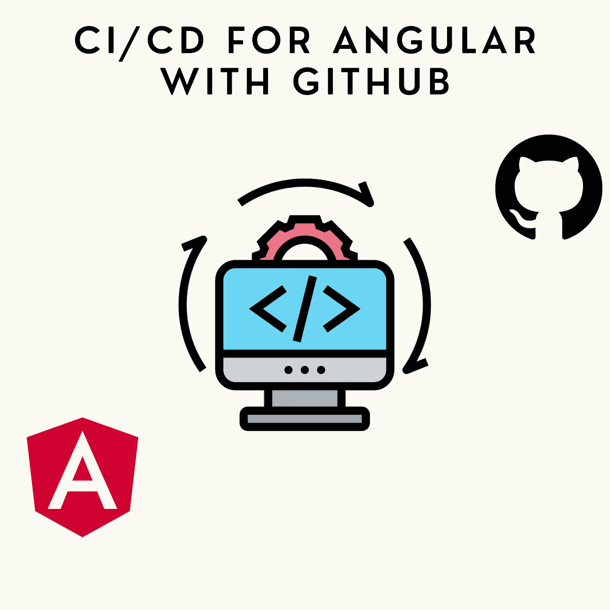
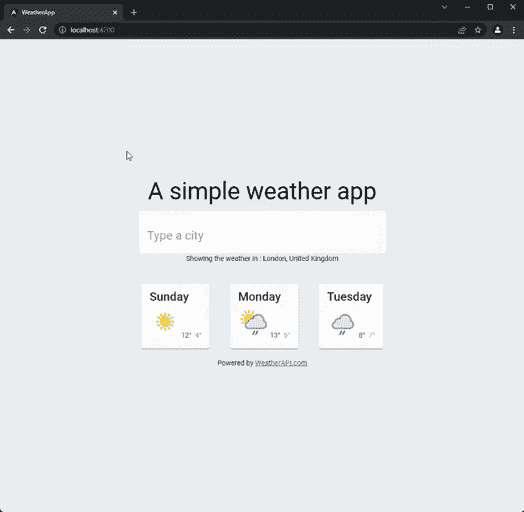
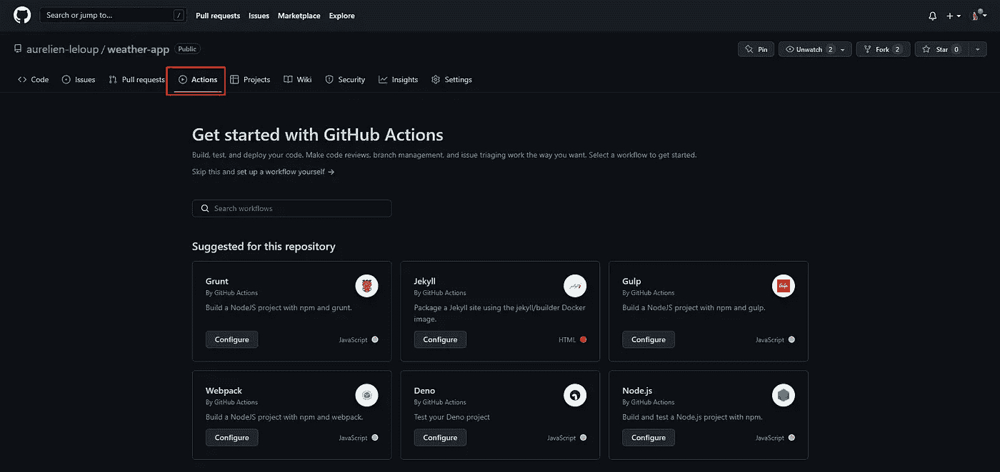
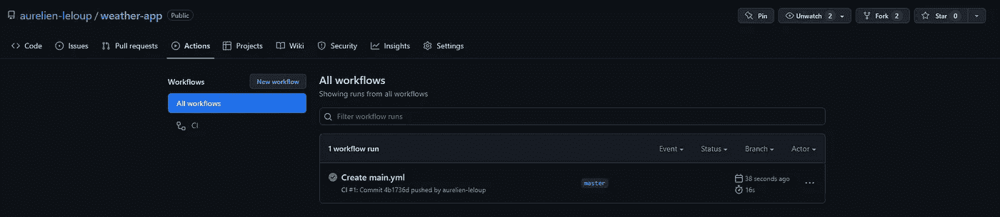
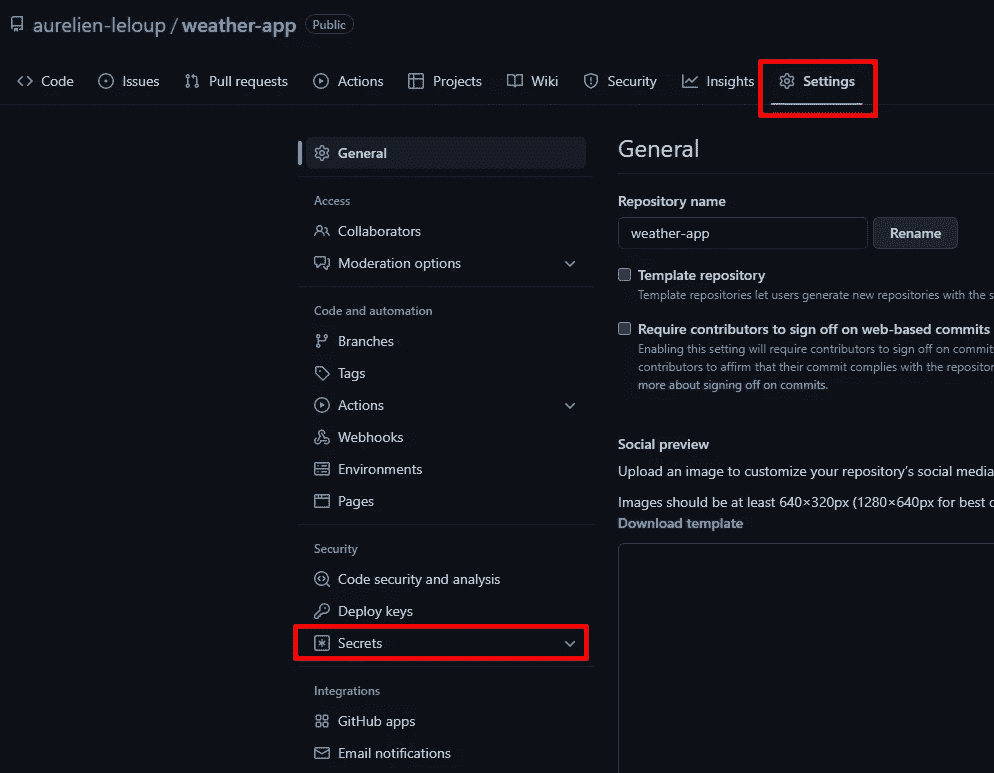
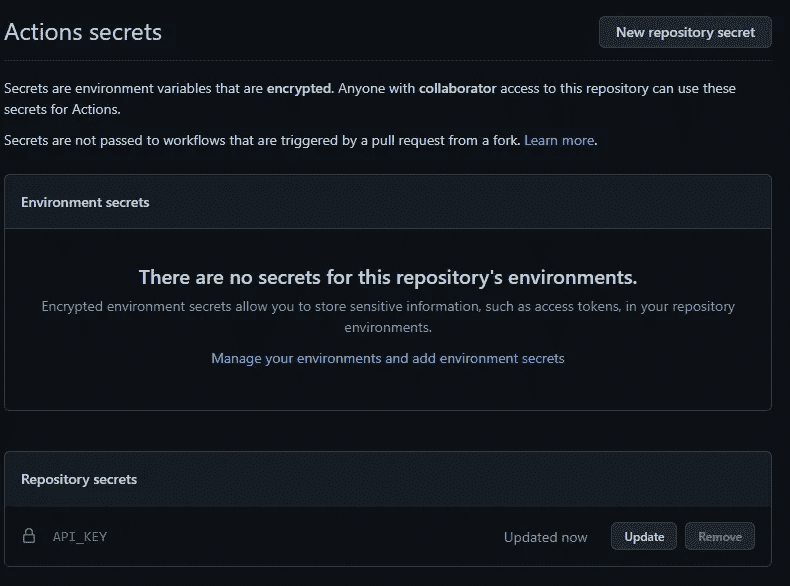
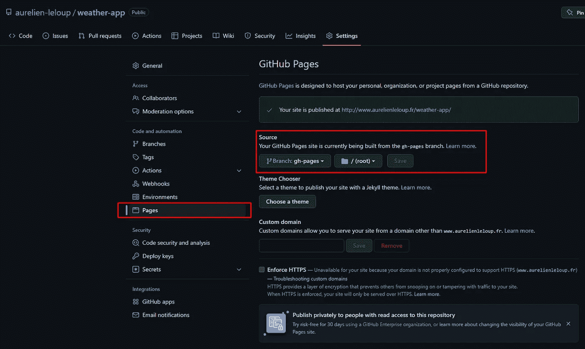
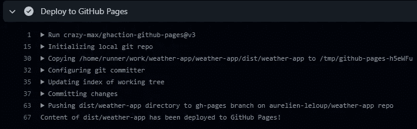

# 如何直接从 GitHub 构建和部署 Angular 应用程序

> 原文：<https://betterprogramming.pub/how-to-build-and-deploy-an-angular-application-directly-from-github-a0aa5f28e6aa>

## 通过 GitHub 动作和 GitHub 页面轻松实现升级和运行的 CI/CD

作者图片

如今，拥有一个用于持续集成和部署的可靠工作流是强制性的。无论您是单独工作还是作为团队的一员，拥有自动构建、检查和部署项目的能力可以节省大量时间。市场上为 Angular 构建配置项的选择如此之多，不可能面面俱到。

在本文中，我们将简单地关注使用 GitHub 提供的工具做每一件事。如果您已经在使用 GitHub 来版本化您的项目，您可能会有兴趣充分利用它的潜力。

我将构建并部署一个我在上一篇文章中使用过的简单天气应用程序。

# 步骤 1:初始化 GitHub 动作

要初始化 CI 的工作流，只需转到您的存储库主页并单击 actions。

正如你所看到的，GitHub 会建议一些预定义的工作流，这取决于你的库中代码的性质。我们将手动构建工作流，因此我们可以对每个步骤进行注释。(文章末尾提供了完整的最终文件)

点击“自行设置工作流程”后，您将看到一个基本的 hello world 类型的工作流程。工作流以一个具有特定语法的`.yml`文件的形式出现。每一行都有一个注释解释它为什么在这里。我们可以保持文件不变，然后单击提交。

现在，如果您返回到“操作”选项卡，您的工作流应该已经成功执行。

CI 配置文件现在存储在项目中的`/.github`文件夹下。

# 步骤 2:设置和安装依赖项

首先，我们需要决定何时触发工作流。我决定每次有人推 T2 分行时就触发它。在我的例子中，这非常有意义，因为我的工作流将构建和部署我的项目。您可以选择为每个 pull 请求触发，或者甚至使用正则表达式来匹配分支名称。

我的文件的开头是这样的:

接下来，我们来准备实际工作。我们需要:

*   查看项目源代码
*   设置 node.js
*   安装依赖项

*   `jobs`是开始一项工作的语法。一个工作流可以包含任意数量的作业。
*   `build-and-deploy`是这项工作的名称。你可以把任何东西放在这里。
*   `runs-on`是您决定工作平台的地方。我选择了 Ubuntu，但由于我们将主要使用`npm`,我们可以在这里选择任何东西。
*   `uses`是导入外部动作的语法
*   `run`简单地运行一个命令

我使用提供的`cache`参数设置 Node.js。这将缓存和恢复依赖项，从而缩短构建时间。需要注意的是，它不会缓存整个`node_modules`文件夹。因此，我可以使用`npm ci`命令。

# 第三步:检查角度项目

设置完成后，我们现在可以执行几项检查，以确保在实际构建之前项目质量良好。对于这个例子，我们将执行最常见的检查:林挺项目和运行单元测试。

安装节点后，事情变得非常简单:

在 CI 上 lint 项目之前，您需要在本地计算机上至少运行一次该命令。它将触发 lint 配置并将所需的文件添加到您的项目中。

为了测试我的应用程序，您可能已经注意到我没有直接使用默认配置中的`npm run test`命令。相反，我专门为配置项创建了一个脚本:

*   我把浏览器切换到 Chrome 的无头版本。没有必要为配置项打开浏览器窗口，因为我们无论如何也看不到它。
*   我将`watch`属性设置为 false。如果不这样做，该命令将永远不会结束，因为它将监视代码中的更改。您的工作总是会因为超时而失败。
*   我还添加了`code-coverage`属性来显示代码覆盖率报告。

# 步骤 4:构建角度项目

我们的项目通过了所有的检查。太好了！现在是时候建造它了。

在实际这样做之前，可以有一个可选的额外步骤。在我的示例项目中，我通过他们提供给我的 API 键来使用天气 API。但是，如果你进入我的`environment.prod.ts`文件，在那里的关键应该是，这是你看到的:

钥匙不在那里。即使它是一个免费的 API，在存储库中暴露秘密也是一个不好的做法，我希望尊重这个原则。但是现在，我们如何建立这个项目呢？

首先，我们需要将实际的密钥存储在一个安全的位置。转到您的存储库设置，并点击秘密。

然后，您可以添加新的存储库密码。给它一个明确的名称，因为您以后会需要它。

回到工作流文件，我们必须添加一个步骤，用正确的值替换占位符值。市场上有很多提供这种服务的行为。我选了这个。

在我的环境文件中，我小心地将我的值放在大括号中，以便插件更容易找到它。在这种情况下，`SECRET_API_KEY`是将被替换的令牌的名称，`API_KEY`是秘密的标识符。

要构建项目，我只需运行以下代码:

我通过添加`— deploy-url` 参数为配置项创建了一个特定的脚本。这在下一步中是有意义的。

# 步骤 5:将 Angular 项目部署到 GitHub 页面

GitHub 页面直接从 GitHub 提供静态托管。它非常适合个人页面、项目文档，甚至是托管一个小的 Angular 应用程序。

我们需要创建一个分支来存储项目的编译版本。这个分支将直接反映 GitHub 页面上部署的内容。你想怎么叫都行。

但是，`gh-pages`是 GitHub 认可的标准名称。一旦您创建并推送了这个分支，您就可以检查部署是否工作了。

在您的存储库设置中，单击页面。分支`gh-pages`应该已经被自动检测和部署了。

我使用一个自定义域名来托管我的 GitHub 页面，我不会在本教程中介绍如何做。默认的 URL 应该是这样的`http://<github_username>.github.io/<repository_name>`

您的项目将部署在子文件夹中。这就是为什么我们之前设置的`deploy-url`属性很重要。构建需要从正确的途径服务资产。

上面说你的网站发表了，但是还没有结束！如果您从`master`创建了分支，那么您只需要部署一个 Angular 应用程序的源代码。它不能这样使用。我们需要部署我们在前面的步骤中生成的构建。

让我们回到工作流文件并添加最后一步。

这个动作只是将`dist`文件夹的内容复制到我们之前创建的分支，自动触发部署到 GitHub 页面。您可以在配置项的日志中看到它的工作情况。

恭喜你！现在，您已经为 Angular 项目准备了一个简单的 CI，以及一个要展示的已部署版本。

# Angular 文件的完整 CI / CD

这是最终的工作流文件。你可以在这里访问完整的库[。](https://github.com/aurelien-leloup/weather-app)

谢谢你看完这篇文章！我最近才开始钻研 GitHub 动作的特性。我惊讶于它是如此的好和简单。

因此，我将继续使用它，我鼓励你也这样做。