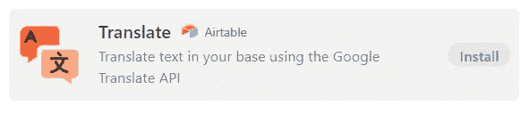
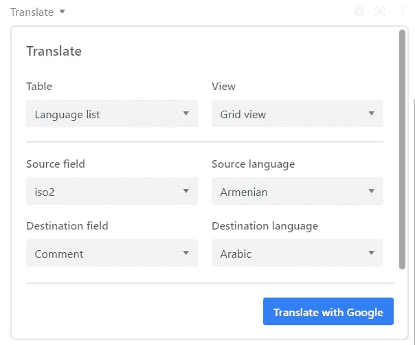
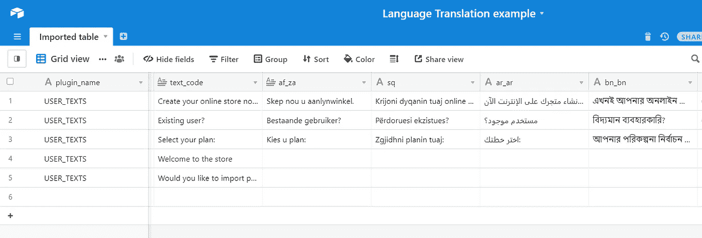
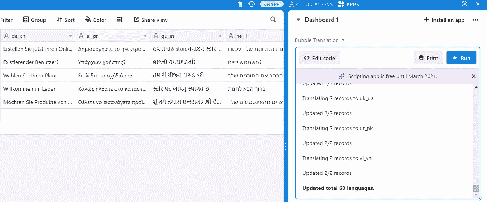

# 如何用飞行积木建造巴别塔

> 原文：<https://betterprogramming.pub/how-to-build-babel-tower-out-of-airtable-blocks-b3af7d2d36d2>

## 使用 Airtable、Google 翻译 API 和一点 JavaScript，大规模本地化您的应用程序、网站和电子邮件


照片由来自[佩克斯](https://www.pexels.com/photo/man-drawing-on-floor-2927599/?utm_content=attributionCopyText&utm_medium=referral&utm_source=pexels)的[达莉亚·桑尼科娃](https://www.pexels.com/@dariabuntaria?utm_content=attributionCopyText&utm_medium=referral&utm_source=pexels)拍摄

在一个日益全球化的世界里，你的产品，不管是什么样的形式，都会接触到越来越多的说外语的人。与此同时，翻译算法的进步和 Google Translate 等工具的易用性使得用户/消费者对母语服务的期望越来越高。

这篇文章的根源和其中的解决方案源于我自己需要将我的 MVP 应用程序(在无代码构建器 [Bubble.io](http://bubble.io) 中为了速度而开发)翻译成多种语言，最好是免费的。

我想把我的应用程序翻译成两种语言。我最终得到了 60 分，因为真的没有额外的语言要求。我需要翻译我的应用程序中的短语，但你可以使用下面的方法和代码来翻译网站内容、电子邮件或文档段落。

在本文的底部，您可以找到一个脚本供您复制粘贴和修改。

# 为什么要用 Airtable 和 Google 翻译？

让我们先把职业选项排除在外。

## 人类

大概寻找任何语言翻译的最快方法就是去 Upwork.com[看看，那里有任何语言的大量候选人。你肯定会发现各种价位的人才。稍加努力，你可以掌握三到五种语言，但达到 60 种肯定是一个挑战。仅仅是向这么多分包商解释你的任务所涉及的大量沟通就成了一个大麻烦。](http://Upwork.com)

如果你愿意为节省你的时间付费，谷歌搜索一家翻译公司会得到大量的结果。收取额外费用，这些机构将管理翻译并提供最终产品。像选择任何机构一样，这需要在雇佣前进行大量的调查评估。

## Localize.js

帮助你管理网站和应用程序翻译过程的最受认可的工具之一是 [Localize.js](http://Localize.js) 。该服务不仅提供了与您的代码的集成，以处理在正确的位置显示正确的短语，而且还有助于管理翻译后端。

Localize 在 Bubble 中有一个现成的插件，所以我希望在这里有一个流畅的无代码体验。如果插件不成熟，只允许选择一些流行的语言，而没有我真正需要的语言，这种情况可能会发生。最重要的是，最低的计划从 50 美元/月开始，Localize 更倾向于 pro 项目，而不是本质性的 MVP 测试。

## 谷歌翻译 API 和 Airtable 来拯救

我们都嘲笑谷歌的机器翻译结果。然而，很难承认，如今大多数时候，算法都非常接近。纠正谷歌翻译的错误也比从头开始写要容易得多。

为什么[气台](http://airtable.com)？部分是因为我最近没有建立一个没有某种形式的 Airtable 参与的项目。然而，主要是因为它提供了:

*   翻译内容的数据管理(优于电子表格)
*   评论和跟踪变化的能力
*   使用 Airtable 脚本应用程序添加 JavaScript 代码的简单方法
*   易于使用的 API 连接

# 现有 Airtable 翻译模块

除了类似电子表格的数据视图， [Airtable](http://airtable.com) 还提供了安装应用程序的能力，这些应用程序提供了额外的功能，如数据修改、图表、甘特图和[等等](https://airtable.com/marketplace)。

你还可以找到一个翻译应用，由 Airtable 发布，它基于 Google Translate API，朝着我们感兴趣的方向发展。



[Airtable Marketplace](https://airtable.com/marketplace) 中现成的翻译应用

## 获取 Google API 密钥

不管你是继续使用 Airtable 标准翻译应用程序还是我们下面的自定义代码，你都需要获得自己的 Google 翻译 API 密钥。准确的说，我们这里指的是[云翻译——基础 API](https://cloud.google.com/translate#section-4) 。

这个过程非常简单。

1.  在[谷歌云](https://cloud.google.com/)注册一个账号。
2.  转到[谷歌云平台控制台](https://console.cloud.google.com/)并创建一个新项目(或使用现有项目)。
3.  在[计费页面](https://console.cloud.google.com/billing)上，为您的项目添加付款方式，以启用计费。
4.  免费层将允许你每月免费翻译 50 万字。除此之外，翻译 API 的成本是每一百万个翻译字符 20 美元。你可以[在这里](https://cloud.google.com/translate#section-4)阅读详情。
5.  转到[云翻译 API 页面](https://console.cloud.google.com/apis/library/translate.googleapis.com)启用它并将其添加到您的项目中。在[凭证页面](https://console.cloud.google.com/apis/credentials)上，创建一个 API 密钥并将其粘贴到翻译应用程序的输入字段中。

## 如何使用翻译应用程序及其缺点

整理好 API 代码后，Airtable Translate app 的使用就相当直观了。选择包含翻译短语的表格后，您需要确定源和目的地的位置和语言。



用于选择和翻译语言的 Airtable 翻译应用程序菜单

该应用程序易于操作，但如果你需要对多种语言重复这一操作，很快就会变得费力。还有两个更明显的缺点:

*   该应用程序翻译列中的所有内容并覆盖目标列中的所有内容。您在“目标”栏中所做的任何手动更改都将丢失。这种方式还会浪费先前翻译的短语的积分。
*   Airtable 应用程序仅适用于 Pro 计划。如果你是在免费或甚至 Plus 计划，这个功能是你力所不及的。然而，所有的 Airtable 计划都提供一个脚本应用程序(免费到 2021 年 3 月)。这将是我们将在下面使用的工具。

# 您自己的超级翻译脚本应用程序

Airtable 脚本应用程序(以前称为脚本块)允许您在 Airtable 中执行 JavaScript 代码。内置的依赖项允许轻松访问您的基本记录，并提供一些简单的 UI 元素，如输入字段。

## 充气台基础结构

my base 中的列结构遵循[气泡](http://Bubble.io)语言翻译 CSV 导出文件所使用的列名。这意味着一些列只与 Bubble 应用程序相关(如 plugin_name)，但核心结构是通用的。应该有一个包含要翻译的源文本的列(可以是任何语言)，在我们的例子中命名为 text_code。第二个要点是，对于每种目标翻译语言，都应该有一个以语言代码作为列名的列。



Airtable base 的示例设置，在列名中使用语言作为区域设置代码

在我的例子中，列名包含浏览器提供的一个[地区代码](https://www.w3.org/International/articles/language-tags/)。该地区遵循一个叫做 [BCP 47](https://www.techonthenet.com/js/language_tags.php) 的标准；但是，你需要为 Google Translate API 提供的只是两个字母的 ISO 代码。

无需过多赘述，BCP 47 的标识符以两个字母的 ISO 639-1 代码开始。

```
de-DE  <== BCP 47 language tag
de     <== ISO 639-1 code
```

这意味着你也可以使用 ISO 代码(de，es，fr 等。)作为列名。

## 代码

在仪表板中安装新的脚本应用程序后，删除其中的任何示例代码，并复制粘贴以下代码:

将此代码复制粘贴到您的脚本应用程序中，并按照说明进行修改

## 调整脚本

我使用脚本将英语内容翻译成其他语言，但是您可以轻松地将源语言更改为任何其他语言。只需更改用作源的语言代码。

```
//select source langauge using ISO 2 letter code
let source = "en";
```

下一步是填写您的 Google Translate API 代码(您可以从本文前面的免费说明中获得)。

```
// Translate API key
let key="YourAPIcodeHere";  // <= change your API here
```

该脚本将表中的所有列视为语言目标源(以列名作为目标语言)。任何应该排除在外的列，比如 text_code(包含要翻译的源文本)都需要明确指出。

```
// Get language list from columns
let fields = [];
for (let field of table.fields) {
    if (field.name !== "plugin_name" && field.name !== "text_name"
     && field.name !== "text_code"  ){
         fields.push(field.name);
    }
}
```

我还排除了一些 Bubble 需要的技术列，但是您也可以想象创建像“Last Modified”或“Last modified by”这样的支持列，它们也应该被排除。

因为我要将地区代码转换成 ISO 代码，所以我在第 59 行添加了一个`split()`方法来提取字符串的第一部分。如果您使用 ISO 代码，此方法可能没有必要。

```
let target = field.split("_")[0];  // changing locale ( BCP 47 ) to  ISO 639-1
```

或者

```
let target = field; // if using 2 ISO codes as column name
```

## 运行脚本

一旦代码和调整就绪，您只需按下 Run 按钮并选择正确的表。



在短短几秒钟内翻译成 60 种语言！

脚本块将为您提供一些进程的运行统计数据，以及处理的语言总数。

该脚本将只更新每一列中的空字段，因此任何现有的翻译都不会被修改。

# 最后的想法

上述设置会取代专业翻译解决方案吗？不。它会给你一个难以置信的简单方法来产生大量翻译成谷歌能处理的尽可能多的语言吗？是的。

额外的好处还在于，您现在可以让人工编辑在专用视图上修改翻译(您可以想象为每个语言短语添加一个复选框列)，并通过 Airtable API 实时访问这些翻译数据，以便在其他系统中使用。

我当然希望这个设置能帮助你的应用程序获得多语言功能！

# 资源

1.  [Airtable 翻译应用](https://gist.github.com/gregonarash/fa233fcd59d6284c66147eaec4c225c4) —本文中翻译应用的源代码
2.  [Bubble](https://bubble.io/blog/get-started/)入门——更多关于为什么你应该尝试无代码应用构建的信息
3.  [Airtable 脚本应用](https://blog.airtable.com/introducing-scripting-block/)介绍——为什么无代码仍然可以使用一些 JavaScript
4.  关于谷歌翻译 API 的一切——如果你想探索高级 API 的更多信息