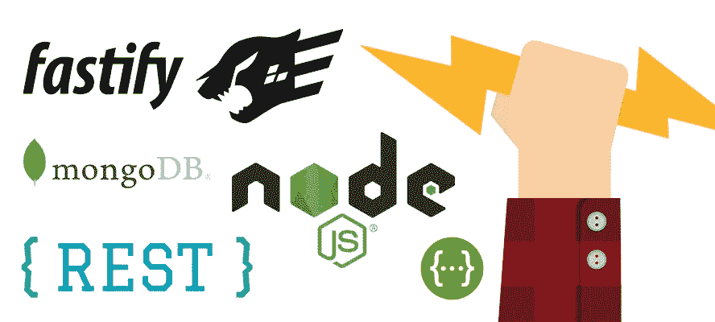
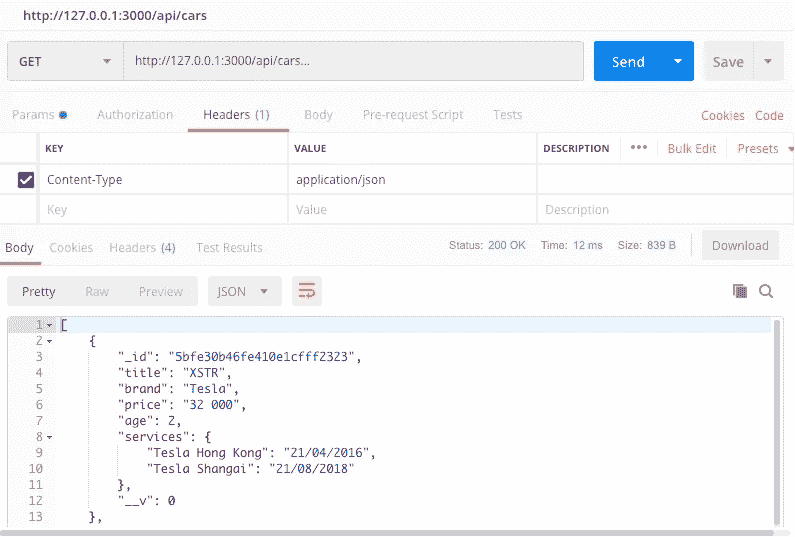
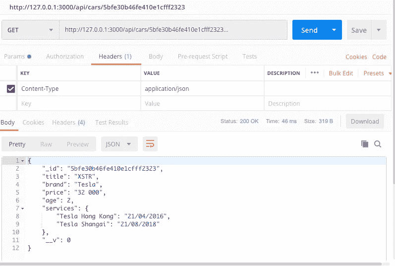
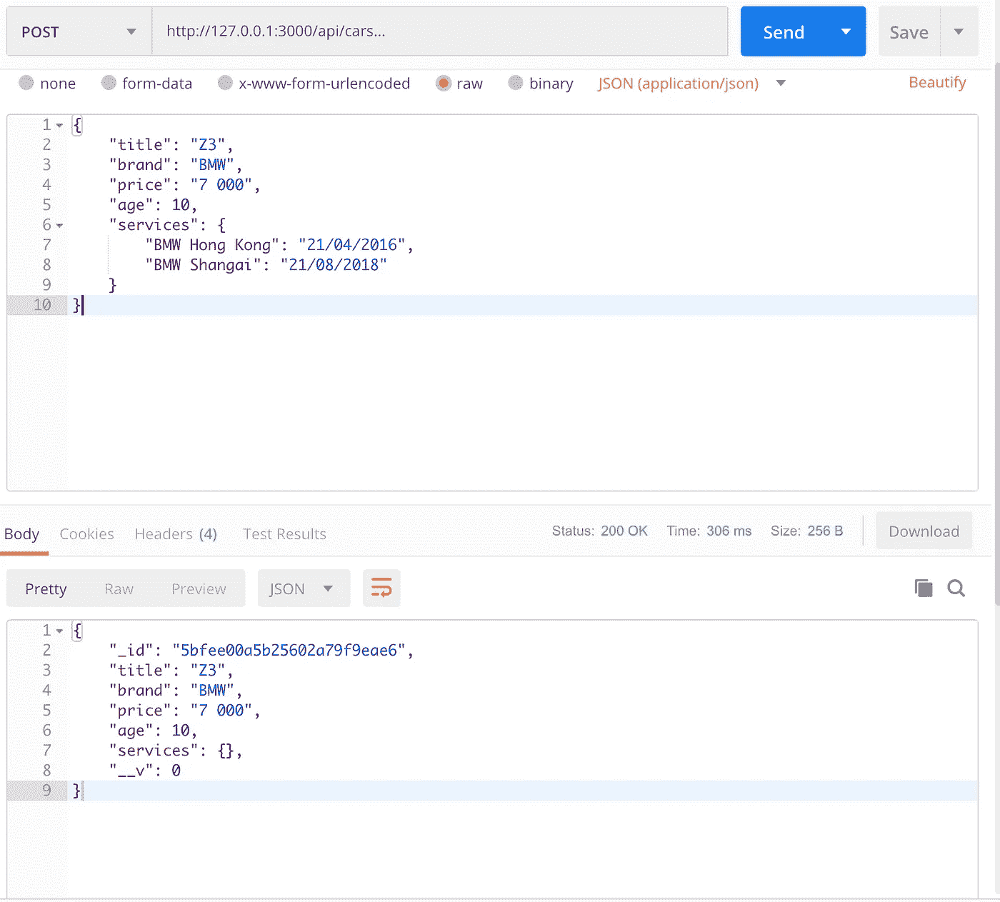
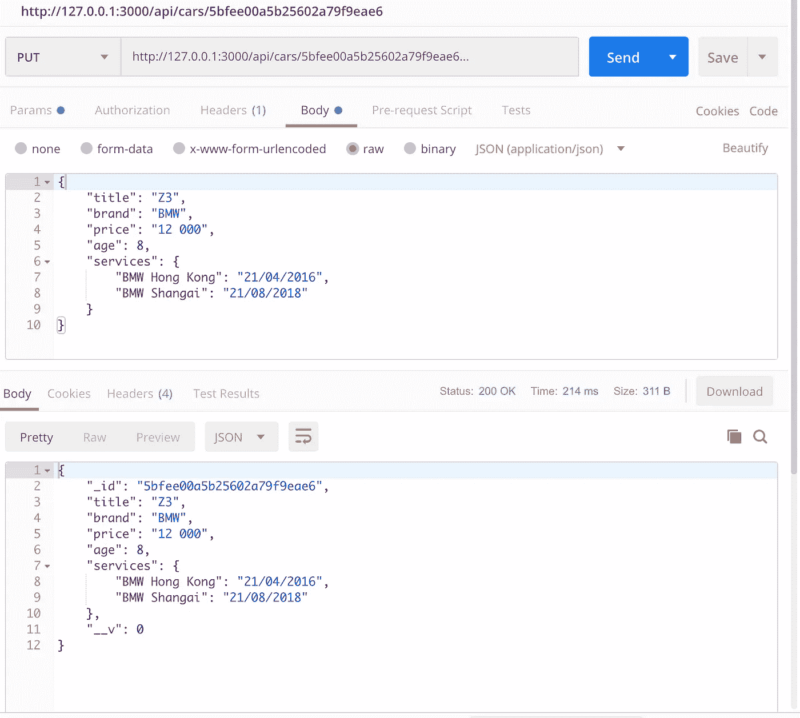
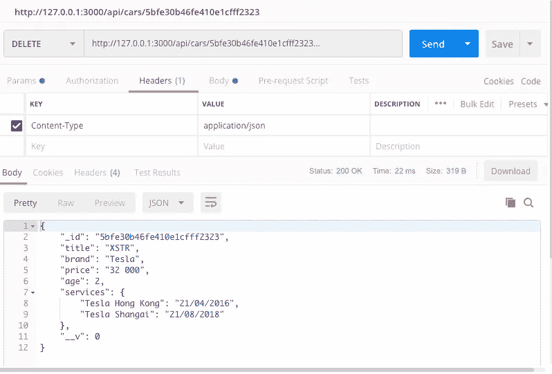
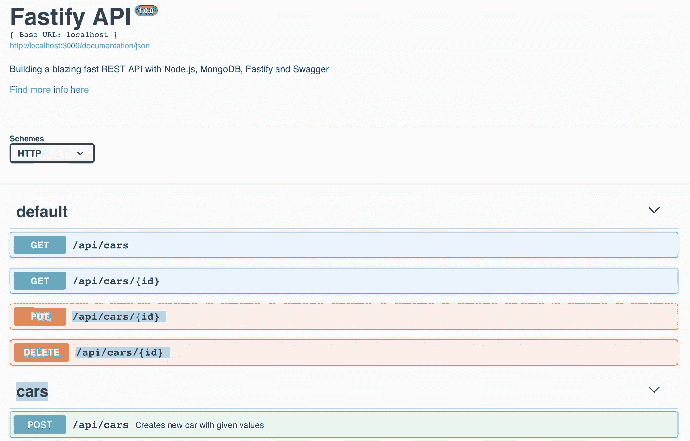

# 如何用 Node.js、MongoDB、Fastify 和 Swagger 构建超快的 REST APIs

> 原文：<https://betterprogramming.pub/how-to-build-blazing-fast-rest-apis-with-node-js-mongodb-fastify-and-swagger-114e062db0c9>

## 循序渐进的教程



图片来源:[由 Dooder](https://www.freepik.com/free-vector/hand-with-a-pencil-with-lightning-shape_901992.htm) 设计

想必没有一个 web 开发人员对 REST APIs 和设计一个有效的 API 解决方案所带来的挑战是陌生的。

这些挑战包括:

*   速度。(API 响应时间。)
*   文档。(清晰简洁的文档，描述 API。)
*   建筑和可持续性。(可维护和可扩展的代码库。)

在本教程中，我们将使用 Node.js、[、MongoDB](https://www.mongodb.com/) 、 [Fastify](https://www.fastify.io/) 和 [Swagger](https://swagger.io/) 的组合来解决上述所有问题。

该项目的源代码可以在 [GitHub](https://github.com/siegfriedgrimbeek/fastify-api) 上获得。

# 在开始之前

你应该有初级到中级的 JavaScript 知识，听说过 Node.js 和 MongoDB，知道什么是 REST APIs。

以下是让您了解最新情况的一些链接:

*   [JavaScript](https://developer.mozilla.org/bm/docs/Web/JavaScript)
*   [Node.js](https://codeburst.io/the-only-nodejs-introduction-youll-ever-need-d969a47ef219)
*   [MongoDB](https://docs.mongodb.com/manual/introduction/)
*   [REST API](https://restful.io/an-introduction-to-api-s-cee90581ca1b)

## 我们将使用的技术

*   [加速](https://www.fastify.io/)
*   [猫鼬](https://mongoosejs.com/)
*   [大摇大摆](https://swagger.io/)

最好在新标签页中打开以上页面，以便于参考。

## 您需要安装以下软件

*   [Node.js/npm](https://nodejs.org/en/)
*   [MongoDB](https://docs.mongodb.com/manual/installation/)
*   [邮递员](https://www.getpostman.com/)

你还需要一个 [IDE](https://ourcodeworld.com/articles/read/200/top-7-best-free-web-development-ide-for-javascript-html-and-css) 和一个终端我用的是 Mac 的 [iTerm2](https://www.iterm2.com/) 和 Windows 的 [Hyper](https://hyper.is/) 。

# 我们开始吧


通过打开终端并执行以下代码行来初始化一个新项目:

```
mkdir fastify-api
cd fastify-api
mkdir src
cd src
touch index.js
npm init
```

在上面的代码中，我们创建了两个新目录，导航到它们，创建了一个`index.js`文件，并通过 [npm](https://www.npmjs.com/) 启动了我们的项目。

初始化新项目时，系统会提示您输入几个值，您可以将这些值留空，稍后进行更新。

一旦完成，就会在`src`目录中生成一个`[package.json](https://alligator.io/nodejs/package-json/)`文件。在此文件中，您可以更改项目初始化时输入的值。

接下来，我们安装我们将需要的所有依赖项:

```
npm i nodemon mongoose fastify fastify-swagger boom
```

下面是对每个软件包功能的简要描述，引自它们各自的网站:

## **节点门**

> nodemon 是一个工具，通过在检测到目录中的文件更改时自动重新启动节点应用程序，来帮助开发基于 Node.js 的应用程序。
> 
> nodemon 不需要*对你的代码或者开发方法做任何*额外的修改。nodemon 是`node`的替换包装器，在执行脚本时使用`nodemon`替换命令行上的单词`node`。

为了设置 [nodemon](https://github.com/remy/nodemon) ，我们需要将下面一行代码添加到脚本对象中的`package.json`文件中:

```
“start”: “./node_modules/nodemon/bin/nodemon.js ./src/index.js”,
```

我们的`package.json`文件现在应该如下所示:

package.json

## **猫鼬**

> mongose 提供了一个直接的、基于模式的解决方案来为你的应用数据建模。它包括内置的类型转换、验证、查询构建、业务逻辑挂钩等等。

## 固定化

> Fastify 是一个高度专注于以最少的开销和强大的插件架构提供最佳开发体验的 web 框架。它的灵感来自哈比神和 Express，据我们所知，它是目前最快的 web 框架之一。

## **fastify-swagger**

> 用于 Fastify 的 [Swagger](https://swagger.io/) 文档[生成器](https://github.com/fastify/fastify-swagger)。它使用您在路由中声明的模式来生成 swagger 兼容文档。

## **吊杆**

> [boom](https://github.com/hapijs/boom) 提供了一套返回 HTTP 错误的实用程序。

# 设置服务器并创建第一条路由


将以下代码添加到您的`index.js`文件中:

索引. js

我们需要 Fastify 框架，声明我们的第一个路由，并在`port 3000`上初始化服务器，代码很简单，但请注意初始化 Fastify 时传递的 options 对象:

```
// Require the fastify framework and instantiate it
const fastify = require('fastify')({
  logger: true
})
```

上面的代码启用了 Fastify 的内置记录器，默认情况下是禁用的。

现在，您可以在终端的`src`目录中运行以下代码:

```
npm start
```

现在，当您导航到 [http://localhost:3000/](http://localhost:3000/) 时，您应该看到返回的`{hello:world}`对象。

我们将回到`index.js`文件，但现在，让我们继续设置我们的数据库。

# 启动 MongoDB 并创建模型


成功安装 MongoDB 后，您可以通过运行以下命令打开一个新的终端窗口并启动一个 MongoDB 实例:

```
mongod
```

使用 MongoDB，我们不需要创建数据库。我们只需在设置中指定一个名称，一旦我们存储了数据，MongoDB 就会为我们创建这个数据库。

将以下内容添加到您的`index.js`文件中:

```
...// Require external modules
const mongoose = require('mongoose')// Connect to DB
mongoose.connect(‘mongodb://localhost/mycargarage’)
 .then(() => console.log(‘MongoDB connected…’))
 .catch(err => console.log(err))...
```

在上面的代码中，我们需要 Mongoose 并连接到我们的 MongoDB 数据库。数据库名为`mycargarage`，如果一切顺利，您将在终端上看到`MongoDB connected...`。

请注意，由于我们之前添加的`Nodemon`包*，您不必重启应用程序。*

现在我们的数据库已经建立并运行了，我们可以创建我们的第一个模型了。在`src`目录下创建一个名为`models`的新文件夹，在其中创建一个名为`Car.js`的新文件，并添加以下代码:

上面的代码声明了我们的`carSchema`，它包含了与我们的汽车相关的所有信息。除了两个明显的数据类型:`String`和`Number`。

我们还使用了一个对猫鼬来说相对较新的`Map`，你可以在这里阅读更多关于它的内容。然后，我们导出我们的`carSchema`以在我们的应用程序中使用。

我们可以继续在`index.js`文件中设置我们的路线、控制器和配置，但是本教程的一部分是演示一个可持续的代码库。因此，每个组件都有自己的文件夹。

# 创建汽车控制器

为了开始创建控制器，我们在`src`目录中创建一个名为`controllers`的文件夹，并在该文件夹中创建一个`carController.js`文件:

汽车控制器. js

以上内容可能看起来有点难以理解，但实际上非常简单。

*   我们需要 *boom* 来处理我们的错误:`boom.boomify(err)`。
*   我们导出将在我们的路由中使用的每个函数。
*   每个函数都是一个`async` 函数，其中可以包含一个`await`表达式，该表达式暂停`async`函数的执行并等待传递的承诺的解析，然后恢复`async`函数的执行并返回解析后的值。点击此处了解更多信息。
*   每个函数都包装在一个`try` / `catch`语句中。在此了解更多信息。
*   每个函数都有两个参数:`req`(请求)和`reply`(回复)。在我们的教程中，我们只使用请求参数。我们将使用它来访问请求体和请求参数，从而允许我们处理数据。[在此了解更多信息。](https://www.fastify.io/docs/latest/Reply/)
*   注意第 31 行的代码:
    `const car = new Car({ …req.body })`
    这使用了 JavaScript spread 操作符。[点击此处了解更多信息。](https://developer.mozilla.org/en-US/docs/Web/JavaScript/Reference/Operators/Spread_syntax)
*   注意第 42 行的代码:
    `const { …updateData } = car`
    这使用了 JavaScript 析构，结合了 spread 操作符。点击此处了解更多信息。

除此之外，我们使用一些标准的 mongose**特性来操作我们的数据库。**

**您可能正在燃烧以启动您的 API 并进行健全性检查，但在我们这样做之前，我们只需要将控制器连接到路由，然后，最后，将路由连接到应用程序。**

## **创建和导入路线**

**同样，我们可以从在项目的根目录下创建一个文件夹开始，但是这一次，它被称为`routes`。在该文件夹中，我们用以下代码创建了一个`index.js`文件:**

**索引. js**

**这里，我们需要我们的控制器，并将我们在控制器中创建的每个功能分配给我们的路由。**

**如您所见，每个路由都由一个方法、一个 URL 和一个处理程序组成，指示应用程序在访问其中一个路由时使用哪个函数。**

**跟随某些路线的`:id`是向路线传递参数的常见方式，这将允许我们如下访问`id` :**

**`[http://127.0.0.1:3000/api/cars/5bfe30b46fe410e1cfff2323](http://127.0.0.1:3000/api/cars/5bfe30b46fe410e1cfff2323)`**

## **将所有这些放在一起并测试 API**

**既然我们已经构建了大部分部分，我们只需要将它们连接在一起，开始通过我们的 API 提供数据。**

**首先，我们需要通过向主`index.js`文件添加以下代码行来导入我们创建的路线:**

```
const routes = require(‘./routes’)
```

**然后，我们需要遍历 routes 数组，用 Fastify 初始化它们。我们可以用下面的代码做到这一点，这些代码也需要添加到主`index.js`文件中:**

```
routes.forEach((route, index) => {
 fastify.route(route)
})
```

**现在我们准备开始测试了！**

**这项工作的最佳工具是 [Postman](https://www.getpostman.com/) ，我们将用它来测试我们所有的路线。我们将在请求体中以原始对象和参数的形式发送数据。**

**查找所有汽车:**

****

**寻找一辆车:**

****

**添加新车**:**

****

****服务看起来是空的，但事实上，信息确实保存在数据库中。**

**更新汽车:**

****

**删除汽车:**

****

**我们现在有了一个全功能的 API——但是文档呢？这就是 Swagger 真正得心应手的地方。**

****

## **添加招摇和总结**

**现在，我们将创建名为`config`的最终文件夹。在里面，我们将用下面的代码创建一个名为`swagger.js`的文件:**

**上面的代码是一个带有选项的对象，我们将把它传递到我们的 fastify-swagger 插件中。为此，我们需要将以下内容添加到我们的`index.js`文件中:**

```
// Import Swagger Options
const swagger = require(‘./config/swagger’)// Register Swagger
fastify.register(require(‘fastify-swagger’), swagger.options)
```

**然后，在初始化 Fastify 服务器后，我们需要添加以下代码行:**

```
...
await fastify.listen(3000)
fastify.swagger()
fastify.log.info(`listening on ${fastify.server.address().port}`)
...
```

**就是这样！如果您现在导航到[http://localhost:3000/documentation](http://localhost:3000/documentation)，您应该会看到以下内容:**

****

**就这么简单！现在，您拥有了可以自我更新的 API 文档，它将与您的 API 一起发展。您可以轻松地将附加信息添加到您的路线中，点击此处查看更多。**

# **下一步是什么**

**现在我们已经有了一个基本的 API，可能性是无限的。它可以作为任何可以想象的应用程序的基础。**

**在下一个教程中，我们将集成 [GraphQL](https://graphql.org/) ，并最终将前端也与 Vue.js 集成在一起！**