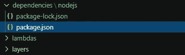
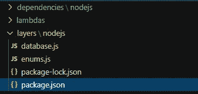

# 如何构建这两种 AWS Lambda 层。(是的，有两个)

> 原文：<https://betterprogramming.pub/how-to-build-both-kinds-of-aws-lambda-layers-yes-there-are-two-edb945979f17>

## 你知道兰姆达斯像食人魔吗？他们有层次。了解如何以最简单的方式跨无服务器函数共享代码

照片由 [C 在](https://unsplash.com/@cdrying?utm_source=medium&utm_medium=referral) [Unsplash](https://unsplash.com?utm_source=medium&utm_medium=referral) 上烘干

大约一年前，我开始了无服务器编程。我来自一个企业软件背景，有着巨大的应用程序和意大利面条一样的代码。如果我更改了一些修改 UI 的代码，有可能会影响到数据库级别的东西。呀！

我认为代码应该被重用和共享。只写一次就可以从任何地方调用它，这是有道理的。当我开始用 Lambda 构建我的第一个概念证明时，我假设我也能做同样的事情。

我在 [VS 代码](https://code.visualstudio.com/)中构建了我的解决方案，每个 Lambda 都在它自己的文件夹中，所有基类和可重用函数都在一个共享文件夹中。

在我的本地机器上运行良好。当我按下部署键时，一切都乱套了。

什么都没用。到处都有“找不到方法”的异常。我开始认为云开发可能不像大家说的那么容易。

当您将 Lambda 函数部署到云中时，它必须绑定所有的依赖项。如果您使用 [AWS SAM](https://aws.amazon.com/serverless/sam/) ，它会获取 Lambda 的根文件夹中包含的所有内容。就这些，没别的了。

共享依赖项不存在于根文件夹中，它们存在于共享文件夹中，因此所有功能都可以通过相同的路径访问它们。我该怎么解决这个问题？

# 你有选择

由 [Kelly Sikkema](https://unsplash.com/@kellysikkema?utm_source=medium&utm_medium=referral) 在 [Unsplash](https://unsplash.com?utm_source=medium&utm_medium=referral) 上拍摄的照片

有三种方法可以解决这个问题:

*   在每个需要的 lambda 目录中复制代码
*   创建一个包(npm、nuget、PyPi)并作为依赖项安装
*   使用 Lambda 层

我们不会讨论第一种选择。它之所以在那里，是因为从技术上来说，它是问题的解决方案，但它是不可扩展的。一点也不。

创建一个包并不是一个坏主意。如果您需要跨微服务共享代码，这实际上是一个非常好的想法。如果你只是在同一个微服务中共享代码，这可能有点过头了。然而，如果你想让你的代码开源并与世界共享，我完全赞成！

我们今天在这里讨论第三种选择:Lambda 层。一个*层*仅仅是位于你的主要 Lambda 函数旁边的另一束代码。它们是可重用的块，可以在任意多的 Lambdas 上共享，甚至可以跨帐户共享。

# 两种类型的层

信不信由你，实际上有两种不同类型的层。从技术上来说，只有一个，如果您查看部署的资源类型。但是在实践中，层有两种非常不同的用例。

## 依赖层

严格来说，依赖层是一个包含 Lambda 函数的第三方依赖的包。很多软件包都很大，需要一段时间来加载，并且会增加你的函数代码。通过将所有的依赖转移到一个共享的 Lambda 层，您可以卸载大部分的部署包，保持您的功能代码集中和简洁。

## 功能层

这是我最初的图层用例。如果您想在多个函数之间共享代码，该怎么办？开发人员已经过了编写代码的潮湿(“我们喜欢打字”)时代。如果我们能写一次函数并在所有的 Lambdas 中访问它，那就太好了。这样，如果我们需要在一段可重用的代码中更改某些东西，我们可以在一个地方更改它，它会在任何地方更新。呜哇！

# 开发商搭车

由[阿尔瓦罗·雷耶斯](https://unsplash.com/@alvaroreyes?utm_source=medium&utm_medium=referral)在 [Unsplash](https://unsplash.com?utm_source=medium&utm_medium=referral) 上拍摄的照片

遵循介质上的指南可能有点抽象。我在 GitHub 上提供了一个[完整的工作解决方案，请大家和我一起看一下。](https://github.com/allenheltondev/aws-lambda-layer-types)

工作实例总是对我获得解决问题的方法帮助最大。您可能想在这里暂停一下，以遵循[先决条件](https://github.com/allenheltondev/aws-lambda-layer-types/blob/master/README.md)并确保您已经设置好了。

我提供的例子是一个小型的、无服务器的 API，它管理联系人并允许你通过 [Twilio](https://www.twilio.com) 给他们发送文本消息。您可以添加、更新和删除联系人，以及发送和查看发送给每个联系人的邮件。

## 构建依赖层

如前所述，依赖层有助于保持您的部署包较小。如果您希望使用 AWS 控制台进行任何快速故障排除，这将是一个非常有用的情况。

如果 Lambda 部署包大于 3 MB，则不能在控制台中编辑代码。

因此，对于我们的 contact 示例中的依赖层，我们在根处有一个名为`dependencies` 的文件夹，以及一个名为`nodejs.` 的子文件夹。由于我们在示例中使用了[节点](https://nodejs.org/en/)，我们只需添加一个名为`nodejs`的文件夹。

对于基于运行时的所有目录名的完整列表，您可以查看 [AWS 文档](https://docs.aws.amazon.com/lambda/latest/dg/configuration-layers.html#configuration-layers-path)。

在`nodejs`文件夹中，我们只有一个`package.json`和一个`package-lock.json`。

`package.json`将只包含我们想要添加到我们的层中的依赖关系。

在我们的 SAM 模板中，我们想要添加一个`LayerVersion`并将其指向依赖目录

这就是创建依赖层的方法——非常容易实现，但不一定直观。现在来创建一个功能层。

## 构建功能层

对于这种类型的层，您可能有更多的用例，这种层使您能够在整个解决方案中提供共享代码。这个布局差不多，只是消费略有不同。

在根目录下创建一个名为`layers` > `nodejs`的文件夹结构。同样，这个子文件夹是因为我们正在使用的运行时。如果你用的是 Python，Ruby 等，那就不一样了。

添加`package.json`和任何将要包含共享代码的文件。对于我们的例子，我们有一个`database.js`和一个`enums.js`文件。

你在这个目录中添加的每个文件在你的 Lambdas 中都是一个单独的导入。这很好，因为您可以对共享代码的关注点进行合理的分离。这有助于你更有条理。

模板`yaml`中的资源声明将与依赖层相同，只是这次它将指向 layers 文件夹。

这两种类型的层的实现非常相似，唯一真正的区别是添加到层目录中的文件。这两者之间的主要区别在于它们是如何被您的函数消费的。

## 使用依赖层

要让 Lambda 使用您的层，您需要将它添加到模板`yaml`中。如果您希望您的层可用于您的微服务中的所有功能，您可以方便地将其添加到`Globals` 部分。

在您使该层对该功能可用之后，您需要将资产拉进来。有了依赖层，一切如常:只需添加您的`require` 语句就可以了。构建函数代码的方式没有变化。

## 消费功能层

这是你的发展会稍有变化的地方。功能层被部署到一个`opt`目录中，所以要获取代码，必须从`opt/nodejs/<your filename>`中获取。

您想要导入的每个文件都可以是自己的`require`语句。您还可以让文件在功能层中相互引用。您可以在解决方案的`[database.js](https://github.com/allenheltondev/aws-lambda-layer-types/blob/master/layers/nodejs/database.js)`文件中看到一个例子。

# 需要注意的事项

Lambda 层很棒，但是有一些事情需要注意。

*   **您不能在本地从另一个微服务导入层** —如果您在推入云之前在本地进行测试，您不能通过导入下载层并期望它工作。这是目前分层过程中的一个缺口。如果图层位于您正在使用的服务中，则一切正常。
*   **SAM 不构建层** —您必须在 CI/CD 管道中的每个层上手动安装 npm。SAM 将为您打包并部署一个构建层，但它不进行构建。

# 结论

层对于共享代码和降低部署包大小非常有用。与创建自己的 npm 包相比，它们的重量更轻，也更容易维护。

请记住，它们最好与您的 Lambdas 在同一个微服务中使用，文件夹结构取决于您使用的运行时。

请随意使用我提供的示例，并将其变成您自己的示例。它使用了 [Open API 3.0](https://medium.com/better-programming/you-should-open-up-that-api-youve-been-working-on-b0313a4df9bc) 和新的 [AWS HTTP API](https://medium.com/better-programming/how-to-migrate-your-rest-api-to-the-new-http-api-in-aws-2e986c326ce0) 。保持您的技能敏锐，并与 AWS 无服务器技术堆栈中的最新和最棒的技术保持同步。

#每天都变聪明