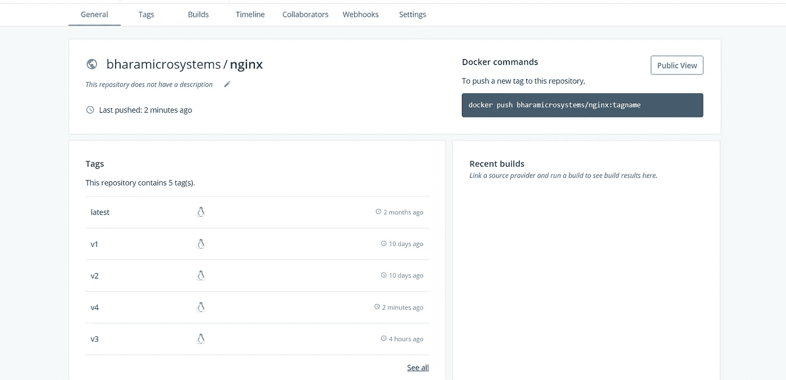
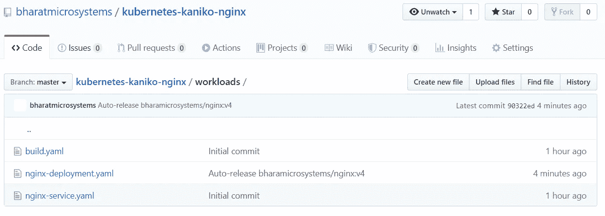

# 如何用 Kaniko 在 Kubernetes 集群中构建容器

> 原文：<https://betterprogramming.pub/how-to-build-containers-in-a-kubernetes-cluster-with-kaniko-2d01cd3242a7>

## 在 K8s 中自动构建容器，无需 Docker 守护进程


来源:[维基共享](https://commons.wikimedia.org/wiki/File:Kubernetes-Engine-Logo.svg)

传统上，组织在 Kubernetes 集群之外构建 Docker 映像。然而，随着越来越多的公司采用 Kubernetes，并且对虚拟机的需求日益减少，在 Kubernetes 集群中运行您的持续集成构建是有意义的。

在容器中构建 Docker 映像是一个安全挑战，因为容器需要访问 worker 节点文件系统来连接 Docker 守护进程。

您还需要在特权模式下运行容器。不推荐这种做法，因为它会将您的节点暴露给众多的安全威胁。大多数组织依赖持久的外部卷来存储数据，在任何情况下，容器都不应该直接访问节点文件系统。

在特权模式下运行容器是一个糟糕的想法，因为它提供了对主机的容器根访问。这给了网络犯罪分子破坏您的系统的机会，可能危及整个工作节点，而不仅仅是容器。

谷歌通过提供一个名为 [Kaniko](https://github.com/GoogleContainerTools/kaniko) 的工具解决了这个问题。Kaniko 帮助您在不访问 Docker 守护进程的情况下在容器中构建容器映像。这样，您可以在容器内执行构建作业，而无需授予对主机文件系统的任何访问权限。

您只需要创建一个构建清单作为 Kubernetes 批处理作业，并使用您选择的任何 CI 工具将它应用到集群。该作业负责构建您的映像并将其上传到指定的容器注册中心。

# Kaniko 如何工作

卡尼科:

*   读取指定的`Dockerfile`。
*   将基本映像(在`FROM`指令中指定)提取到容器文件系统中。
*   单独运行`Dockerfile`中的每个命令。
*   每次运行后，拍摄用户空间文件系统的快照。
*   每次运行时将快照层附加到基础层。

因此，Kaniko 不依赖于 Docker 守护进程。

让我们来看看它是如何工作的。

# 先决条件

确保您具备以下条件:

*   正在运行的 Kubernetes 集群，具有创建、列出、更新和删除作业、服务、pod 和机密的权限。
*   用于存储`Dockerfile`和 Kubernetes 清单的 GitHub 帐户。
*   用于托管容器映像的 Docker Hub 帐户。

# 创建容器注册表机密

让我们从设置一个容器注册表秘密开始。要推送构建的映像，需要向容器注册中心进行认证。

您将需要以下内容:

*   `docker-server`—Docker 注册服务器，您需要在其中托管您的图像。如果您使用 Docker Hub，请使用`[https://index.docker.io/v1/](https://index.docker.io/v1/)`。
*   `docker-username`—Docker 注册用户名。
*   `docker-password`—Docker 注册表密码。
*   `docker-email`—Docker 注册表上配置的电子邮件。

运行以下命令，替换上述值:

```
$ kubectl create secret docker-registry regcred --docker-server=<docker-server> --docker-username=<username> --docker-password=<password> --docker-email=<email>
```

# GitHub 知识库

对于动手练习叉[这个库](https://github.com/bharatmicrosystems/kubernetes-kaniko)到你的 GitHub 账户。克隆分叉的 GitHub 库并将`cd`放入其中。

因为我们正在构建一个 [NGINX](https://www.nginx.com/) 容器，所以让我们从`nginx:v3`标签开始。运行以下命令，将占位符替换为适合您环境的值:

```
$ export GHUSER="<YOUR_GITHUB_USER>"
$ export GHREPO="<YOUR_GITHUB_REPO>"
$ export DOCKERREPO="<YOUR_DOCKER_REPOSITORY>"#Substitute placeholders in build.yaml
$ sed -i "s/GHUSER/${GHUSER}/g" build.yaml
$ sed -i "s/GHREPO/${GHREPO}/g" build.yaml
$ sed -i "s/<repo>/${DOCKERREPO}/g" build.yaml
$ sed -i "s/<tag>/nginx:v3/g" build.yaml#Substitute placeholders in Dockerfile
$ sed -i "s/v_x/3/g" Dockerfile#Substitute placeholders in the Kubernetes deployment file
$ sed -i "s/<repo>/${DOCKERREPO}/g" workloads/nginx-deployment.yaml
$ sed -i "s/<tag>/nginx:v3/g" workloads/nginx-deployment.yaml
```

我们来看看换人后的`Dockerfile`:

`Dockerfile`包含两个步骤。它向`nginx`声明基础映像，并向`/usr/share/nginx/html/index.html`写入`This is version 3`。当我们到达 NGINX 端点时，我们应该得到一个响应。

让我们看看替换后的`build.yaml`是什么样子:

正如您可能注意到的，这是一个带有单独容器的简单的 Kubernetes 工作。清单使用`gcr.io/kaniko-project/executor:latest`映像创建一个容器，并使用以下参数运行它:

*   `docker-file`—Docker 文件的路径，相对于上下文。
*   `context` —Docker 上下文。在这种情况下，我们已经指明了我们的 GitHub 存储库
*   `destination` —推送已构建映像的 Docker 存储库。

此外，它还在`/kaniko/.docker`上挂载一个 docker config JSON 文件，以通过 docker 存储库进行身份验证。我们在上一节中对此进行了定义。

那`nginx-deployment.yaml`文件呢？

这是一个经典的 NGINX 部署，它部署了我们使用 Kaniko 构建的`nginx:v3`映像。

如果你注意到注释，它有`fluxcd.io/automated: "true"`。这意味着如果我们使用 [Flux CD](https://fluxcd.io) 来部署这个清单，当它在 Docker 存储库中可用时，Flux CD 会用新版本的 NGINX 映像自动更新它。

此外，我们有一个 NGINX 服务，将 NGINX pods 暴露给外部负载平衡器。

将更改推送到您的远程 GitHub 存储库。

# 使用 Kaniko 构建容器映像

通过应用`build.yaml`清单构建映像:

```
$ kubectl apply -f build.yaml
job/kaniko created
$ kubectl get pod
NAME           READY   STATUS    RESTARTS   AGE
kaniko-jztr6   1/1     Running   0          68s
```

pod 运行后，打印日志:

如你所见，Kaniko 已经构建了`nginx:v3`，它应该会出现在你的 Docker 注册表中。

# 安装 Flux CD

如前所述，我们使用 Flux CD 将工作负载部署到我们的 Kubernetes 集群。 [Flux CD](https://fluxcd.io/) 是一款持续交付工具，正在迅速流行起来。Weaveworks 最初开发了这个项目，然后将它开源给了云计算原生计算基金会。

Flux CD 通过定期轮询库来同步源代码库中存储的 Kubernetes 清单和 Kubernetes 集群。

此外，Flux CD 还允许您轮询容器注册中心，并使用最新的映像更新 Git 存储库上的 Kubernetes 清单，如果您想自动升级工作负载的话。

按照我的文章[如何使用 Flux CD 连续交付 Kubernetes 应用程序](https://medium.com/better-programming/how-to-continuously-deliver-kubernetes-applications-with-flux-cd-502e4fb8ccfe)中的说明，在您的 Kubernetes 集群中安装和配置 Flux CD。请确保在遵循该指南时不要更改`GHUSER`和`GHREPO`变量。目标是将你的 GitHub 库与 Flux CD 同步。

一旦您在 Kubernetes 集群上设置了 Flux CD，您就可以通过运行以下命令将其与 GitHub 存储库同步:

```
$ fluxctl sync --k8s-fwd-ns flux
Synchronizing with ssh://[git@github.com](mailto:git@github.com)/bharatmicrosystems/kubernetes-kaniko-nginx
Revision of master to apply is 3a33f0a
Waiting for 3a33f0a to be applied ...
Done.
```

现在让我们列出`web`名称空间内的所有资源，看看 Flux 是否部署了 NGINX。

从`nginx-service`获取外部 IP 并触发端点:

```
$ curl 35.193.173.129
This is version 3
```

# 更新 NGINX 版本

让我们尝试一些不同的东西。正如我在上一节所描述的，Flux CD 会自动检测 NGINX 的新版本，并用最新版本更新`nginx-deployment.yaml`清单文件。如果我们构建一个新版本的 NGINX，并将其推送到容器注册中心，会发生什么？让我们找出答案。

## 更新清单

我们需要更新 docker 文件和构建清单以反映新版本。

```
# Update docker file with the new version
$ sed -i 's/3/4/g' Dockerfile# Update the build.yaml with the new version
$ sed -i 's/nginx:v3/nginx:v4/g' build.yaml
```

让我们再次应用构建清单:

```
$ kubectl apply -f build.yaml
job/kaniko created
$ kubectl get pod
NAME           READY   STATUS    RESTARTS   AGE
kaniko-qs9qz   1/1     Running   0          68s
```

现在，在 pod 运行后列出日志:

Kaniko 应该构建映像并将其推送到 Docker 存储库:



# 通量 CD 同步

等待五分钟，让 Flux 将您的 GitHub 存储库与集群同步。

您应该看到 Flux CD 已经用新的`nginx-deployment.yaml`清单更新了您的 GitHub 库:



如果你看一下`nginx-deployment.yaml`文件，你会看到 Kaniko 已经将图像更新为`nginx:v4`:

让我们列出来自`web`名称空间的所有资源:

我们可以看到`nginx-deployment`豆荚是最近的。

再次卷曲 NGINX 服务:

```
$ curl 35.193.173.129
This is version 4
```

恭喜你！你现在得到的是`version 4`而不是`version 3`。这表明 Flux CD 在检测到容器注册表中的更改时会自动更新配置。

# 结论

感谢阅读！我希望你喜欢这篇文章。

与 Flux CD 一起，Kaniko 可以成为现有选项的一个令人信服的 CI/CD 替代方案，并为您提供额外的优势，特别是如果您希望利用 Kubernetes 和云的无限扩展能力。