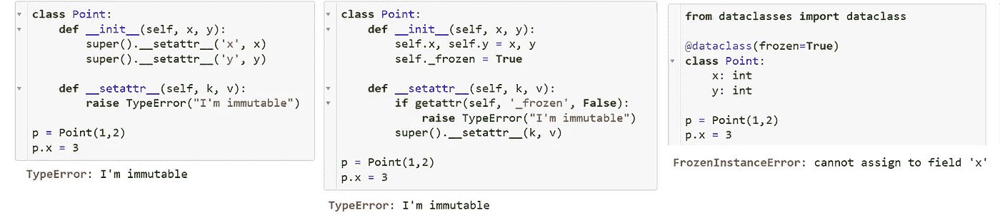

# 如何用 Python 构建可数类

> 原文：<https://betterprogramming.pub/how-to-build-countable-classes-in-python-c3aa5b887c90>

## 或者如何让“可散列”的对象在字典中充当键


Andrea Lightfoot 在 [Unsplash](https://unsplash.com?utm_source=medium&utm_medium=referral) 上拍摄的照片

考虑这样一种情况，给你一些类型为`Point(x,y)`的对象，你想检查其中是否有重复的对象，或者更好的是，获得每个不同点的计数。例如:

```
Point(1,2), Point(2,3), Point(1,2) -> {Point(1,2): 2, Point(2,3): 1}
```

这可以通过使用一个`dict`(代码多一点)、一个`collections.defaultdict` (代码少一点)或者一个`collections.Counter`(一行程序)来完成。但是无论你选择哪一个，你都会遇到一个问题，Python 把具有相同坐标的点当作不同的对象:

即使你覆盖了`==`操作符(参见'[如何构建可比较的类【T18)，`Counter`(以及`defaultdict`和`dict`)也不会将其用于其内部机制。然而，这一次，他们会给出一个提示，告诉我们哪里出了问题:](/how-to-use-comparable-classes-in-python-a897f9bccf25?sk=e740f80d7836dbc1a43c007245ad79fb)

# 哈希能力解释

为了在类似 dict 的结构(如`dict`、`set`、`defaultdict`、`Counter`等)中作为键使用，一个对象具有可比性是不够的。

在内部，这些结构根据应用于对象的散列函数的结果将存储的对象分布在“桶”中。只有当散列发生冲突时，Python 才会退回到基于直接比较的线性搜索。默认情况下(就像比较一样)，Python 不关心值，甚至不关心字段的存在。用户定义的类被散列的是它在内存中的位置。

为了让 Python 更好地理解在计算散列时应该考虑什么，您需要定义`__hash__`方法。不需要微调实际的散列函数；您可以重用现有结构(如元组)的哈希算法:

对！__hash__ 和 __eq__ 都存在

注意，我们在这里覆盖了`__hash__`和`__eq__`方法。如果你只覆盖了`__hash__`方法而没有覆盖`__eq__`，事情就会被打破。dict 中的查找过程(以及存储或编辑)包括两个阶段。

Python 首先通过散列进行搜索，然后它确保不仅散列是一致的，对象本身也是一致的。除非您也定义了`__eq__`方法，否则在第二阶段，它将退回到使用内存位置作为比较的标准:

不对！__eq__ 丢失

# 不变性解释

如果你需要做的只是数一数这些物体，然后忘记它们，那就足够了。但是如果它发生在动态中(对象可以被创建、删除或修改)，值得注意的是`dict`并不跟踪对象中的修改。

如果某个点的坐标被更改，它不会自动将其移动到另一个存储桶，因此查找将会失败:

处理修改的正确方法是删除旧值，然后插入修改后的值。为了实施这一策略并保护自己免受这种难以调试的错误，建议将类设为不可变的。

*顺便说一句，这是 Python 中字符串不可变的原因之一:这样它们就可以安全地用作字典中的键，而不用担心桶。*

利用父类的`__setattr__`并不是实现不变性的唯一方法。另一个技巧是通过一个专用字段将属性锁定在构造函数的末尾(见下文)。还有一种方法是使用标准库中的`[dataclasses](https://docs.python.org/3/library/dataclasses.html)`模块，该模块应该一次性替换所有的“神奇”方法:



使类不可变的三种方法

关于`@dataclass`装饰器的好消息是，它将为像`__repr__`、`__eq__`、`__lt__`等一系列方法提供合理的默认设置。免费的。坏消息是，这个缺省值仅在最简单的用例中是合理的，在现实生活中，无论何时您想要任何有价值的东西，您仍然必须覆盖' dunder' (=double underline)方法。因此，它没有从“dunder”方法中解放出来，而是引入了具有非显而易见语义的新方法:如果您认为`__init__`和`__new__`已经很难看了，您会对`__post_init__`怎么看？

同样，就像比较一样，你可以使用一个已经可数的类作为起点。

# 基于现有的可数类构建

`namedtuple`生成的类不仅是可比的，而且是可数的:

从`list`继承在这里没有用，因为列表是不可修改的:

更好的办法是从元组继承:

# 结论

如果你希望你的类是可数的，或者在类似字典的结构中作为关键字使用，你需要三样东西:

1.  覆盖`__hash__`方法
2.  相应地覆盖`__eq__`方法
3.  使类不可变

如果这对您来说听起来太低级了，有几个方便的函数可以在最简单的情况下自动完成:

*   `collections.namedtuple`函数用命名字段构建一个元组；
*   继承`tuple`进一步定制；
*   decorator 构建了一个预定义了所有必要方法的类。

这些方法中的任何一个都足以满足你的类的“哈希能力”,因此，例如，你可以使用熟悉的习语`len(set(items))`来计算列表中不同对象的数量。