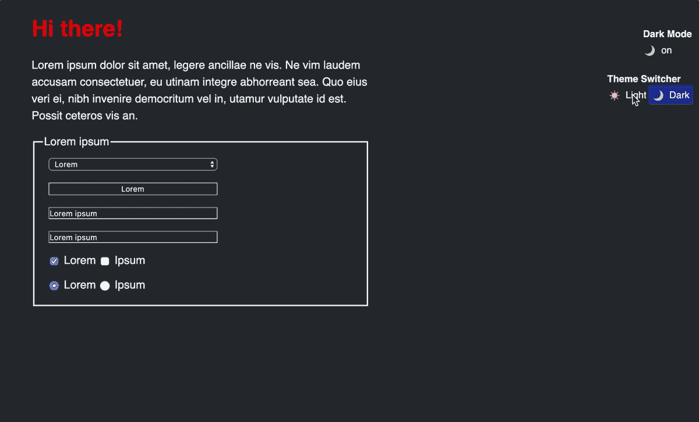
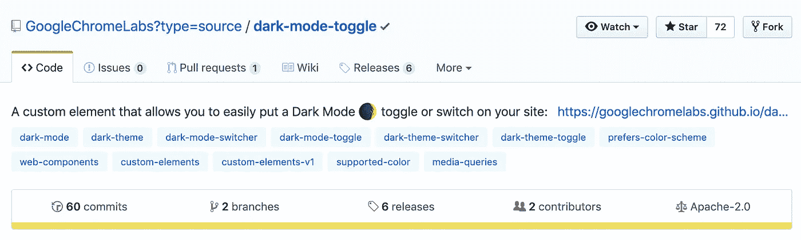
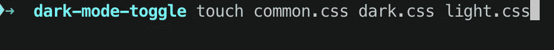
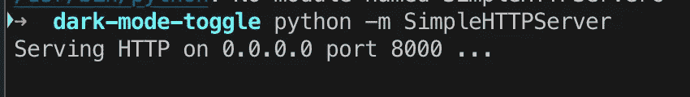
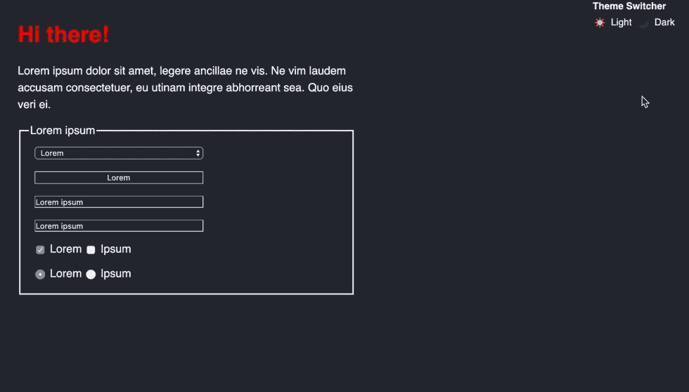

# 如何用 Web 组件构建明暗主题

> 原文：<https://betterprogramming.pub/how-to-build-dark-and-light-theme-with-web-components-a63ca1570bfe>

## 明暗主题之间的切换从未如此简单



在明暗主题之间切换

我们又回到了黑暗模式。从暗模式到亮模式，再回到暗模式。在个人计算的初期，黑暗模式是唯一的选择。单色阴极射线管计算机显示器通过向磷光屏幕发射电子束来工作。早期 CRT 使用的磷光体是绿色的，导致文本以绿色显示，而屏幕的其余部分是黑色的。这些型号通常被称为[绿屏](https://commons.wikimedia.org/wiki/File:Schneider_CPC6128_with_green_monitor_GT65,_start_screen.jpg)。

随着随后彩色阴极射线管的引入，通过使用红色、绿色和蓝色磷光体能够显示多种颜色。通过同时激活所有三种磷光体来产生白光。现在我们又回到了黑色主题，因为它看起来更舒服，主观上也更美观。

我是 web 组件的忠实粉丝，喜欢他们如何使 web 开发面向组件。让我们只使用 web 组件来构建一个明暗主题切换。

> "面向组件的编程将是未来."因德雷克·拉斯恩

Web 组件是一套不同的技术，允许您创建可重用的自定义元素(将它们的功能封装在代码的其余部分之外)，并在您的 web 应用程序中使用它们。如果您对 web 组件不确定，请查看“ [W *eb 组件概要*](https://medium.com/better-programming/web-components-api-in-a-nutshell-c409127d563a) ”。

[](https://medium.com/better-programming/web-components-api-in-a-nutshell-c409127d563a) [## 简而言之，Web 组件 API

### 本机 Web 组件 API 的内容和原因

medium.com](https://medium.com/better-programming/web-components-api-in-a-nutshell-c409127d563a) 

# 入门指南

我们只需要一个网络浏览器和一个文本编辑器。继续创建`index.html`文件。如果你使用的是 [emmet](https://emmet.io/) ，你只需输入`!`并点击 tab 键。这将给你`index.html`样板代码。

每个 web 应用程序的构建模块`**index.html**`

## `<dark-mode-toggle>`元素

感谢开源代码，我们已经有了一个方便的组件来满足我们的需求。它被称为`[dark-mode-toggle](https://github.com/GoogleChromeLabs/dark-mode-toggle)`——我们可以通过 CDN 包含该组件，也可以将其安装为 NPM 软件包。



黑暗模式切换—[https://github.com/GoogleChromeLabs/dark-mode-toggle](https://github.com/GoogleChromeLabs/dark-mode-toggle)

以下组件是一个自定义元素，允许您轻松地将*暗模式🌒*在你的站点上切换，这样你可以根据`[prefers-color-scheme](https://drafts.csswg.org/mediaqueries-5/#prefers-color-scheme)`最初坚持你的用户的偏好，但是也允许他们(可选地永久地)只为你的站点覆盖他们的系统设置。

`[prefers-color-scheme](https://drafts.csswg.org/mediaqueries-5/#prefers-color-scheme)`媒体功能用于检测用户是否请求页面使用浅色或深色主题。它有以下三个值。

*   `no-preference`:表示浏览器不知道用户的偏好。该关键字值在[布尔上下文](https://drafts.csswg.org/mediaqueries-5/#boolean-context)中被评估为`false`。
*   `light`:表示用户已经通知浏览器他们更喜欢浅色主题的页面(浅色背景上的深色文本)。
*   `dark`:表示用户已经通知浏览器他们更喜欢深色主题的页面(深色背景上的浅色文本)。

将以下代码放入`index.html`的`<head>`部分:

custom 元素假设您已经将 CSS 组织在不同的文件中，这些文件是根据样式表的相应`link`元素中的`media`属性有条件地加载的。下面的样式表被命名为`common.css`、`light.css`和`dark.css`——注意每个主题是如何拥有自己的封装样式的。继续创建三个样式表。

```
touch common.css light.css dark.css
```



这是一个很好的性能模式，因为您不会强迫人们根据他们当前的主题偏好下载他们不需要的 CSS，然而不匹配的样式表仍然会被加载，但不会在关键的呈现路径中竞争带宽。

接下来，将`<dark-mode-toggle>`元素添加到我们的`index.html`中

添加**黑暗模式切换**元素

现在，让我们也添加一些内容。毕竟，我们希望看到和测试我们的结果。这是我们的`index.html`现在的样子:

向**index.html**添加内容

最后，我们需要为我们的明暗主题声明风格。从下面的代码片段中获取样式。

## common.css

这些样式在明暗主题之间重复使用。

**common.css**

请注意`color-scheme`属性。属性`color-scheme`仍在开发中，它可能还没有被完全支持。Chrome 的全面支持将于 2019 年底到来。

## dark.css

这些是我们黑暗主题的风格。

**dark.css**

## light.css

最后，灯光主题的风格。

**light.css**

在浏览器中打开 index.html 文件。你既可以在本地打开它，也可以启动一个快速 HTTP 服务器。在我的例子中，我只是用内置的 Python 服务器打开它。

```
$ python -m SimpleHTTPServer
```



启动我们的 Python 服务器

现在，如果我们打开浏览器，输入`localhost:8000`，我们应该会看到以下内容:


继续点击右上角的主题切换器按钮。



切换主题

厉害！它非常有效。你可以在这里找到所有来自 [GitHub 库的图片资源。](https://github.com/indreklasn/web-components-dark-light-theme-demo)

[](https://github.com/indreklasn/web-components-dark-light-theme-demo) [## indreklasn/web-组件-暗-亮-主题-演示

### 此时您不能执行该操作。您已使用另一个标签页或窗口登录。您已在另一个选项卡中注销，或者…

github.com](https://github.com/indreklasn/web-components-dark-light-theme-demo) 

如果你是 JavaScript 新手，想学习这门语言，我建议你从阅读书籍和构建东西开始。从“ [*学习 JavaScript 的更聪明的方法*](https://amzn.to/2LOkzjj) ”这本书和[这里有一个要构建的有趣应用的列表](https://medium.com/better-programming/the-secret-to-being-a-top-developer-is-building-things-heres-a-list-of-fun-apps-to-build-aac61ac0736c)。

感谢阅读，我希望你学到了一两件事。保持牛逼！

[](https://medium.com/better-programming/2020-programming-trend-predictions-a5d6b70bec26) [## 2020 年编程趋势预测

### 预测 2020 年将出现哪些编程技术

medium.com](https://medium.com/better-programming/2020-programming-trend-predictions-a5d6b70bec26)