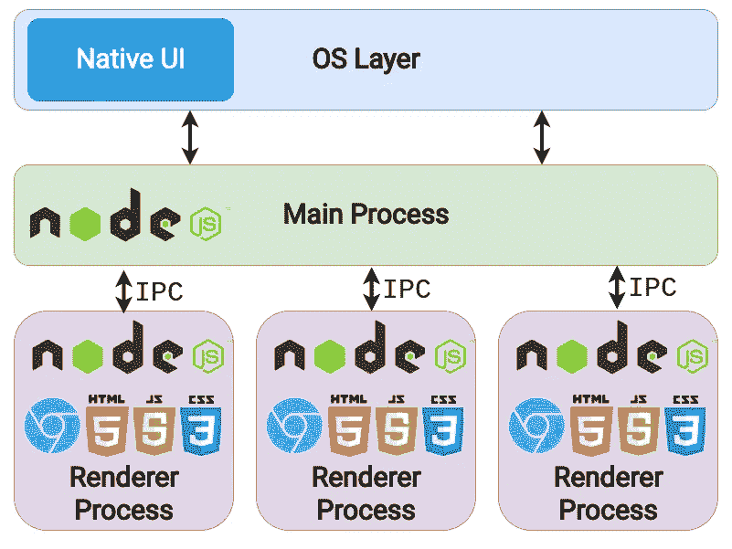
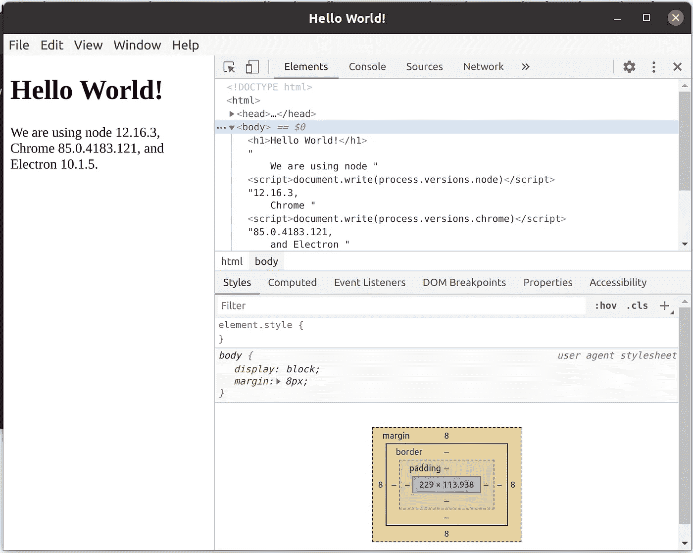

# 如何使用电子构建桌面应用程序

> 原文：<https://betterprogramming.pub/how-to-build-desktop-applications-the-right-way-using-electron-aee5deedeb8c>

## 用电子启动你的下一个项目


照片来自[电子](https://www.electronjs.org/)。

如果你像我一样，喜欢 JavaScript 及其生态系统，并且一直在使用 React 或[performant web server with node . js](https://bajcmartinez.medium.com/when-you-should-and-shouldnt-use-node-js-for-your-project-2e141dc118b6)之类的框架构建令人惊叹的 web 应用程序。现在你想开发一个桌面应用程序，又不想学习新的编程语言。或者您可能希望尽可能多地重用现有的 web 项目。

这是当[电子](https://www.electronjs.org/)进入画面，以拯救世界。

Electron 允许您使用 HTML、CSS 和 JavaScript 构建桌面应用程序。互联网上有许多反对 Electron 的论点，其中一些是它的性能和经常是低质量的应用程序，但不要责怪框架。电子是强大的，可以表演。如今，许多流行的应用程序都运行在 Electron 之上，如 VS Code、Slack、Skype、Discord 等等。

但是为什么那么多人反对呢？问题始于应用程序和人们使用电子产品的方式。对许多人来说，将 web 应用程序移植到 Electron 意味着将您现有的代码原封不动地嵌入到 Electron 容器中。这是一件可怕的事情吗？也许不是，但是你没有充分利用电子的力量。您只是在为一个独立的应用程序更改浏览器选项卡。

我们能改进什么？在本文中，我们将探索电子的基础知识，并构建一个示例应用程序来展示一些电子方式。

# 电子是如何工作的？

电子建立在三个主要组件之上:

*   Chromium:负责网页内容。
*   节点:用于与操作系统交互。
*   自定义 API:解决处理操作系统时的常见问题。

这些组件中的每一个都在电子体系结构层的不同级别上相互作用，如体系结构图所示:



电子建筑

电子与两种类型的过程一起工作:

*   主进程:负责窗口管理和所有与操作系统的交互。这是一切开始的地方，它可以创建和管理多个渲染器进程。
*   渲染器进程:可能有一个或多个。每个都将托管一个 Chromium 实例，并负责 web 内容。

值得注意的是，渲染器进程不能直接访问操作系统功能。相反，它们通过 IPC 与主进程通信来完成这些任务。

许多典型的电子应用程序会使用 main 进程来创建一个 renderer 进程并加载它们的 web 应用程序。今天，我们将更进一步。

# 必备部分:Hello World！

接下来，我们要建立一个“hello world！”申请。我们将不会使用任何框架或库，这对于专注于电子代码是不必要的。

让我们开始吧。

## 设置电子

构建应用程序的第一步是创建一个项目并安装电子库，所以从使用 NPM 创建项目开始:

```
npm init
```

并设置您的应用程序详细信息。作为应用程序的起点，我喜欢使用`main.js`，但是您可以使用任何您想要的文件名。

接下来，安装电子设备:

```
npm install -D electron@latest
```

## 构建屏幕

对于我们的微型 hello world 示例，我们需要两个文件:`main.js`和`hello-world.html`。`main.js`是我们的主要流程。我们将创建第一个渲染器进程来加载我们的`hello-world.html`。

以下是`main.js`的启动代码:

初学者工具包将处理运行应用程序的最少操作，用`new BrowserWindow`创建第一个渲染器，并在其上加载`main.html`。它还将解决一些退出应用程序并在需要时重新启动主窗口的情况。

至于我们的`main.html`，我们将使用如下:

这只是一个简单的 HTML，展示了我们的应用程序使用的 Node、Chrome 和 Electron 的当前版本。

最后，我们需要运行我们的应用程序。首先，您需要更改`package.json`并添加启动脚本:

```
"scripts": {
    "start": "electron .",
    "test": "echo \"Error: no test specified\" && exit 1"
  },
```

您的“脚本”部分现在应该是这样的。

是时候测试一下了！在终端上，运行:

```
npm start
```

如果一切顺利，您应该会看到这样一个窗口:



用电子制作的 Hello World app

## 没有更简单的方法吗？

简短的回答是肯定的，尽管这是有代价的。许多样板文件为构建电子应用程序提供了一个起点——其中一些使用 vanilla JS，另一些则直接集成了一些最流行的框架，如 React 和 Vue。

我不太喜欢这些样板文件，因为它们通常附带了许多我不需要的库和附件。但是它们是让你开始的好地方。

以下是一些受欢迎的:

*   [电子锻造](https://www.electronforge.io/)
*   [电子生成器](https://github.com/electron-userland/electron-builder)
*   [电子反应样板](https://github.com/electron-react-boilerplate/electron-react-boilerplate)
*   [电子眼](https://github.com/SimulatedGREG/electron-vue)

# 构建流畅的应用程序

我们已经看到了电子结构的工作原理。如果你像我一样，你可能会担心 Chromium 和 Node 运行的所有实例——你应该担心。我们都知道铬(或 Chrome)如何吞噬我们的内存并影响我们的性能，那么我们如何才能避免基于铬的应用程序这样做呢？我们如何保持它的性能？

这里有一些建议。

## 永远不要阻塞主进程

主要流程是一切开始的地方。它是应用程序所有进程的父进程。它与操作系统通信，处理所有窗口和它们之间的通信，并运行 UI 线程。

阻止此进程意味着应用程序将停止响应，直到操作完成。在任何情况下，您都不应该运行占用大量 CPU 资源并且需要很长时间才能完成的代码。

以下是一些建议:

*   对于 CPU 密集型操作，将这些功能委托给一个工作线程、一个渲染器进程，或者甚至衍生一个专用进程来执行该任务(不过要确保您知道自己在为最后一个任务做什么)。
*   尽可能避免使用`remote`模块。使用`remote`模块很容易在不知不觉中阻塞 UI 线程。
*   避免在主线程上使用阻塞 I/O 操作。如果需要，使用 Node 提供的异步对等项。

## 阻止渲染器进程可以吗？

不完全是。也许后果不会像阻塞主进程那样有害，但是阻塞渲染器是有代价的。您的 windows 可能会变得缓慢或无响应，整体用户体验将非常糟糕。

当我们使用网络时，我们习惯了一些网络应用程序突然变慢，不流畅，我们对此没有意见。然而，当涉及到桌面应用程序时，我们的标准更高。请注意这一点，因为用户的期望很重要。

我能做些什么来提高我的应用程序的响应速度？就像我们可以在网络应用上做的一样。毕竟，在渲染器过程中，我们只是在谈论铬。

*   `requestIdleCallback`:这是一个 API，允许 JavaScript 的执行在空闲浏览器时间排队运行，要么在一帧结束，要么在用户不活动的时候。
*   Web workers:通过将计算分配给一个新线程，在 Web 浏览器上运行昂贵计算的最佳工具。

## 你不需要跨浏览器兼容性

在 web 开发过程中，使用 polyfills 来支持不同的浏览器是非常典型的。当构建电子应用时，你不需要这些。如果它运行在 Chromium 上，它就运行在 Electron 上，不需要支持任何其他浏览器。通过不加载这些额外的模块，减少您的包并使一切更快。

## 捆绑你所有的代码

在 web 开发中，我们有时会从 cdn 等服务器上加载脚本或页面，这些服务器与我们的应用程序是分开提供的——这很好。毕竟，对于 web，我们总是需要下载这些资产来运行应用程序。

对于桌面应用程序，这是不同的。通过在应用程序中捆绑所有静态资产、脚本和内容，避免任何不必要的网络请求。这将使你的应用程序做两件事:离线工作和加快加载过程，因为读取磁盘比上网便宜。

# 结论

下次您需要构建跨平台的桌面应用程序时，我建议您尝试使用 electronic——尤其是如果您是 JavaScript 出身，并且已经有了一些可以重用的代码。

如果使用得当，电子可以发挥巨大作用。请记住，虽然它看起来像 web，但它并不完全是 web，因此您需要做一些特殊的考虑才能使它工作。

感谢阅读！