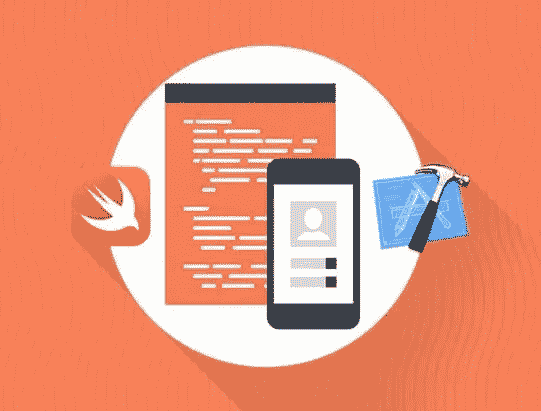
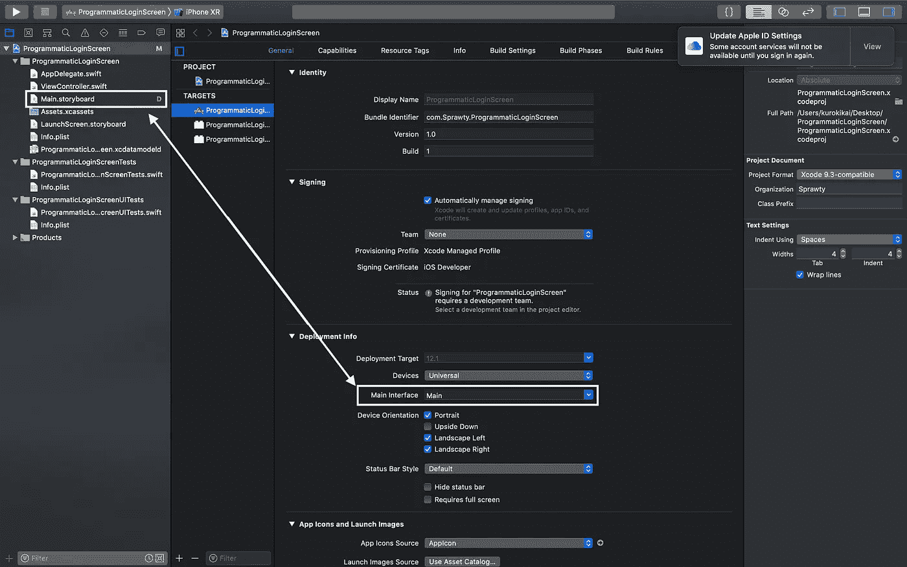
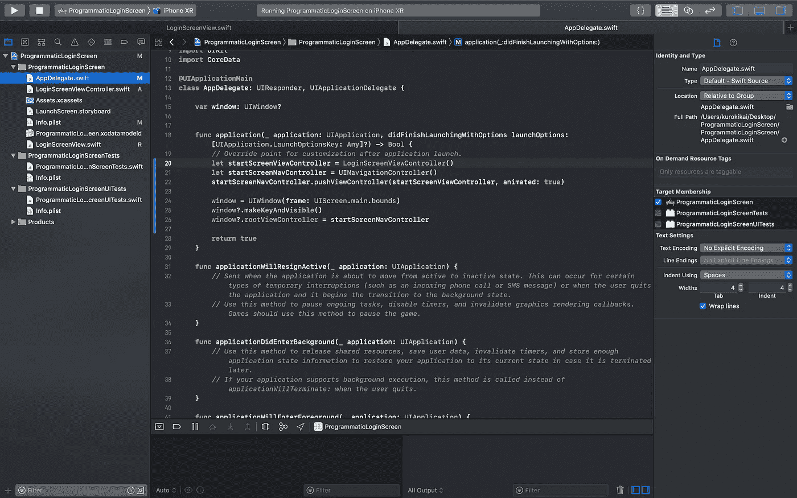
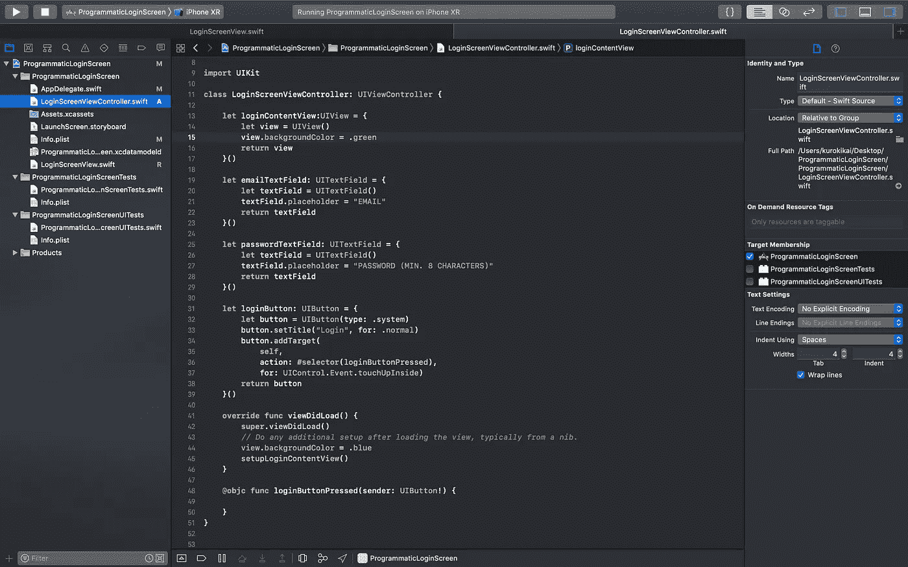
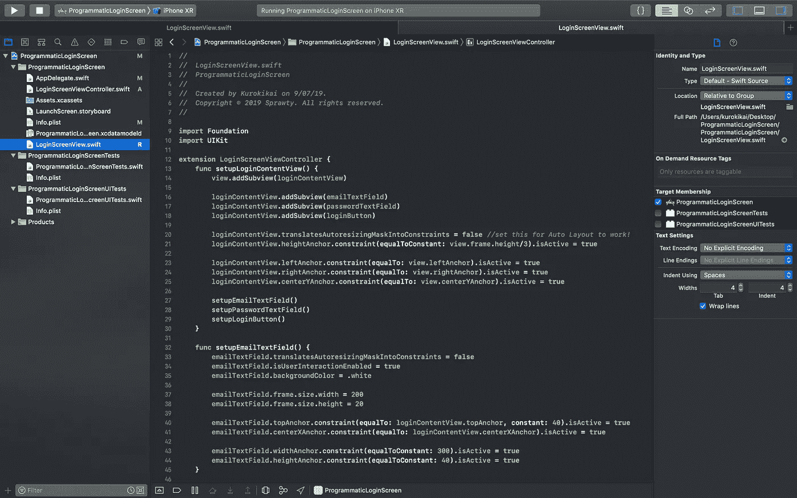
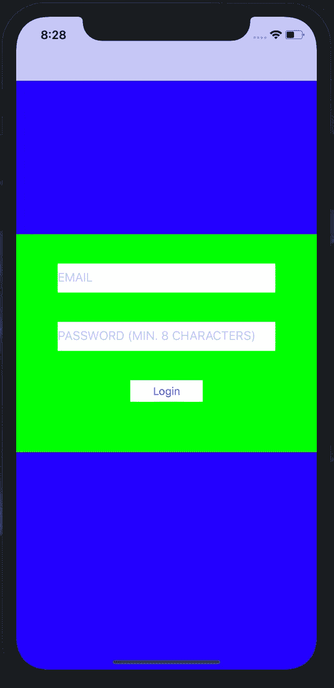

# 如何以编程方式构建 iOS 用户界面

> 原文：<https://betterprogramming.pub/how-to-build-ios-uis-programmatically-e0c4be2c3f24>

## 以编程方式从头开始构建登录屏幕



由 [AIS 技术公司](https://www.aistechnolabs.com/swift-development/)拍摄的照片

iOS 新手？经验丰富的本地开发人员？不管怎样，你们中的很多人在使用故事板的时候都会遇到一些问题。

1.  **过渡:**对于初学者来说，随着应用程序中屏幕数量的增加，过渡有时会变得非常混乱，难以处理。
2.  **代码重构**:每当我们改变标记的变量名——IBOutlets 和 I actions——无论是为了优化还是可读性，我们通常都必须重新连接已经重构的变量，否则应用程序会崩溃。
3.  **约束**:在同一个屏幕中，曾经有许多 UI 属性，嵌套的子视图，相互堆叠在一起吗？当警告信号出现时，必须单独设置这些约束有时会令人困惑。或者更糟，当你不小心点击了 C*lear Constraints*for*View Controller 中的所有视图。*

也就是说，使用故事板仍然有其优点——可视化的能力和非常容易掌握——并且以编程方式创建 ui**可能会形成一个陡峭的学习曲线。本质上，故事板有利于可视化设计流程，并允许快速模拟应用程序。**

但是，通过从头开始以编程方式创建整个应用程序，您的代码会更加健壮和可靠。虽然这种方法可能需要更多的时间来学习和设置，但是一旦你掌握了它，你肯定可以加快速度。

因此，如果时间和资源允许，我绝对推荐新的和经验丰富的 iOS 开发人员尝试一下编程方式。

# 以编程方式构建登录屏幕

我们开始吧！我们将完全从头开始构建一个登录屏幕，当然，是以编程的方式。这里有一个快速概述:

1.  **删除你的故事板(是的，现在不要害羞。)**
2.  **分配一个默认的视图控制器**
3.  **创建各自的 UI 属性**
4.  **设置约束**

如果你相对来说是 iOS 开发的新手，我强烈建议你阅读一下 iOS **文件夹架构，**我以后会谈到。这将允许您更好地组织您的项目，以保持易访问性。

## 1.删除你的故事板

向你致敬！你已经决定进行一次信仰的飞跃！我向你保证，这将是一次有趣的经历。

*   创建 Xcode 项目，就像创建任何其他应用程序一样。
*   在项目导航器窗格中，删除整个`Main.storyboard` 文件。
*   单击项目图标的最顶层。
*   在*部署信息*下，清除*主界面中的条目。*
*   运行项目。



## **2。分配一个默认的视图控制器**

面对模拟器黑屏和 Xcode 的错误信息？不要担心。原因如下。

删除对`Main.storyboard` 的引用也会删除将与您的应用程序一起启动的默认控制器。因此，我们必须分配一个根节点`ViewController` ,它将在应用程序启动后显示。

*   将默认的`ViewController.swift` 文件重命名为`LoginScreenViewController.swift` ，可读性更好。
*   导航到`AppDelegate.swift` 文件。
*   在包含`didFinishLaunchingWithOptions`的`application` 方法下，包含以下代码:

现在，让我们逐行分解这段代码。

首先，`startScreenViewController` 被初始化为一个泛型`UIViewController`的变量。这使您能够添加更多的逻辑语句，根据应用程序的不同状态将其设置为您想要的任何一个`ViewController` 。

例如，可以向新用户显示登录/注册屏幕，而认证用户可以转到仪表板屏幕。因此，您可以用您想要的任何一个`ViewController` 子类替换`LoginScreenViewController()` 。在本教程中，我们将使用`LoginScreenViewController()` *。*

其次，初始化`startScreenNavController` ，因为`UINavigationController` 允许您导航到应用程序的不同屏幕。

第三行简单地调用`pushViewController()` 方法将`startScreenViewController` 推到`startScreenNavController` *上。*

接下来，`window` 用设备的屏幕边界初始化。

并且，[根据苹果的文档](https://developer.apple.com/documentation/uikit/uiwindow/1621601-makekeyandvisible)，它的`makeKeyAndVisible()`方法“显示当前窗口，并将其定位在同级或更低级别的所有其他窗口的前面。”

最后，最后一行代码将`startScreenNavController` 赋给窗口的`rootViewController`。您应该有类似的东西:



现在，当您运行项目时，您会注意到黑屏已经被一个空白屏幕所取代。这就是你推到`Navigation Controller`上的`View Controller` 。

为了确保您的代码按预期运行，您可以更改`View Controller` 的背景，方法是转到相应的`LoginScreenViewController.swift`文件(您的根目录`View Controller`的名称)并将这行代码添加到`viewDidLoad()`方法下:

```
view.backgroundColor = .blue //set it to the color that you prefer
```

模拟器应显示如下:


## 3.创建各自的用户界面属性

太好了！既然我们已经以编程方式设置了控制器，我们终于可以构建我们的登录屏幕了！

在本教程中，我们将只构建屏幕的 UI 部分，它不会处理任何逻辑或 API。登录屏幕通常由 *UITextFields* 和 *UIButtons 组成。*头移至`LoginScreenViewController.swift` 并将该代码段添加到类的顶部，就在`viewDidLoad()` 方法之前。

在这里，我们声明并立即调用`UITextfields` 和`UIButton`和*。*我们稍后将设置约束和任何进一步的定制。我们在这里初始化的`loginContentView` 是为了将`UITextFields` 和`UIButton` 耦合在一起，以便我们能够更方便地定制它们。

注意到*使用未解析的标识符“登录按钮按下”*有错误？这是因为我们还没有创建这个方法，它将在我们按下`loginButton` *时处理事件。*在`viewDidLoad()` *后加上这个；我会把事件的处理交给你。*

```
@objc func loginButtonPressed(sender: UIButton!) {}
```

现在，运行项目。我们仍然只能看到蓝色的背景。我们创建的所有属性都没有出现。这是因为我们还没有将它们添加到视图中并设置它们的约束。

你的`LoginScreenViewController.swift` 文件应该类似下图:



## 4.设置约束

为了保持可读性，我喜欢在一个单独的`*Swift*` 文件中构造约束，该文件扩展了`LoginScreenViewController()` 类。

*   创建一个新的 swift 文件，命名为`LoginScreenView.swift` *。*
*   按如下方式初始化文件:

```
extension LoginScreenViewController {}
```

*   在扩展里面，我们首先创建一个方法来设置`loginContentView` *。这个`UIView` 将包含我们之前创建的`UITextfields` 和`UIButton` 。*

`addSubview` 方法将各自的`UI properties` 添加到调用该方法的`UIViews` 上。这里，我们将`loginContentView` 添加到`view` 上，将`UITextfields` 和`UIButton` 添加到`loginContentView`上。如果需要，我们将这些`UI properties` 组合在一起，以便于维护和调整。

接下来，我们使用`translatesAutoresizingMaskIntoConstraints` 到`false` 来让`Auto Layout` 发挥它的魔力。

之后，我们添加锚(约束)。`heightAnchor` 决定了`loginContentView` 将垂直占据多少像素。另一方面，`leftAnchor` 和`rightAnchor` 控制`loginContentView` 的水平拉伸。

根据给定的参数，`centerYAnchor` 约束使`loginContentView` 居中。

最后，最后的三个方法是为另一个`UI properties` *构造约束。*

*   接下来，为我们拥有的每个`UI property` 构造约束。我最喜欢的做法是创建一个方法来设置每个`property`:

这里，一个明显的模式是每个 UI 属性调用的方法非常相似，除了给定的参数。由于这只是一个教程，请随意探索其他方法，如设置字体或边框。您的扩展文件应该类似，如下所示:



给初学者一个提示:你也应该按照 DRY 的概念模块化其中的一些方法！

*   最后，您已经准备好运行您的(有史以来第一次)以编程方式创建的登录屏幕了！



虽然它不是 UI 中最漂亮的，但我希望它在教你如何以编程方式构建UI 设计方面是有用的，并且它很容易理解。你可以[在 github](https://github.com/kaikoh95/ProgrammaticLoginScreen) 上找到这个项目的源代码。

感谢您花时间通读这篇文章。请随意留下您对可以改进的地方的反馈和意见，以及您对以编程方式进行 iOS 开发的想法！