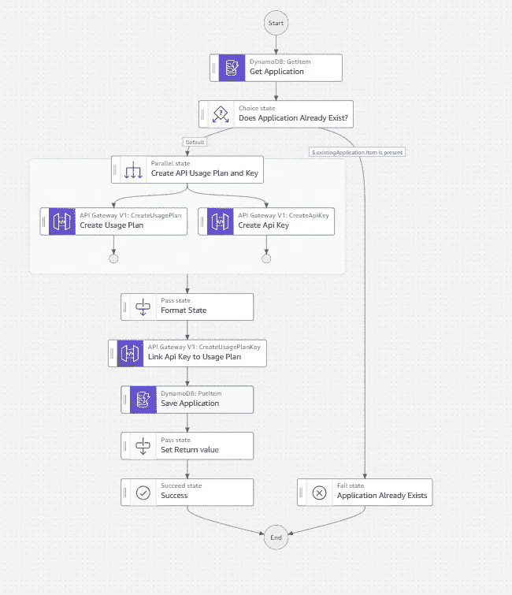
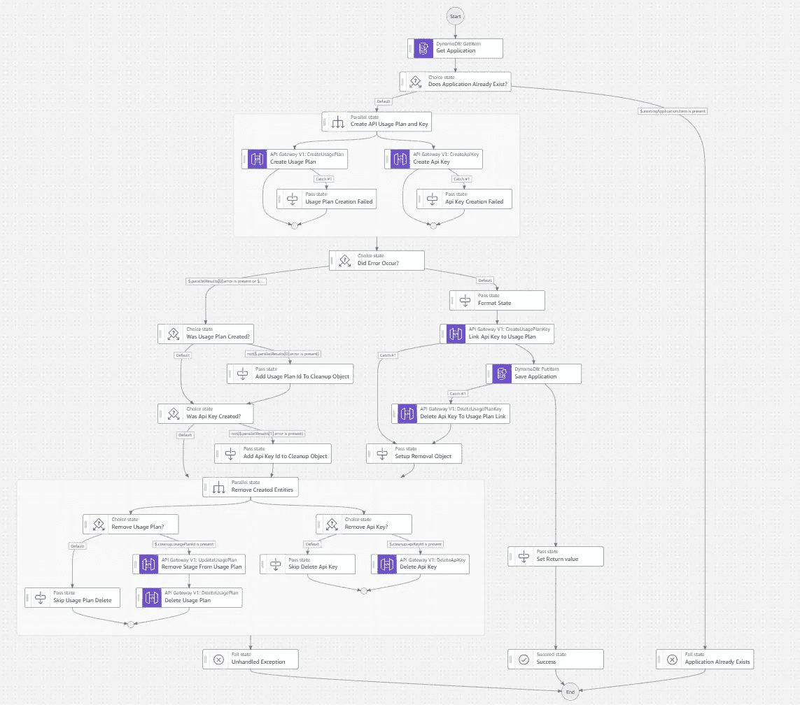
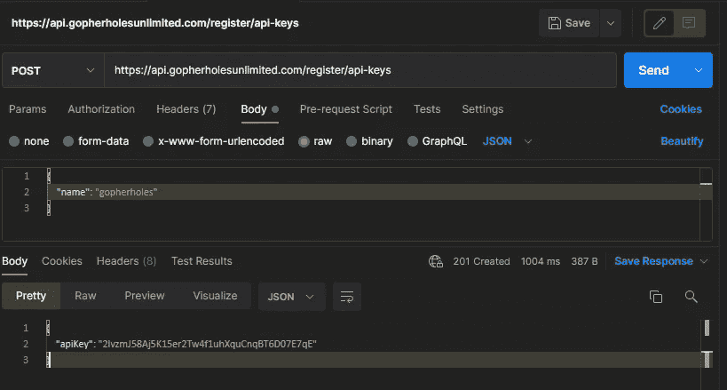

# 如何用 AWS Step 函数构建闪电般快速的 API

> 原文：<https://betterprogramming.pub/how-to-build-lightning-fast-apis-with-aws-step-functions-d1725624aaaa>

## Step 函数正迅速成为在 AWS 中构建工作流的事实标准。探索用 REST APIs 配置它们的技巧。


比尔·杰伦在 [Unsplash](https://unsplash.com/s/photos/speed?utm_source=unsplash&utm_medium=referral&utm_content=creditCopyText) 上的照片

几年前我刚开始使用无服务器时，阶跃函数有点神秘。

我知道它们是为编排工作流而设计的，但我不知道它们的范围。他们应该跨越微服务吗？他们是否应该局限于单个微服务？它们应该被限制在有限的上下文中的服务吗？

工作流中的跨帐户 Lambda 调用怎么办？在这种情况下，Step 函数会发挥作用。

当时，步进函数的唯一选项是异步的。[快递工作流程](https://docs.aws.amazon.com/step-functions/latest/dg/concepts-express-synchronous.html)还没出来。有很多功能，但它被我的经验不足和缺乏明确的服务方向所掩盖。

但是这种情况已经改变了。

我确信阶跃函数团队不睡觉。他们每周都推出高质量、高价值的功能，加上 AWS 开发者社区[一直在写关于它们的文章](https://dev.to/search?q=step%20functions)。这是一个很好的时间去了解未来的发展方向。

上周，我写了关于使用异步工作流进行处理的“存储优先”开发的文章。但这并不总是可行的。

有许多需要同步响应的用例。如果您想在这些场景中使用步骤功能，您将不得不使用[同步快速工作流](https://aws.amazon.com/blogs/compute/new-synchronous-express-workflows-for-aws-step-functions/)。因此，今天我们将介绍如何在 REST API 中创建一个端点，该 API 使用 express 工作流作为其后端。

# 为什么在 Lambda 上使用阶跃函数？

这将永远是开发者之间的激烈争论。在一个 lambda 函数中管理和维护所有代码有利于组织和代码密度。但是对于阶跃函数，从技术上讲，你是在编写*配置*，而不是*代码*。

[代码是负债](https://medium.com/continuousdelivery/simplicity-and-reliability-bc8c4e916f8e)。通过在 Lambda 函数中切换到配置状态机而不是手写代码，您将责任推给了云供应商，让您可以专注于…构建更多的阶跃函数！

我们今天的用例是使用阶跃函数比使用 Lambda 更好的一个很好的例子。我们将构建一个 API，允许用户为我们构建的微服务注册 API 密钥。

[Andres Moreno](https://twitter.com/andmoredev) 在[他的文章](https://www.andmore.dev/blog/portman-with-api-key/)中对此做了最好的描述:

> *“当创建一个 API 时，你需要有安全性，以避免不良使用和意外使用带来的成本”——Andres Moreno*

Auth 在任何项目中都是绝对必要的。甚至一个[概念验证(POC)](/4-reasons-you-should-never-use-proof-of-concepts-in-production-ca54432e52b9) 也需要受到某种安全层的保护。因此，我们将创建一个简单的 API，它位于我们的服务旁边，允许用户创建和注册 API 密钥。

注册 API 密钥包括几个步骤:

在我们快乐的道路上有四个不同的步骤。更不用说我们需要构建的任何验证和检查状态了。

如果我们试图使用 Lambda 来创建我们的 API 键，它将调用四个不同的 AWS 命令。对于单个功能标记，这开始超过*的阈值太多。Lambda 函数应该用尽可能少的业务逻辑做一件事情。*

相反，迁移到托管状态机为我们提供了更容易的可读性和更好的工作流长期管理。

# 构建状态机

当构建状态机时，我喜欢从 AWS 控制台开始，并使用 [Workflow Studio](https://docs.aws.amazon.com/step-functions/latest/dg/workflow-studio.html) 来构建它。

我可以将 AWS SDK 集成直接拖放到状态机中，并将一个调用的输出传递到另一个调用的输入中。

在最初的开发阶段，我将状态机构建为标准的工作流，这样我就可以图形化地看到我的开发测试的执行情况，并轻松地跟踪问题。Express 工作流仅限于显示日志结果，这使得在初始开发阶段进行故障排除更加困难。

为了构建我们的快乐路径，我们可以将四个 API 调用添加到工作流中，并进行一些初始验证:



*添加 API 密匙的快乐之路。来源:作者*

你可以看到为什么我们已经选择了状态机。刚刚开始我们的工作流，我们已经对 AWS SDK 进行了五次调用。此外，使用阶跃函数，我们还可以并行运行一些调用*，这样我们就可以减少执行时间。*

# *补偿行动*

*在处理安全问题时，你要再三检查你没有留下任何暴露的东西。你最不希望看到的就是你的系统出现安全漏洞，因为当出现问题时，你忘了收拾残局。*

*如果 SDK 调用由于某种原因在我们的状态机中失败，我们希望确保删除任何已创建的资源。API 密匙和使用计划是进入你的 API 的大门，所以如果我们不小心留下了它们，我们就在系统中留下了一个未被跟踪的入口。*

*当工作流失败时，采取补偿措施。它们是设计用来清理失败前生成的资源的路径。这有助于防止安全漏洞和孤立数据。*

*在我们的工作流程中，我们希望确保删除任何使用计划、API 密钥以及 API 密钥和使用计划之间的链接(如果它们已创建)。加上我们的补偿动作，工作流的形状如下。*

**

**完成向您的 API 添加 API 密钥的工作流程。来源:作者**

*此工作流有条件地清理它创建的任何资源。同样，我们尽可能利用并行处理来确保最快的运行时间。这是一个同步调用，所以我们必须确保快速返回响应。*

*注意，这个状态机中没有 Lambdas。随着去年[的大发布](https://aws.amazon.com/about-aws/whats-new/2021/09/aws-step-functions-200-aws-sdk-integration/)，Step 函数可以直接与 AWS SDK 集成，因为没有 Lambda 冷启动，所以大大加快了状态机的速度。*

*要完整查看状态机，您可以[在 GitHub](https://github.com/allenheltondev/serverless-api-key-registration) 上查看。*

# *将 API 网关连接到步骤函数*

*当我第一次使用阶跃函数时，我会让 API Gateway 触发一个 Lambda 函数，该函数会触发阶跃函数。但是那种胶水真的没有必要。您可以轻松地让 API Gateway 连接到一个同步步骤函数，并将响应返回给您的用户。*

*我非常支持使用[开放 API 规范(OAS)](https://openapis.org) 来定义你的[无服务器 API](https://www.readysetcloud.io/blog/allen.helton/the-importance-of-proper-serverless-api-design)。在我们的例子中，我们将使用 [VTL](https://docs.aws.amazon.com/apigateway/latest/developerguide/api-gateway-mapping-template-reference.html) 通过我们的 OAS 将 API 网关连接到 Step 函数。*

```
*x-amazon-apigateway-integration: 
  credentials: 
    Fn::Sub: ${AddApiKeyRole.Arn} 
  uri: 
    Fn::Sub:   arn:${AWS::Partition}:apigateway:${AWS::Region}:states:action/StartSyncExecution 
  httpMethod: POST 
  type: aws 
  requestTemplates: 
    application/json: 
      Fn::Sub: 
        - |- 
          #set($context.responseOverride.header.Access-Control-Allow-Origin = '*') 
          #set($body = "{""detail"" : $input.json('$')}") 
          { 
            "input": "$util.escapeJavaScript($body)", 
            "stateMachineArn": "${StateMachine}" 
          } 
        - { StateMachine: { "Ref": "AddApiKeyStateMachine" }}*
```

*AWS `x-amazon-apigateway-integration` [开放 API 扩展](https://docs.aws.amazon.com/apigateway/latest/developerguide/api-gateway-swagger-extensions-integration.html)允许我们定义来自 API 请求的输入，并将其转换为状态机所需的形状。*

*使用这种配置，我们创建的状态机将运行并返回一个响应。因此，我们必须将各种响应映射到有效的 http 响应。为此，我们可以在`x-amazon-apigateway-integration`扩展上添加一个*响应*部分。*

```
*responses: 
  200: 
    statusCode: 201 
    responseTemplates: 
      application/json: | 
        #set($context.responseOverride.header.Access-Control-Allow-Origin = '*') 
        #set($inputRoot = $input.path('$')) 
        #set($output = $util.parseJson($input.path('$.output'))) 
        { 
          #if("$output.apiKey" != "") 
            "apiKey": "$output.apiKey" 
          #end 
          #if("$inputRoot.error" == "NameExists") 
            #set($context.responseOverride.status = 400) 
            "message": "$inputRoot.cause" 
          #end 
          #if("$inputRoot.error" == "UnhandledError") 
            #set($context.responseOverride.status = 500)
            "message": "$inputRoot.cause" 
          #end 
        }*
```

*`responses`部分下的 *200* 定义了当积分(在本例中为阶跃函数)返回 200 时该做什么，这意味着它被成功执行。在 200 以下是我们对如何将响应从成功的执行中转化出来的定义。*

*这个映射将从我们的状态机中获取三个可能的结果，并将它们映射到适当的 http 响应。*

*   ***成功** —如果状态机运行并在响应中返回一个`apiKey`属性，我们返回一个 [201 状态代码](https://developer.mozilla.org/en-US/docs/Web/HTTP/Status/201)和生成的 API 键的值。*
*   ***名称存在** —如果有人已经注册了一个 API 密钥，并使用了调用者输入的相同名称，我们将返回一个 [400 状态代码](https://developer.mozilla.org/en-US/docs/Web/HTTP/Status/400)，表明调用者需要进行更改。*
*   ***未处理的错误** —如果在我们的工作流处理过程中出现了我们没有预料到的问题，我们会返回一个 [500 状态代码](https://developer.mozilla.org/en-US/docs/Web/HTTP/Status/500)，表明服务器端出现了问题，调用者可以等待或重试。*

*我们正在检查的`NameExists`和`UnhandledError`错误被专门添加到我们的状态机中作为故障状态。您可以添加任何类型的失败状态，并显式地检查它们以向调用者返回不同的响应。*

# *进行速度测试*

*既然状态机已经完成，OAS 映射也已经创建，我们可以在部署的 API 上运行一个测试，看看它到底有多快。*

*为此，我们将使用 [Postman](https://www.postman.com) 来运行一个测试，这样我们就可以看到响应时间。*

**

**通过 Step 函数生成 API 密钥的速度测试。来源:作者**

*1004 ms 不是最快的端点，但考虑到它正在做的一切，它已经相当快了。这篇文章展示了如何进行完全同步的操作。*

*我的上一篇文章讨论了使用存储优先方法的完全异步端点。有一个例子可以说明，利用端点的同步和异步处理可以获得完美的平衡。*

*可以对这个端点进行修改，以生成 API 键并同步验证注册名称，然后启动异步步骤函数来创建使用计划并将键链接到计划。*

# *结论*

*和所有事情一样，你创建的软件也有权衡。您可以完全同步，并以较慢的响应时间向用户返回完整的验证，或者您可以返回部分响应，并让用户检查异步作业的结果。*

*平衡就是一切。找出对你和你的消费者来说最好的解决方案。异步正在获得越来越多的关注，你可以做像[实现 WebSockets](/introduction-to-aws-websockets-8b336a92c379) 这样的事情来增强用户体验。另外，[是 2022 年](/and-the-2022-word-of-the-year-for-programmers-is-3605dc1bd698)软件工程的词。*

*但是也有必须同步的关键端点。比如生成一个 API 密匙。*

> *安全永远值得等待。*

*随着 AWS Step Functions 服务的不断改进，延迟将继续减少，功能集将继续增加。现在是熟悉这项服务工作原理的时候了。在不太遥远的将来，我们都将构建状态机作为日常工作的一部分。*

*编码快乐！*