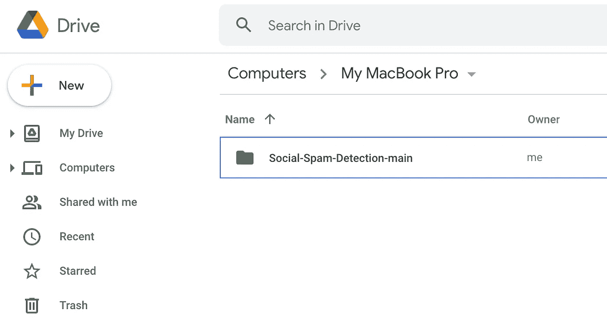
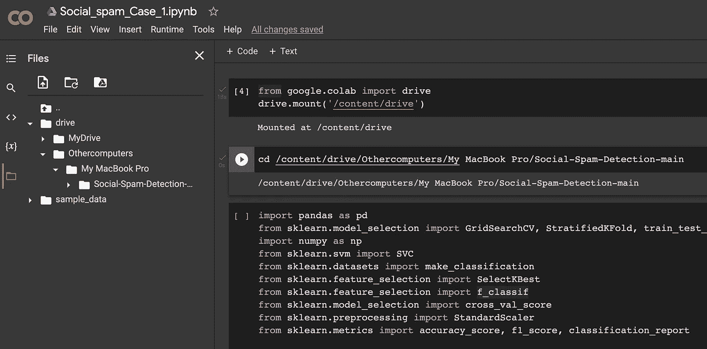

# 如何同时在本地机器和 Google Colab 中构建 ML 模型？

> 原文：<https://betterprogramming.pub/how-to-build-ml-models-in-a-local-machine-and-google-colab-at-the-same-time-9607a1c5fb99>

## 利用 Google Colab 满足您的 GPU 需求的巧妙技巧！


由[Nathana rebou as](https://unsplash.com/@nathanareboucas?utm_source=unsplash&utm_medium=referral&utm_content=creditCopyText)在 [Unsplash](https://unsplash.com/s/photos/google?utm_source=unsplash&utm_medium=referral&utm_content=creditCopyText) 上拍摄

您是一名数据科学家、学生或 ML 项目的爱好者，并且您已经在计算机上安装了 Anaconda 发行版，开始使用机器学习模型。

你开始进步，现在需要 GPU 的力量来训练一些神经网络。Google colab 对于希望免费使用 GPU 的初学者来说是一个简单的答案。这是不是意味着你每次想用的时候都要把你的项目文件上传到 colab？这会变得有点乏味和混乱。

有一个解决方案是将所有文件保存在本地机器上，对简单的 ML 模型使用 anaconda，当运行计算量很大的模型时切换到 Google colab。

在这个简短的教程中，我将展示这样做的一步一步的过程。首先，你需要的是:

1.  安装在本地机器上的 Anaconda 发行版
2.  [谷歌桌面软件驱动](https://www.google.com/drive/download/)
3.  一个示例 ML 项目，在您的本地机器上有一个数据集和一些笔记本

我将用于演示目的的示例项目文件夹是`Social-Spam-Detection-main.`

# 为桌面安装谷歌驱动


将文件夹添加到 Google Drive (Gif by Author)

安装 Google drive for desktop 后，使用 Google 帐户登录，然后将项目文件夹添加到您的驱动器中。

这里，对于这个例子，我在`Social-Spam-Detection-main`上使用我的 ML 项目。将文件夹添加到 Google drive 后，接下来的步骤非常简单。

# 使用 Google Colab



Google Drive(图片由作者提供)

同步过程完成后，您可以在 google drive 的“计算机”部分看到相同的文件夹。将显示您用于上传文件夹的电脑的名称(在我的情况下是 MacBook Pro)。

只需打开文件夹并点击您想要运行的 python 笔记本——这将使用 Colab 在一个单独的选项卡中打开笔记本。



Python 笔记本(图片由作者提供)

现在运行 python 笔记本中的前两个单元，将您的驱动器连接到笔记本。

注意:你可以右击下拉菜单中的文件夹来复制你的项目的路径。

瞧啊。现在，您可以运行代码并对笔记本进行任何更改。这些变化也会在你的本地计算机上发生，反之亦然——本地计算机上发生的任何变化都会反映在 Google colab 中。

是不是很酷！

当我在本地机器上工作时，我使用 Jupyter Lab，必要时切换到 Colab。有了这个，我就不用担心每次想切换时都要迁移文件，而且我的代码总是在云上备份。

这种设置对我来说很方便，因为我发现单独使用 Colab 有几个缺点:

1.  Colab 会在一段时间后断开运行时，给你有限的访问权来运行你的笔记本。
2.  您只能同时运行几台笔记本电脑。
3.  每次启动 Colab 实例时，您都必须安装一些库，这很烦人。在 Jupyter 实验室，我可以创建自己的内核，其中包含必要的库和项目的特定版本。

如果你看到了这篇文章的这一部分，感谢你的阅读和关注。

```
**Want to Connect?** You can reach me on [LinkedIn](https://www.linkedin.com/in/rohithteja/), [Twitter](https://twitter.com/rohithtejam), or [GitHub](https://github.com/rohithteja).
```