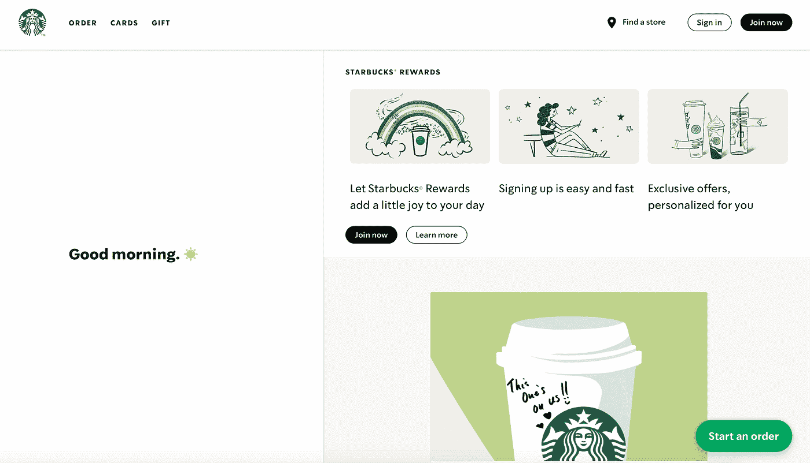
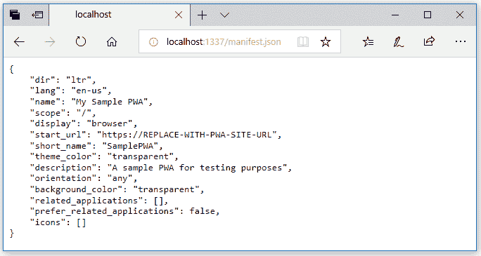
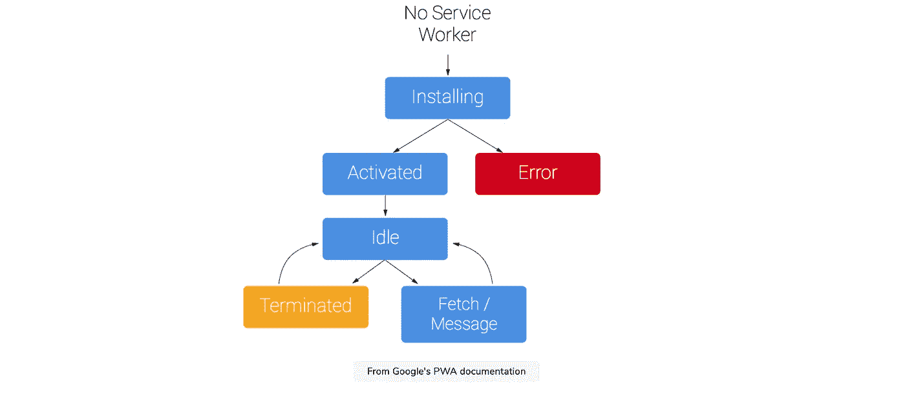

# 如何使用渐进式网络应用程序构建现代化的离线应用程序

> 原文：<https://betterprogramming.pub/how-to-build-modern-offline-apps-with-progressive-web-apps-50dbc8d91b13>

## pwa、服务人员等


图片来源:作者

渐进式网络应用程序(PWAs)可能是现代移动应用程序开发的下一件大事。这个强大的工具结合了本地应用程序的功能和 web 应用程序的范围。他们使用现代 API 来提供可靠性和可安装性，同时通过单一代码库在任何地方、任何设备上访问任何人。PWAs 在 web 开发中的应用越来越多，大大小小的公司都在利用这项强大的技术。今天，我想向您介绍 PWAs，并让您从一个基本的应用程序开始。

我们将回顾:

*   什么是 PWA？
*   公共福利援助的基础
*   从头开始创建 PWA
*   接下来学什么

# 什么是 PWA？

渐进式 web 应用程序(PWAs)是使用现代技术来提供与本地应用程序非常相似的用户体验的 web 应用程序。pwa 近年来变得非常流行，因为它们不仅可以提高性能和用户体验，而且在用户离线时也可以访问。

PWA 的主要目标是使用移动应用程序开发人员可用的大多数功能，提供与本机应用程序相同的体验。PWAs 将最好的移动和网络应用结合到一项技术中。你可以使用前端网络技术建立一个网站，但是它的行为、感觉和表现就像一个移动应用程序。



星巴克用于离线订购的现代 PWA

这种现代的应用程序开发解决方案使移动应用程序开发人员可以轻松地将他们的产品推向市场，而无需经过苹果或 Play stores 缓慢的验证过程。一旦部署了 PWA，用户就可以立即使用它。这也意味着用户不必手动更新应用程序来获得最新版本——它是自动部署的。

pwa 的开发成本明显比本地应用便宜，因为 pwa 消除了对 iOS 和 Android 团队的需求。与原生应用相比，这种有价值的现代应用开发解决方案利用更大的网络生态系统来维护应用。渐进式网络应用显然有很多好处。让我们来看看他们的一些特点。

*   **渐进式:**PWA 必须在每台设备上工作，并逐步增强，这意味着用户设备或浏览器可用的功能都要考虑在内。
*   **可发现:**渐进式网络应用本质上是一个网站，因此它必须在搜索引擎上可被发现。
*   **离线功能:**PWA 应该在用户离线时工作。它还应该在连接性差或低的地区工作。
*   类似应用程序:pwa 的行为和外观应该像本机应用程序。
*   **可链接:**pwa 本质上是网站，因此它们应该使用 URI 来指示应用程序的状态，以便应用程序可以保留其状态。

## 公共福利援助的例子

渐进式网络应用已经是应用生态系统的一部分。你很可能已经用过一个了还不知道！这里有五种流行的 pwa，让你了解哪些公司正在使用这种现代技术。

**优步:**优步将 PWA 技术用于低速 2G 网络的拼车预订。这种 PWA 允许用户在与其本地应用不兼容的低端设备上访问优步的服务。

**Pinterest:** Pinterest 在了解到由于移动性能不佳，只有 1%的移动用户转为注册用户后，设计了一个 PWA。他们使用基于 PWA 的技术进行了重新设计，以改善用户体验。

**Starbucks:** Starbucks 为他们的 web 订购系统构建了一个 PWA，以提供类似于他们的本地应用程序的离线订购。星巴克的 PWA 允许你在不上网的情况下浏览菜单和定制订单。

**Spotify:** Spotify 由 PWA-technology 支持，克服了与苹果合作的局限性。Spotify 的 PWA 应用程序利用自适应用户界面来改变背景。

**Soundslice:** Soundslice 是一款音乐教育软件，使用 PWA 进行音乐学习体验。基于 Soundslice PWA 的播放器允许用户在另一个移动或桌面设备上阅读音乐的同时学习一段音乐。

## 应该构建 PWA 还是原生 app？

尽管使用 PWA 显然有很多优势，但在某些情况下，本地应用可能是更好的选择。让我们进一步分析一下。

pwa 适用于以下情况:

*   这款应用必须尽快上市
*   你的预算有限
*   直播后你有几个计划
*   跨平台兼容性是一项要求

本机应用非常适合以下情况:

*   关键要求是速度和响应能力
*   您希望使用特定的硬件或功能
*   该应用程序必须与第三方应用程序集成

# 公共福利援助的基础

在我们学习如何下载和构建 PWAs 之前，我们需要了解这些应用程序是如何组织和构建的。在本节中，我们将向您介绍 PWAs 的基础知识。要成功完成这一部分，您应该对 HTML、CSS 和 JavaScript 有所了解。我们开始吧！

## Web 应用程序清单

网络清单对 PWA 至关重要。它提供元数据，指示浏览器如何使用`JSON`文本文件在任何设备上呈现和显示 PWA。这是重要的第一步，必须安装在主屏幕上。稍后，我们将向您展示如何从头开始创建 web 应用清单，但是您也可以使用清单生成器，这是 PWA 开发人员的常见选择。



来自微软的 PWA 文档

## 服务人员

服务工作者是所有公共福利援助的重要基础。它们允许我们拦截网络请求，并为不同的调用实现缓存策略。可以把它想象成一种网络工作者，但它是一个 JavaScript 文件，充当我们的网络应用程序和网络之间的代理。它拦截 HTTP 请求，并提供来自网络或本地缓存的响应。服务人员是安全的，不能直接与 DOM 交互。它们通过`postMessage`接口与页面通信，该接口可以直接与 DOM 交互。

## PWA 文件结构

看看这个 PWA 文件结构。我们将在下面讨论必需的部分，并解释哪些特性是可选的。

`**name/short_name**`

这是在用户设备上安装 PWA 后，应用程序图标下使用的值。`short_name`用在没有足够空间的时候。我建议保持在 12 个字符以内，以避免截断。

`**start_url**`

这是启动 PWA 时要加载的应用程序资产的路径。这将表明我们希望应用程序每次启动时都在主页上启动。

`**display**`

这将指定如何显示您的 PWA 应用程序。您可以根据浏览器体验指定不同的值，例如标准体验的`browser`或独立窗口的`standalone`。

`**icons**`

这将决定哪些图标在主屏幕或闪屏上。应该至少是 144 px*分辨率。一些浏览器，如 Chrome，建议使用两个不同大小的图标来帮助在不同的设备上缩放。然后我们可以使用`purpose`属性来表示这些不同图标的用途。*

`**background_color**`

顾名思义，这将设置 PWA 的背景颜色。你可以决定你想要哪种颜色，在 Chrome 上，背景色也用于启动画面。

我们的 PWA 文件结构中的以下特征是用于添加不同功能或设计元素的可选属性。如果你想要一个全面发展的 PWA，推荐使用它们，但是如果你只是想从基础开始，你只需要我们上面讨论的。

*   `orientation`
*   `theme_color`
*   `scope`
*   `description`
*   `related_applications`
*   `dir`

# 从头开始创建 PWA

现在我们已经熟悉了 PWAs 的基本原理，让我们从头开始学习如何制作一个。本指南将向您介绍创建 PWA 的基础知识。

## 第一步。建立一个基本的网站

要制作 PWA，我们需要一个网站。您可以从头开始创建一个(只要它能在不同的屏幕、浏览器和设备上很好地伸缩),也可以下载一个模板。如果使用模板，替换`index.html`文件中的内容，并使用 CSS 更改颜色或设计。一旦我们有了自己的网站，我们可以把它变成一个进步的网络应用程序。

## 第二步。为你的主屏幕制作一个应用图标

正如我们在文件结构部分提到的，您的 PWA 需要一个应用程序图标。这将出现在主屏幕上。您可以制作自己的徽标，也可以从网上下载免费的徽标。无论哪种方式，你的 logo 都需要是一个正方形，分辨率至少应该是 144 像素。一旦你制作了图标，下载它并将 HTML 代码添加到`index.html`文件的`<head>`中。请务必检查该文件的路径是否正确。对于应用设备，正确显示 PWA 图标需要一些额外的设置。

## 第三步。创建并注册 web 应用程序清单

正如我之前提到的，web 应用程序清单是制作 PWA 的重要步骤。这是一个包含所有网站数据的文件。您可以从头开始创建一个，或者使用 web 应用程序清单生成器并填写您想要的数据。如果您刚刚开始，这是一个很好的选择，因为您可以为您不了解的功能保留默认设置。

通常，清单文件存储在我们的 web 应用程序的根目录下。只要结尾有`.webmanifest`，你想取什么名字都可以。然后，我们用媒体类型`application/manifest+json`来服务它。然后，我们必须使用 HTML 文档的`<head>`部分中的`<link>`标签将清单与 web 应用程序关联起来。这里有一个示例，它向用户代理表明必须采用清单元数据。我们还需要通过添加属性`crossorigin="use-credentials`来添加凭证。

```
<head>
  <link rel="manifest" href="/manifest.webmanifest" crossorigin="use-credentials">
</head>
```

## 第四步。添加服务人员

正如我之前概述的，服务工作者充当我们的应用程序和网络的代理。这是另一个文件，我们需要添加到我们的 PWA，以便它可以脱机工作。要成功创建服务人员，您需要了解一些 JavaScript 中的承诺知识。要创建服务人员，有四个主要步骤:

1.  **使用包含服务人员逻辑的 JavaScript 文件注册服务人员。**你可以使用下面的代码。在此阶段，如果无法获取服务工作者文件，您可以生成一个`error`。

**2。安装您的服务人员。**在这个阶段，通常会执行预取操作，以确保下载目标资产(比如静态文件)。这就是我们在 JavaScript 代码中使用承诺的地方。`caches.open()`和`cache.addAll()`都会回承诺。安装后，服务人员将延迟激活，直到较旧的服务人员不再控制客户端(如果您已经安装了客户端)。

```
var urlsToCache = [
  '/',
  '/styles/styles.css',
  '/script/home.js'
];self.addEventListener('install', (event) => {
  event.waitUntil(
    caches.open('my-cache')
      .then((cache) => {
        return cache.addAll(urlsToCache);
      })
  );
});
```

**3。激活服务人员。旧的服务人员离开后，新的服务人员将被激活。**



**4。获取和拦截请求。**现在我们的服务工作者已经安装并激活，因此它可以拦截请求并与本地缓存通信。有几种方法可以实现这个阶段。现在，我将向您展示一般 PWA 场景的最简单方法。

现在，我们了解了为 PWA 创建和安装服务人员的基本步骤。请记住，还有其他方法可以接近服务人员，比如使用`sw-toolbox`或利用不同的缓存策略。

## 第五步。初始化添加到主屏幕对话框

添加到主屏幕对话框(A2HS)是用户在他们的设备上本地安装应用程序的方式。我们还需要通过 HTTPS 连接服务的应用程序。为此，Chrome 会要求你的 PWA 有一个注册的服务人员。一旦满足要求，浏览器将显示 A2HS 对话框，如按钮、弹出窗口或菜单选项。一旦它被添加到主屏幕，您的 PWA 将看起来像一个使用您提供的图标的本机应用程序。

## 第六步。测试您的 PWA 和清单文件

现在您已经有了基本的 PWA，您需要测试它是否工作，并确定它是否是一个好的 PWA。PWA 开发者的一个常用工具是 [Google Lighthouse](https://developers.google.com/web/tools/lighthouse) ，它会评估你的 PWA，并提出如何改进的建议。你可以安装 Lighthouse，打开你的网站，点击生成报告。这将打开一个包含有价值信息的选项卡。您应该关注的数据是对渐进式 Web 应用程序、性能、可访问性和最佳实践类别的评级。从那里，您可以确定应该进行哪些更改。

您还需要测试清单文件。为此，您可以使用浏览器的开发工具。例如，在 Chrome 中，您需要打开应用程序选项卡，访问清单部分(在左侧)，并查看文件的属性。如果有错误，它将显示警告。对于这一步，您还可以使用清单验证器。


# 接下来学什么

恭喜你。现在，您已经知道如何创建一个基本的 PWA，并将其下载到用户的主屏幕上。显然，这个过程比传统的本地应用程序过程要快得多，也容易得多。PWAs 是现代 web 应用程序创建和部署的强大工具。要掌握 PWA 开发还有很多东西要学。接下来您需要学习的东西和工具是:

*   缓存策略
*   用于离线持久性的云 Firestore
*   PWA 库和工具箱
*   如何创建带角度的 PWA
*   部署和托管 PWA

掌控你的职业生涯，学习如何创建现代进步的网络应用。