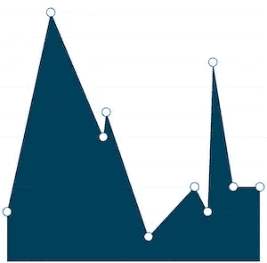

# 如何构建带有动态工具提示的 React 原生图表

> 原文：<https://betterprogramming.pub/how-to-build-react-native-charts-with-dynamic-tooltips-64aefc550c95>

## 使用 react-native-svg-charts 创建漂亮的图表


照片由[杰森·库德里特](https://unsplash.com/@jcoudriet?utm_source=unsplash&utm_medium=referral&utm_content=creditCopyText)在 [Unsplash](https://unsplash.com/search/photos/chart?utm_source=unsplash&utm_medium=referral&utm_content=creditCopyText) 上拍摄

在 React Native 中创建图表，无论是在网络上还是在移动应用程序上，都一直是一项有趣且具有挑战性的任务。很难找到一个合适的库可以同时满足你的功能和设计需求。您可以尝试制作自己的图表，但这通常会带来从头学习和实施的开销。

如果您像我一样是初学者，您可能希望使用现有的图表库，并且考虑到 React Native 社区还很年轻，您可以用来实现和定制图表的选项非常少。

# 问题陈述


带有可点击工具提示的面积图

在我们开始深入森林的旅程之前，让我们看看我们的问题陈述。

在这一部分中，我们的目标是绘制一个面积图，并在每个数据点添加一个圆形标记，点击该标记可以显示包含 X 和 Y 坐标值的工具提示。

为了解决这个问题，我对一些现有的 React 原生库做了一些研究，并将其缩小到其中两个，[React-Native-charts-wrapper](https://github.com/wuxudong/react-native-charts-wrapper)和 [react-native-svg-charts](https://github.com/JesperLekland/react-native-svg-charts) 。

# React 本机图表包装器

我们的第一个竞争者`[react-native-charts-wrapper](https://github.com/wuxudong/react-native-charts-wrapper)`，是流行的原生图表库 [MPAndroidChart](https://github.com/PhilJay/MPAndroidChart) 和[图表](https://github.com/danielgindi/Charts)的 React 原生包装器。

这个库是高度可配置的，因为它使用了本地图表库，所以它提供了如丝般平滑的过渡和触摸支持。在其 GitHub repo 中也有大量的用例示例。

一开始，考虑到它的性能和定制，它是我的首选。它有一个很长很具体的[安装](https://github.com/wuxudong/react-native-charts-wrapper/blob/master/installation_guide/README.md)指南，按照这个指南，我可以在 iOS 和 Android 设备上安装和运行它。

在 Android 上，一切似乎都很顺利。然而，当我试图创建一个 iOS 版本时，它给了我一个错误。在 GitHub 问题和谷歌上搜索了无数个小时后，我决定不使用它。

# 反应本地 SVG 图表

放弃`react-native-charts-wrapper`后，这是我能找到的最好的解决方案。

`[react-native-svg-charts](https://github.com/JesperLekland/react-native-svg-charts)`使用`[react-native-svg](https://github.com/react-native-community/react-native-svg)`来渲染图表。它也有大量的[例子](https://github.com/JesperLekland/react-native-svg-charts-examples)展示了许多用例。

因为它不使用任何本地链接，所以安装和实现非常简单明了。

> 如果你只是想看示例项目的源代码，在这里找到项目 repo [。](https://github.com/vikrantnegi/react-native-tooltip-chart)

好了，让我们开始派对吧！

# 入门指南

创建一个 React 本地项目并安装所有必需的依赖项:

```
~ react-native init ReactNativeTooltip
```

我们还需要安装并链接`react-native-svg`库:

```
~ npm i react-native-svg~ react-native link react-native-svg
```

如果您在使用 link 命令自动链接库时遇到任何问题，请遵循官方文档中提到的[手动](https://github.com/react-native-community/react-native-svg)步骤。

现在，最后，安装`react-native-svg-charts`:

```
~ npm install react-native-svg-charts
```

# 获取虚拟数据

在我们继续深入之前，我们需要找到一些可以用来渲染我们的`AreaChart`的数据。我们将使用一个名为 [Mockaroo](https://www.mockaroo.com/) 的第三方服务来为我们的项目生成一些模拟数据。

理想情况下，我们将从 API 获取这些数据，将其存储在组件状态中，然后将其提供给我们的区域组件。

下面是我的虚拟 JSON 数据的样子。完整的 JSON 数据文件见[此处](https://github.com/vikrantnegi/react-native-tooltip-chart/blob/master/src/Data.js):

# 使用 React 本机 SVG 图表

有很多我们可以用来创建图表的组件。在本教程中，我们将使用`AreaChart`组件，但是您可以使用任何一个可用的[图表组件。下面是一个`Areachart`图表组件的样子:](https://github.com/JesperLekland/react-native-svg-charts#components)

让我们来看看我们在`AreaChart`中使用的重要道具。

*   `data`:这是必填字段，必须是数组。
*   `yAccessor`:接受`data`(名为“item”)的每个条目以及索引并返回该条目的 y 值的函数。
*   `xAccessor:` 与`yAccessor`相同，但返回该项的 x 值。

你可以在官方[文档](https://github.com/JesperLekland/react-native-svg-charts#common-props)中读到更多关于其他可用道具的信息。

# 添加装饰者

为了尽可能地扩展而构建。所有图表都可以用 *decorators* 来扩展，这是一个以某种方式设计或增强图表的组件。只需将一个符合`react-native-svg`的组件作为子组件传递给图形，它将被调用，并提供所有必要的信息来布局您的装饰器。

对于本教程，我们需要两个装饰器，一个用于数据点标记，另一个用于工具提示。

*注意:确保你在* `*AreaChart*` *组件中放置了装饰者。否则，他们不会渲染。*

# 添加标记数据点

让我们创建一个装饰器，用作图表中每个数据点的标记。

我们需要为数据数组中的每一项设置一个圆形标记。为此，我们将遍历数据数组中的每一项，并为每一项返回`Circle` SVG 组件。

现在，为了在图表上定位它们，我们将使用`cx`和`cy`道具分别水平和垂直定位它们。对于`cx`我们将使用`date`键，对于`cy`我们将使用`score`键。

除此之外，当任何数据点被按下时，我们还将通过`onPress` prop 来设置三种状态:`tooltipX`、`tooltipY`和`tooltipIndex`。我们将使用这些状态来定位`Tooltip`装饰器。



带标记的面积图

# 添加工具提示

现在我们已经有了必要的信息，如 x 轴(`tooltipX`)、y 轴(`tooltipY`)和所按标记的索引(`tooltipIndex`)，我们可以使用它们将`Tooltip`放置在`AreaChart`上。

我们将为`Tooltip`装饰器创建一个新的[文件](https://github.com/vikrantnegi/react-native-tooltip-chart/blob/master/src/Tooltip.js)。

不要被这里所有的`React`、`G`和`Text`标签迷惑或吓倒，它们中的大多数只是为了工具提示的样式。

只需关注我们用来在图表上水平和垂直定位`Tooltip`的`tooltipX`和`tooltipY`。这些值与我们用于标记的`cx`和`cy`相同，只是我们增加和减少了一些值以在图表上调整它们。

除此之外，我们使用`tooltipIndex`来偏移第一个和最后一个工具提示，这样它们就不会被切掉。

> [这里的](https://github.com/vikrantnegi/react-native-tooltip-chart)是一个工作示例的完整源代码。


带有可点击工具提示的面积图

# 最后的想法

这就是我们创建图表、标记和工具提示所需要做的一切。这只是使用`react-native-svg-charts`库可以实现的一个基本实现。

如果你想探索更多，看看他们的[例子](https://github.com/JesperLekland/react-native-svg-charts-examples)回购，他们展示了大量其他用例。

*注意:为了简洁起见，我跳过了一些你可以在 Github repo 上找到的样板代码。*

如果你发现有什么困惑，请告诉我。如果你做过 React native charts，请分享一下你遇到过哪些库和用例！