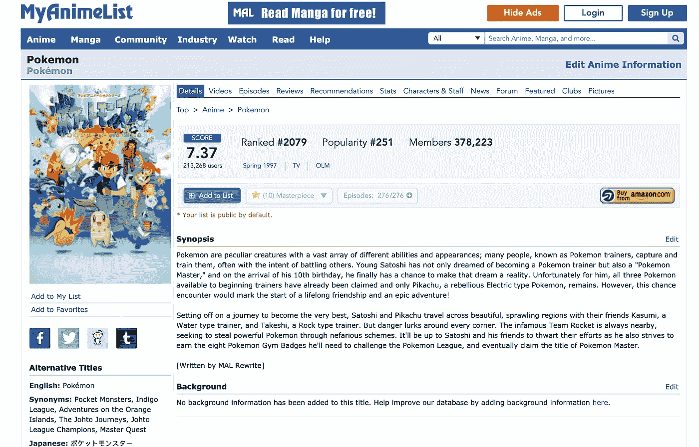
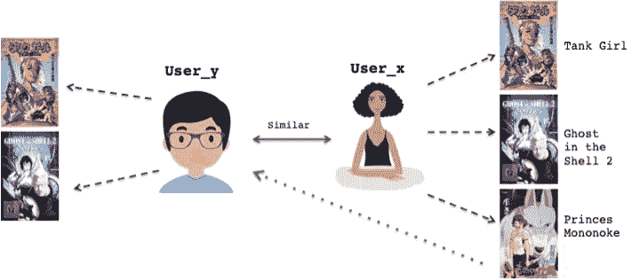
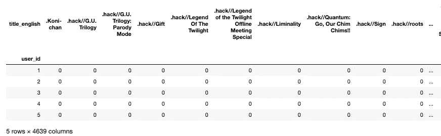
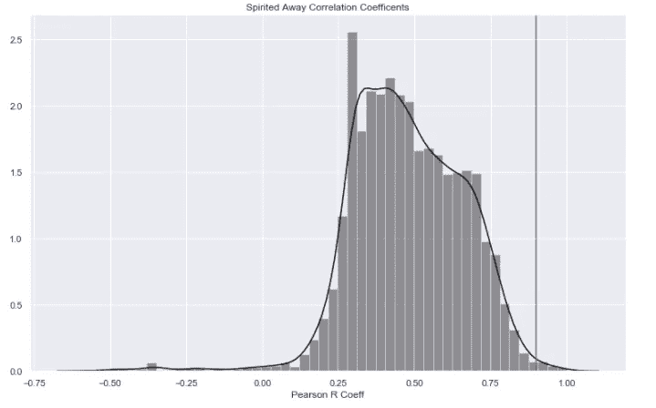
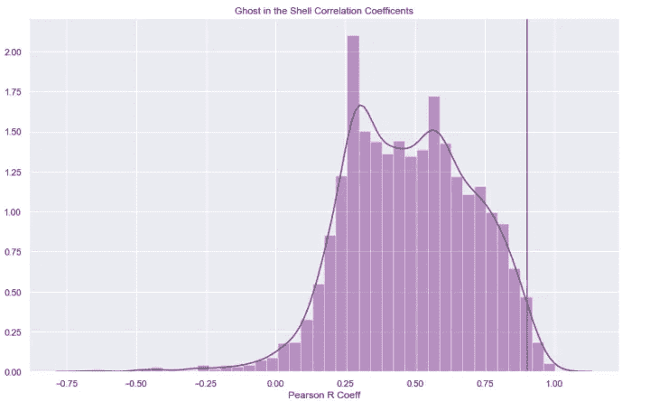
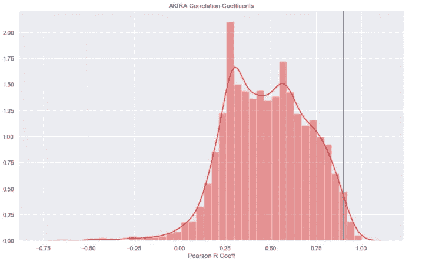
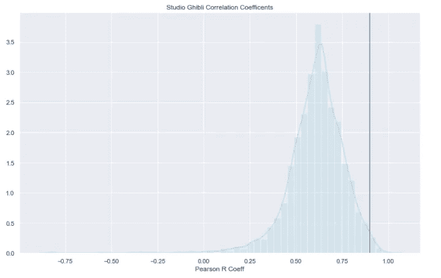
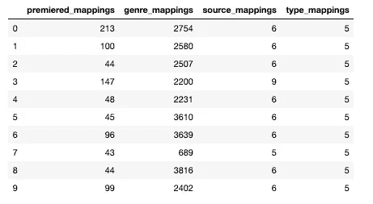
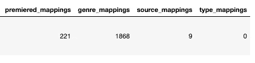
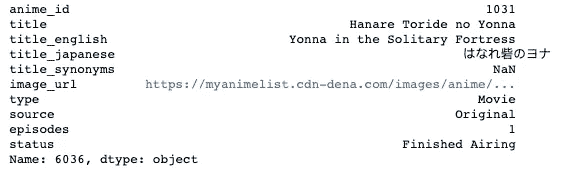

# 如何用 MyAnimeList 和 Sklearn 建立推荐模型

> 原文：<https://betterprogramming.pub/how-to-build-recommendation-models-with-myanimelist-and-sklearn-part-2-4802efba95cd>

## 基于用户评分相关性和特征变量推荐动漫内容的简单技术


马特·波波维奇在 [Unsplash](https://unsplash.com/s/photos/anime?utm_source=unsplash&utm_medium=referral&utm_content=creditCopyText) 拍摄的照片

[本系列的第一部分](https://towardsdatascience.com/building-predictive-models-with-myanimelist-and-sklearn-54edc6c9fff3)使用`MyAnimeList`着重于使用他们庞大的(公开可用的)数据库预测用户对动漫内容的评分。

本文将介绍一些用于推荐动漫内容的简单技术，基于用户评分相关性和特征变量，并使用与第一部分相同的数据框架。



MyAnimeList.com

在我们的大数据时代，推荐系统对于商业成功至关重要——利用我们的观看和收听模式来预测我们未来可能想要消费的东西。对大型科技公司利用我们的数字产品组合让我们使用他们的服务的方式进行诽谤很容易，但我们有时会忘记，当我们去享受我们的电影和音乐时，我们受益于个性化的体验(尽管我在以前的帖子中谈到过这种做法的缺陷)。

抛开观点不谈，Sklearn 中有一些有用且易于实现的推荐系统，你可以在 Jupyter 或你选择的 ide 中使用。这篇文章将分为上述两种形式的建议。我还会分享我写的代码，这样你就可以复制这种形式的分析。

# 数据准备

在执行任何分析之前，请安装必要的软件包:

```
import numpy as np
import pandas as pd
import sklearn
import matplotlib.pyplot as plt
from sklearn.decomposition import TruncatedSVD
import seaborn as sb
from sklearn.preprocessing import LabelEncoder
from sklearn.ensemble import RandomForestClassifier, 
from sklearn.linear_model import LogisticRegression
from matplotlib import rcParams
from sklearn.neighbors import NearestNeighbors
```

# 用户评级相关性

我们将使用的第一个建议将利用我们在第 1 部分中连接的动漫数据框架中的用户评级，使用协同过滤模型(CFM) 和技术，使用特定内容项目上用户评级之间的相关性。CFM 是基于这样一个假设，即用户会对与他们喜欢过的其他内容相似的项目打分，并且这些项目会受到具有相似品味的其他用户的喜欢(图 1)。使用 CFM，您可以根据数据中的用户评分计算推荐模型，并根据该计算结果提出建议。



图一。基于与另一用户(用户 x)相似/相关的观看偏好向用户 y 推荐内容的 CFM 的例子

使用来自`MyAnimeList`的数据，我们将使用一种叫做效用矩阵的东西，通常被称为用户项目矩阵。这些矩阵包含`MyAnimeList`上每个用户的值、每个内容项目以及用户对该项目的评分。我们可以通过使用熊猫中的`pivot_table`功能来创建这种变化的矩阵:

```
rating_crosstab = anime_df.pivot_table(values=’rating_x’, index=’user_id’, columns=’title_english’, fill_value=0)
rating_crosstab.head()
```



从上面的矩阵可以看出，大部分都是零值。这是因为不是每个用户都会对每条内容进行评价——最有可能的情况是`user_x`只会查看几条内容。

现在，我们使用奇异值分解(SVD)技术将效用矩阵改造成一种可以转换成相关矩阵的格式。SVD 是一种线性代数方法，可用于将用户项矩阵分解成三个单独的压缩矩阵。SVD 对于构建 cfm 来提出未来的建议是非常有用的，而不必参考我们的整个动漫数据库。点击此处阅读更多关于 [SVD 的信息。](https://blog.statsbot.co/singular-value-decomposition-tutorial-52c695315254)

首先，我们将获取用户项目矩阵并对其进行转置，然后使用 SVD 将其分解为用户评级的综合表示。Sklearn 的`TruncatedSVD`模块返回我们上面创建的用户条目矩阵的一个压缩矩阵。

压缩发生在我们的数据框的列上——因为我们想要推荐动漫项目，我们需要确保我们保留了内容项目/标题。我们希望在我们的数据框架中使用用户之间的相似性，因此我们使用 Sklearn 将所有用户评级压缩到 12 个潜在参数中。为了保留内容项目/标题，我们需要调整我们的矩阵，以便标题是行而不是列:

```
rating_crosstab.shape>>> (73348, 4639)X = rating_crosstab.T
X.shape>>> (4639, 73348)
```

然后我们将使用`TruncatedSVD`把这个矩阵压缩成 4639 x 12 的矩阵。所有单独的内容项目/标题将沿着行被保留。但是用户将被压缩成 12 个合成成分，它们代表了用户偏好的整体视图:

```
SVD = TruncatedSVD(n_components=12, random_state=17)
resultant_matrix = SVD.fit_transform(X)
resultant_matrix.shape>>> (4639, 12)
```

我们现在将通过为我们的结果矩阵中的每个内容项对生成皮尔逊 R 系数来生成相关矩阵，其中相关性基于用户评级之间的相似性:

```
corr_mat = np.corrcoef(resultant_matrix)
corr_mat.shape>>> (4639, 4639)
```

现在，我们可以在数据框架中分离出一些项目，根据有类似偏好的用户来确定它们与哪些其他动漫作品高度相关。我们将用三部电影作为例子:“千与千寻”、“龟壳里的幽灵”*、*和“阿基拉”。

```
spirited_away = movies_list.index('Spirited Away')
spirited_away>>> 3561ghost_in_the_shell = movies_list.index('Ghost in the Shell')
ghost_in_the_shell>>> 1342AKIRA = movies_list.index('AKIRA')
AKIRA78
```

我们将使用 Pearson R 值 0.95 作为高度相关内容的阈值。我们可以用 Seaborn 可视化系数的分布，看看有多少项存在这种普遍的关系:

```
plt.grid(True)
sb.distplot(corr_spirited_away, color="black", axlabel='Pearson R Coeff').set(title = 'Spirited Away Correlation Coefficents')
plt.axvline(0.95, 0,3.5)
plt.show()sb.distplot(corr_ghost_in_the_shell, color="black", axlabel='Pearson R Coeff').set(title = 'Spirited Away Correlation Coefficents')
plt.axvline(0.95, 0,3.5)
plt.show()sb.distplot(corr_AKIRA, color="black", axlabel='Pearson R Coeff').set(title = 'Spirited Away Correlation Coefficents')
plt.axvline(0.95, 0,3.5)
plt.show()
```



在上面的分布图中，线右边的一切代表皮尔逊 R 值大于 0.95 的电影。这是我们向`user_x`推荐的内容亮点。

我们现在可以查看我们推荐给用户的单个标题，如果他们在这些项目中得分很高:

```
list(movie_names[(corr_spirited_away<1.0) & (corr_spirited_away > 0.95)])>>> ['Howl's Moving Castle',
 'My Neighbor Totoro',
 'Ponyo',
 'Princess Mononoke']list(movie_names[(corr_ghost_in_the_shell<1.0) & (corr_ghost_in_the_shell > 0.95)])>>> ['AKIRA',
 'Cowboy Bebop: The Movie',
 'Cyber City',
 'Dead Leaves',
 'Ghost in the Shell',
 'Ghost in the Shell 2.0',
 'Ghost in the Shell 2: Innocence',
 'Ghost in the Shell: Stand Alone Complex',
 'Ghost in the Shell: Stand Alone Complex - Solid State Society',
 'Ghost in the Shell: Stand Alone Complex 2nd GIG',
 'Jin-Roh: The Wolf Brigade',
 'Paranoia Agent',
 'The Animatrix']list(movie_names[(corr_AKIRA <1.0) & (corr_ghost_in_the_shell > 0.95)])>>> ['Cowboy Bebop: The Movie',
 'Cyber City',
 'Dead Leaves',
 'Ghost in the Shell',
 'Ghost in the Shell: Stand Alone Complex - Solid State Society',
 'Ghost in the Shell: Stand Alone Complex 2nd GIG',
 'Jin-Roh: The Wolf Brigade',
 'Paranoia Agent',
 'The Animatrix']
```

毫不奇怪，当使用“千与千寻”时，高度相关的电影来自同一个制作工作室(吉卜力工作室)——用户会喜欢这些电影是很直观的。同样的，在使用《人鬼情未了》的时候，会把续集推荐给用户。值得一提的是，《蛋壳里的幽灵》和《阿基拉*之间有相当多的交叉，这也很直观，因为两者都是反乌托邦科幻小说。*

*我们可以使用上面的代码来推荐类似于整个制片厂的电影。我们将以吉卜力工作室为例:*

```
*rating_crosstab_studio = anime_df.pivot_table(values=’rating_x’, index=’user_id’, columns=’studio’, fill_value=0)rating_crosstab_studio.shape>>> (73487, 636)X_studio = rating_crosstab_studio.T
X_studio.shape>>> (636, 73487)SVD = TruncatedSVD(n_components=12, random_state=17)resultant_matrix_studio = SVD.fit_transform(X_studio)
resultant_matrix_studio.shape>>> (636, 12)corr_mat_studio = np.corrcoef(resultant_matrix_studio)
corr_mat_studio.shape>>> (636, 636)sb.distplot(corr_studio_ghibli, color="lightblue",axlabel='Pearson R Coeff').set(title = 'Studio Ghibli Correlation Coefficents')
plt.axvline(0.9, 0,3.5)*
```

**

```
*list(movie_names[(corr_studio_ghibli<1.0) & (corr_studio_ghibli > 0.95)])>>> ['Busou Shinki: Armored War Goddess',
 'Lagrange: The Flower of Rin-ne',
 'Lagrange: The Flower of Rin-ne Season 2',
 'Lagrange: The Flower of Rin-ne – Kamogawa Days',
 'Sengoku Collection',
 'Symphogear']*
```

# *特征映射-最近邻法*

*既然我们已经研究了使用 CFM 和相关分析的推荐，我们可以使用一种`NearestNeighbour` (NN)方法来推荐使用任意数量的特征变量的单个内容项目。神经网络算法是一种无监督的分类器。它通常被称为基于记忆的系统，因为它会记忆实例，然后根据与新实例的定量相似性来推荐内容。*

*对于这个分析，我们将使用四个特征变量来匹配内容:内容何时首映、其类型、其来源或媒体以及其类型(电视、电影、音乐等。).由于这些变量是分类数据，我们需要对它们进行一次性编码，以确保我们可以在数量相似性上匹配传入的实例:*

```
*enconder = LabelEncoder()
premiered_labels = enconder.fit_transform(anime_features['premiered'])
premiered_mappings = {index: label for index, label in 
                  enumerate(enconder.classes_)}enconder = LabelEncoder()
genre_labels = enconder.fit_transform(anime_features['genre'])
genre_mappings = {index: label for index, label in 
                  enumerate(enconder.classes_)}enconder = LabelEncoder()
source_labels = enconder.fit_transform(anime_features['source'])
source_mappings = {index: label for index, label in 
                  enumerate(enconder.classes_)}
source_mappingsenconder = LabelEncoder()
type_labels = enconder.fit_transform(anime_features['type'])
type_mappings = {index: label for index, label in 
                  enumerate(enconder.classes_)}*
```

*现在，我们可以将编码数据合并回我们的数据框，并显示它们存在于哪些列中:*

```
*anime_features[‘premiered_mappings’] = premiered_labels
anime_features[‘genre_mappings’] = genre_labels
anime_features[‘source_mappings’] = source_labels
anime_features[‘type_mappings’] = type_labelsX = anime_features.iloc[:,[31,32,33,34]]
X[0:10]*
```

**

*我们现在可以分离出一段我们想要匹配的内容。让我们用吉卜力工作室的《波妞》:*

```
*ponyo = anime_features.loc[anime_features[‘title_english’] == “Ponyo”] 
ponyo*
```

**

*将这些数字存储在一个变量中，并通过我们的`NearestNeighbours`函数传递它们:*

```
*t = [221,1868,9,0]nbrs = NearestNeighbors(n_neighbors=1).fit(X)print(nbrs.kneighbors([t]))>>> (array([[0.]]), array([[6036]]))*
```

*我们可以看到，从我们的编码数据点计算出的与`Ponyo`*在数量上最相似的项目存在于索引`6036`处。我们现在可以调用这个索引来查看`NearestNeighbour`函数推荐了哪些内容:**

********

**我们可以看到它已经推荐了**Yonna in the lonely Fortress，一部由竹内健吾执导的动漫奇幻/冒险短片。这个建议是有道理的，因为它也是一部儿童电影，聚焦于女性主角。看到大约有 2000 个独一无二的编码风格，我们有一个丰富的编码数据池来匹配这个参数。类似地，首映功能有大约 200 个编码条目，因为日期也按季节划分，这意味着我们可以更接近地匹配项目。****

# ****摘要****

****本文深入探讨了向用户提供内容推荐的两种方式。****

****首先，CFM 是一种简单而有效的方法，它使用根据用户评级计算出的相似内容项之间的相关性来推荐内容。****

****第二，NN 方法推荐来自一次性编码特征变量的内容，该特征变量将输入变量匹配到数量上相似的内容。****

****这两种方法可以以迭代的方式使用。通过使用 CFM 方法，我们可以将我们的相关变量存储在一个新对象中，并对我们最相关的内容项执行 NN，以便提出最佳内容。当然，这可能会产生递减的回报，因为我们想要提供大量的相关内容，而不仅仅是一个高度相关的内容。****