# 如何用 Flutter 构建响应式应用

> 原文：<https://betterprogramming.pub/how-to-build-responsive-apps-with-flutter-widgets-review-b22c6dec6904>

## 小工具一览

斯科特·韦伯在 [Unsplash](https://unsplash.com/s/photos/colorful?utm_source=unsplash&utm_medium=referral&utm_content=creditCopyText) 上拍摄的照片

应用程序配置通常会发生变化。当用户垂直或水平旋转手机时，键盘就会出现。

可折叠智能手机、Android 多窗口功能和 iOS 版 [Catalyst](https://developer.apple.com/design/human-interface-guidelines/ios/overview/mac-catalyst/) (该项目允许用户在 macOS 上运行 iOS 应用程序)的发布，揭示了屏幕尺寸的无限变化。

如果你想让你的应用程序设计看起来精致，你的应用程序应该对配置变化做出适当的“反应”。

# 从商业角度看响应式设计

响应式设计是一种允许应用程序、网站或系统适应用户屏幕大小的设计和开发技术。它将通过使网页/应用程序响应特定设备来优化用户的浏览体验。

响应式设计的概念在于使用一套代码，适应与各种设备(智能手机、平板电脑和台式电脑)相对应的不同布局变化。

# 响应式设计目标

1.  更多的观众。一个应用程序可以运行的设备越多，它吸引的受众就越广。
2.  引导用户购买。我相信一定有情感成分在推动人们在用户路径上直觉地前进。简单地说，它提前考虑了所有的用户故事。
3.  品牌知名度。一个漂亮的设计让你的品牌在竞争对手中很容易被认出来。

受众发生了重大转变，转而支持手机浏览。响应式设计是跨多种设备接触用户的最简单方式，并确保用户体验顺畅。

在开发阶段，我们使用的规则叫做“让移动版本先走”。

这种方法很方便，因为它总是更容易将为移动设备创建的设计调整到更大的屏幕上(剩余的空间可以用内容填充)。

换句话说，如果我们有一个简单的东西，我们可以把它变成一个复杂的东西。相反的过程更复杂。

# 为什么在颤振中使用响应式设计是必须的

设计师热爱魔术，然而，执行过程在现实生活中并不像我们希望的那样容易。如果你决定使用 [Flutter](https://flutter.dev/) ，你的设计师将永远忘记“这是不可能的”这句话。

Flutter 提供了许多小部件和类来简化设计者想法的实现。

1.  [aspectation](https://api.flutter.dev/flutter/widgets/AspectRatio-class.html)
2.  [定制单](https://api.flutter.dev/flutter/widgets/CustomSingleChildLayout-class.html)
3.  [子布局](https://api.flutter.dev/flutter/widgets/CustomSingleChildLayout-class.html)
4.  [CustomMultiChildLayout](https://api.flutter.dev/flutter/widgets/CustomMultiChildLayout-class.html)
5.  [适配箱](https://api.flutter.dev/flutter/widgets/FittedBox-class.html)
6.  [FractionallySizedBox](https://api.flutter.dev/flutter/widgets/FractionallySizedBox-class.html)
7.  [附属建筑](https://api.flutter.dev/flutter/widgets/LayoutBuilder-class.html)
8.  [媒体查询](https://api.flutter.dev/flutter/widgets/MediaQuery-class.html)
9.  [MediaQueryData](https://api.flutter.dev/flutter/widgets/MediaQueryData-class.html)
10.  [方向生成器](https://api.flutter.dev/flutter/widgets/OrientationBuilder-class.html)

# 键盘更改处理

在大多数情况下，应用程序包括文本字段，每当用户与应用程序交互时，键盘就会出现。

Scaffold 小部件自动处理键盘更改，解决链接问题。它有一个控制`[MediaQueryData.viewInsets](https://api.flutter.dev/flutter/widgets/MediaQueryData/viewInsets.html)`行为的`resizeToAvoidBottomInset`字段。

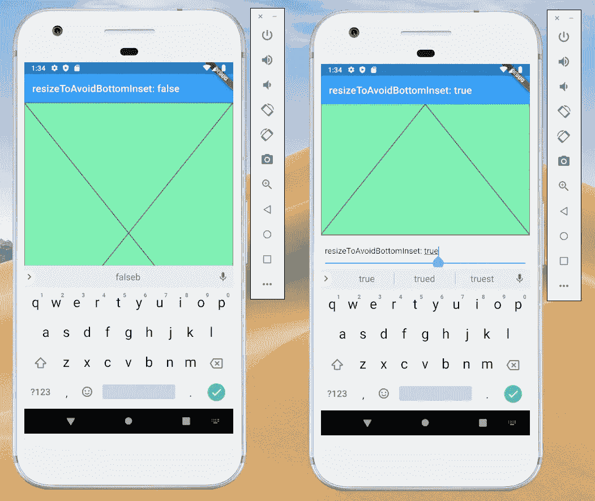

# 使用 MediaQuery 定义配置

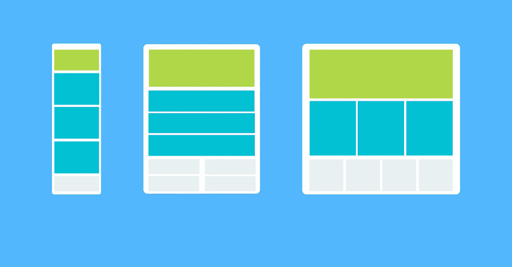

你可以使用`MediaQuery`来获得窗口的实时尺寸。它表明了应用程序的大小和方向。

如果您想要基于完整的上下文而不是仅仅基于特定小部件的大小来做出决策，那么`MediaQuery`小部件非常有用。

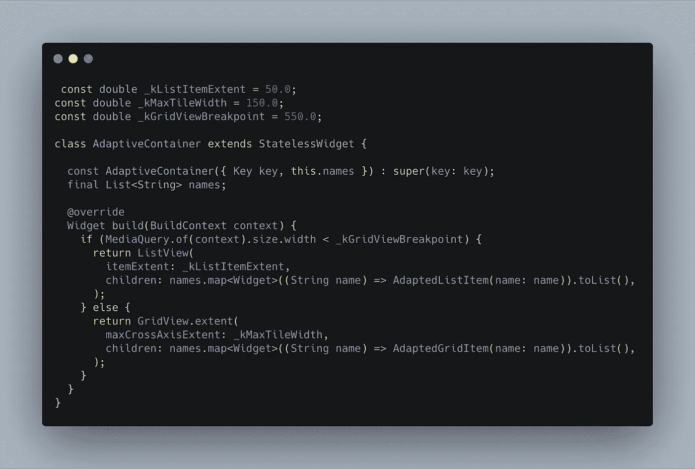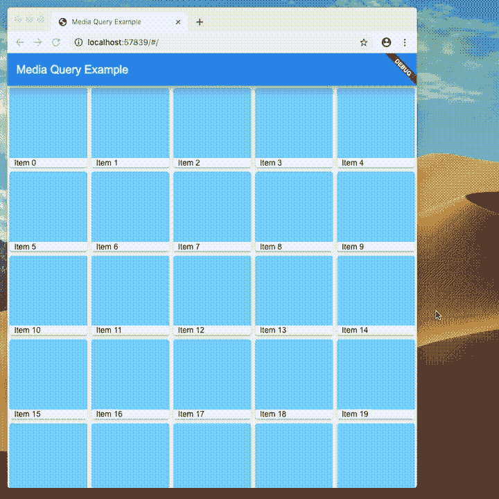

方向的数量有限(例如，仅纵向)。

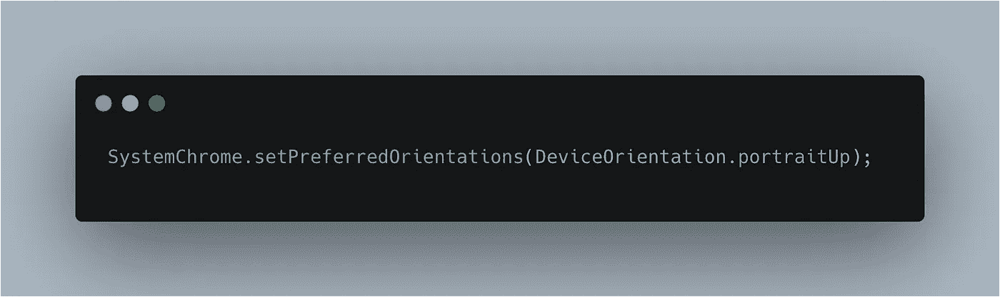

# 使用 LayoutBuilder 类

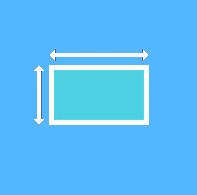

`LayoutBuilder`是`MediaQuery`的简化版，专为基本尺寸需求打造。

它是一个小部件，提供了其父部件的尺寸，这样您就可以知道有多少空间用于小部件，并能够相应地构建子部件。

从它的 builder 属性中，可以得到一个`BoxConstraints`对象。您可以根据约束的属性(设备的高度、设备的宽度、纵横比或其他属性)来调整显示。

例如，如果`maxWidth`大于宽度断点，则返回一个`Scaffold`对象，该对象的一行左侧有一个列表。

如果更窄，返回一个`Scaffold`对象和一个包含列表的抽屉。当约束改变时，构建函数运行。

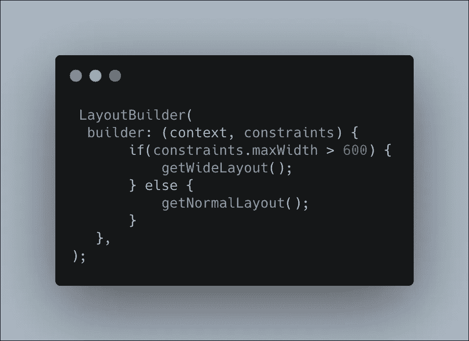

# 使用 OrientationBuilder 类

`OrientationBuilder`小部件与`LayoutBuilder`非常相似。从它的 builder 属性中，您可以获得`Orientation`对象。

例如，您可以使用`OrientationBuilder`来更改`GridView`的列数。

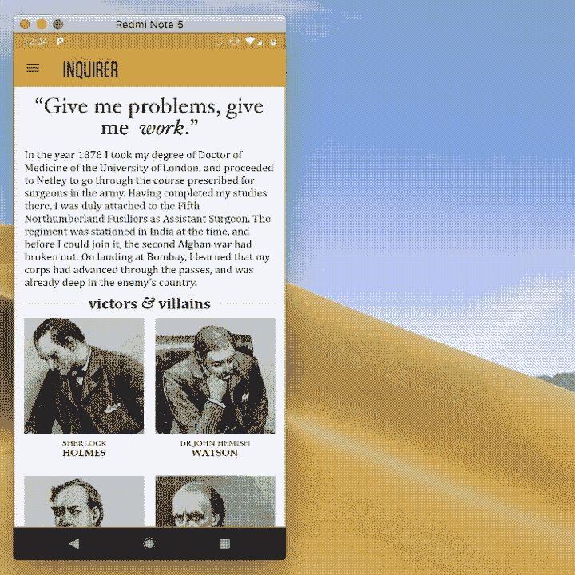

# 使用 FittedBox 类

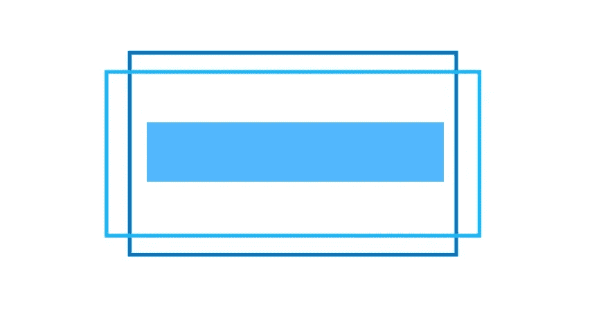

通常，您必须根据父窗口小部件的大小来缩放文本。您可以为各种平台使用固定值，或者让小部件根据父小部件的大小进行缩放。

文本会相应地调整大小。一般情况下，可以使用其他类型的`BoxFit`。您可以在下图中看到它们的行为方式:

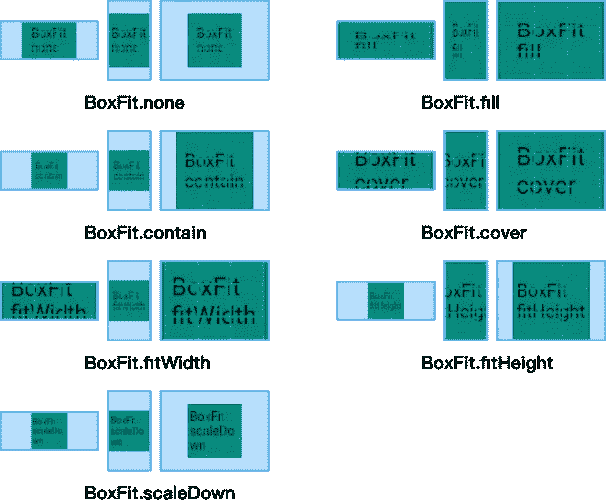

# 使用 AspectRatio 小部件

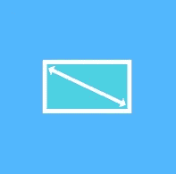

开发应用程序时，你可以忽略它的大小，但你必须考虑长宽比。

不管设备的大小，它可以是宽的、薄的或正方形的。在这一点上，Flutter 通过提供将子值调整到特定纵横比的`AspectRatio`小部件来帮助您。

# 使用灵活和扩展的类

`Flexible`和`Expanded`是两个小部件，您可以在`Row`、`Column`或`Flex`中使用，让他们的孩子可以灵活地扩展以填充可用空间。

不同之处在于`Expanded`小部件要求孩子填充可用空间，而`Flexible`不要求。您可能想使用`Flexible`和`Expanded`小部件来获得一个灵活的 UI，它处理百分比而不是硬编码的值。

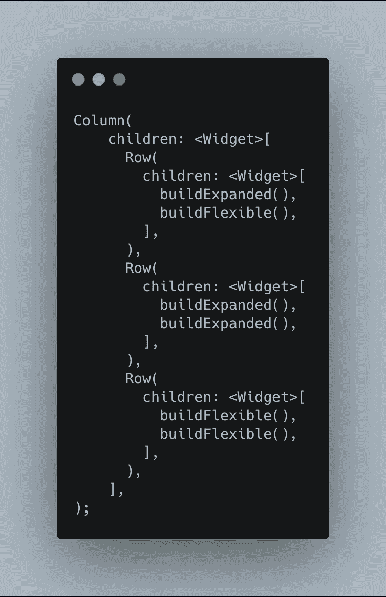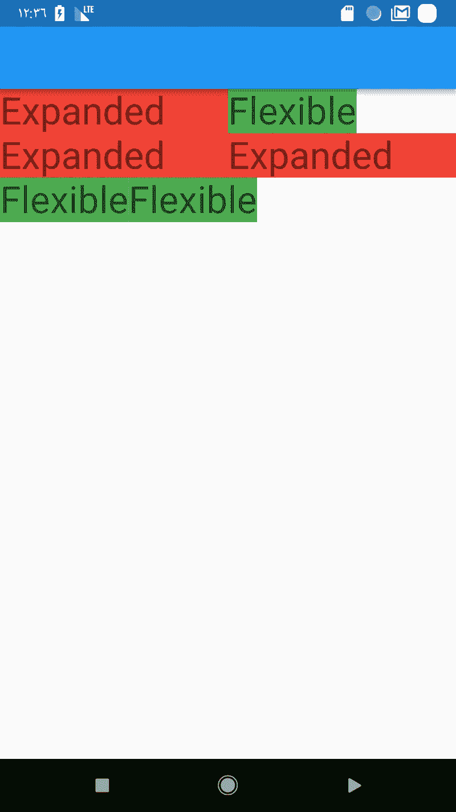

# 使用 FractionallySizedBox 小部件

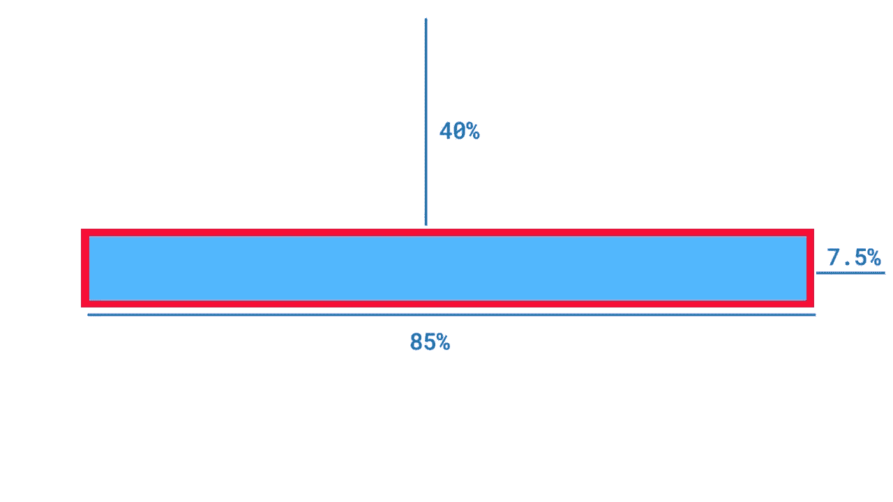

有时候你的设计需要相对的尺寸，例如，一个按钮占据了应用程序宽度的 80%,而边距只占 10%。能应付那件事。

用`FractionallySizedBox`包裹你想要大小的孩子。给它一个高度和/或宽度因子(0.8 表示可用大小的 80%)，并使用对齐来控制小部件的确切位置。

您也可以使用没有子元素的`FractionallySizedBox`来表示微小的空白。

您可能希望将这个`FractionallySizedBox`封装在一个灵活的小部件中，这样它就可以很好地处理行或列。

# CustomMultiChildLayout

`CustomMultiChildLayout`是一个为高级布局用户开发的更复杂的小部件，请继续关注，我们将在下一篇技术博客文章中讨论它。

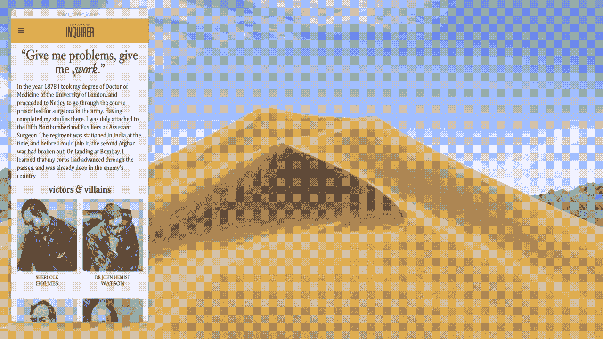

如果你对[的 Flutter 应用开发](https://inveritasoft.com/technologies/flutter)， [inVerita](https://inveritasoft.com/blog/how-to-build-responsive-apps-with-flutter-widgets-review) 很乐意帮忙。

# **有用的链接**

1.  [颤振响应布局](https://flutter.dev/docs/development/ui/layout/responsive)
2.  [响应式设计](https://medium.com/flutter-community/tagged/responsive-design)
3.  [颤振响应设计](https://www.raywenderlich.com/4324124-responsive-design-for-flutter-getting-started)
4.  [源代码](https://github.com/nazarcybulskij/Responsive_design_Flutter_example)

祝你好运，

纳扎尔·西布尔斯基

*原载于 2020 年 2 月 25 日 inveritasoft.com**T21*