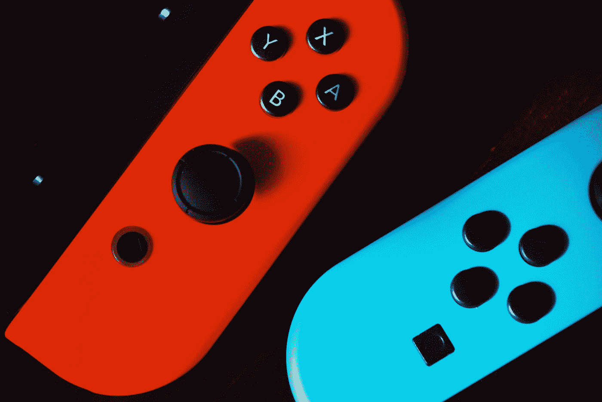

# 如何用通知、SwiftUI 和 Combine 构建 SimonSez 第 2 部分

> 原文：<https://betterprogramming.pub/how-to-build-simonsez-with-notifications-swiftui-and-combine-part-2-de717b1c53d5>

## 如何构建一个简单的网络游戏的第 2 部分



照片由[阿列克斯·多罗霍维奇](https://unsplash.com/@aleksdorohovich?utm_source=medium&utm_medium=referral)在 [Unsplash](https://unsplash.com?utm_source=medium&utm_medium=referral) 拍摄。

我最讨厌的事情之一是阅读一篇基于 iOS Y 和 Swift X 的文章，但读到一半时却发现它已经过时了。所以预先警告:这是写在 iOS 13 和 Swift 5 上的。

好了，如果你一直在关注，这就是:Swift UI 的破折号。然而，在开始之前，我想感谢 Majid Jabrayilov 和 Filip Sakel 帮助我编写 SwiftUI 代码。

我们首先导入 SwiftUI，并组合和定义半打我们将使用的`PassThroughSubjects`，以及表示我们在[第 1 部分](https://medium.com/better-programming/how-to-build-simonsez-with-notifications-swiftui-and-combine-b143920261c3)中构建的类的对象:

接下来，我们定义一个结构实例，我们将使用它来保存我们在 pickerView 中显示的键值对，以及我将使用的一种字体:

现在，我们有了主体。我知道这是很难调试，如果你打错字，所以我要小心。我们开始定义结构和我们将要使用的所有变量:

然后，我们定义应用程序的标题，以及一些`PassThroughSubjects`和它们的动作:

这个定义包括当一方请求另一方玩游戏时发出的警告。接下来，我们有一个按钮，它将发布您的玩家代码并将其保存到云:

在下一节中，我将定义并填充 pickerView。此代码仅对其他玩家的初始选择可见:

这段代码定义了我们的第一个通知，并在途中发送它。接下来，我们有两个按钮，将根据轮到谁挑战或回答来切换开关:

这发布了我们的另外两个 JSON 对象。第一个发送需要复制的一系列按钮，而第二个发送命令来切换轮到谁领先。

最后一节把我们带到这个观点的主体的结尾:

最后，我们需要定义私有函数来激活切片，这将我们带到主体定义的末尾:

最后，我们有了`Wedge`形状的定义:

预览部分:

```
struct ContentView_Previews: PreviewProvider {
static var previews: some View {
ContentView()
}
}
```

# 结论

这就是我们需要的:您需要安装的全部`ContentView.swift`。此时，您肯定已经准备好尝试它了。