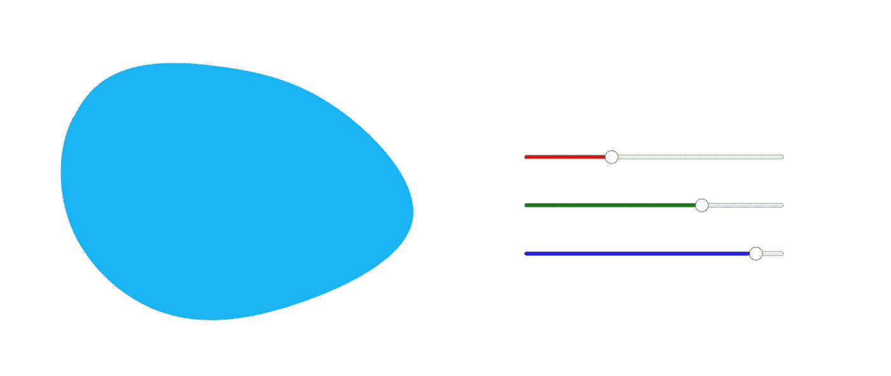

# 如何用 d3.js 构建滑块

> 原文：<https://betterprogramming.pub/how-to-build-sliders-with-d3-js-f6b442171540>

## 用 HTML 和 Javascript 制作滑块的教程

我正在编写一个关键用户流的原型，需要为测试用户创建自定义 blob 外观的能力。对于原型控件，我决定使用 [d3.js](https://d3js.org) 来创建测试用户可以操作的滑块。本教程介绍了我构建滑块的步骤，以及我发现有用的资源。

## 建立你的工作空间。

在目录中设置您的文件:

*   index.html
*   主页. js
*   main.css

## 安装 d3.js

[下载 d3.js](https://d3js.org/) 并解压缩到您的项目文件夹，或者您可以链接到 html 文件底部的脚本:

``

通过带有`npm install d3-simple-slider`的终端安装[D3-简单滑块](https://bl.ocks.org/johnwalley/e1d256b81e51da68f7feb632a53c3518)或者你可以[从 GitHub](https://github.com/johnwalley/d3-simple-slider) 下载。

## 设置您的 HTML 和 CSS

我会把 CSS 留给你，但是这里有一个基本的`index.html`设置，有 2 个`div`元素，我们将在`main.js`文件中调用它们。

第一个是`id="mood"`，包含一个 SVG，这是我们将使用滑块操作的内容。(我使用 [Blobmaker](https://www.blobmaker.app/) 生成了 SVG)第二个`id="slider-color-picker"`，目前为空。JavaScript 将完成构建滑块的工作。

## 设置 main.js。

让我们看一下剧本。首先，我们为在 index.html 设置的 SVG 和 colorSlider `div`设置变量

接下来，我们编写一个将 RGB 值转换为十六进制的函数:

然后，我们选择在`index.html`中命名的`div`，并添加一个 SVG，该 SVG 基本上充当我们稍后将调用的 3 个 RGB 滑块的画布。

接下来，我们命名调用和样式化 R、G 和 b 的滑块的函数。(对于不同样式的滑块，[查看约翰·沃利的教程](https://bl.ocks.org/johnwalley/e1d256b81e51da68f7feb632a53c3518)。)该脚本还将斑点的颜色更改为滑块上选择的 rgb 值。最后，调用滑块画布并调用滑块函数。

## 测试它，并根据需要进行调整

你现在应该有一个工作的 blob 和 rgb 滑块了。尝试一下，并根据需要进行修改！

## 有用的资源

*   [本教程的全部要点](https://gist.github.com/carewren/3018610d6857121ad4a43a31366fa342)
*   [d3 简单滑块教程](https://bl.ocks.org/johnwalley/e1d256b81e51da68f7feb632a53c3518)(约翰·沃利)
*   [d3js 文档](https://d3js.org/)(数据驱动文档)