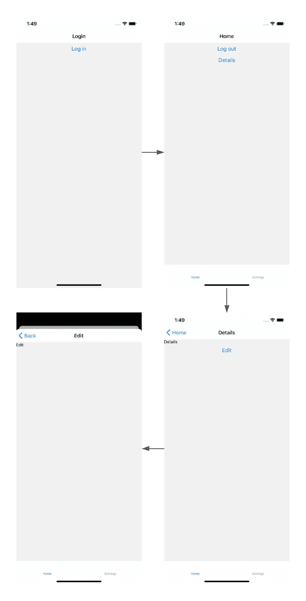
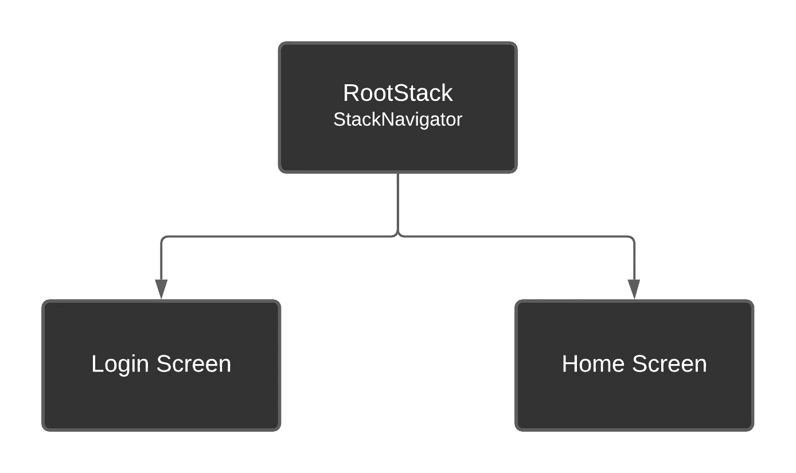
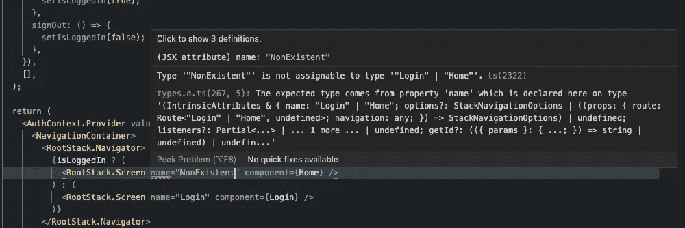
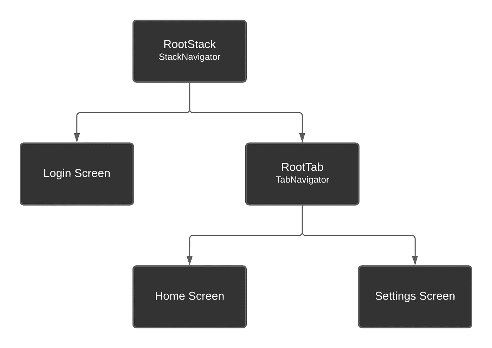
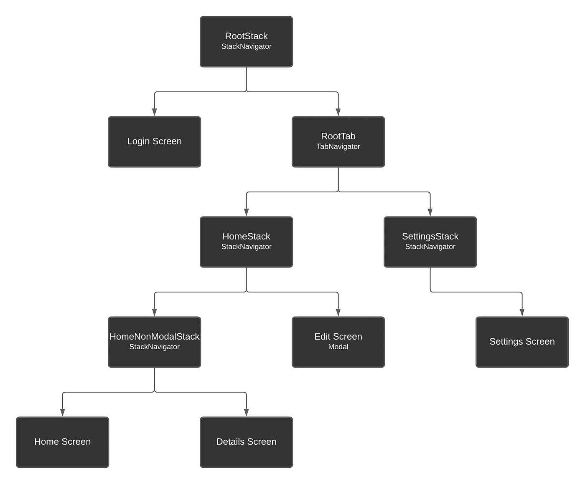
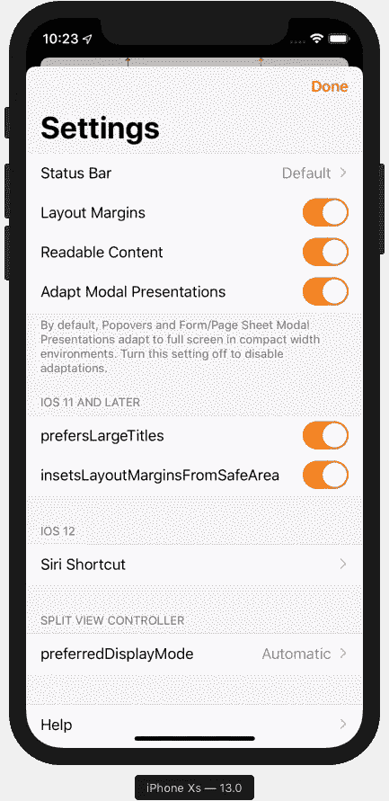
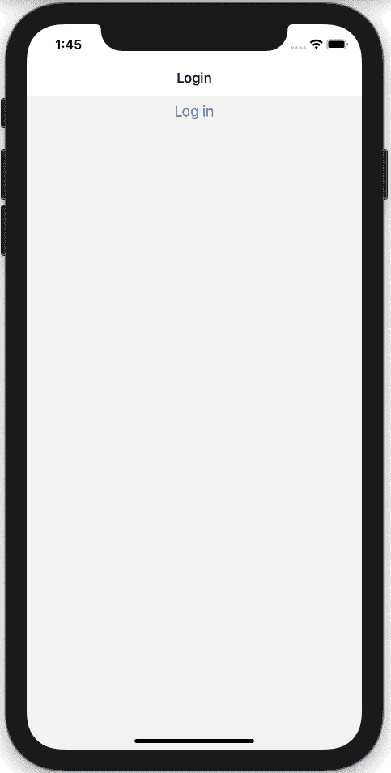

# 使用 React Navigation 5 构建最常见的应用导航模式

> 原文：<https://betterprogramming.pub/how-to-build-the-most-common-app-navigation-pattern-with-react-navigation-5-41fe4ddbe61d>

## 利用 TypeScript 设置您的跨平台应用程序的流程


由[阿尔瓦罗·雷耶斯](https://unsplash.com/@alvarordesign?utm_source=medium&utm_medium=referral)在 [Unsplash](https://unsplash.com?utm_source=medium&utm_medium=referral) 上拍摄的照片。

毫无疑问， [React Native](https://reactnative.dev/) 已经成为创建移动应用的强大且广泛使用的工具。在撰写本文时，它是构建跨平台应用程序使用最多的库。

此外，如果你看一看商店里的应用程序(至少在 iOS 上)，你可以看到在数千个应用程序中重复的导航模式。我说的是从登录屏幕开始，然后在标签或抽屉导航中移动到主屏幕的应用程序。在选项卡或抽屉导航内的每个屏幕上，用户通常可以使用堆栈或模态导航导航到其他屏幕。

在本文中，我们将看到如何使用 [React Navigation](https://reactnavigation.org/) 版本 5 的一些特性来构建这个导航模式。我们将使用 TypeScript 来完成它，这可能会带来一些挑战，因为还没有太多关于这个主题的文档。

这些是我们的应用程序将具有的屏幕:

*   注册
*   主页
*   设置
*   细节
*   编辑



对于这个例子，我们将使用标签导航，尽管它可以很容易地转换为抽屉导航。

# 做好准备

首先，使用 TypeScript 模板创建一个 React 本机应用程序:

```
npx react-native init NavigationCommonPattern --template react-native-template-typescript
```

然后，通过运行以下命令，将 React 导航所需的所有依赖项添加到项目中:

```
yarn add @react-navigation/native @react-navigation/stack @react-navigation/bottom-tabsyarn add react-native-reanimated react-native-gesture-handler react-native-screens react-native-safe-area-context [@react](http://twitter.com/react)-native-community/masked-view
```

如果您正在开发 iOS 应用程序，请运行以下命令来安装 pod:

```
npx pod-install ios
```

最后，为了能够使用 React 导航，转到`index.js`文件，将这一行放在最开始(甚至在 React 导入之前):

```
import 'react-native-gesture-handler';
```

现在一切都准备好了，您可以开始编写应用程序的代码。

# 认证流程

此时的目标是拥有两个屏幕(登录和主页)，用户只有在正确登录的情况下才能导航到主页屏幕。此外，如果用户在打开应用程序时已经登录，我们将直接显示主屏幕。为此，我们将使用以下结构的 StackNavigator:



一个简单的双屏幕堆栈导航器

为了控制登录状态，我们将使用带有两个函数的 [React Context](https://reactjs.org/docs/context.html) :一个用于登录，一个用于注销。将以下代码放在名为`AuthContext.tsx`的文件中:

接下来，使用以下代码为登录和主屏幕创建两个文件:

注意我们是如何使用我们创建的上下文中的函数的。

现在转到`App.tsx` 文件并删除所有内容。我们不会使用那里的任何东西。相反，请使用以下代码:

让我们分析一下这段代码:

*   在第 15 行，我们使用第 9 行定义的`RootStackParamList`类型初始化 StackNavigator。这意味着我们将有两个屏幕(登录和主页),现在不接收任何参数——因此是`undefined`类型。
*   在第 19 行，我们正在为`AuthContext`定义初始值，这是我们声明的两个函数的定义。在这些函数中，我们只是根据用户是登录还是退出来改变第 17 行定义的状态变量`isLoggedIn`为`true`或`false`。
*   最后，我们可以在第 32 行看到，我们通过创建一个导航器并附加我们之前创建的两个屏幕来定义导航。此外，我们用`AuthContext`包装所有东西。这里重要的部分是在第 35 行和第 39 行之间。我们可以看到，如果`isLoggedIn`变量是`true`，我们只显示主屏幕，否则显示`Login`屏幕。

此外，我们可以在下图中看到，如果我们试图使用未定义的屏幕名称，TypeScript 如何通过显示错误来帮助我们避免运行时错误:



Typescript 智能感知

# 添加 TabNavigator

现在我们将从根栈中取出主屏幕，并将它与一个名为 Settings 的新屏幕放在一个 TabNavigator 中。然后，我们将使用 TabNavigator 作为 RootStack 屏幕。这将创建以下导航结构:



嵌套在 StackNavigator 内部的 TabNavigator

首先，创建一个名为`Settings.tsx`的新文件，并粘贴以下代码来创建设置屏幕，其中只有一个简单的文本:

然后，使用以下代码更新`App.tsx`文件:

让我们看看发生了什么变化:

*   在第 21 行，我们创建了一个名为`RootTabParamList`的新类型，它定义了选项卡将包含的屏幕列表。在第 18 行，我们用一个使用新类型的名为`RootTab`的新属性替换了`RootStackParamList`上的`Home`属性。
*   在第 43 行，我们创建了 TabNavigator。在第 59 行，我们定义了将包含在选项卡内的屏幕(主页和设置)。
*   最后，在第 71 行，我们用整个 TabNavigator 替换了主屏幕。

因为我们现在使用整个导航器作为一个屏幕，所以选项卡内所有屏幕的标题都将具有父屏幕的名称(在本例中为`RootTab`)。为了能够使用实际的名字或我们想要的任何其他名字，我们在第 26 行*上添加了函数`getTabHeaderTitle`。你可以查看[文档](https://reactnavigation.org/docs/screen-options-resolution/#setting-parent-screen-options-based-on-child-navigators-state)了解更多信息。*

# 添加更多屏幕和导航类型

在这一点上，我们已经为许多应用程序打下了良好的基础。但是我们通常希望从选项卡屏幕导航到其他屏幕(例如，从主屏幕导航到详细信息屏幕)。让我们在申请中包括这一点。此外，从详细信息屏幕，我们将导航到一个编辑屏幕，其中将有一个全屏模式。

接下来的更改将导致以下导航结构:



和前面一样，首先为详细信息和编辑屏幕创建两个文件:

然后更新`App.tsx`文件以包含以下代码:

让我们看看发生了什么变化:

*   尽管 React 导航中的模态也是 StackNavigators，但是模态设置是在整个堆栈中设置的。这意味着里面的所有屏幕都将作为模态导航。为了避免这种情况，我们可以将另一个 StackNavigator 嵌套在带有模态属性的 stack navigator 中，就像我们在第 88 行和第 115 行之间所做的那样。编辑屏幕将作为模式导航，包含在`HomeNonModalStackScreens`中的屏幕将正常导航。
*   在第 22 行和第 34 行之间，我们为新的栈创建了新的类型:`HomeStackParamList`、`HomeNonModalStackParamList`和`SettingsStackParamList`。我们正在为 Settings 屏幕创建一个新的堆栈，因为我们在选项卡中嵌套了一个堆栈，所以我们需要从选项卡中移除标题(第 132 行)。否则会导致双头。因此，设置屏幕没有标题。获得标题最简单的方法是将屏幕放在 StackNavigator 中。
*   43 号线上发生了什么？当使用`TransitionPresets.ModalPresentationIOS`属性时(以便模态在调用它的屏幕前打开)，标题采用双倍高度。这段代码是为了删除它。



在文档中查看关于此[的更多信息。](https://reactnavigation.org/docs/stack-navigator/#transitionpresets)

# 结果

这是我们完成代码后应用程序的外观和导航方式:



这是一个 GitHub 项目，包含我们在本文中编写的代码，您可以将其用作模板，它包括一个更适合生产项目的文件夹结构。

[](https://github.com/drac94/react-native-common-navigation) [## drac 94/react-native-common-导航

### 在 GitHub 上创建一个帐户，为 drac 94/react-native-common-navigation 开发做出贡献。

github.com](https://github.com/drac94/react-native-common-navigation) 

# 结论

正如我们在编写这个导航模式的代码时所看到的，React Navigation 中用来实现它的最常用的特性是嵌套导航器。在这个例子的最后，我们有三个嵌套导航器的深度，这是理想的。嵌套的导航器越多，我们的代码就变得越复杂，性能就越差。

使用嵌套导航器有一些缺点和建议，你可以在官方文档中读到。确保你仔细阅读它，了解一切是如何工作的。