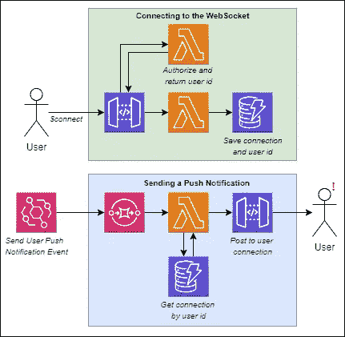

# 如何使用 AWS WebSockets 构建用户通知

> 原文：<https://betterprogramming.pub/how-to-build-user-notifications-with-aws-websockets-93b1b16b8af4>

## 当长时间运行的任务完成时发送通知是异步软件成功的关键。通过 WebSockets，我们可以在几分钟内将它添加到我们的工作流程中


照片由 [Unsplash](https://unsplash.com/s/photos/notification?utm_source=unsplash&utm_medium=referral&utm_content=creditCopyText) 上的 [Prateek Katyal](https://unsplash.com/@prateekkatyal?utm_source=unsplash&utm_medium=referral&utm_content=creditCopyText) 拍摄

当你登录像脸书这样的网站时，你首先会看哪里？你的提要的顶部？故事横幅？

大概不会。

你的眼睛直接看工具栏，看看是否有一个红色的小徽章显示你的通知或新朋友的请求。我们没办法，我们喜欢通知。

我们看到的每一个小通知都会在我们的大脑中发出一个信号，给我们一种满足感。老实说，我们对通知上瘾了。那么，还有什么比用我们的 WebSocket 来实现更好的呢？

如果您一直在关注，这是 WebSockets 介绍系列的第四部分。每一部分都建立在前一部分的基础上，所以如果你现在加入我们，我强烈推荐阅读前三部分。

*   [第一部分——构建一个 WebSocket](/introduction-to-aws-websockets-8b336a92c379)
*   [第二部分——保护您的网络插座](/using-authoriser-for-aws-websockets-caf7a0441c8e)
*   [第三部分—使用异步 API 规范的文档](/aws-websockets-writing-documentation-using-async-api-spec-6c4ccc77f20)

今天，我们将扩展我们已经构建的内容来创建**用户通知**。

# 部署到云

就像前面三个部分一样，工作都是提前完成的。要部署添加用户通知的更新，请在本地机器上的 repo 的根目录下的终端中运行以下命令。

```
git fetch 
git checkout part-four 
npm run deploy
```

这将检验演练的这一部分，并将其部署到 AWS。支持用户通知的更新包括:

*   一个 lambda 函数，用于搜索和发布特定的用户连接
*   [死信队列(dlq)](https://docs.aws.amazon.com/AWSSimpleQueueService/latest/SQSDeveloperGuide/sqs-dead-letter-queues.html)事件传递/处理失败
*   [CloudWatch 警报](https://docs.aws.amazon.com/AmazonCloudWatch/latest/monitoring/AlarmThatSendsEmail.html)用于在出现故障时发出通知
*   对异步 API 规范的更新，定义了新的输入和输出事件

幸运的是，在现有的基础上增加用户通知很容易。我们的数据结构允许特定用户 [访问模式](https://docs.aws.amazon.com/prescriptive-guidance/latest/dynamodb-data-modeling/step3.html)的 *give me connections，所以修改很简单。*

# 查找用户连接

利用我们在上一篇文章中构建的 web socket[，我们向 *$connect* 端点添加了一个 lambda authorizer，它将连接用户的`userId`保存到数据库中。](/using-authoriser-for-aws-websockets-caf7a0441c8e)

我们可以使用这些信息来查找用户打开的连接，以便向他们发送推送通知。当一个新的`Send User Push Notification` EventBridge 事件进来时，我们可以在数据库中查询那个`userId`的所有连接，并向它们发送一条消息。



*使用连接详情接收推送通知*

在我们的数据模型中，我们将用户 id 作为`pk`保存在我们的`GSI`中，这样我们就能够只对传入事件中提供的用户 id 运行查询。

```
{ 
  "pk": "<connectionId>", 
  "sk": "connection#", 
  "GSI1PK": "<userId>", 
  "GSI1SK": "user#", 
  "ipAddress": "<connecting ip address>", 
  "connectedAt": "<epoch connected at time>", 
  "ttl": "<time to live before connection is removed>" 
}
```

[全局二级索引(GSI)](https://docs.aws.amazon.com/amazondynamodb/latest/developerguide/GSI.html) 允许我们查询数据库中具有`userId`的`GSI1PK`的所有记录。这允许我们获得到 WebSocket 的连接，这样我们就可以传递来自事件的消息。[参见λ函数](https://github.com/allenheltondev/serverless-websockets/blob/part-four/lambdas/create-user-notification/index.js#L39)。

# 用户通知的类型

我们可以通过 WebSocket 连接实现两种不同类型的用户通知:**可操作**和**反馈**通知。就用户体验而言，每个通知都有其独特的用途。

## 可操作的通知

如果我们在脸书点击一个通知，它什么也不做，它可能不会有这样的上瘾效果。但是如果你点击它，你被带到某个地方去执行一个动作，那么通知就有了价值。

我们通过 WebSocket 发送给用户的推送通知包含两条数据:

*   向用户显示的**消息**
*   用户可以跟随一个**回调**来执行一个动作

该消息将通知用户发生了一些事情，回调将让他们做一些事情。以这个事件为例:

```
{ 
  "message": "The XYZ report has finished processing and is ready for review.", 
"callback": "https://www.gopherholesunlimited.com/jobs/736ajdff7/results" 
}
```

通过此消息，用户可以看到他们请求的报告已经完成处理。当他们转到`callback` url 时，他们会看到与该消息相关的结果。

## 反馈通知

另一方面，反馈通知提供状态更新。他们不会在用户界面的通知图标旁边添加一个红色的小徽章。

如果您正在等待一个长时间运行的流程，一个*反馈通知*会向您提供关于它在流程中的位置的更新。一个例子是上传的完成百分比或一条消息，说明作业正在做什么。如果我们使用报告示例，反馈用户通知应该如下所示:

```
{ 
  "message": "Calculating average time between status changes..." 
}
```

注意这个通知中没有`callback`。它只提供信息，不提供任何操作。

> *反馈通知的目的是向最终用户保证系统正在做一些事情。*

提醒用户后台正在发生一些事情总是一个好主意，这样他们就不会认为有什么地方出错了。

# 推送通知的错误处理

当涉及到错误处理时，事件驱动架构(EDA)是出了名的困难。由于我们使用无服务器服务，我们加倍了对增强可观察性的需求。

为了帮助跟踪 WebSocket 的状态，我们实现了死信队列，这样当出现问题时，我们可以在一个位置丢弃事件。在我们的 WebSocket 中，我们会遇到两种类型的问题:

1.  事件传递失败
2.  事件处理失败

**当 EventBridge 无法将事件放入我们的 SQS 队列时，或者当事件无法从 SQS 传输到处理 lambda 时，会发生事件交付失败**。这可能是由于系统中断或配置不当造成的。不管根本原因是什么，我们都会把它送到 DLQ 进行监控和分类。一旦它进入 DLQ，我们就可以调查系统中发生了什么，并尝试修复它。

为了向 DLQ 发送一个事件交付失败，我们[更新我们的 EventBridge 规则](https://docs.aws.amazon.com/eventbridge/latest/userguide/eb-rule-dlq.html)来定位交付失败的队列。

**事件处理失败**发生在我们的代码中。我们要么在代码中有一个 bug，事件没有我们期望的数据，要么可能我们在代码中调用的服务已经被抑制或者正在经历一个失败。我们再一次将这些错误推给 DLQ，这样我们就不必在出现问题时立即做好准备。

为了将事件处理失败发送到 DLQ，我们利用[λ目的地](https://aws.amazon.com/blogs/compute/introducing-aws-lambda-destinations/)来路由失败事件。

## 如何知道何时出现错误

向 DLQ 发送错误是一回事，但是您如何知道什么时候需要您的注意呢？

为了知道什么时候出了问题，我们实现了一个监视 DLQ 的 CloudWatch 警报。每当 DLQ 中有 1+项时，SNS 主题就会触发，并通知相关方系统出现故障。

一旦死信队列中的所有项目被清除，警报将关闭，并继续关注下一个事件。

## 如何处理 DLQ 中的错误

当 DLQ 出现错误时，有两种选择:*手动操作*和*自动重试*。当您习惯于对事件驱动的错误进行故障排除时，可以考虑专门从手动操作开始。在尝试自动化之前，找出解决它们的模式。

一旦确定了可以重试的错误以及如何修复它们，就应该开始围绕这个过程构建基础设施。乐高团队[有一个令人难以置信的视频](https://youtu.be/HcbnrJdNBRI?t=365)展示了他们如何在系统中自动重试事件交付失败。

# 结论

用户通知在任何系统中都很重要。保持终端用户的参与是产品保持的关键部分。如果应用程序在任何长时间运行的过程中默默失败(或成功)，用户将被要求探索应用程序以发现正在发生的事情。

使用 WebSocket API，添加这些类型的通知很容易。现在就看你自己在 app 里实现了。您可以将它们作为工作流的一部分包含在您的 [AWS 步骤函数](https://aws.amazon.com/step-functions/?step-functions.sort-by=item.additionalFields.postDateTime&step-functions.sort-order=desc)中，或者在异步 lambda 函数完成时将它们作为目标。

在我们的 WebSocket 系列中，接下来是一个如何将我们构建的内容整合到现有应用程序中的示例。我们已经构建了 WebSocket，现在是我们使用它的时候了。

我鼓励您将这个堆栈部署到您的 AWS 帐户中，并尝试使用它。此时，我们已经构建了一个生产就绪的 WebSocket 微服务。所以把它拿出来，开始使用吧！

编码快乐！