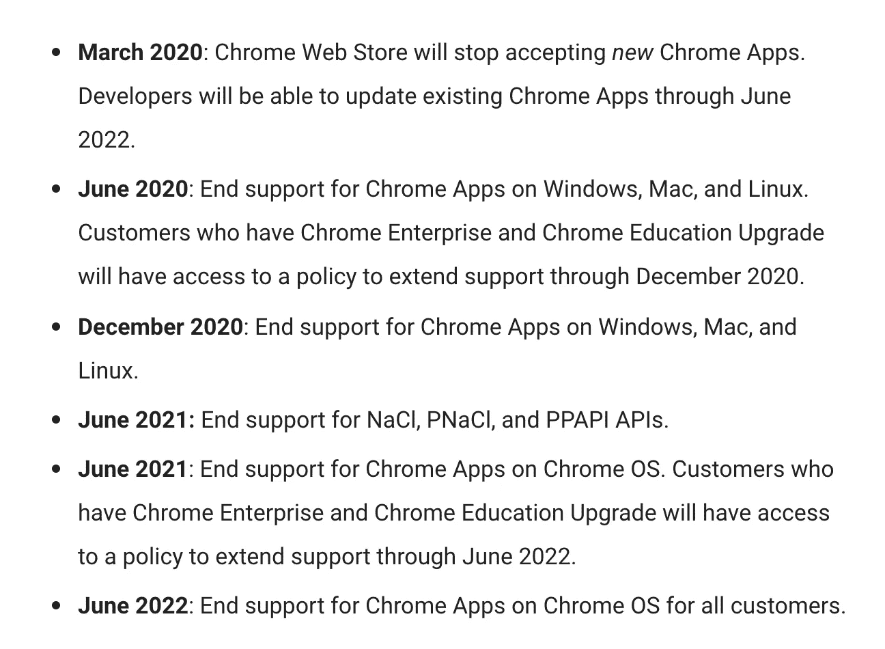
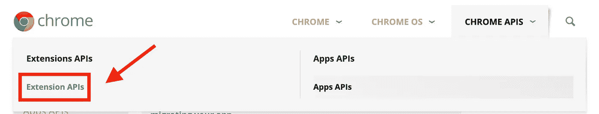
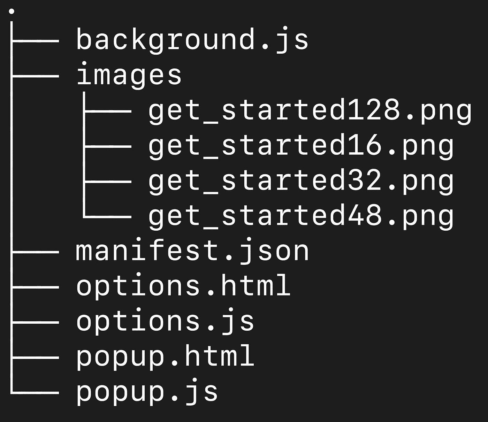
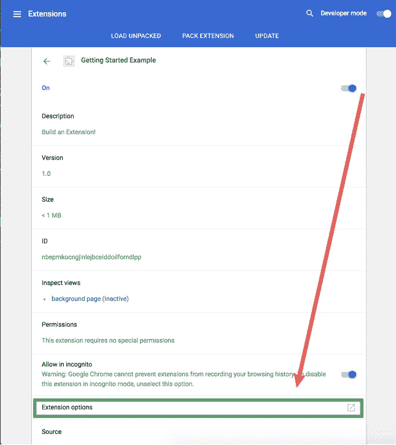
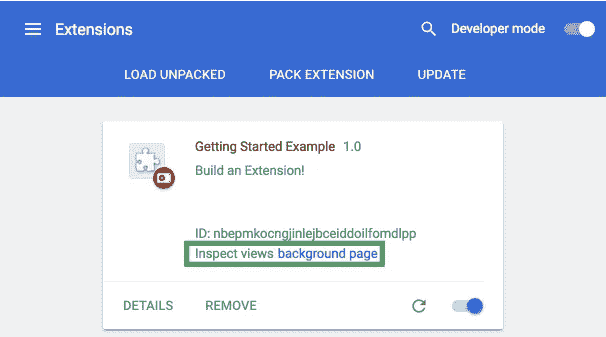
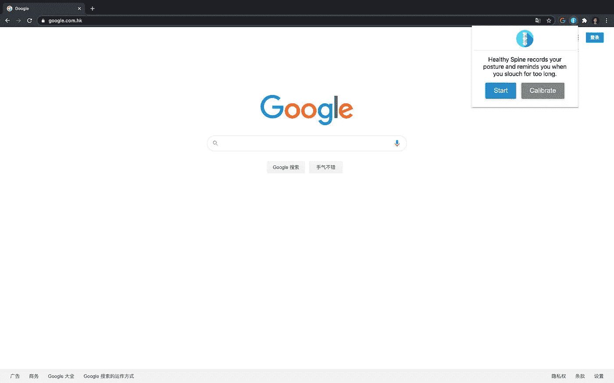
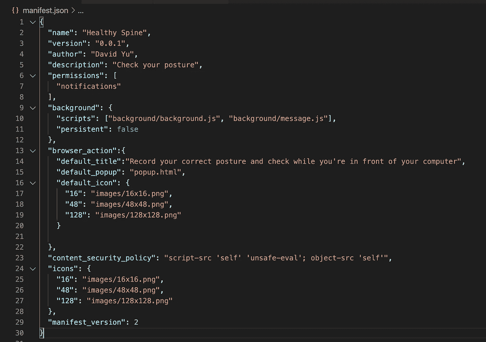
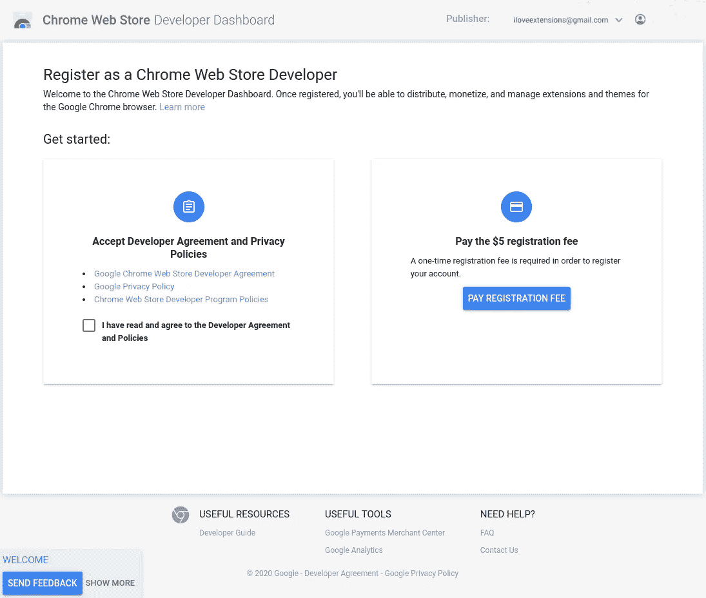

# 如何构建你的第一个 Chrome 扩展

> 原文：<https://betterprogramming.pub/how-to-build-your-first-chrome-extension-8abdee9a4365>

## 立即开始使用 Chrome 扩展


由 [Krsto Jevtic](https://unsplash.com/@krstoj?utm_source=medium&utm_medium=referral) 在 [Unsplash](https://unsplash.com?utm_source=medium&utm_medium=referral) 上拍摄的照片

“坐直了！”当我长时间盯着我的笔记本电脑时，我妈妈会对我大喊大叫。

十年后，当我在写代码而不是玩电子游戏时，我糟糕的姿势又回来咬我了。

因此，我决定亲自处理这件事。我可以看一些 YouTube 视频，做一些姿势练习。但我是一个程序员，所以我会编码我的问题。

健康脊柱就是这样诞生的。它会观察你的姿势，并在你没精打采时提醒你——就像我妈妈当年一样。

# 先决条件

*   HTML、CSS 和 JavaScript 的基础知识
*   访问 Chrome 网络商店开发者账户

这是我从创建我的第一个 Chrome 扩展中学到的一个总结版本。如果你需要一个完整的分步教程，可以看 Chrome 的[入门教程](https://developer.chrome.com/extensions/getstarted)。

# Chrome 扩展与 Chrome 应用

Chrome 应用是 Chrome 扩展的一个更强大的版本。

然而，谷歌已经决定今年彻底关闭 Chrome 应用。



图片来源: [Chromium 博文，2020 年 1 月 15 日](https://blog.chromium.org/2020/01/moving-forward-from-chrome-apps.html)

然而，在他们的文档中，他们仍然有 Chrome Apps API，这会给你一个错误的希望，你仍然可以构建一个 Chrome 应用程序。

请务必查看 Chrome 扩展文档的扩展 API。



# 典型的 Chrome 扩展的结构



文件夹是存放你所有图标的地方。

`options`文件是你定义用户下载 Chrome 扩展后如何定制的方式。

然而，截至目前(2020/8/9)，选项隐藏在设置的深处。我怀疑有任何用户会意识到他们甚至在那里。



对于代码的其他部分，它分为四个部分:

1.  背景
2.  弹出
3.  内容(不在入门项目文件夹中)
4.  环境

# 背景脚本

顾名思义，它在用户安装 Chrome 扩展时在后台运行。

要查看后台脚本的调试控制台，可以点击 chrome://extensions 中的“检查视图背景页面”。



应该在后台脚本中放什么样的代码？

对于某些功能，比如通知，您可能希望在后台脚本中触发它。或者您可能希望在后台运行计时器。

在`background.js`中要写的最重要的代码是`chrome.runtime`。

## 运行时事件

`onInstalled`:

```
chrome.runtime.onInstalled.addListener(function() { // Code to execute once the extension is installed});
```

`onStartup`:

```
chrome.runtime.onStartup.addListener(function() {// Code to execute once Google Chrome is opened});
```

对于与弹出窗口或内容脚本通信的后台，您需要使用`onMessage`并接收消息。

在`background.js`中，您将听到如下代码中的消息。

在弹出窗口或内容脚本中，您可以连接:

```
const runtimePort = chrome.runtime.connect({name: location.href.replace(/\/|:|#|\?|\$|\^|%|\.|`|~|!|\+|@|\[|\||]|\|*. /g, '').split('\n').join('').split('\r').join('')});
```

要发送事件(消息)，请执行`postMessage`:

```
runtimePort.postMessage({ message: ''});
```

# 弹出脚本

当你点击扩展图标时弹出菜单。

不一定是菜单。您可以将 HTML、CSS 和 JavaScript 调整为您想要的任何形式。



因此，弹出窗口就像一个网站。您可以使用任何框架，也可以不使用框架。

这里有一个`popup.html`的例子:

看到了吗？它看起来就像一个普通网站的 HTML。

下面是一个`popup.js`代码的例子:

在健康脊柱中，为了实现姿态检测，我使用了 [p5js](https://p5js.org/) 和 [ML5js](https://ml5js.org/) 。

# 内容脚本

内容脚本允许您操作用户当前正在使用的网页。

例如，广告拦截器扩展可能使用内容脚本来检测与广告相关弹出窗口，并阻止它们在 JavaScript 中执行。

与弹出脚本类似，内容脚本包含 HTML、CSS 和 JavaScript。

然而，在`manifest.json`中，记得添加你的文件路径。

`matches`和`exlude_globs`将指定您的内容脚本执行哪个 URL。有关所有模式的列表，请参见 Chrome 的[匹配模式文档](https://developer.chrome.com/extensions/match_patterns)。

# 设置

所有重要的设置都在`manifest.json`中。

它做了几件事:

1.  它告诉 Chrome Web Store 你的应用是什么，它做什么。
2.  它定义了在哪里寻找背景、弹出窗口或内容脚本等。
3.  它定义了扩展的图标是什么。
4.  它定义了您需要从用户那里获得什么权限。

它也有其他的规则，但是这些将取决于单独的扩展的用例。

注意下面的`manifest.json`文件没有内容脚本，因为我的扩展不需要访问用户的网页。

## 注意

让我犯了一个错误的是`page_action`和`browser_action`的区别。

如果您在`page_action`中指定您的弹出窗口，您的扩展图标将仅在用户打开链接时显示。

使用`browser_action`，当 Chrome 打开时，图标会显示出来，这是我想要的动作。



# 提交到 Chrome 网络商店

首先，你需要支付 5 美元注册一个 Chrome 网络商店开发者账户。(不知道谷歌真的需要我的 5 美元吗？)

https://developer.chrome.com/webstore/register



注册后，您需要使用 zip 来捆绑您的扩展文件，并将它们上传到他们的仪表板。

它会要求您填写一些关于您的扩展的信息，并添加一些营销图片。

一件重要的事情是确保您只请求您在扩展中使用的权限。

我的应用被拒绝了三次，因为我认为使用本地存储需要“存储”权限

# 结论

Chrome 扩展是一个很好的方式来构建一些实用的东西来改善你或者其他人的工作方式。

感谢阅读！