# 如何与 Buddy 一起建立您的第一个 CI/CD 渠道

> 原文：<https://betterprogramming.pub/how-to-build-your-first-ci-cd-pipeline-with-buddy-b12a01bbc90a>

## 与 Buddy 一起将 Dockerised Node.js 应用程序持续集成和部署到 AWS Elastic Beanstalk 的指南

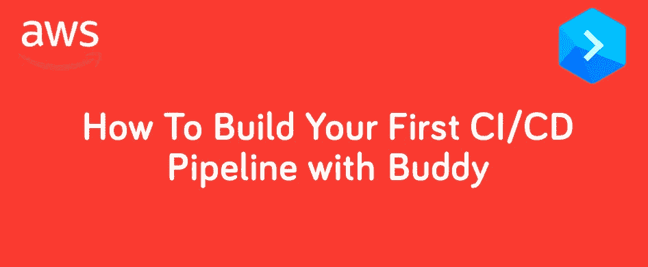

# 介绍

这件作品有两个目标:

*   成为与[好友](https://buddy.works/?utm_source=medium&utm_medium=referral&utm_campaign=andrewbestbier_bz&utm_content=toolcomparison)一起构建 CI/CD 渠道的独立指南
*   作为比较各种 CI/CD 服务的系列文章的一部分

与[好友](https://buddy.works/?utm_source=medium&utm_medium=referral&utm_campaign=andrewbestbier_bz&utm_content=toolcomparison)一起测试和部署的项目的存储库可以在[这里](https://github.com/AndrewBestbier/ci-comparison-blog)找到。这是一个小型节点/快速应用程序，有文档记录，只有一个测试。我建议你克隆这个应用程序，并把它推到你自己的 GitHub 帐户上，这样你就可以在阅读本指南的同时建立一个管道。

阅读我的其他 CI/CD 指南，使用下面的相同应用程序:

 [## 如何建立您的第一个 Travis CI/CD 渠道

### 使用 Travis 将 Dockerised Node 应用程序持续集成和部署到 AWS Elastic Beanstalk 的指南

medium.com](https://medium.com/better-programming/how-to-build-your-first-travis-ci-cd-pipeline-4ee180222819)  [## 如何构建您的第一个 GitLab CI/CD 管道

### 使用 GitLab 将 Dockerised Node.js 应用程序持续集成和部署到 AWS Elastic Beanstalk 的指南

medium.com](https://medium.com/better-programming/how-to-build-your-first-gitlab-ci-cd-pipeline-5416d7e3b602)  [## 如何构建您的第一个 AWS 代码管道 CI/CD 管道

### 将 Dockerised Node.js 应用程序持续集成和部署到 AWS Elastic Beanstalk 和 AWS 的指南…

medium.com](https://medium.com/better-programming/how-to-build-your-first-aws-codepipeline-ci-cd-pipeline-c4127dab6394)  [## 如何为 Dockerised Node 应用程序构建第一个 CircleCI CI/CD 管道

### 将 Dockerised 节点应用程序持续集成和部署到 AWS elastic beanstalk with circle ci 的指南

medium.com](https://medium.com/better-programming/how-to-build-your-first-circleci-ci-cd-pipeline-for-a-dockerised-node-app-3e935f351103) 

这篇文章比较了这些服务:

 [## 5 项 CI/CD 服务的比较结果

### AWS、Buddy、TravisCI、CircleCI 和 GitLab

medium.com](https://medium.com/better-programming/the-results-of-a-comparison-between-5-ci-cd-services-8d1a5c4d185a) 

# 管道概述

下图显示了我们的 CI/CD 渠道遵循的步骤。请注意我们如何使用 Docker Hub 来存储 Docker 图像，以及如何使用 Elastic Beanstalk 来提取和运行这些图像:

# 初步步骤

对于这一部分，我们需要创建一个 AWS 用户，这样[好友](https://buddy.works/?utm_source=medium&utm_medium=referral&utm_campaign=andrewbestbier_bz&utm_content=toolcomparison)就可以通过编程访问 Elastic Beanstalk。

参见我的指南:(你将获得`AWS_ACCESS_KEY_ID` 和*`AWS_SECRET_ACCESS_KEY`*变量):**

** [## 如何为 CI /CD 服务创建 AWS 用户，以便在部署到 Elastic Beanstalk 时使用

### 通常在构建 CI/CD 管道时，我们需要创建一个 AWS 用户，这样 CI/CD 服务就可以通过编程…

medium.com](https://medium.com/@andrew.bestbier/how-to-create-an-aws-user-for-a-ci-cd-service-to-use-when-deploying-to-elastic-beanstalk-a9dd0877fd6f) 

接下来，我们需要在 Elastic Beanstalk 上创建一个[好友](https://buddy.works/?utm_source=medium&utm_medium=referral&utm_campaign=andrewbestbier_bz&utm_content=toolcomparison)可以部署的应用程序。我的指南(如下)解释了如何做到这一点。

 [## 如何创建一个弹性 Beanstalk 应用程序

### 注意:在我的博客文章中，我经常在 Elastic Beanstalk 上创建示例应用程序。而不是重复我自己…

medium.com](https://medium.com/@andrew.bestbier/how-to-create-an-elastic-beanstalk-application-8431e7960bad) 

最后一步是创建 Docker Hub 存储库。同样，请参见我的指南:

 [## 如何创建 Docker Hub 存储库:

### 注意:在我的博客文章中，我经常在 Docker Hub 上创建样本库。与其每次都重复自己，我…

medium.com](https://medium.com/@andrew.bestbier/how-to-create-a-docker-hub-repository-f07d1e0ddf5e) 

# 好朋友

前往[好友](https://buddy.works/?utm_source=medium&utm_medium=referral&utm_campaign=andrewbestbier_bz&utm_content=toolcomparison)，登录 GitHub。然后单击“创建新项目”

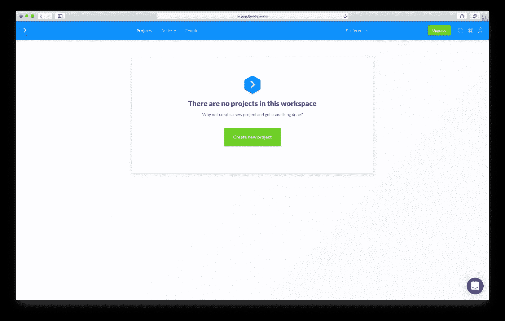

然后您需要从列表中选择您的 GitHub 库。 [Buddy](https://buddy.works/?utm_source=medium&utm_medium=referral&utm_campaign=andrewbestbier_bz&utm_content=toolcomparison) 应该聪明地发现我们的项目是一个 Express 应用程序。然后单击“添加新管道”

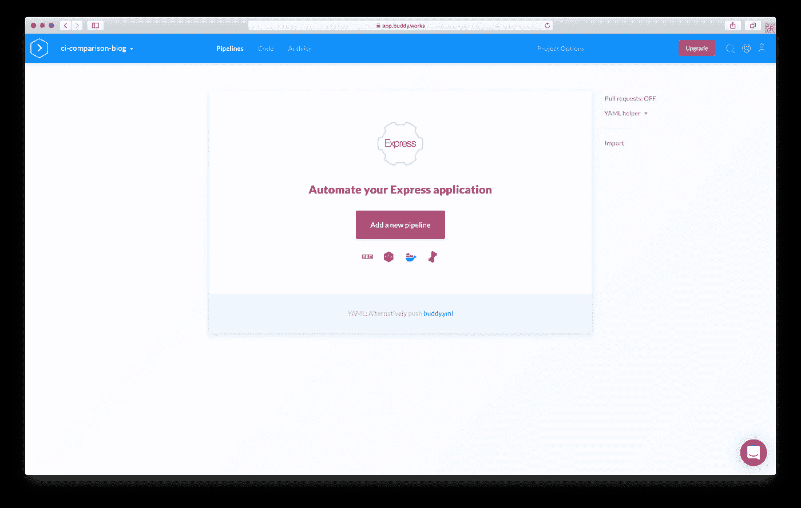

指定一个管道名称(我选择了“CI 博客文章”)。选择“推送时触发”，然后单击“添加新管道”

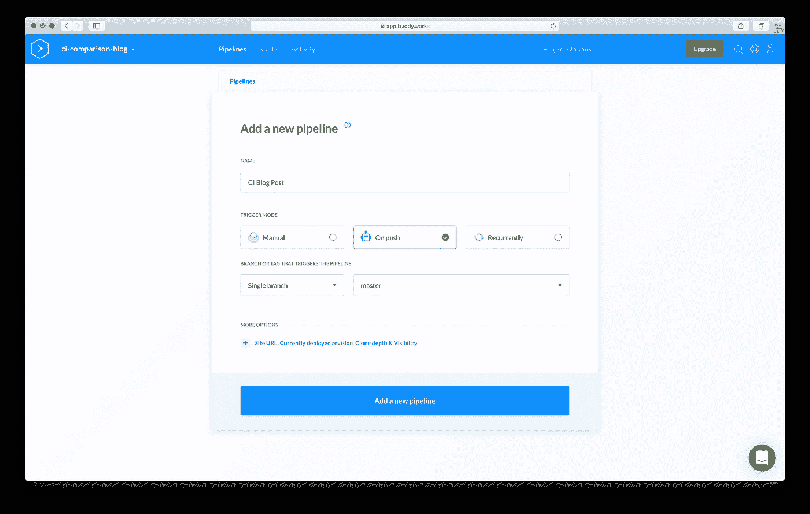

然后我们可以创建我们的第一个动作，它将安装我们的依赖项并运行测试。搜索 Node.js 操作，然后单击它。

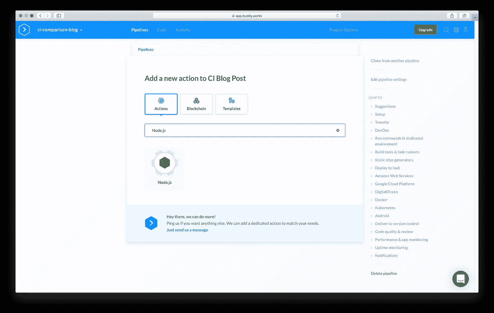

然后提示您运行一些 bash 命令。在我们的例子中，我们希望运行`yarn install`和`yarn test`，所以输入这些命令并点击“添加这个动作”

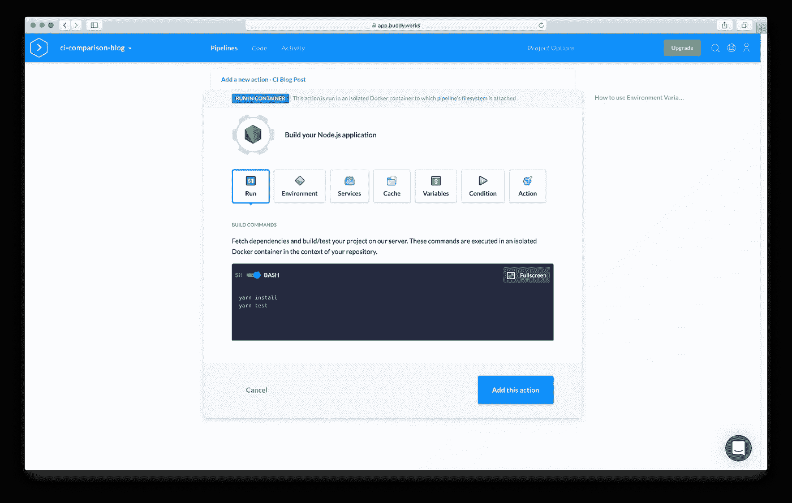

接下来，我们想从源代码中构建一个 Docker 映像。搜索“构建图像”操作:

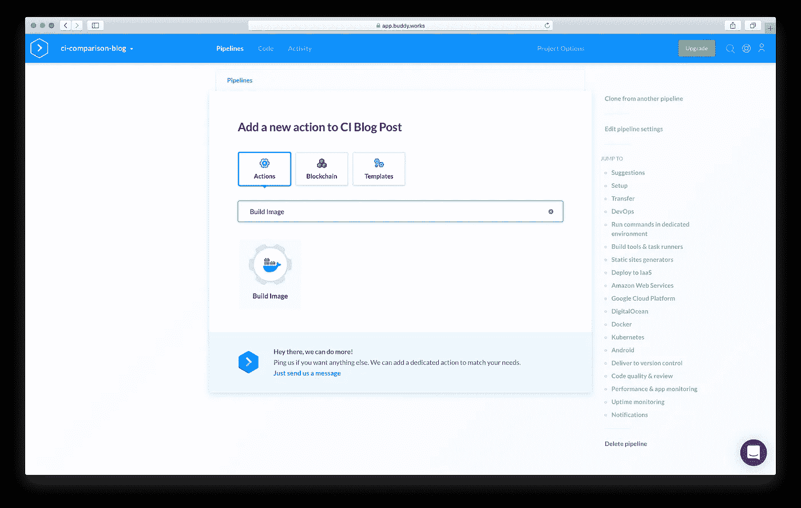

[好友](https://buddy.works/?utm_source=medium&utm_medium=referral&utm_campaign=andrewbestbier_bz&utm_content=toolcomparison)会自动检测你的`Dockerfile`，所以只需点击“添加此动作”

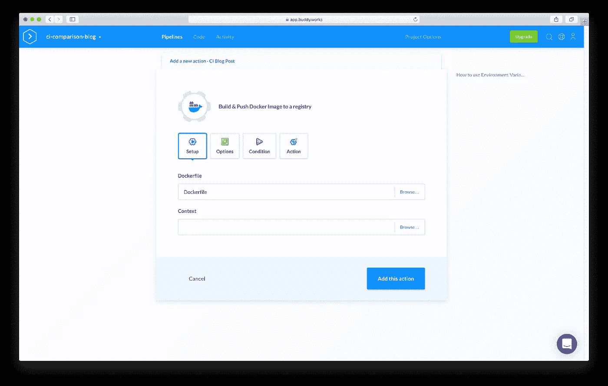

接下来，我们希望将刚刚构建的映像推送到 Docker Hub。搜索“推送图像”操作:

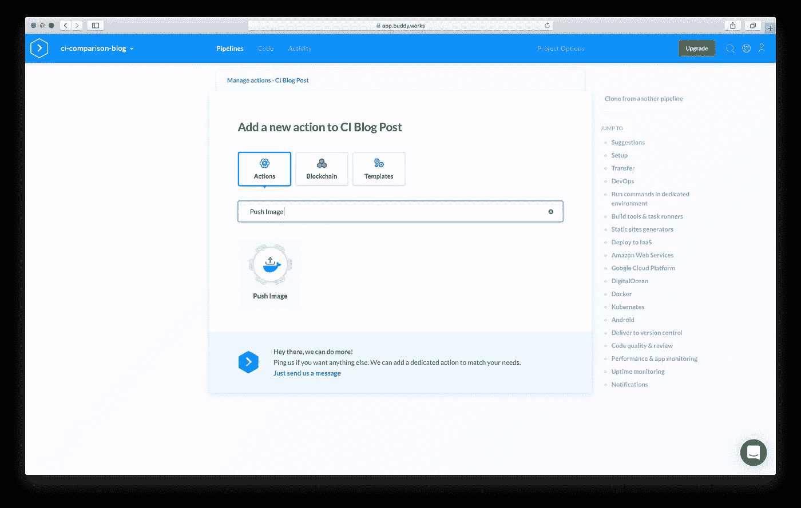

[好友](https://buddy.works/?utm_source=medium&utm_medium=referral&utm_campaign=andrewbestbier_bz&utm_content=toolcomparison)自动知道使用之前动作中建立的图像。在单击“添加此操作”之前，请提供您的 Docker Hub 用户名、密码、存储库和标签

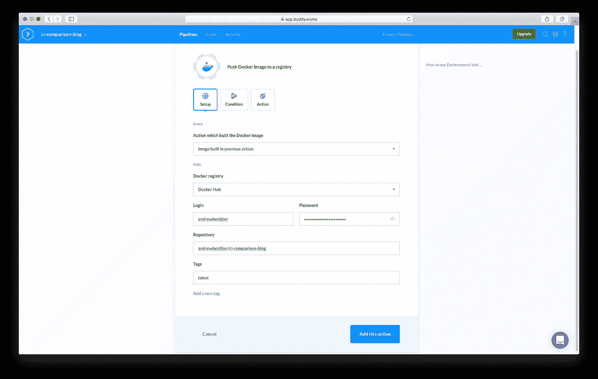

最后，我们希望将我们的文件部署到 Elastic Beanstalk，所以搜索这个动作:

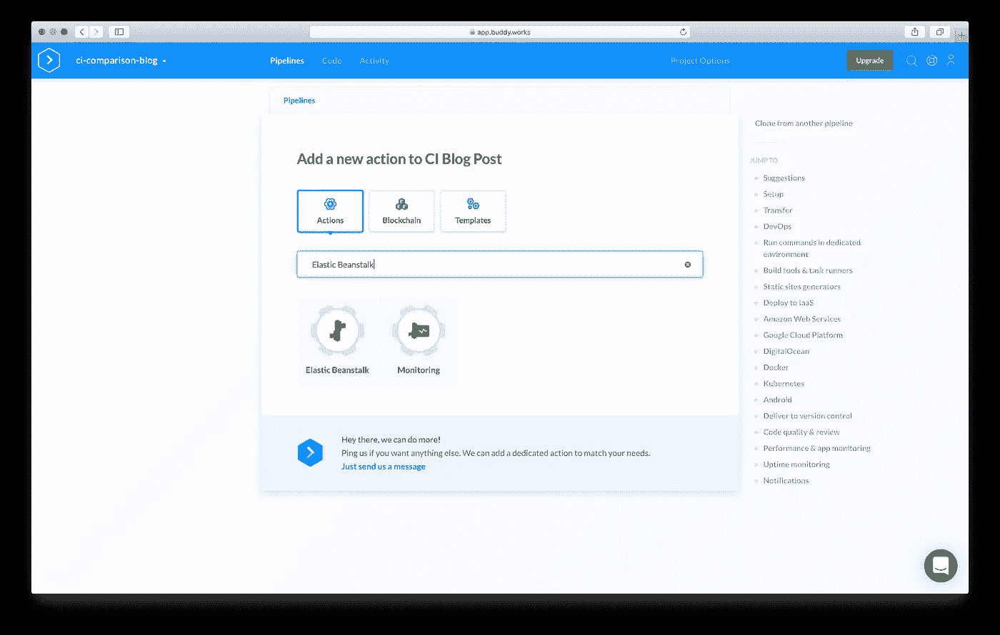

将出现一个模式，要求您提供我们在本指南前面创建的 AWS 用户访问密钥和秘密访问密钥，因此请输入这些信息并单击“添加集成”

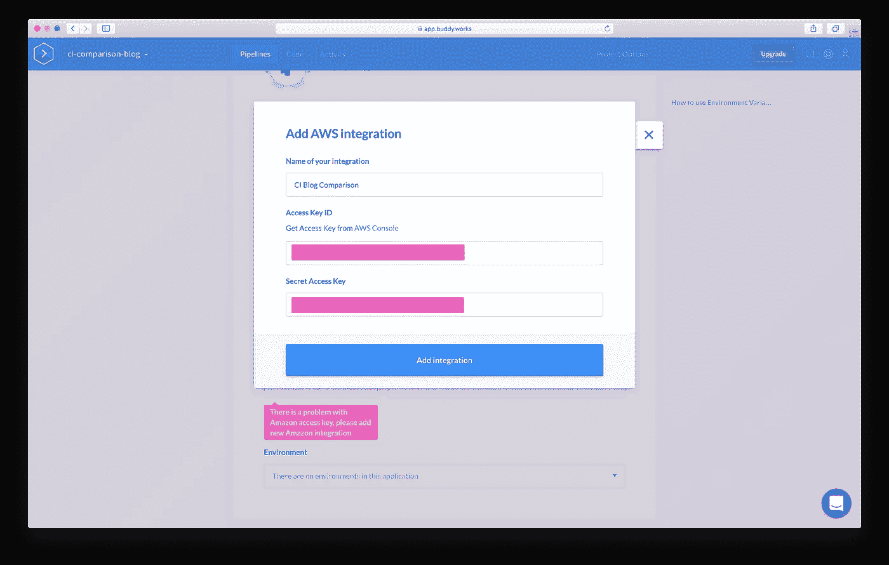

选择 AWS 区域，您的弹性 Beanstalk 应用程序应该会自动出现。然后点按“添加此操作”

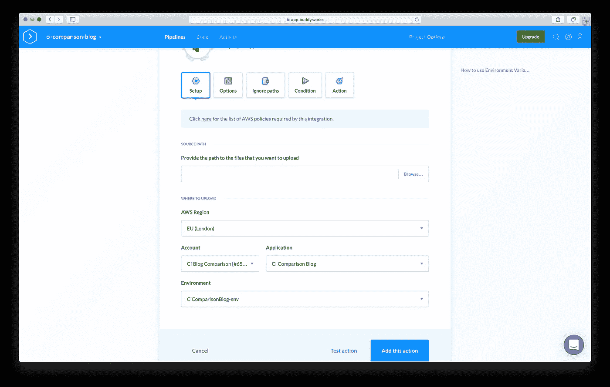

您的管道应该如下所示:

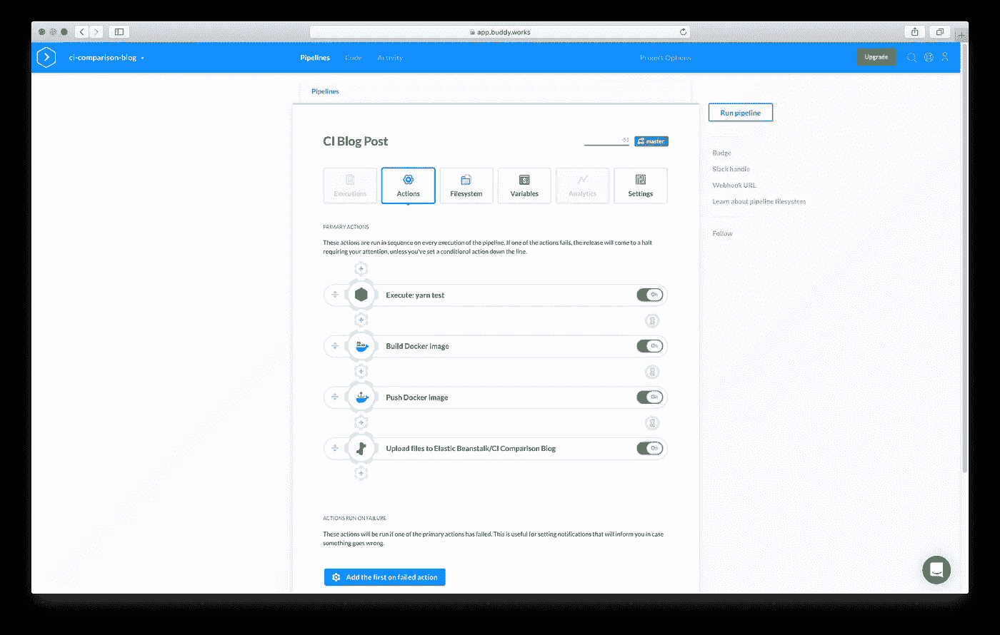

单击“运行管道”，它应该会成功地测试、构建和部署您的应用程序:

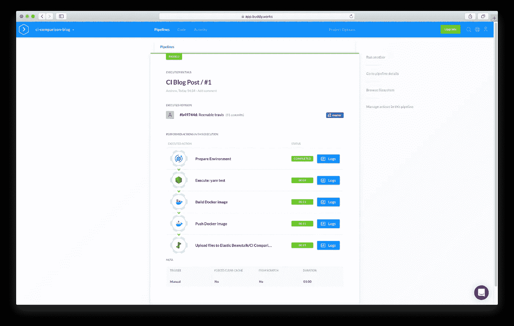

如果您愿意，也可以在根目录中用一个`buddy.yml`文件来设置这个管道(或者将您在 UI 中构建的内容导出为一个`yml`文件):

# 结论

我希望你喜欢这个指南。查看我本周稍后的其他文章，了解如何使用不同的 CI/CD 服务来部署同一个应用程序。**