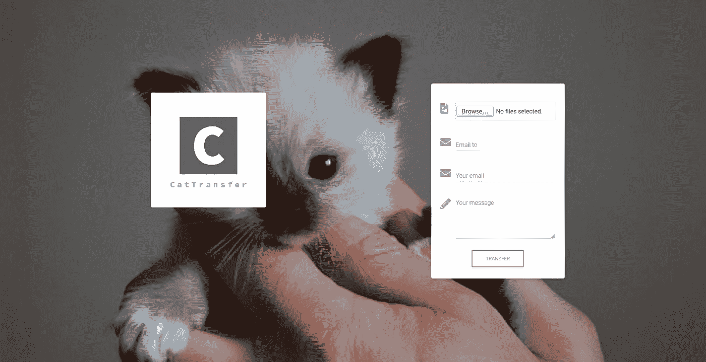

# 在 AWS 上构建您自己的无服务器 WeTransfer 克隆

> 原文：<https://betterprogramming.pub/how-to-build-your-own-serverless-wetransfer-clone-on-aws-80ccab938731>

## 让我们建立一个 WeTransfer 的无服务器克隆来分享猫的图片


照片由 [Cat Mapper (Max Ogden)](https://unsplash.com/@catmapper?utm_source=unsplash&utm_medium=referral&utm_content=creditCopyText) 在 [Unsplash](https://unsplash.com/s/photos/cat-in-basket?utm_source=unsplash&utm_medium=referral&utm_content=creditCopyText) 拍摄

WeTransfer 是一个非常棒的文件共享服务。对于小于 2 GB 的文件，它是完全免费的，无需注册就可以存储七天。如果需要，它还提供高级支持和功能。

让我们看看如何在 AWS 之上创建这个酷服务的无服务器克隆。我们将称之为 CatTransfer，并试图以无服务器的方式提供类似的功能，这样一切都将自动扩展。我们的应用程序是为了分享猫的照片，因此得名。由于它将完全免费使用，我们将把上传文件的最大大小限制在 20 MB，并只存储三天——这对于猫的照片来说应该足够了。

我们将采用以下 AWS 服务:

*   AWS 放大器
*   自动气象站λ
*   API 网关
*   S3
*   (美)工程科学学会(Society of Engineering Science)

完整的源代码可在以下存储库中找到:

[](https://github.com/jkapuscik2/cat-transfer-app) [## jkapuscik2/cat-transfer-app

### 这个项目是用 Create React App 引导的。在项目目录中，您可以运行:在…中运行应用程序

github.com](https://github.com/jkapuscik2/cat-transfer-app) 

我们必须从生成应用程序的样板文件和初始化 Amplify 项目开始(我们假设您已经配置了 [Amplify CLI](https://docs.amplify.aws/) ):

```
npx create-react-app cat-transfer-app
cd cat-transfer-appamplify init? Enter a name for the project cat-transfer-app
? Enter a name for the environment demo
? Choose your default editor: IntelliJ IDEA
? Choose the type of app that you're building javascript
Please tell us about your project
? What javascript framework are you using react
? Source Directory Path:  src
? Distribution Directory Path: build
? Build Command:  npm run-script build
? Start Command: npm run-script start
Using default provider  awscloudformationFor more information on AWS Profiles, see:
[https://docs.aws.amazon.com/cli/latest/userguide/cli-multiple-profiles.html](https://docs.aws.amazon.com/cli/latest/userguide/cli-multiple-profiles.html)? Do you want to use an AWS profile? Yes
? Please choose the profile you want to use default
```

前端将基于 React 框架，并显示一个随机的猫图像(来自[https://api.thecatapi.com](https://api.thecatapi.com))后面的文件上传的形式。目前我们会尽量保持简单。将只有一些小组件，我们将使用 [MDBoostrap](https://mdbootstrap.com/) 来加速开发。



随机猫很适合作为背景图像

我们的用户可以上传多个文件，将被打包成一个单一的。zip 存档并发送到提供的电子邮件地址。这听起来很适合 Lambda 函数。为了使用 API Gateway 添加端点，我们必须键入一个命令。我们将只有两个 API 端点:

*   将上传的文件压缩成一个。zip 存档并存储在 S3 上— `POST /files`。
*   提供从 S3 请求的文件— `GET /files/{id}`。

在这种情况下，可以在一个名为`files`的 Lambda 函数中创建两个端点。

```
amplify add api? Please select from one of the below mentioned services: REST
? Provide a friendly name for your resource to be used as a label for this category in the project: files
? Provide a path (e.g., /book/{isbn}): /files
? Choose a Lambda source Create a new Lambda function
? Provide a friendly name for your resource to be used as a label for this category in the project: files
? Provide the AWS Lambda function name: files
? Choose the function runtime that you want to use: NodeJS
? Choose the function template that you want to use: Hello World
? Do you want to access other resources created in this project from your Lambda function? No
? Do you want to invoke this function on a recurring schedule? No
? Do you want to edit the local lambda function now? No
Succesfully added the Lambda function locally
? Restrict API access No
? Do you want to add another path? No
Successfully added resource files locally
```

我们现在必须在云中创建资源:

```
amplify push| Category | Resource name | Operation | Provider plugin   |
| -------- | ------------- | --------- | ----------------- |
| Function | saveFiles     | Create    | awscloudformation |
| Api      | files         | Create    | awscloudformation |? Are you sure you want to continue? Yes
```

Amplify 使 API Gateway 的使用变得简单，因为它会自动创建包含所有必需配置的`aws-exports.js`文件。为了发送请求，我们只需要记住我们给 API 起的名字和我们想要使用的路径。

src/components/Form.js

我们在`amplify/backend`中生成了很多代码。每一类资源(如 Lambda、API Gateway)都存储在单独的目录中。此外，每个资源都有自己的嵌套目录，形成云。json 文件。它们包含了在 AWS 中创建角色、权限和配置的所有信息。

我们需要创建一个额外的 S3 桶，并授予 Lambda 读写它的权限。当我们需要让资源知道彼此时，我们可以修改`amplify/backend/backend-config.json` 并使用`dependsOn`指令。

`amplify/backend/backend-config.json`

文件共享应用程序具有相当可重复的使用模式。我们不希望文件被下载超过几次。每次，用户上传几个文件，并将其发送给特定的用户组，这些用户组下载这些文件并保存在本地。

这是使用 S3 存储类的一个很好的用例。一个区域不频繁的访问对于作业来说是最经济的。99.5%的可用性对于我们的应用程序来说也是绰绰有余的。用户存储的每个文件都必须在三天后自动删除。我们可以使用 S3 生命周期规则轻松地自动化这一过程。

我们现在需要手动创建一个名为`storage/archives`的目录，配置为 S3:

amplify/back end/storage/archives/archives backet-cloud formation-template . JSON

我们将把 bucket 名称作为环境变量传递，因为它在每个部署阶段都不同。这也是授予我们 Lambda 所需权限的好时机:

amplify/back end/function/files/files-cloud formation-template . JSON

我们几乎拥有所有需要的资源。是时候更新云中的资源了:

```
// We have to let amplify know that cloudformation config changed
amplfy env checkout demoamplify push
✔ Successfully pulled backend environment demo from the cloud.Current Environment: demo| Category | Resource name | Operation | Provider plugin   |
| -------- | ------------- | --------- | ----------------- |
| Storage  | archives      | Create    | awscloudformation |
| Function | files         | Update    | awscloudformation |
| Api      | files         | No Change | awscloudformation |? Are you sure you want to continue? Yes
⠹ Updating resources in the cloud. This may take a few minutes...
```

我们可以继续编写应用程序中最复杂的部分 Lambda 函数。它将使用 Express.js 的无服务器版本:

我们的函数服务于两个端点，用于创建和下载文件归档。在后一种情况下，它只是使用已签名的 URL 将请求代理给 S3。生成. zip 归档文件稍微复杂一些。我们在内存中创建一个档案，一个接一个地添加文件，最后把它放到 S3 上。我们还使用简单的电子邮件服务来发送通知。它不是开箱即用的，需要验证(他们对垃圾邮件和其他滥用行为非常重视)。SES 的配置超出了本文的范围，我们只是展示如何使用它的 API。关于这项服务的更多信息可以在这里找到[。](https://docs.aws.amazon.com/ses/latest/DeveloperGuide/Welcome.html)

现在一切顺利。最后一步是部署整个应用程序。我们只需要一个命令:

```
amplify add hosting
? Select the plugin module to execute Hosting with Amplify Console (Managed hosting with custom domains, Continuous deployment)
? Choose a type Manual deploymentYou can now publish your app using the following command:Command: amplify publish amplify publish...✔ Zipping artifacts completed.
✔ Deployment complete!
[https://demo.d1alt5savo6r3y.amplifyapp.com](https://deploy.d1alt5savo6r3y.amplifyapp.com)
```

我们的应用程序被自动部署到新创建的子域中。如果你想尝试一下，可以在下面的[网址](https://deploy.d1alt5savo6r3y.amplifyapp.com)找到。免费分享你的猫咪照片！

# 外卖食品

关于云最令人惊奇的事情是我们可以潜在地扩展到真正的 WeTransfer 的水平。我们永远不会，因为它有更广泛的功能，庞大的用户群和大量的其他品质，但如果出于某种疯狂的原因，很多人开始使用我们的应用程序，我们就不必担心提供任何新的服务器或提供额外的存储空间。一切都会自动发生。

此外，它非常便宜。假设在一个月内我们会:

*   100 GB 的存储猫图片。
*   每个档案的平均大小为 20 Mb。
*   每个档案平均下载两次。

我们一个月要付大约 20 美元！AWS Lambda 和 API 网关的使用甚至不会超过免费层。

使用无服务器架构有很多好处，但也有一些缺点。如果你想在 AWS 上不用服务器，你会成为 Cloud Watch 的亲密朋友。调试要困难得多，因为它是一种相对较新的方法，所以没有多少经过实践检验的标准和例子。如果你习惯于传统的方法，有时会令人沮丧。学习曲线可能很陡，但绝对值得一试。

# 资源

 [## 亚马逊网络服务简单每月计算器

### AWS 简单的每月计算器帮助客户和潜在客户更有效地估算他们的每月 AWS 账单。使用…

calculator.s3.amazonaws.com](https://calculator.s3.amazonaws.com/index.html) [](https://medium.com/@navvabian/how-to-add-an-sqs-queue-to-your-amplify-cli-bootstrapped-project-cb7781c636ed) [## 如何将 SQS 队列添加到您的 Amplify CLI 引导项目中

### 在开始之前，你需要知道 AWS Amplify 的一切都在不断变化，这个问题可能不会…

medium.com](https://medium.com/@navvabian/how-to-add-an-sqs-queue-to-your-amplify-cli-bootstrapped-project-cb7781c636ed)