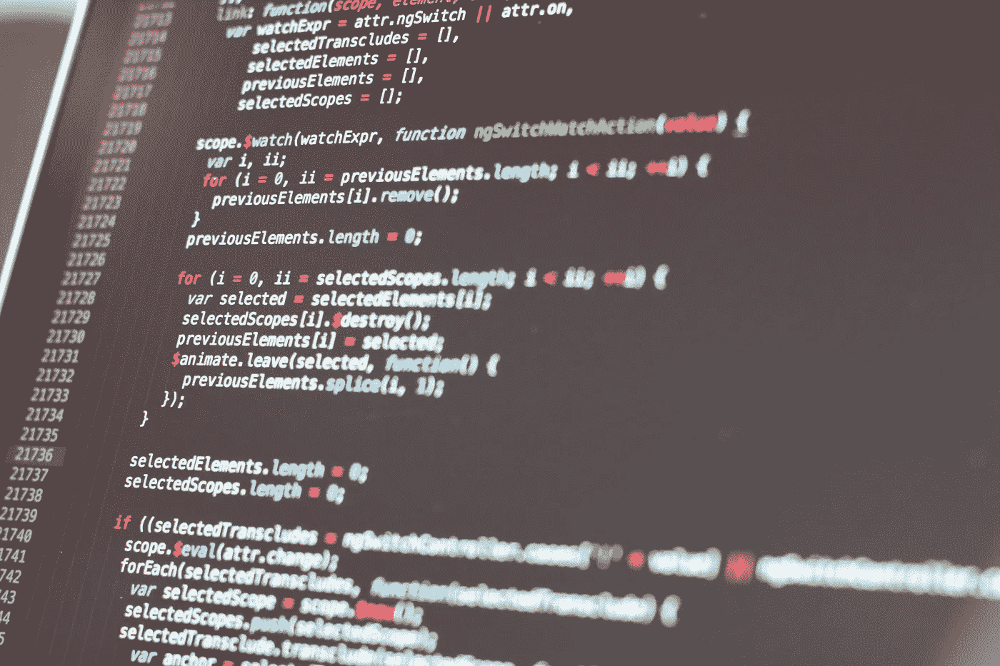
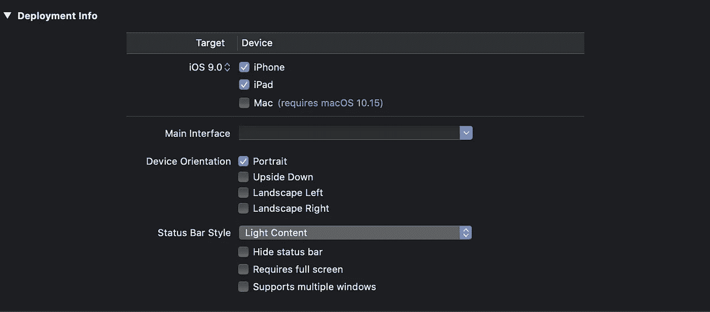

# 如何在没有 SwiftUI 的情况下以编程方式构建 UI 和转换

> 原文：<https://betterprogramming.pub/how-to-build-your-user-interface-programatically-without-swiftui-9f0dc52e02bc>

## 还没准备好 SwiftUI？我们可以在代码中做很多事情，去掉故事板



SwiftUI 是一种全新的为 iOS 应用构建用户界面的方式。然而，你可能是一个实际上喜欢老方法(UIKit 和自动布局)的 iOS 开发者。

定义布局约束和使用 UIKit 其实很酷。不酷的是使用界面生成器和故事板。

# 停止使用界面构建器

界面生成器速度慢且错误百出。在转而只使用代码为我的 iOS 应用程序构建界面后，我的生活变得更加轻松。

使用界面构建器有很多缺点。

1.  如果你没有建立一个非常简单的应用程序，你将不得不配置你的视图来匹配你的设计，例如添加半径，边框，阴影等。Interface Builder 将无法显示这些更改，因为您已经在将在运行时应用的视图控制器类中定义了这些更改。
2.  你不知道幕后发生了什么。我花了这么多时间试图找出我的约束出了什么问题。
3.  你不需要 segues。Segues 可以用一行代码代替:`self.present(viewController, animated: true, completion: nil)`
4.  控制你的用户界面。不要依赖这个工具，直接掌控。

如果你的项目很大程度上依赖于故事板，习惯于用代码做所有事情会很困难，但是值得一试。特别是如果你正在构建超过 10 个屏幕的复杂应用程序，界面构建器完全不是一个好的选择。

# 如何设置一个根视图控制器并去掉 Main.storyboard

## 1.保留主界面为空

你不必附加一个主界面文件，那不是必需的。所以，空着吧。



## 2.删除 Main.storyboard 文件

我知道感觉不一样，但是去掉`Main.storyboard`你会焕然一新。

## 3.在 AppDelegate.swift 中设置根视图控制器

如果您还没有`window`属性，请将其添加到您的`AppDelegate.swift`中。然后，进入你的`didFinishLaunchingWithOptions`。

立即运行您的应用程序。你现在可能意识到你实际上并不需要故事板。

# 塞格斯？

下面是如何呈现另一个视图控制器。

```
**let** vc = AnotherViewController()
**self**.present(vc, animated: **true**, completion: **nil**)
```

哦，但是导航控制器？

```
**let** vc = AnotherViewController()
**self**.navigationController?.pushViewController(vc, animated: **true**)
```

这里只需确保您的根视图控制器是一个导航控制器。

仅此而已。现在，您可以手动设置视图的框架，或者在视图控制器中定义自动布局约束。

下面是如何通过定义自动布局约束将按钮放置在视图控制器的中心:

现在，您可以继续构建您的布局，逐个定义约束。这样你就可以 100%地控制呈现给用户的内容。

要了解更多关于定义约束的信息，请看一下本文档。

如果你认为这真的让你的生活更轻松，让你的开发过程更快，请在评论区告诉我。