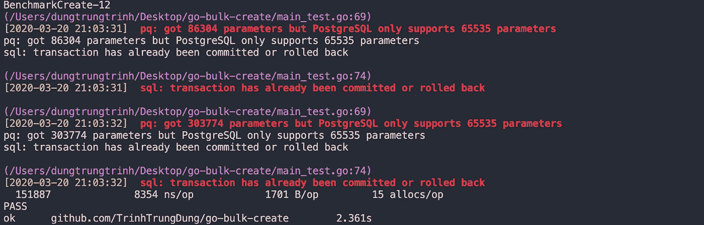
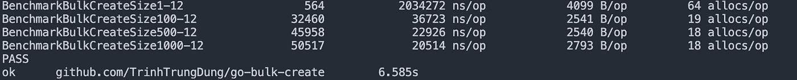
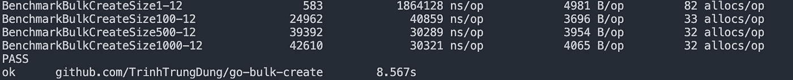

# 如何在 Golang 中正确地批量创建和更新(第一部分)

> 原文：<https://betterprogramming.pub/how-to-bulk-create-and-update-the-right-way-in-golang-part-i-e15a8e5585d1>

## 不同的基准方法


我最近走出了我的舒适区 Python，开始着手我公司目前正在进行的 Golang 项目。

我写这篇文章的原因是，我想分享我在 Golang 中创建和更新多个记录到 [PostgreSQL](https://www.postgresql.org/) 时所面临的经历，而我目前使用的 ORM 库( [GORM](https://gorm.io/) )还不支持批量创建和更新操作。

在本文中，我们将研究上述操作的不同方法，并对它们进行基准测试。那么，我们开始吧。

首先，我需要创建一个包含所有源代码的新项目文件夹:

```
mkdir go-bulk-create && cd go-bulk-create
```

然后，我用`go`模块初始化一个新的 Go 项目:

```
go mod init github.com/TrinhTrungDung/go-bulk-create
```

我们将需要使用`gorm`依赖项，安装如下:

```
go get -u github.com/jinzhu/gorm
```

我使用 Docker Compose 在我的本地机器容器中创建了一个新的隔离的 PostgreSQL 数据库实例，名为`test.db`:

*   在当前目录下创建一个新文件`docker-compose.yml`。

```
touch docker-compose.yml
```

*   文件的内容应该如下所示:

*   运行`docker-compose`文件来创建一个新的数据库:

```
docker-compose up -d
```

现在我们有了一个新的数据库，我们创建一个新文件来尝试我所说的所有方法:

```
touch main.go
```

*   我们需要首先成功连接到我们的数据库。`main.go`的内容将是:

*   我们创建一个名为`User`的样本表，并将其迁移到数据库中。

# 标杆管理

让我们首先创建测试文件:

```
touch main_test.go
```

该文件包含如下一些帮助函数:

这就是我们需要的所有实用程序，让我们对每种方法进行基准测试。

## **1。使用 GORM** 插入多条记录

*   我们将下面的 ORM 批量创建基准测试函数添加到`main_test.go`文件中:

*   运行以下命令获得速度和内存性能基准:

```
go test -benchmem -run=^$ github.com/TrinhTrungDung/go-bulk-create -bench BenchmarkOrmCreate
```

*   测试结果:


ORM 批量创建的测试结果

我们得到该函数在一秒钟内运行(默认情况下)，它以大约 5.5 毫秒/迭代的速率创建 240 条记录，每次迭代分配大约 9000 B，每次迭代分配 105 个不同的内存。

对于更大的系统来说相当糟糕…

## **2。使用 Insert 语句**插入多条记录

*   我们使用`INSERT`语句向`main_test.go`文件添加另一个批量创建函数:

*   使用以下命令运行测试功能:

```
go test -benchmem -run=^$ github.com/TrinhTrungDung/go-bulk-create -bench BenchmarkCreate
```

*   测试结果:



测试基准出现错误

什么？您一定想知道，在对上述函数进行基准测试时，为什么会出现这样的错误。

如果我们阅读控制台中的错误，我们会注意到 PostgreSQL 支持的最大参数数是 65535。每次迭代，我们都会追加两个参数(名称、密码),因此最大迭代次数必须小于或等于 65535/2 = 32767。

但是，您可以看到在速度和内存方面的显著改进。在一秒钟内，它生成大约 150000 条记录，每次迭代花费我们 8354 纳秒，比第一种方法快 600 多倍！

此外，在每次迭代的字节数和内存分配数方面，它减少了大约 10 倍。嗯，这是一个巨大的改进，但是如果我们在现实世界中实现这种方法，就不能保证数据的一致性。

## **3。使用批处理大小为**的 Insert 语句插入多条记录

让我们看看这种方法是否是对第二种方法的拯救。

*   首先，添加一个新的批量创建函数，就像在`main_test.go`文件中的`BenchmarkCreate`函数一样。但是，我们将实例列表分成多个小块，批量大小为 500，如下所示:

*   使用以下命令运行测试功能:

```
go test -benchmem -run=^$ github.com/TrinhTrungDung/go-bulk-create -bench BenchmarkBulkCreate
```

*   测试结果:


好吧，它的性能可能比第二种方法差一点，但现在它保证了插入新记录时的一致性，这是您必须首先考虑的最重要的事情。

现在，您应该有一些类似这样的问题:“当我们动态调整批量大小或插入更多列时会发生什么？”我们到了最后一种方法。

## **4。使用具有动态批处理大小的 Insert 语句插入多条记录**

*   首先，我们重构`benchmarkBulkCreate`函数来接受另一个名为`size`的参数:

*   我们现在分别用 1、100、500 和 1000 的大小对`benchmarkBulkCreate`函数进行基准测试。

*   通过运行以下命令，使用不同的批处理大小测试基准:

```
go test -benchmem -run=^$ github.com/TrinhTrungDung/go-bulk-create -bench BenchmarkBulkCreateSize
```

*   测试结果:



不同批量的基准测试

当批量大于 100 时，我们每秒创建的记录数或创建速度没有区别。它也适用于每次迭代分配的字节数和内存分配。

让我们看看如果改变插入参数的数量会发生什么。要做到这一点，我们只需将助手函数更改如下:

*   测试结果:



使用不同批量和附加参数进行基准测试

嗯，在比较不同批量的统计数据时，添加更多的参数似乎没有什么不同。

# 结论

我个人默认选择批处理大小为 500 的`INSERT`语句，因为它对于所有用例都是稳定的。在下一部分中，我将对批量更新进行基准测试。

*   这是[样本项目](https://github.com/TrinhTrungDung/go-bulk-create)。

如果你有更好的解决方法，请在评论区分享给我。