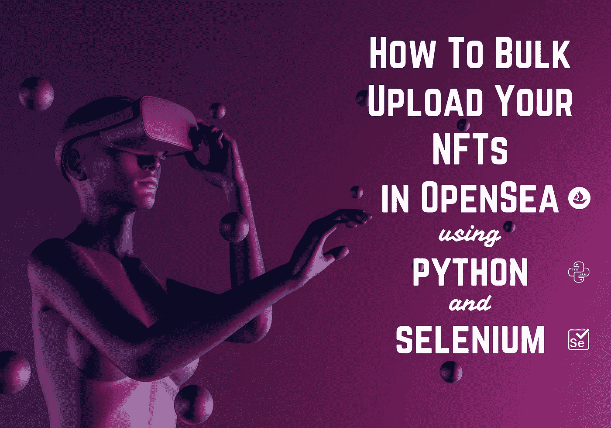

# 如何使用 Python 在 OpenSea 中批量上传您的 NFTs

> 原文：<https://betterprogramming.pub/how-to-bulk-upload-your-nfts-in-opensea-using-python-1d0d3f8a7d3c>

## NFT 懒铸造与浏览器自动化

作者图片

几个月前，我决定去看看 NFT 的炒作到底是怎么回事。我设法用算法创建了一个“艺术”收藏。我在引号里加上了“艺术”，因为我不是艺术家。我只是想知道什么是 NFTs 所以我拿了我女儿的数码画，我做了一个程序，通过添加不同的特征(颜色、徽章等)和控制它们的稀有度来生成数千个 NFT。哒哒！我的 NFT 系列已经准备好了…

然后我开始造币，也就是说，让它们在区块链可以买到。

我选择了一种懒惰的铸造方法，这样我可以避免预先支付汽油费。惰性铸造本质上是一种延期交易，其中 NFT 在市场上被列为数字项目，但只有当它被出售时才在区块链上被写入。同样出于时间的考虑，我更愿意准备好 MVP(最小可行产品),然后在稍后阶段学习智能合约和 dApps。

在 OpenSea 中一个接一个地上传 NFT，然后列出它们，这将是大量的手工和重复的工作…所以我决定**创建一个机器人**来帮我做这件事。

一些开发人员和数据科学家创建数字人工制品，然后将它们转换成 NFT，所以我希望这些笔记有助于克服将它们发布到 OpenSea 的最后一个障碍。

# 先决条件

1.  你的 NFT 作品已经准备好了，按顺序命名为:1.png、2.png……等等。
    还设置了各自的[元数据](https://docs.opensea.io/docs/metadata-standards):1 . JSON，2.json，…等。
2.  您有一个已连接 MetaMask 钱包的 OpenSea 帐户。
3.  您已经创建了一个 OpenSea 收藏来存放您的收藏品，即`YourOpenSeaNftCollectionName`。
4.  您已经在 python 环境中安装了`selenium`和`webdriver_manager`。
5.  您已经有了 Chrome 元掩码扩展位置(`crx`文件)。

# 让我们开始吧…

确保这些库已导入:

主要参数定义如下:

以编程方式启动 Chrome 浏览器并导航至 OpenSea:

此时，您需要打开一个新选项卡并登录 MetaMask 以导入您的钱包。一旦你这样做了，回到 OpenSea 标签页并登录你的账户。

# 实用方法

## 等待，直到元素中出现文本:

大多数 web 应用程序都使用 AJAX 技术，所以当浏览器加载一个页面时，页面中的元素可能会在不同的时间间隔加载，这使得定位元素变得很棘手:如果一个元素还没有出现在 DOM 中，`find_elements`函数会引发一个异常。因此，我们会等到预定义的超时，然后才休息。

## 找到一个元素并单击它:

同样，有时我们想要单击的元素可能不可见，因此在找到它之后，我们将屏幕居中围绕它，然后单击它:

## 在输入栏上写文本:

下面的代码也处理 unicode 字符，比如表情符号🦸‍♀️:

# 懒惰铸币

## 读取令牌的元数据:

这种方法:

1.  读取给定令牌 id 的 json 文件，并
2.  访问相关的 json 元素，并以元组的形式返回它们。

## 薄荷一号:

这种方法:

1.  首先导航到集合的`create`端点，
2.  上传 NFT 的照片，
3.  调用`read_token_info`函数获取令牌的元数据，设置名称、描述和所有属性【注意:总是设置第一个属性，所以按`Add more`按钮`properties_number - 1`次】，
4.  创造了 NFT，并且
5.  等待确认。

## 把它们都铸造出来:

现在循环遍历所有的 NFT，通过调用`mint_token`函数来创建它们:

# 嘿，很快！

仅此而已！你的 NFT 系列已经准备好了！按照上面的例子，您现在可以很容易地扩展它，列出您的 NFTs 进行销售。

感谢阅读！

*我定期在媒体上撰写关于领导力、技术&的数据——如果您想阅读我未来的帖子，请*[*‘关注’我*](https://medium.com/@semika) *或* [*订阅*](https://semika.medium.com/subscribe) *！*