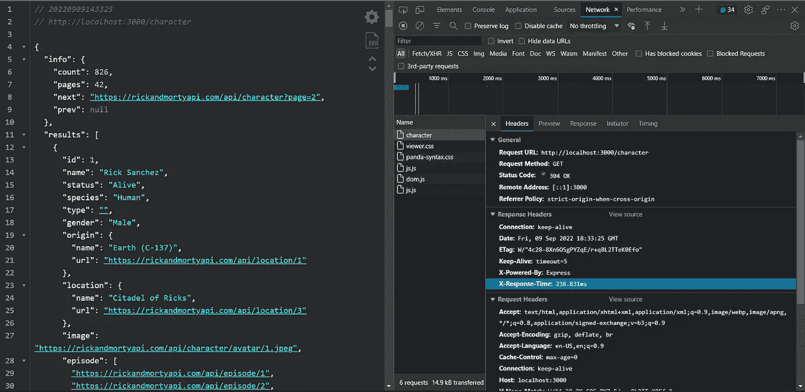
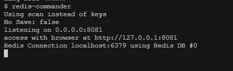
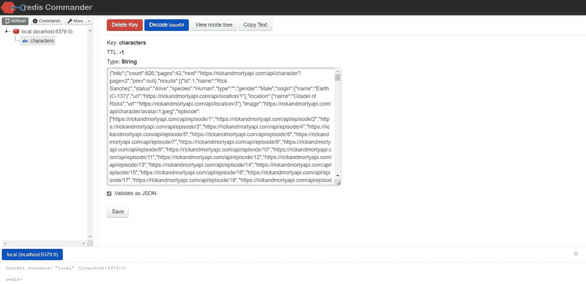
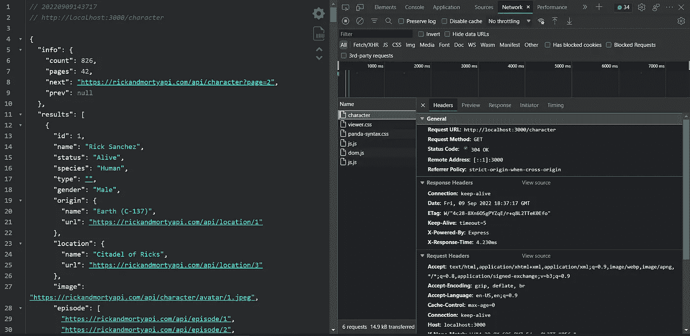

# 使用 Redis 缓存减少响应时间并提高性能

> 原文：<https://betterprogramming.pub/how-to-cache-api-requests-with-redis-and-node-js-cba883385e7>

## 减少查询数据时响应时间的初学者指南


在 [Unsplash](https://unsplash.com/?utm_source=medium&utm_medium=referral) 上由 [Hitesh Choudhary](https://unsplash.com/@hiteshchoudhary?utm_source=medium&utm_medium=referral) 拍摄的照片

我们生活在即时的时代，时间已经比金钱更有价值。而那个时代，再加上互联网的活力，让我们的观众每天的要求都更高。

你的网站内容可能很优秀，但是如果加载速度不好，人们会等着看吗？

根据几项研究，一半的用户等待时间不超过三秒。这对电子商务等网站来说是一个挑战，如果页面不能立即加载，用户可能会放弃页面，从而失去潜在的销售。

缓存您的 web 应用程序数据对于解决这个问题并在您扩展时提供高性能增益至关重要。

近年来，Redis 已经成为最受欢迎的缓存数据库，因为它允许网站通过在几毫秒内访问数据来大幅提高性能和工作效率。

# Redis 是什么？

远程字典服务器( [Redis](https://redis.io/) )是一个高性能的开源 NoSQL 数据库，主要用作各种类型应用程序的缓存解决方案。

Redis 基于散列表结构，其中每个键都有一个关联值。与其他键值数据库相比，Redis 允许使用更复杂、更灵活的结构，这为不同的业务应用程序需求提供了多种可能性。

当访问速度和响应时间对业务解决方案至关重要时，强烈建议使用 Redis。在处理实时应用程序时也需要使用它，实时应用程序需要快速访问数据以缩短响应时间。在最常见的使用案例中，我们可以找到:

*   聊天和信息系统
*   最新项目列表
*   实时计数器和统计使用情况
*   在线购物车管理
*   在应用程序中存储用户会话
*   支持缓存网页

# 什么是缓存？

缓存是将数据副本存储在内存中以允许应用程序更快地访问和检索数据的过程。

缓存的目标是比数据库或远程服务器更好地加速数据访问操作。对于高成本(及时)操作来说尤其如此。

例如，如果我们的查询需要几个操作，比如从数据库中检索数据、执行计算、从其他服务中检索附加数据等等。，我们可以使用缓存。

这样，我们只需处理一次数据，将其存储在缓存中，然后直接从缓存中检索，而无需执行所有这些代价高昂的操作。然后，我们将定期刷新缓存，以便用户可以看到更新的信息。

# 使用 Node.js 和 Redis 进行缓存

现在，我们将开始开发我们的应用程序，我们希望在本教程中实现的是对外部 API 执行查询，并测量响应时间。

之后，我们将在应用程序中实现 Redis，将查询结果存储在缓存中。这样，我们将能够比较 Redis 前后的响应时间。

# Redis 设置

本教程的第一件事是在我们的本地环境中安装 Redis。为此，我们将遵循每个平台的安装指南。

[在 Mac 上安装](https://phoenixnap.com/kb/install-redis-on-mac)

[安装在 Ubuntu 上](https://www.digitalocean.com/community/tutorials/how-to-install-and-secure-redis-on-ubuntu-18-04)

[在 Windows 上安装](https://redis.com/blog/redis-on-windows-10/)

# Node.js 设置

我们用创建`package.json`的命令开始 Node.js 项目。

```
npm init
```

对于我们的 Node.js 应用程序，我们需要使用以下命令安装以下依赖项:

```
npm install express redis axios
```

*   [快递](https://www.npmjs.com/package/express)建立服务器
*   [Redis](https://www.npmjs.com/package/redis) 连接我们的应用程序和 Redis 并执行查询
*   [axios](https://www.npmjs.com/package/axios) 执行 REST 查询

```
npm install nodemon response-time -D
```

*   [nodemon](https://www.npmjs.com/package/nodemon) 每次更改后自动唤醒我们的应用程序
*   [响应时间](https://www.npmjs.com/package/response-time)查看每个请求需要多长时间

在我们的`package.json`文件中，我们将在“scripts”键中创建一个新的脚本，我们将使用它来启动我们的应用程序。

```
"dev": "nodemon src/app.js"
```

# 构建 Node.js 应用程序

像这样为 Node.js 应用程序设置初始样板文件。我们创建一个`app.js`文件，并在其中添加以下几行:

```
const express = *require*('express')
const responseTime = *require*('response-time')
const redis = *require*('redis')
const axios = *require*('axios')const app = express()app.listen(process.env.PORT || 3000, () => {
    console.log("Node server started")
})
```

现在，如果我们执行该命令，我们就创建了 Express 服务器。

```
npm run dev
```

我们将在控制台中看到消息`"Node server started"`

# 从外部 API 检索数据

对于我们的教程，我们将使用 Rick 和 Morty API 的 REST 版本，它为我们提供了以下端点:

```
{
  "characters": "https://rickandmortyapi.com/api/character",
  "locations": "https://rickandmortyapi.com/api/location",
  "episodes": "https://rickandmortyapi.com/api/episode"
}
```

现在，我们将使用 axios 向`/character`端点发出请求。

对于我们发出的这个请求，API 返回给我们一个包含所有字符的对象，我们感兴趣的是这个请求所获取的`response-time`。

使用我们作为中间件添加的响应时间，我们将能够在请求的报头中看到一个名为`X-Response-Time`的新报头，它将指示我们更多的时间。

此请求花费了 238.831 毫秒



/字符

# 为我们的端点实现 Redis 缓存

现在，让我们看看如何通过缓存来提高应用程序的性能。

首先，我们需要通过应用程序连接到 Redis 服务器。我们使用安装的 Redis 包来完成这项任务。

默认情况下，`[redis.createClient()](https://github.com/NodeRedis/node-redis#rediscreateclient)`会分别使用`127.0.0.1`和`6379`作为主机名和端口。如果您有不同的主机/端口，您可以像这样提供它们:

现在，我们将向 API 发出相同的请求，并使用 Redis 客户端的`set()`方法缓存响应，该方法接收我们想要保存的键的名称作为第一个参数。作为第二个参数，这个键的值，我们必须保存为一个字符串，所以我们必须将 JSON 解析为 string。

一旦我们重新加载我们的应用程序，我们得到了查询的结果，我们就已经缓存了答案。

为了验证这一点，我们将使用 [Redis-commander](https://github.com/joeferner/redis-commander) 。Redis-commander 允许我们通过网络界面查看我们的 Redis 数据库。我们用以下命令安装它:

```
npm install -g redis-commander
```

这个包将为我们提供一个`redis-commander`命令，当它被执行时，将在端口`127.0.0.1:8081`上执行数据库 web 接口。



redis-指挥官



redis-指挥官

当我们进入 redis-commander 时，我们会看到对我们的`/character`请求的响应已经用我们分配给它的名称存储起来了。

使用 Redis 进行缓存的过程非常简单。当我们收到用户的请求时，我们首先检查请求的数据是否已经被缓存。如果是这样，我们可以快速从 Redis 检索数据并发送响应。

但是，如果数据没有被缓存，我们称之为缓存未命中，我们必须首先从数据库或外部 API 检索数据，并将其发送给客户端。我们还确保将检索到的数据存储在缓存中，以便下次收到相同的请求时，我们可以更快地将缓存的数据发送给用户。

现在，我们正在从缓存中检索信息，响应时间大大减少到了 4.230 毫秒



/字符

值得注意的是，我们在本教程中仅仅触及了皮毛，Redis 提供的内容还远远不够。我强烈推荐查阅它的官方[文档](https://redis.io/documentation)。

下面是一个完整的脚本，还有一个端点接收参数的示例:

# 结论

在本教程中，我们看到了 Redis 的快速介绍，并用它为 Node.js 应用程序创建了一个简单的缓存。

现在，您可以使用 Redis 来缓存应用程序中频繁查询的数据，从而显著提高性能，特别是在每秒处理许多请求的项目中，Redis 提供的性能变得非常重要。

# **阅读更多:**

[](https://blog.bitsrc.io/how-to-create-instagram-filters-with-react-and-css-dce9f92753d0) [## 如何用 React 和 CSS 创建 Instagram 滤镜

### 使用 CSS Filter 属性为 HTML 图像创建自定义滤镜

blog.bitsrc.io](https://blog.bitsrc.io/how-to-create-instagram-filters-with-react-and-css-dce9f92753d0) [](/developing-a-crud-app-in-react-js-with-a-fake-api-rest-9f401bad5f04) [## 用假的 API Rest 在 React JS 中开发 CRUD 应用

### 用 JSON 服务器添加 CRUD 功能

better 编程. pub](/developing-a-crud-app-in-react-js-with-a-fake-api-rest-9f401bad5f04) 

```
**Want to Connect?** Love connecting with friends all around the world on [Twitter](https://twitter.com/ljaviertovar).
```