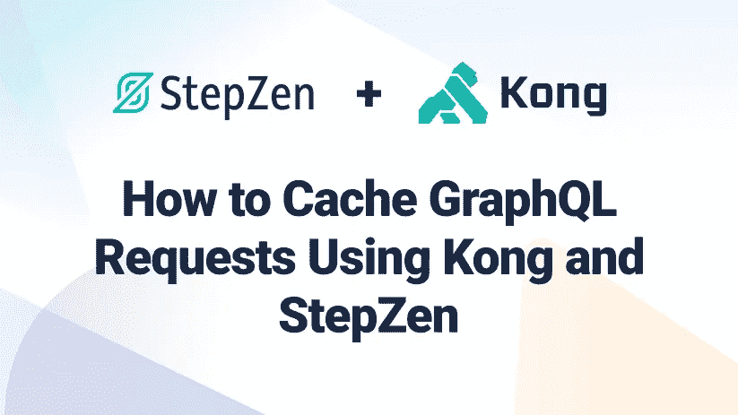
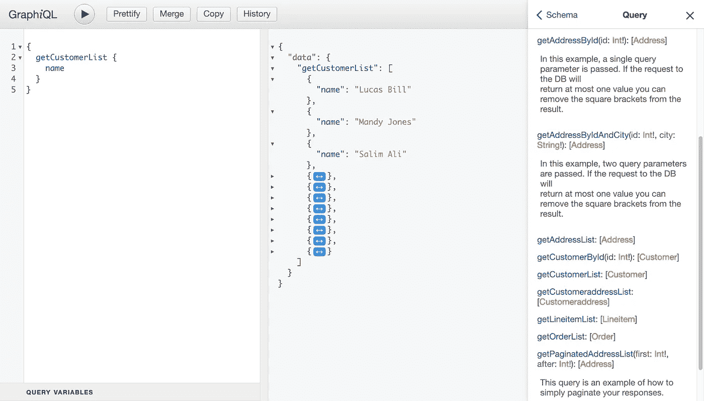

# 如何使用 Kong 和 StepZen 缓存 GraphQL 请求

> 原文：<https://betterprogramming.pub/how-to-cache-graphql-requests-using-kong-and-stepzen-24a42219c71d>

## 使用 API 网关解决缓存 GraphQL API 的挑战



GraphQL 经常被用作微服务的 API 网关，但也可以很好地与现有的 API 网关解决方案配合使用。比如使用[孔](https://konghq.com/)，一个 API 网关和微服务管理平台。作为一个 API 网关，Kong 有许多功能可以用来增强 GraphQL APIs。其中一个功能是向您添加到 Kong 的上游服务添加代理缓存。但是当使用 GraphQL 进行缓存时，由于 GraphQL 的性质，您必须考虑几个警告。在这篇文章中，我们将讨论缓存 GraphQL API 的挑战，以及 API 网关如何对此有所帮助。

# 为什么要使用 API 缓存？

缓存是任何 API 的重要组成部分——您希望确保您的用户尽可能获得对其请求的最佳响应时间。当然，缓存不是万能的解决方案，不同的场景有很多不同的策略。

假设您的 API 是一个高流量的关键应用程序。它将受到许多用户的强烈冲击，你需要确保它能随着需求而扩展。缓存可以帮助您做到这一点，它可以减少服务器上的负载，提高所有用户的性能，同时潜在地降低成本并提供额外的安全功能。Kong 的缓存通常应用于代理层，这意味着这个代理将缓存请求，并提供对某个端点的最后一次调用的响应(如果该端点存在于缓存中)。

GraphQL APIs 在缓存方面有其挑战，您需要在实现缓存策略之前了解这些挑战，您将在下一节中了解到。

# 使用 GraphQL 缓存的挑战

GraphQL 在公司中越来越受欢迎。GraphQL 最好被描述为 API 的查询语言。它是声明性的，这意味着您编写您想要的数据，并将请求的细节留给服务器。这对我们有好处，因为它通过将关注点分离到客户端和服务器端实现中，使我们的代码更具可读性和可维护性。

GraphQL APIs 可以解决诸如过度提取和提取不足的挑战(也称为 N+1 问题)。但是与任何 API 一样，设计不佳的 GraphQL API 会导致一些可怕的 N+1 问题。用户可以通过修改发送给 GraphQL API 的查询来控制 GraphQL 请求的响应，他们甚至可以在多个级别上嵌套数据。虽然肯定有办法通过解析器或缓存策略的设计在后端缓解这个问题，但是如果有一种方法可以让您的 GraphQL API 运行得非常快，而不需要更改一行代码呢？

> StepZen 为依赖于`@rest`的查询和突变添加了缓存，更多信息请参见[这里的](https://stepzen.com/docs/custom-graphql-directives/directives#cachepolicy)。

通过使用 Kong 和 GraphQL 代理缓存高级插件，你完全可以！让我们来看看。

# 用 Kong 为 GraphQL 设置缓存

当您使用 Kong 作为 API 网关时，它可以用来代理对上游服务的请求，包括 GraphQL APIs。使用企业插件 [GraphQL 代理缓存高级](https://docs.konghq.com/hub/kong-inc/graphql-proxy-cache-advanced/)，您可以向任何 GraphQL API 添加代理缓存。使用这个插件，您可以在 GraphQL 服务、路由甚至全局范围内启用代理缓存。让我们通过向用 StepZen 创建的 Kong 添加一个 GraphQL 服务来尝试一下。

使用 StepZen，您可以通过使用 CLI 或编写 GraphQL SDL(模式定义语言)以声明方式创建 GraphQL APIs。这是一种与语言无关的创建 GraphQL 的方式，因为它完全依赖于 GraphQL SDL。您唯一需要开始的是一个现有的数据源，例如(没有)SQL 数据库或 REST API。然后，您可以使用 CLI 为该数据源生成模式和解析器，或者使用 GraphQL SDL 编写连接。然后，GraphQL 模式可以直接从您的终端部署到云中，并带有内置的身份验证。

# 使用 StepZen 创建一个 GraphQL API

要使用 StepZen 获得 GraphQL，您可以连接您的数据源或使用 Github 中的一个预建示例。在这篇文章中，我们将从示例中的 MySQL 数据库中取出一个在[上创建的 GraphQL API。通过将这个存储库克隆到您的本地机器，您将获得一组包含 GraphQL 模式的配置文件和`.graphql`文件。要运行 GraphQL API 并将其部署到云中，您需要使用 StepZen CLI。](https://github.com/stepzen-dev/examples/tree/main/with-mysql)

您可以从 npm 安装 CLI:

```
npm i -g stepzen
```

安装完 CLI 后，您可以[注册一个 StepZen 帐户](https://stepzen.com/signup)在一个私有的、安全的端点上部署 GraphQL API。或者，您可以不注册而继续，但是请记住，部署的 GraphQL 端点将是公共的。要启动和部署 GraphQL API，您可以运行:

```
stepzen start
```

运行这个命令将返回终端中的一个已部署的端点(如`https://public3b47822a17c9dda6.stepzen.net/api/with-mysql/__graphql`)。此外，它还产生了一个`localhost`地址，您可以使用 GraphQL 在本地探索 GraphQL API。

# 为 Kong 添加一个 GraphQL 服务

您在上一节中创建的服务现在可以通过使用 Kong Manager 或 [Admin API](https://docs.konghq.com/gateway/latest/configure/graphql-quickstart/#existing-graphql-infrastructure) 添加到您的 Kong 网关中。让我们使用 Admin API 将我们新创建的 GraphQL API 添加到 Kong，它只需要我们发送几个 cURL 请求。首先，我们需要添加服务，然后需要添加该服务的路由。

您可以运行以下命令来添加 GraphQL 服务和路由。根据您的 Kong 网关的设置，您可能需要在您的请求中添加身份验证头:

```
curl -i -X POST \
  --url http://localhost:8001/services/ \
  --data 'name=graphql-service' \
  --data 'url=https://public3b47822a17c9dda6.stepzen.net/api/with-mysql/__graphql'

curl -i -X POST \
  --url http://localhost:8001/services/graphql-service/routes \
  --data 'hosts[]=stepzen.net' \
```

GraphQL API 现在已经作为上游服务添加到了 Kong 网关中，这意味着您已经可以代理它了。但在此之前，我们将添加 [GraphQL 代理缓存高级](https://docs.konghq.com/hub/kong-inc/graphql-proxy-cache-advanced/)插件，这也可以使用 cURL 命令来完成:

```
​​curl -i -X POST \
  --url http://localhost:8001/services/graphql-service/plugins/ \
  --data 'name=graphql-proxy-cache-advanced' \
  --data 'config.strategy=memory'
```

使用 Kong 作为 GraphQL API 的代理，并添加了这个插件，所有请求都在查询级别自动缓存。缓存的默认 TTL(生存时间)是 300 秒，除非您通过添加`--data' config.cache_ttl=600`将其覆盖(例如 600 秒)。在下一节中，我们将通过查询代理的 GraphQL 端点来探索缓存。

# 查询 GraphQL API

代理的 GraphQL API 将通过网关端点上的 Kong 提供。当您向它发送请求时，它会收到一个带有 GraphQL 主机名的头值。因为这是一个对 GraphQL API 的请求，请记住所有请求都应该是带有`Content-Type: application/json`头的`POST`请求，并在正文中附加一个 GraphQL 查询。

要向 GraphQL API 发送请求，必须首先构造一个 GraphQL 查询。当您访问部署了 GraphQL API 的端点时，您会发现一个 GraphQL 接口——一个探索 GraphQL API 的交互式平台。在这个接口中，您可以找到完整的模式，包括查询和 GraphQL API 可能接受的其他操作。



在这个界面中，您可以发送查询，并浏览上面看到的结果和模式。要将相同的查询发送到代理的 GraphQL API，可以使用以下 cURL:

```
curl -i -X POST 'http://localhost:8000/' \
--header 'Host: stepzen.net' \
--header 'Content-Type: application/json' \
--data-raw '{"query":"query getCustomerList {\n getCustomerList {\n name\n }\n}","variables":{}}'
```

这个 cURL 将返回响应结果和响应头:

```
HTTP/1.1 200 OK
Content-Type: application/json; charset=utf-8
Content-Length: 445
Connection: keep-alive
X-Cache-Key: 5abfc9adc50491d0a264f1e289f4ab1a
X-Cache-Status: Miss
StepZen-Trace: 410b35b512a622aeffa2c7dd6189cd15
Vary: Origin
Date: Wed, 22 Jun 2022 14:12:23 GMT
Via: kong/2.8.1.0-enterprise-edition
Alt-Svc: h3=":443"; ma=2592000,h3-29=":443"; ma=2592000
X-Kong-Upstream-Latency: 256
X-Kong-Proxy-Latency: 39

{
  "data": {
    "getCustomerList": [
      {
        "name": "Lucas Bill"
      },
      {
        "name": "Mandy Jones"
      },
      …
    ]
  }
}
```

在上面，可以看到 GraphQL API 的响应，这是一个假客户的列表，与我们发送给它的查询具有相同的数据结构。同样，输出响应头，这里有两个我们应该关注的头:`X-Cache-Status`和`X-Cache-Key`。第一个头将显示缓存是否被命中，第二个头显示缓存响应的键。为了缓存响应，Kong 将查看向其发送请求的端点和 post 主体的内容——包括查询和可能的查询参数。如果您在不同的请求中重用部分 GraphQL 查询，GraphQL 代理高级插件不会缓存部分响应。

在第一次请求时，`X-Cache-Status`的值将总是`Miss`，因为没有可用的缓存响应。然而，`X-Cache-Key`将始终有一个值，因为将根据请求创建缓存。因此，`X-Cache-Key`的值将是新创建的缓存响应或来自先前请求的现有缓存响应的键。

让我们再次发出这个请求，并关注这两个响应头的值:

```
X-Cache-Status: Hit
X-Cache-Key: 5abfc9adc50491d0a264f1e289f4ab1a
```

我们第二次命中代理的 GraphQL API 端点时，缓存被命中，缓存键仍然是与第一次请求相同的值。这意味着前一个请求的响应已经被缓存，现在被返回。相反，缓存的响应被用作所指示的缓存状态。除非您更改缓存的默认 TTL，否则缓存的响应将保持可用 300 秒。如果在 TTL 过期后向代理的 GraphQL API 发送相同的请求，缓存状态将是`Miss`。

您还可以通过直接向 GraphQL 代理高级插件发送请求来直接检查缓存的响应。要从前面的请求中获取缓存的响应，可以在 Kong 实例的 Admin API 上使用以下端点。例如:

```
curl [http://localhost:8001/graphql-proxy-cache-advanced/5abfc9adc50491d0a264f1e289f4ab1a](http://localhost:8001/graphql-proxy-cache-advanced/5abfc9adc50491d0a264f1e289f4ab1a)
```

如果缓存值存在，该请求返回`HTTP 200 OK`，如果不存在，则返回`HTTP 404 Not Found`。使用 Kong Admin API，您可以通过键删除缓存的响应，甚至清除所有缓存的响应。有关此主题的更多信息，请参见 GraphQL 代理缓存高级文档中的[删除缓存的实体部分](https://docs.konghq.com/hub/kong-inc/graphql-proxy-cache-advanced/#delete-cache-entity)。

# 结论

这篇文章教你如何添加一个 GraphQL API 到 Kong 来创建一个代理的 GraphQL 端点。通过将它添加到 Kong 中，您不仅可以获得 Kong 作为代理服务提供的所有特性，还可以为 GraphQL API 实现缓存。您可以通过安装 GraphQL 代理缓存高级版来实现这一点，该版适用于 Plus 和 Enterprise 实例。使用这个插件，您可以为 GraphQL APIs 实现代理缓存，让您缓存任何 GraphQL 请求的响应。

```
Follow us on [Twitter](https://twitter.com/stepzen_dev) or [join our Discord community](https://discord.gg/9k2VdPn2FR) to stay updated about our latest developments.
```