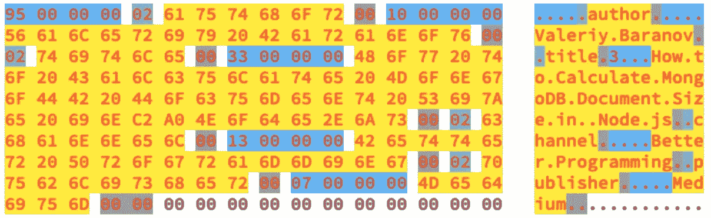

# Node.js 中如何计算 MongoDB 文档大小

> 原文：<https://betterprogramming.pub/how-to-calculate-mongodb-document-size-in-node-js-f463b8457f27>

## 没有 bson 模块

在我的上一篇文章[如何在 MongoDB 中存储大于 16Mb 的文档](https://medium.com/better-programming/how-to-store-documents-larger-than-16-mb-in-mongodb-aecc957bbe6c)中，我提出了一种在链接文档中存储大文档的方法。要做到这一点，我们需要在运行时计算文档的大小，以知道何时拆分它并保存到 MongoDB。我用了一个非常简单的方法来计算尺寸。

在本文中，我将创建一个函数来计算一个文档的确切字节数。有一点需要注意——我将对上一篇文章中的列类型这样做。为了简单起见，我稍微更改了下面的列类型:

文档以 BSON 格式存储在 MongoDB 中。你可以猜到，BSON 是一个二进制 JavaScript 对象符号或简称为二进制 JSON。它起源于 MongoDB——这是它的[规范](http://bsonspec.org/spec.html)。

我们将使用一个`bson`模块来探索 BSON 格式。先用`npm install bson`装一下吧。然后我们要求用`const BSON = require('bson');`来表示。我们准备好了。

让我们开始探索文档是如何用 BSON 编码的。

# **空对象编码**

让我们从最简单的文档开始——一个空对象。将其序列化并记录到控制台:

我们可以看到有一个 5 字节的缓冲区。这是最小的有效 BSON 文件。

让我们看看空对象是如何编码的:`05 00 00 00 00`

1.  `05 00 00 00`:前四个字节实际上是一个`int32`数字。这是 BSON 文档的大小(5 字节)，包括文档本身和文档结束符。
2.  `00`:最后一个字节代表文件结束符。

***实现细节:*** *字节以小端记数法书写，最低有效字节优先。*

# 数字编码

接下来，让我们看一个有效的 MongoDB 文档，它可以保存到数据库中。它只有一个键值对。

## **数字键值对如何编码**

`0e 00 00 00 10 5f 69 64 00 01 00 00 00 00`

1.  `0e 00 00 00`文件大小为 14 字节。
2.  `10 5f 69 64 00 01 00 00 00`键值对。
3.  `00`最后一个字节代表文件结束符。

所有 BSON 文档都以二进制格式存储，其中前四个字节是文档大小，最后一个字节是文档终止符。介于两者之间的是键值对。

## **让我们分析上面的键值对**

`10 5f 69 64 00 01 00 00 00`

1.  `10`第一个字节是值类型——在本例中是`int32`(可以看看上面的规范链接)。
2.  `5f 69 64`以下任意数量的字节都是一个密钥。
3.  `00`关键的终结者。
4.  `01 00 00 00`最后四个字节是一个值——我们知道它需要四个字节，因为它是`int32`。

我们有值类型，但是键类型在哪里？

***实现细节:*** *关键始终是一个字符串。因此，我们不需要给 BSON 添加一个键的类型——我们知道它是一个字符串。*

# **字符串类型**

让我们看看以字符串为值的键值对是如何编码的。

## **字符串键值部分如何编码**

`02 74 79 70 65 00 07 00 00 00 73 74 72 69 6e 67 00`

1.  `02`第一个字节是值类型，本例中为字符串。
2.  `74 79 70 65`键`type.`
3.  `00`关键终结者。
4.  `07 00 00 00`对于字符串类型，字符串的长度值被写入`int32`。长度包括字符串值终止符的一个字节。
5.  `73 74 72 69 6e 67`我们的编码字符串。
6.  `00`一个字符串值终止符。

**实现细节:**字符串采用 UTF-8 编码，这意味着每个字符需要一到四个字节来编码。拉丁字母、数字和其他一些东西需要一个字节来编码。一些非英语语言字符需要两个字节来编码。中国象形文字需要三个字节。表情符号需要四个字节。为了计算编码字符串的大小，我们可以使用 nodejs 缓冲方法:`Buffer.from(str).size`。

# **阵列类型**

让我们进一步研究数组是如何编码的。

## **数组键值部分如何编码**

`04 76 61 6c 75 65 73 00 12 00 00 00 02 30 00 06 00 00 00 66 69 72 73 74 00 00`

1.  `04`:数组文档类型。
2.  `76 61 6c 75 65 73 00`:带终止符`00`的钥匙`values`。
3.  `12 00 00 00 02 30 00 06 00 00 00 66 69 72 73 74 00 00`:编码后的数组。这是一份完整的 BSON 文件。

## **让我们看看数组** `**['first']**` **是如何编码的**

`12 00 00 00 02 30 00 06 00 00 00 66 69 72 73 74 00 00`

1.  `12 00 00 00`:文件长度为 12 字节。
2.  `02 30 00 06 00 00 00 66 69 72 73 74 00`:编码键值`。
3.  `00`一个文档终结者。

但是等等，如果我们在`['first’]`数组中只有一个元素，为什么是键值对呢？

***实现细节:*** *数组作为对象保存在 BSON，所以* `*['first']*` *实际上保存为* `*{ '0': 'first' }*` *。*

# **空类型**

在一个`Column.values`数组中，我可以有字符串和空值，所以我也需要知道空值是如何存储的。

**空键值部分如何编码:** `0a 30 00`

1.  `0a`空类型代码。
2.  `30`字符串键`0`后跟
3.  `00`一键终止符。

如你所见，以 BSON 格式存储`null`非常有效。我们不需要提供一个值，从它的类型可以明显看出。

现在我们有足够的信息来为`Column`接口创建一个计算 BSON 大小的函数。MongoDB 将文档的大小限制为`16Mb`，也就是`16777216`字节。

# **计算 BSON 尺寸函数**

在下面的代码片段中，我编写了一个函数来计算列的确切大小。这是为了演示的目的，只是向您展示当您知道规范时，如何可能编写一个函数。

我们在生产中使用的函数实际上是用空数组使用`bson`模块计算对象大小。然后，在添加新元素时，我们跟踪文档的大小。

# 结论

通过在运行时计算`BSON`的大小，我们可以有效地将一列分割成块。

我将在以后的文章中讨论减少 MongoDB 文档大小的其他选择，敬请关注。